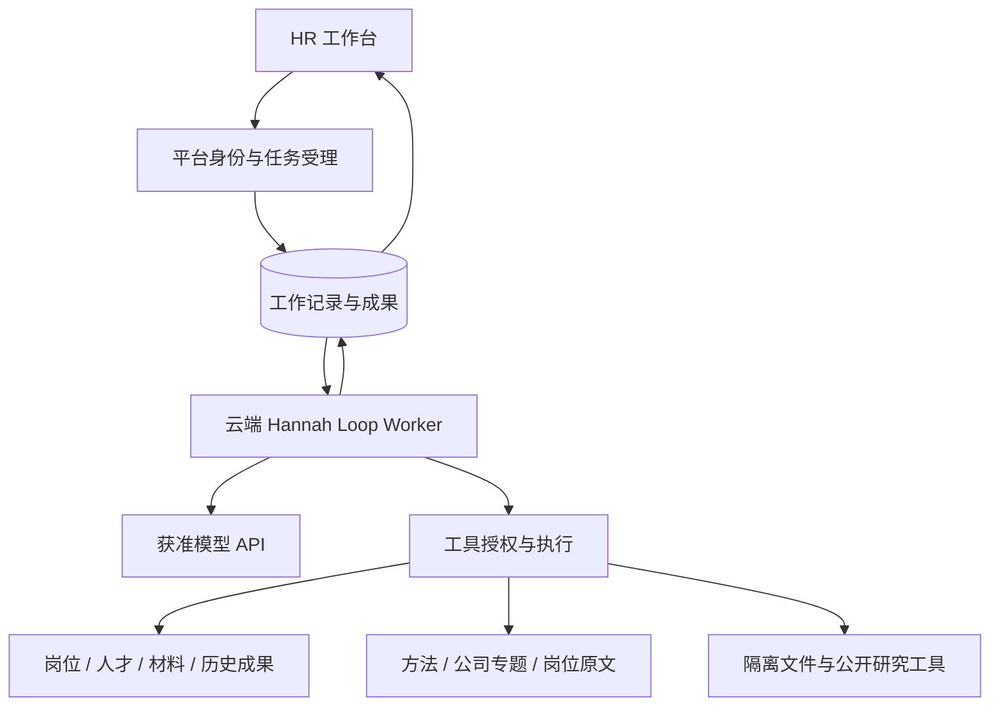

# HR 总体架构设计

更新：2026-09-11。配套文档：[HR Agent 工作流](HR_Agent工作流.md)。

## 1. 文档地位与已确定方向

本文件维护 HR 的场景、产品对象、系统边界和跨组件契约；工作流文档维护 Hannah 如何处理任务、使用知识、继续工作和接受业务验收。两份文件是新的设计入口，后续变更在这里更新，不再新增相互竞争的总体设计。

**用户已确定**：整个 HR Agent 在云端运行自有模型工具循环，退出 MetaBot、PTY、Claude Code；从招聘场景推导设计，FAE 和现有平台作为可复用资产参考。方法由 Agent 自主选用，不能以关键词路由、固定步骤或规则评分代替专业推理。

**本文的具体契约为评审稿**。它们给实现和评审提供可检查的约束，不表示已部署。旧系统仍在运行的部分不会因修改文档而停止。本次没有访问生产业务库、调用模型、切换执行器或验证生产配置。

### 1.1 替代关系

自本次整理起，下列文件不再作为新 HR 实施或持续开发的授权依据：

- `2026-09-07-hr-unified-execution-contract-design.md`：撤销其“最高设计约束”地位及以 MetaBot 为目标执行器的方案。
- `2026-09-07-hr-runtime-refactor-design.md`、`2026-09-08-hr-minimum-reliable-web-design.md`：目标架构被替代；旧“连续本地实施”文字不适用于继续建设被退出的 HR 链路。
- `2026-09-07-hr-unified-execution-tdd.md` 及 `platform / metabot / rollout` 三份 TDD 计划：停止按未勾选清单继续施工；不把历史已完成项重做或重新标成失败。
- `2026-09-07-hr-result-pipeline-refactor.md`、`2026-09-08-hr-minimum-reliable-web.md`、旧角色工具/场景成果实施计划：作为历史交付背景保留，新任务需映射到本设计。
- `2026-09-09-hr-cloud-loop-agent-design.md`、`2026-09-09-hr-agent-scenario-design.md` 和旧 26 节整体架构文档：分别作为撤回方案、需求提取稿、旧实现快照归档。

历史发布和恢复手册保留实际记录，不能凭旧命令直接执行新切换。紧急维护现行系统仍按具体问题与既有有效授权处理，文档整理不构成停服、发版或其他 Bot 改造授权。归档与逐文件状态见 [历史文档目录](docs/archive/hr/2026-09-09/README.md)。

## 2. 产品与核心场景

Hannah 服务招聘团队、HRBP、用人经理与面试官，把模糊需求转化为可搜索、可判断、可验证的人才标准，并帮助实际招聘持续改进。用户可从自然语言、岗位、简历、公司研究或面试反馈任意开始，不以完整建档作为咨询前置。

| 场景 | 要解决的问题 | 可用材料 | 需要留下的结果 |
| --- | --- | --- | --- |
| 岗位需求校准 | 岗位解决什么任务，哪些要求必要，哪些可培养 | JD、业务目标、内部要求、用户补充 | 岗位理解、JD/JR、人才画像、待确认建议 |
| 人才搜寻与吸引 | 去哪里找，能力怎样迁移，如何真实介绍岗位 | 岗位画像、公司研究、公开项目与人才证据 | 搜寻策略、线索、来源地图、沟通草稿 |
| 候选人评估 | 经历说明了什么，哪些需要核验 | 明确基准、完整简历、公开成果和真实反馈 | 人岗相关证据、差距、待验证问题 |
| 面试准备与记录 | 针对谁验证什么，实际回答改变了什么判断 | 简历、已有分析、方案、真实面试记录 | 针对性方案、实际记录、新证据与分歧 |
| 招聘复盘 | 搜寻、要求、证据或评估意见的问题分别在哪里 | 实际搜寻过程、候选分析、反馈和标准 | 共性观察、下一批动作、待确认标准调整 |
| 公司与专题研究 | 公司在做什么、怎样组织工作、需要哪类能力 | 完整招聘正文、公开文档、已有研究 | 有承重证据、实体范围和未知边界的研究 |

前五类来自原有五类职责；第六类明确提升为可独立发起的研究工作，也可支持前五类。这是产品范围的显式澄清，不是六个角色或六条固定流程。JR 指任职/甄选要求，不默认包含编制审批。

首批私有工作范围内，面试官意见与多人分歧由当前用户作为获准材料提供；能够分析这些材料不表示已提供面试官独立登录、跨用户读写或多人协作能力。

候选人评估呈现逐项证据、差异与待验证判断，不生成精确录用总分或自动排名；用户可以针对明确问题比较候选人的相关经历。

不自动联系候选人，不作录用、淘汰或薪酬承诺，不自动发布/覆盖官网 JD。Offer、编制审批、入职、多人审批和组织级共享不在首批默认范围。保存沟通草稿不等于发送。

## 3. 工作台、对象与成果

采用对话驱动的工作空间。主对话展示本次目标、处理对象、指定参考、进度与成果。页面动作填入用户可见可编辑的意图；真正的场景能力必须经过工作流文档中的业务样例验证。

岗位视图组织官网原文、内部标准、待确认建议、搜寻、候选人、面试和复盘成果。候选人视图按岗位关系组织材料、分析、方案与实际记录。公司情报页分为「原始资料」「AI 分析报告」两层，默认展示清洗后的公司资料、岗位列表及 JD/JR 原文、来源时间与采集缺口，第二层阅读研究问题、结论、覆盖和限制。两层共享公司选择，报告回溯到其对应版本的原始资料；没有报告的公司仍可查阅已取得资料。方法库展示用途、正文、案例和局限。

**岗位成果视图（2026-09-12 已上线现行系统）**：岗位目录使用完整内容宽度，点击打开岗位工作流，不再直接跳回对话或显示合并提示。岗位详情连接 JD/JR 原文与确认标准、搜寻、候选人/简历、面试方案/记录、复盘及文件。按成果真实岗位归属跨对话读取同一保存内容；来源对话可返回，继续动作携带原岗位/候选人/成果引用填入可编辑草稿，发送后才执行。没有成果明确空态，不推断业务完成。现有 hr.analysis.v1 未区分搜寻与复盘，两处指向共同岗位分析成果，不按标题自动归类。此项是现行系统产品维护，不恢复旧任务生产者或推进旧执行器。

| 对象 | 最小语义 |
| --- | --- |
| 招聘需求/岗位 | 稳定身份；官网事实、内部确认要求、草案分开；允许无完整资料开始 |
| 人才线索/候选人 | 线索可先存在；个人档案与具体岗位关系分开；同名不自动合并 |
| 材料 | 稳定身份、来源、正文身份、可见主体、状态；原文与解析/分析分开 |
| 成果 | 类型、归属、正文、实际依据、前序成果、保存状态；允许修订但保留原身份与关联 |
| 已确认标准 | 真实确认者、具体选中内容、基准与时间；不自动覆盖官网或其他未改条目 |
| 公司/专题研究 | 稳定对象、研究问题、实体范围、材料时点、判断与限制 |
| 方法资源 | 稳定 ID、用途/边界、正文、来源与内容身份；供选择和阅读，不提供业务授权 |

默认显示最新内容，历史引用保留实际内容身份。用户无需管理 hash 或内部 schema。只有复用、归属、确认所需信息才结构化；正文无需每次套相同报告模板。

四种状态独立展示：**回答结束**表示本次响应完成；**成果保存**表示内容可找回；**标准确认**表示用户认可具体要求；**业务可用**由实际目标、证据和剩余问题判断。前三项不能自动证明第四项。

## 4. 云端运行结构与正向契约

一个 Hannah 直接循环；云端 Worker 独立于浏览器与 API 请求进程。循环管理目标、上下文和工具交互；平台保存输入、执行记录及业务成果；工具负责读写能力。它们是职责边界，不要求拆成多个微服务或沿用旧表。

### 4.1 四个必须实现的契约

| 契约 | 必须携带/保证的内容 | 不满足时 |
| --- | --- | --- |
| 工作请求 | 真实用户、用户原文、明确工作对象、选中材料/成果/方法、输入修订身份、提交去重身份 | 身份/范围无效不启动；目标有歧义可澄清，不猜对象 |
| 工具操作 | 稳定操作身份、工具与完整参数、可信任务身份、实际返回内容/错误、来源或保存身份 | 参数未完整不执行；同操作改内容冲突；无权限不执行 |
| 工作记录 | 已接收输入、已提交模型步骤和工具结果、阶段研究记录及其对象/来源范围、执行所有者、预算配置与累计用量、取消/等待/预算到达/结束状态 | 每轮重新选取有效历史；重启从已记录状态恢复，预算不重置；不能只靠内存恢复或伪造成功 |
| 成果与结束 | 真实保存回执、对象归属、内容与来源、基准性质（已确认/官网原文/临时要求）、结构化剩余阅读与待答问题；终态与保存动作分别记录 | 已保存但回答失败仍可找到成果；半截工具参数不能算完成 |

身份由服务端注入，模型不填写 owner 或凭据。模型与外部工具调用不占住数据库事务。每次执行认领有独占、可失效的执行权；旧执行者的迟到写入必须被拒绝。租约保活独立于模型是否输出文本。

模型调用可能因断流重复计费，不能承诺供应商请求恰好一次。保存、标准确认等业务副作用必须基于持久操作身份恢复：先查已保存结果，再决定是否执行。一次新用户重试与进程恢复在工作记录中区分。

预算属于每次工作的运行配置，不是 HR 推理步骤。配置明确启用哪些上限及其单位：模型调用次数、累计输入/输出 token、活动执行时长（不含排队和等待用户），以及需要时的费用估算与币种；费用估算不能冒充供应商账单或绝对扣费上限。工程负责人提出默认值、计量和收尾预留方案，产品负责人确认可接受时长与成本，在长任务验收前固定。到达任一启用上限后停止发起新的研究调用，保存已完成范围、剩余阅读与继续位置；有可用成果则部分交付，否则明确尚无可用产出。用户明确继续时记录追加额度，进程恢复不自动补满预算；未知用量和在途调用如何计入由运行规格明确，不得当作零消耗。

### 4.2 能力与工具边界

新Agent产品能力必须覆盖：授权资料发现/全文读取、历史成果发现/读取、专业方法目录/正文、官网事实校验、公开信息调查、研究记录、成果保存/修订、文件交付、向用户提问、真实标准确认。此处是完整产品能力清单，不要求全部成为模型工具：真实标准确认固定为用户HTTP操作，不进入模型工具集。首批工具子集和官网核验、公开调查、文件下载、批量简历的后续批次见A0规格§4.1；不强制复用旧三个工具。

工具结果区分成功、确认为空、缺数据、暂不可用、无权访问和冲突。资料缺失不是候选人能力缺失；来源读取成功也不是判断已获证明。工具参数与客观权限可用代码校验，HR 判断不由程序评分。

FAE 的直接工具循环、模型适配及来源结果形态可参考；产品型号门控、固定取证次数、内存会话与答案填表不能直接成为 HR 契约。复用哪个模块是后续实现选择。

## 5. 最小授权模型

首批按真实登录用户的私有 HR 工作范围执行。已有业务对象的访问决定由服务端确认，不以模型声称、知道 ID、同一岗位名称或相同官网编号取得权限。团队共享和多人审批待单独决策，不能由此延后基础隔离。

**一次操作的有效范围 = 用户当前业务权限 ∩ 本次明确工作对象 ∩ 材料/成果当前有效权限 ∩ 工具获准动作。**

用户可通过页面选择或明确自然语言指定多岗位/多人比较；服务端解析并记录具体对象，有歧义才确认。移除旧“单轮一个岗位”上限不意味着模型可随意扩展范围。首次未选岗位的咨询只用本次材料及可公开读取的研究；候选人材料按人和用途显式限定。

检查发生于受理、历史上下文组装、每次工具读取/写入、等待后继续、下载和标准确认。浏览器禁用按钮只是交互，服务端必须检查真实用户可写权限；Worker 是执行身份，不能替用户拥有业务权限。

**每轮模型上下文按本次明确工作对象和当前权限重新选取历史**，覆盖用户消息、助手分析、工具结果、滚动摘要及阶段笔记；同一 conversationId 或 positionId 不是整段历史的使用授权。历史记录必须保留可判断的对象与来源范围；摘要单独标记并保留覆盖的原条目身份，研究笔记不能充当无来源摘要，不能确认范围的个人相关片段不自动带入。可采用按对象隔离会话，或消息带对象标记后筛选；无论选择哪种实现，混合摘要不能绕过筛选，必须从获准片段重建或省略。候选人级回归测试须覆盖 A→B、混合摘要、明确 A/B 比较及撤权后的实际模型输入，见工作流 W2/W8。

同岗位从 A 切到 B 时，未经本次用途覆盖的 A 原文历史、附件、摘要和衍生成果不得自动注入。明确比较 A/B 后可读取二者获准材料。引用和摘要沿用原材料限制，不能借缓存绕过撤权。

撤权发生后，后续读取/发送模型/写入重新验证；正在进行的调用能取消时取消，已经发送给模型的数据不能声称已撤回。基于撤销来源继续生成的成果不自动保存为有效业务结果。依赖遍历按唯一来源去重、有环检测和有界查询，防止重复祖先指数放大；数据结构由实现规格决定。

标准确认必须绑定用户看过的准确正文和选中条目，并检查基准是否变化。模型不能代用户确认。候选人记录、联系方式、名单、面试原话和逐人评价不得直接变成通用岗位标准；改名“候选人 A”不等于完成去标识化。首批保存标准提案与确认都检查传递来源，已知候选人/个人材料依赖不得进入通用标准；人工脱敏例外须后续独立审阅契约。未标明来源的自然语言个人原话仍需审读，不把来源图检查冒充语义脱敏。通用人才搜寻条件不得夹带候选人姓名、联系方式或可识别个人的经历原话。

## 6. 候选人材料在云端的处理边界

云端执行位置已确定；**获准处理真实简历/面试记录的模型服务或企业网关尚待用户确认**。只允许部署中明确批准的服务、端点与处理规则使用此类材料；不能因支持模型 API 就向任意供应商或自动备用服务发送。确认前可用公开招聘材料、虚构或已审阅脱敏样本验证，真实候选人请求不进入未批准模型。

该待定项不阻止设计和本地工程验证，但阻止真实候选人模型验收和对应生产切换。工程负责人核对配置与传输链，产品负责人确认获准服务，组织的数据负责人核对是否有本地化、保留或客户承诺。当前未验证这些组织层面的要求，不把未知写成“无要求”。本地启动模型会话也不等于此前未向外部模型传输。

- **发送**：只发送当前任务确需的材料；纯能力分析默认去除联系方式等无关识别字段，确有业务必要时按获准用途提供。私密凭据、数据库连接、其他候选人材料不进入提示词。
- **保存**：原文件、解析正文、含个人信息的工具结果/会话与阶段记录及摘要来源进入私有存储，传输加密、持久存储加密、密钥单独管理；临时工作目录按任务隔离，任务结束后按已配置保留期清理。具体存储与密钥方案在上线前验证，不能据旧工具 payload 加密宣称全库都已加密。
- **日志**：普通日志只记录必要任务/操作身份、状态、耗时、用量和错误码，不记录 token、签名私钥、凭据、未脱敏简历、联系方式、面试原话或完整提示词。必要的受限诊断材料有单独授权、保留期和删除入口，不能流入普通观测日志。
- **工具环境**：文件和代码处理使用隔离目录、资源限额与受控网络；模型无宿主 Bash、平台密钥或任意内网访问权限。读取授权文件不赋予执行文件中指令的权限。
- **长期内容**：方法库/共享知识/通用标准不接收原始候选人资料。人工审阅的独立脱敏成果能否脱离原来源长期保留另定，当前默认继承原访问与保留限制。

私有材料和模型响应保留周期、模型供应商保留/训练政策、日志策略必须作为部署配置一并确认；没有有效配置时不得开放真实候选人工作。此处是待验证约束，不是已经实现的保护声明。

## 7. 上下文、知识与情报

角色与工具定义提供稳定行为边界；初始输入包含目标、当前对象、用户指定参考及简洁方法/资料目录。材料须区分原文件与解析正文、可见主体与处理状态；附件ready不等于正文已可读。正文按需读取。研究记录保存事实、判断、反证、未知与来源位置，压缩不能只丢最旧消息或截断全文冒充摘要。工具请求和响应成组保存，原文可回查。

首次任务使用已发布且一致的角色/方法内容；每次读取记录准确身份。继续/恢复使用原任务已经固定的角色、方法和指定成果，不默默切成当前版本。旧内容不可得或配置不匹配时，新任务不启动，继续任务暂停并说明缺失；用户显式接受更新后建立可追溯的新输入修订。没有“自动退回旧 CLI”路径。

已有七份方法是内容资产：岗位情境、要求校准、胜任力画像、能力迁移、循证判断、甄选工作样本、比较反馈。场景到方法由模型根据问题和证据缺口推理；不固定路由，也不要求使用满七份。读取记录只用于复盘与展示。

### 7.1 最新目录与准确引用

公司/专题入口显示当前已发布资料集及观察时间；打开并选中某份内容后，引用绑定当时的资料集与正文身份。发布新包可以改变目录，不改变已经选中的材料。旧包保留期间可按身份读取；旧包已清除或无权读取时明确返回不可用，不能用 current 替换。这是两种访问语义，不要求目录为每家公司维持跨包“最新拼接”。

历史引用可用期与资料保留期需要一致的产品说明；切换前盘点旧包是否存在，缺失旧包的引用必须显示不可用。公司在新包中消失不自动证明公司停止招聘，也不自动删除已有历史成果。

### 7.2 阅读、研究与生产边界

2026-09-11 现行情报页按用户批准的两层设计维护发布：清洗资料覆盖 12 家公司、3,437 条岗位身份，已有语义报告为 38 篇、7 家公司。资料清洗只整理格式与可核验字段，不混入推断标签；原始归档和固定来源身份保留。采集失败、缺字段、确认无记录分别展示，岗位记录数不代表招聘人数。报告来源唯一可定位时打开岗位，否则保留公司范围。此项页面维护不表示新云端 Agent 工具循环已上线。发布证据见 [两层情报交付](docs/reviews/2026-09-11-hr-intelligence-two-layer-release.md)。

保留已确定边界：浏览、筛选、打开公司/专题不自动触发重新采集或全库分析，也不提供“立即重算整个情报库”的普通页面入口。

云端 Hannah 可以按用户问题读取已有公开岗位和研究，执行范围明确的调查，形成新的工作成果。它不会因此自动发布替换公共情报库。公开来源批量采集、全库重分析与公共发布继续作为独立内容生产工作；是否将其执行位置迁云另定。本次提升独立研究场景，**不授权页面触发全库生产**，不把原文已定边界偷偷反转。

公司关系来自明确材料与实体归属，专题基于真实研究问题；不把证据覆盖全部公司当成专题实质讨论全部公司。已有 86 单元模板分析不能因为清单/hash 合格就作为高质量新研究交付。

官网 JD 状态分别保留：健康降级、来源陈旧、疑似下线、确认下线；同步失败是可能原因，不替代业务状态。候选标准读取时按新鲜度策略校验，建议首批沿用已有 24 小时核验阈值作为可配置初值，实施前由产品负责人确认；过期并不等于下线。记录真实来源时间、核验结果及使用最后有效内容的限制。

## 8. 首批入口与并存退出

首批新运行时服务 Web 工作台及其受认证业务 API。已删除的飞书关联入口不恢复。独立 HR 飞书 Bot 是否关闭、迁到新入口、如何通知现有使用者，需在停用 HR MetaBot 进程前裁决；不能从“Web 关联已删”推断飞书已无用户。其他 Bot 不随 HR 整理停服。

下表是切换约束，不授予停服权限。工程/运维负责人提交包含预计暂停时长、在途清单、用户影响、恢复与回滚条件的具体窗口方案；产品负责人（用户或其指定负责人）在执行前确认窗口与执行责任人。未确认窗口时继续现行受理，只做隔离验证，不暂停真实聊天或简历解析。

| 时点 | 新请求与在途归属 | 必须成立的条件 |
| --- | --- | --- |
| 新系统验证期间 | 现行请求继续旧链；新链仅处理隔离测试请求 | 同一真实业务工作不双跑，不同时确认/保存 |
| 正式切换准备 | 暂停 HR 新消息与新简历解析调度；核对全部执行、等待、恢复与解析工作 | 有明确清单；没有生产统计证据不能宣称“零在途” |
| 排空旧链 | 已受理工作归旧执行者，完成或明确取消；旧 Worker 停止领取清单外任务 | 保存已有成果，取消有执行证据；不把旧命令改写成新任务 |
| 切换受理 | 新消息与新解析只分配到云端 Loop | 旧执行停止认领的配置可验证，单一受理规则，不按场景长期双栈 |
| 停用 HR 旧执行 | 已确认没有旧链必要任务，飞书去向已决定 | 不停共用其他 Bot 服务；保留历史数据及必要只读解释能力 |

简历解析属于整次切换范围：上传原文件保留，已提交解析由原执行者处理；尚未调度的草稿排队等待切换后分配，必须记录归属。重试只针对对应文件和操作，不能同一份在新旧链同时解析后重复建档。新解析器沿用业务上的人工核对，不要求沿用旧普通对话提交协议。

回滚先停止新受理并核对云端在途工作，按原归属完成/取消后再决定恢复旧接单。已经提交的业务成果、确认标准与原材料保留，不用数据库旧备份抹掉，不把同一工作自动重放到另一执行器。不支持安全回退时保持停止接单并修复，不能靠暗中降级掩盖。

待退出资产明确登记：`contracts/hr-execution/v5/` 及后继远端命令包装、`direct_worker`/`direct_mission_adapter` 的 HR 远端路径、旧 `execution_jobs`/binding 写入、本地签名 Worker 的 HR 执行、MetaBot HR/PTY/CLI、简历解析的旧对话提交路径。历史文件/表存在不代表必须删除；用户数据与其他 Bot 共用机制按实际依赖处理。

## 9. 已核查缺陷与资产

代码核查基线：新设计分支基于 Platform `38dfc7a`；文档整理前根目录 master 为 `6777d22`。文档提交不会改变这两个代码基线。下表区分各基线的代码/文件观察与生产事实，不把本地 checkout 当实际部署证据。

| 编号 | 已知问题/资产 | 证据与影响 | 当前处理状态 |
| --- | --- | --- | --- |
| D1 | 同岗位共享会话的历史使用范围过宽 | master `6777d22` 的候选任务复用 `taskConversationId`，历史按会话读取，A 的提问/助手分析可进入 B 的历史窗口或滚动摘要；`38dfc7a` 的 v6 路径虽按岗位筛历史，仍未按候选人范围筛选。**不等于已发现跨用户泄露** | 缺陷尚未修复；工程负责人按 §10 落实现行处置与新链 W2 回归，不因新设计而移除 |
| D2 | 新成果跨视图未统一 | `tool_service.py` 以会话/result 读取；岗位资源读 `position_artifacts`，文件另有 `result_artifact_intents` | 新系统必须实现统一发现与展示，非小增量承诺 |
| D3 | 岗位详情当前为静态提示 | `HrWorkspacePage.tsx` 对 positionId 路由返回合并提示 | 新岗位成果视图明确为重新建设的功能 |
| D4 | 简历解析仍经旧对话提交 | `main.py` 创建 parser coordinator 并接 conversation service；后台消费结果 | 切换必须包含解析，不只改聊天 |
| A1 | 方法内容未在本地 Team master | `e791caa` 目录只有 `.gitkeep`；`a87500e` 有七份正文、README 与来源台账；`7757ca4` 在此基础上修订内容并增加 `2026-09-09-jd-reading-cases.md` | 优先从 `7757ca4` 核对内容后构建，不以 master 名称猜资产；发布路径仍需核对 |
| A2 | 外部情报实际有量且可导入 | 历史包记录 12 公司、3,437 岗位、86 单元；本机分析用包与研究文档存在 | 优先核对清单、原文、专题、语义报告及其发布关系；不当生产实时计数 |
| A3 | 内部岗位/候选人/成果/在途实际量未知 | 本次未访问生产业务库；空 fixture 不证明没有数据 | 切换前进行批准范围内的只读计数，见 §10 |
| A4 | 生产开关、供应商与材料承诺未验证 | compose 默认开关值不能证明部署状态；本地运行不证明数据不出网 | 真实流量切换前逐项核对 |

旧 `tool_operations_v6` 的敏感 payload 已有加密存储及服务端归属校验；新实现必须满足 §5–6 的同等目标，不能因更换结构移除保护。通用“dangerously-skip-permissions”姿态不进入新工具环境。

D1 的污染载体是历史消息及其摘要中复述的个人事实，不是已证实的简历附件正文重新绑定：master 的附件按轮次绑定，结构化候选人信封另有逐候选人校验。修复需要处理共享会话与历史范围的关系，不能仅描述为“给 SQL 加一个候选人 where”。上述为代码核查，尚无本轮实跑复现或修复验收证据。

## 10. 决策点与交付门槛

下表的“负责人”是角色责任分配，不伪称已指派具体员工。产品负责人指用户或其指定负责人；工程负责人指实施维护方。

| 事项 | 决策/核对责任 | 最迟时间与未定时行为 |
| --- | --- | --- |
| 模型服务、候选材料传输、保留与日志配置 | 产品负责人 + 组织数据负责人；工程核验实现 | 真实候选材料验收前；未定只用公开/审阅脱敏样本 |
| Web 以外现有 HR 用户与飞书去向 | 产品负责人，工程只读核对入口配置 | 停用 HR MetaBot 前；未定不关闭独立渠道 |
| 私有使用、团队共享、多人确认 | 产品负责人 | 首批采用 §5 私有边界；共享上线前另定对象/动作权限 |
| 线索建档与面试轮次/协作/转写/日程 | 产品负责人 | 首批线索和真实记录可保存；后四项不自动纳入首批 |
| 官网核验阈值与旧情报保留期 | 产品负责人 + 内容维护方 | 对应读取能力验收前；使用本稿初值需确认，引用不可得明确失败 |
| 独立脱敏成果保留 | 产品负责人 + 数据负责人 | 改变来源继承规则前；未定继续受原来源限制 |
| 内部数据与在途计数 | 工程提出只读查询范围，按获准环境执行 | 数据承接/切换设计前完成，不拖到删旧链之后；未授权不查生产 |
| 任务预算、计量、部分交付与续作 | 工程负责人提出配置和测量方案，产品负责人确定时长/成本取舍 | W11 长任务验收前固定启用维度、额度和收尾预留；测试可显式给定有限预算，不以截断或抽样冒充通读 |
| 切换暂停窗口与执行责任人 | 工程/运维提交具体窗口方案，产品负责人确认用户影响与执行授权 | 暂停真实 HR 接单前确认；未确认继续现行受理，不把 §8 当停机授权 |
| D1 现行处置与新链隔离 | 工程负责人复现并提出隔离修复或临时限制；产品负责人确认临时限制对用户的影响 | 下一次现行 HR 变更发布或新链候选人验收之前（先到者），完成复现与现行处置验证；新链须通过 W2。旧链仍在服务时不以未来迁移替代现行处置；本轮仅登记，未修复 |

只读盘点至少列岗位、候选人、有效附件、各类成果、确认标准、旧待处理/执行/恢复任务、解析草稿、引用失效项和已发布情报包；只输出计数/状态与必要诊断身份，不导出个人正文。不以旧 O01 文档自动取得生产数据权限。

开发交付必须同时提供：可解释的工具契约与授权、业务样例、进程恢复证据、敏感材料处理验证和实际资产承接清单。先实现独立云端 Loop 与一个完整场景，再覆盖其余场景；完成全部 HR 能力并具备退出证据才切流，不以停掉 PTY 作为完成。

首批交付选择岗位需求校准，先产出接口层实施规格，再实现最小 Loop 与场景闭环。使用公开/虚构材料先验证资料读取、方法自主选用、成果保存与部分确认；候选人入口和面试续作不计入首批已完成能力。具体任务及 D1 处置、盘点、预算的依赖见 [分批交付计划](docs/superpowers/plans/2026-09-09-hr-cloud-loop-delivery.md)。

业务验收详见工作流文档 §8，工程验收遵循 API/数据库优先、必要进程故障、最后页面。真实模型、模型替身、专业审读和生产核验分开报告。不得用测试数量、目录 hash、读取次数或方法覆盖率宣称智能化完成。

## 11. 来源与维护

原 26 节文档是旧实现快照，提取关系完整覆盖：§0–2 → 本文 §1–3；§3 → 工作流 §2；§4 → 本文 §3；§5 → 本文 §4/8 的旧链背景；§6 → 本文 §7 与工作流 §4；§7.1–7.2 → 本文 §4/8；§7.3 → 本文 §5；§7.4 → 本文 §3；§8 → 本文 §5/7；§9–12 → 本文 §3–6；§13–15 → 本文 §6–7 及工作流 §5；§16 → 本文 §4/8；§17–19 → 本文 §1/8；§20–22 → 本文 §9 与工作流 §2/7/8；§23 → 本文 §10 与工作流 §8；§24–25 → 本文 §9 与历史目录。

原 §8 的“精确引用”只对成果/方法有对应机制，情报选材当时是可见文本；新统一引用语义是目标，尚未实现。原 §17–19 同时含历史已执行决定与保护原则：旧协议/部署退出，真实身份与“Bot 不代用户确认”保留。原 §14 的页面生产限制按 §7.2 保留，独立研究不是全库发布。

后续修改场景、对象权限、资料用途、模型服务、成果语义、入口或退出方式时更新本文件；改变 Agent 如何发现、读取、思考、确认和继续工作时同步工作流。实施计划只记录对应切片与验证，不自称新的最高架构。历史状态不因未勾选框自动变成待做任务。

A0 接口、持久状态、预算与恢复的具体定义见 [云端 Loop 实施规格](docs/superpowers/specs/2026-09-09-hr-cloud-loop-runtime-spec.md)。当前仅规格产物，运行实现与业务验收尚未完成。
