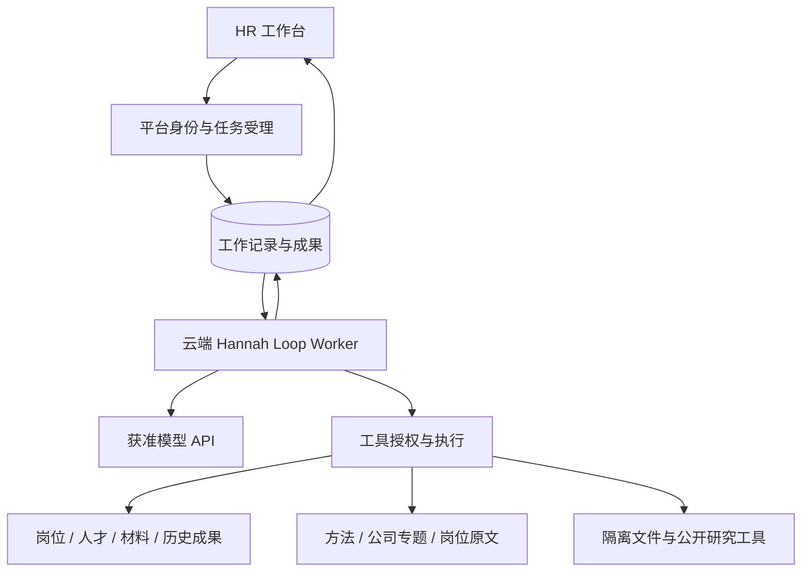

# HR 总体架构设计

## 当前实现入口（2026-09-15）

当前主线已完成云端岗位标准/成果读取、岗位单列列表及旧前端删除；岗位身份仍在 platform_hr.positions，当前标准/成果/候选人使用 platform_hr_agent。旧后端接口、服务及表仍有残留，不得把旧界面退出写成旧后端全部删除。

完整现状见 [HR 当前实现全景](docs/2026-09-15-hr-current-implementation.md)。2026-09-15 已从主线部署 `570ea625`，包含岗位闭环、单列列表、旧前端删除与扫码入口 challenge 刷新修复；准确镜像、维护配置和验证边界见[本次发布记录](docs/releases/2026-09-15-mainline.md)。接口与后台由开发侧验证，浏览器和页面验收按用户最新要求交给用户；服务 healthy 不等于受认证业务验收。

下方保留架构原则及各阶段原始记录；其中“待授权”“未进入 C/D/E”“保留旧历史区”等进度文字是历史时点，不代表现在的实施状态。涉及当前落地、残留和未完成项，以上述现状文档与准确代码/发布证据为准，不自动执行历史计划。

2026-09-11 至 2026-09-14 的历史变更与授权记录

> 2026-09-14 最新裁定：用户明确旧界面直接放弃，没有实际使用者，不做兼容、迁移或历史阅读区。当前标准/成果只读云端；移除旧候选人和情报归档入口，保留现行候选人工作及已发布情报资料/研究两层，岗位库采用列表。此裁定覆盖下方保留旧阅读区的历史方案；执行见[当前计划](docs/superpowers/plans/2026-09-14-hr-position-cloud-reading.md)。

> 2026-09-14 最新授权：主线已同步，开始[产品设计](docs/2026-09-14-hr-workbench-product-design.md)第一阶段 P1+P2。岗位页当前标准改读云端 current，当前成果改读云端岗位范围与准确修订；旧标准和成果保留只读历史。岗位库列表、候选人/情报/导航收敛及建岗契约留后续阶段，历史任务 B 的暂停文字不限制本次明确授权。实施与验证见[闭环计划](docs/superpowers/plans/2026-09-14-hr-position-cloud-reading.md)。

> 2026-09-14 最新顺序裁定：先把已发布和已完成工作归并到 `master`，维护单一开发基线，再考虑工作台重新设计。B 暂停在方案阶段；历史任务书中的分支/工作树是当时调查定位，不作为今后长期开发入口。实际线上版本仍单独查发布记录。归并范围与验证见[主线整合记录](docs/2026-09-14-mainline-reconciliation.md)。

> 2026-09-14 收敛任务：已在正确的 `feat/hr-cloud-loop-launch` 分支删除四个零引用组件及自有测试（任务 A，`8baf6328`，尚未部署）。任务 B **只交方案，待用户确认**：推荐独立岗位列表/情报路由共用一个工作台与云端工作状态，一次替换七条旧路由；历史对话、准确成果/标准版本与情报保留专门阅读入口。路由归属、能力缺口、组件/测试迁移及旧 UI 退出时点见[收敛方案](docs/2026-09-14-hr-workbench-consolidation-proposal.md)。该方案优先于下面的布局稿，但尚未成为已实施行为；当前发布状态仍以发布记录为准。

> 2026-09-14 用户要求重新设计工作台，并明确岗位采用列表而非卡片。新版统一导航，以对话为中心，材料/成果按需展开；当前为[交互设计稿](docs/superpowers/specs/2026-09-14-hr-workspace-redesign.md)，尚未替换生产。此前页面恢复记录保留为历史发布状态。

> 2026-09-14 页面恢复：已找回旧版岗位卡片与滚动容器，云端对话接回原 HR 渐变磨砂布局。当前生产版本、分支溯源和浏览器待验收范围见[页面恢复记录](docs/releases/2026-09-14-hr-layout-restoration.md)。

> 2026-09-14 发布完成：正式入口已直接替换为云端 Hannah，旧入口历史只读；生产配置、维护覆盖、验证范围和未完成项见[发布记录](docs/releases/2026-09-14-hr-cloud-primary.md)。

> 2026-09-14 用户要求直接替换旧入口：`/hr/` 使用云端 Hannah 工作台作为唯一主对话，取消“试用”并列菜单；`/hr/agent` 保留同页兼容入口，岗位/work 参数在路由与登录回跳中保留。岗位、HR 情报、专业方法与历史消息/成果继续可读；旧会话页面停止新消息、重试及确认操作，主导航始终进入新对话。岗位普通快捷任务只携带岗位和未发送草稿，旧格式的成果/候选人引用与确认授权不静默改写成云端授权，须在新工作台重新选择。此次是前端替换，生产部署及受认证业务验收分别记录。

> 2026-09-14 上线范围：用户确认线上暂无使用者，继续按低流量试运行发布；飞书和浏览器不纳入本次验收。兼容服务部署及数据库/进程就绪与受认证业务验收分别报告，缺少既有登录凭据不伪造验收；真实个人材料处理仍关闭，专业内容遗留保留。实际执行见[当前上线计划](docs/superpowers/plans/2026-09-13-hr-launch.md)。

> 历史回放修订（2026-09-13）：已有成果的类型保持不变；保存更新若类型不一致，只在 owner、同一工作和准确修订均校验通过后返回具体字段与原类型。Hannah 修订沿用已有成果身份与类型，不以调试占位污染业务成果；旧 H03 四轮回放预算等待与内容问题原样保留，工程反馈修复不等于专业验收通过。

> 上线执行（2026-09-13）：用户已授权直接上线，并明确飞书不纳入本次范围；用户随后明确允许绕过前端直接走接口，本次不以浏览器验收作为上线前置；实际发布仍保留单一执行归属、真实HTTP身份/授权及私有材料处理策略。新增历史HR会话只读场景提取及去标识真实模型回放，旧答案不作为正确答案。当前承接线上65e7fbd的岗位工作流与成果读取能力；执行与证据见[上线计划](docs/superpowers/plans/2026-09-13-hr-launch.md)。

> E二次审计（2026-09-12）：切换SQL采用显式事务与3秒语句时限，实际持锁超时/其他Bot追加另留证；当前只承诺保持draining_cloud修复，恢复legacy受理延期。搜索恢复夹具、用户重新搜索闸门、v5恢复授权、SIGQUIT与部署预检补验，见[第二轮修订交接](docs/reviews/2026-09-12-hr-e-audit-hardening.md)。自动编排HR探针、生产负载及专业验收仍未完成。

> E审计追加（2026-09-12）：上轮W表已收窄到具体测试范围；遗漏夹具、旧NULL上下文与计数边界补验，104以追加方式移除103不可达条件。失败草稿逐项处置、切换SQL时限与旧执行器显式恢复条件见[本轮修订](docs/reviews/2026-09-12-hr-e-audit-followup.md)。原25项审读缺运行日志；PM2材料仅为本机仓库代码，生产身份未核验。

> E复审收尾（2026-09-11）：活 `/v5/handoff`、并发分类、旧草稿写入已接切换闸门；新增103区分命令记录与活跃工作，D1覆盖及受控异常补回，迁移监督与失败清理留证。3条queued和28条interrupted已做只读聚合定性；旧执行器实际停用、飞书去向、D专业/真实候选人/D7与发布窗口仍未通过。本轮610/6、身份872、HR前端317；全仓前端1193通过/3既有失败/2条件跳过，证据见[E复审收尾](docs/reviews/2026-09-11-hr-e-review-followup.md)。

更新：2026-09-11。配套文档：[HR Agent 工作流](HR_Agent工作流.md)。

## 1. 文档地位与已确定方向

本文件维护 HR 的场景、产品对象、系统边界和跨组件契约；工作流文档维护 Hannah 如何处理任务、使用知识、继续工作和接受业务验收。两份文件是新的设计入口，后续变更在这里更新，不再新增相互竞争的总体设计。

**用户已确定**：整个 HR Agent 在云端运行自有模型工具循环，退出 MetaBot、PTY、Claude Code；从招聘场景推导设计，FAE 和现有平台作为可复用资产参考。方法由 Agent 自主选用，不能以关键词路由、固定步骤或规则评分代替专业推理。

**设计评审已通过，按阶段实施与验收。**A+B 修订及 HR Opus 5 配置后，用户授权继续；用户最新授权后已在 `feat/hr-cloud-loop-d` 开始 D 本地实施，C 分支保留于 `95d33c3`，A1 与 A+B 分支亦保留。证据见[交付计划](docs/superpowers/plans/2026-09-09-hr-cloud-loop-delivery.md)及 [C 执行记录](docs/superpowers/plans/2026-09-11-hr-c-execution.md)。旧系统不因新代码停止；已按用户授权只读核查平台附件聚合状态、权限与迁移，未切换执行器。真实模型只使用 HR 指定的 Opus 5 配置处理公开或明确虚构材料；D 具体任务见[D实施记录](docs/superpowers/plans/2026-09-11-hr-d-execution.md)。本地开发可继续；真实候选人、生产切换及业务验收仍需各自证据。

### 1.1 替代关系

自本次整理起，下列文件不再作为新 HR 实施或持续开发的授权依据：

- `2026-09-07-hr-unified-execution-contract-design.md`：撤销其“最高设计约束”地位及以 MetaBot 为目标执行器的方案。
- `2026-09-07-hr-runtime-refactor-design.md`、`2026-09-08-hr-minimum-reliable-web-design.md`：目标架构被替代；旧“连续本地实施”文字不适用于继续建设被退出的 HR 链路。
- `2026-09-07-hr-unified-execution-tdd.md` 及 `platform / metabot / rollout` 三份 TDD 计划：停止按未勾选清单继续施工；不把历史已完成项重做或重新标成失败。
- `2026-09-07-hr-result-pipeline-refactor.md`、`2026-09-08-hr-minimum-reliable-web.md`、旧角色工具/场景成果实施计划：作为历史交付背景保留，新任务需映射到本设计。
- `2026-09-09-hr-cloud-loop-agent-design.md`、`2026-09-09-hr-agent-scenario-design.md` 和旧 26 节整体架构文档：分别作为撤回方案、需求提取稿、旧实现快照归档。

历史发布和恢复手册保留实际记录，不能凭旧命令直接执行新切换。紧急维护现行系统仍按具体问题与既有有效授权处理，文档整理不构成停服、发版或其他 Bot 改造授权。归档与逐文件状态见 [历史文档目录](docs/archive/hr/2026-09-09/README.md)。

### 1.2 A1 的工程落地范围

新 `hr_agent` 包提供独立受理 API、持久工作与模型步骤、五工具循环及独立 Worker；沿用平台身份/CSRF、当前 HR 使用授权和附件归属检查。新迁移位于独立 `hr_agent/096`，运行时只读检查就绪；API 与 Worker 都须显式配置，默认不启用。现行 DirectWorker/Relay/MetaBot 没有接到新循环。

首批工程链路支持 UTF-8 材料的原件/正文精确引用、范围标记与递归摘要来源、成果保存/精确读取/用户岗位关联。角色和方法来自受校验的不可变发布目录，正文按需读取；工具调用顺序由模型决定。专业方法、PDF/DOCX、标准提案与确认、文件下载及独立业务 UI 已进入 B 实施；正式切换仍属于 E。A1 的保存与回答结束不代表 HR 业务验收通过。

### 1.3 A+B 评审修订（2026-09-11）

修订证据见 [A+B 修订记录](docs/reviews/2026-09-11-hr-cloud-loop-ab-revision.md)。服务端统一由 `ResourceReader.validate_scope` 校验工作范围，`HrAccess.authorize_user` 校验 HTTP 用户；缺少范围校验器时连空范围也拒绝受理。工具错误历史使用冻结输入对象与调用来源，不能成为无范围记录。

token 结算采用供应商报告总量与本次冻结输入保守估算的较大值；下限生效时标为估算，原始报告加密保留，不称为实际账单。预算追加受服务配置 `service_limits` 限制；未配置则以上线配置初始 `limits` 为上限，不默认为无限追加。部署负责人须显式设置追加上限，产品仍负责成本取舍。

工作级usage_quality按已扣记attempt来源汇总：全估算为estimated，全实报为reported，两者并存才是mixed；保留原始报告不意味着扣记混合。当前UTF-8字节估算在C3样例中约为实报2倍，校准前不按该值宣称实际费用。明确的研究配置与计量取舍见§10 D7。

C0 已把工作锁内快照与外部校验分离；一次历史读取内重复引用去重，完成后重验当前来源、输入与租约。材料授权批量读元数据与先前实际正文校验的凭据，不重读对象；实际正文读取仍校验字节。凭据不是最新字节审计。取消返回不含材料正文的控制回执，不等待材料；完整检查点仍保留，后续正常读取按权限投影。见[材料授权记录](docs/reviews/2026-09-11-hr-material-authority.md)。旧 D1 的现行处置截止点不变。

## 2. 产品与核心场景

Hannah 服务招聘团队、HRBP、用人经理与面试官，把模糊需求转化为可搜索、可判断、可验证的人才标准，并帮助实际招聘持续改进。用户可从自然语言、岗位、简历、公司研究或面试反馈任意开始，不以完整建档作为咨询前置。

| 场景 | 要解决的问题 | 可用材料 | 需要留下的结果 |
| --- | --- | --- | --- |
| 岗位需求校准 | 岗位解决什么任务，哪些要求必要，哪些可培养 | JD、业务目标、内部要求、用户补充 | 岗位理解、JD/JR、人才画像、待确认建议 |
| 人才搜寻与吸引 | 去哪里找，能力怎样迁移，如何真实介绍岗位 | 岗位画像、公司研究、公开项目与人才证据 | 搜寻策略、线索、来源地图、沟通草稿 |
| 候选人评估 | 经历说明了什么，哪些需要核验 | 明确基准、完整简历、公开成果和真实反馈 | 人岗相关证据、差距、待验证问题 |
| 面试准备与记录 | 针对谁验证什么，实际回答改变了什么判断 | 简历、已有分析、方案、真实面试记录 | 针对性方案、实际记录、新证据与分歧 |
| 招聘复盘 | 搜寻、要求、证据或评估意见的问题分别在哪里 | 实际搜寻过程、候选分析、反馈和标准 | 共性观察、下一批动作、待确认标准调整 |
| 公司与专题研究 | 公司在做什么、怎样组织工作、需要哪类能力 | 完整招聘正文、公开文档、已有研究 | 有承重证据、实体范围和未知边界的研究 |

前五类来自原有五类职责；第六类明确提升为可独立发起的研究工作，也可支持前五类。这是产品范围的显式澄清，不是六个角色或六条固定流程。JR 指任职/甄选要求，不默认包含编制审批。

首批私有工作范围内，面试官意见与多人分歧由当前用户作为获准材料提供；能够分析这些材料不表示已提供面试官独立登录、跨用户读写或多人协作能力。

候选人评估呈现逐项证据、差异与待验证判断，不生成精确录用总分或自动排名；用户可以针对明确问题比较候选人的相关经历。

不自动联系候选人，不作录用、淘汰或薪酬承诺，不自动发布/覆盖官网 JD。Offer、编制审批、入职、多人审批和组织级共享不在首批默认范围。保存沟通草稿不等于发送。

## 3. 工作台、对象与成果

采用对话驱动的工作空间。主对话展示本次目标、处理对象、指定参考、进度与成果。页面动作填入用户可见可编辑的意图；真正的场景能力必须经过工作流文档中的业务样例验证。

岗位视图组织官网原文、内部标准、待确认建议、搜寻、候选人、面试和复盘成果。候选人视图按岗位关系组织材料、分析、方案与实际记录。公司情报页分为「原始资料」「AI 分析报告」两层，默认展示清洗后的公司资料、岗位列表及 JD/JR 原文、来源时间与采集缺口，第二层阅读研究问题、结论、覆盖和限制。两层共享公司选择，报告回溯到其对应版本的原始资料；没有报告的公司仍可查阅已取得资料。方法库展示用途、正文、案例和局限。

**岗位成果视图（2026-09-12 上线，2026-09-14 入口边界已变化）**：岗位详情保留 JD/JR 原文、历史确认标准、候选人/简历、面试方案/记录、复盘及文件，按成果真实岗位归属跨对话读取同一保存内容。云端主入口替换后，岗位详情仍可打开，普通继续工作动作进入云端；带旧成果/候选人引用的快捷操作被拒绝，旧对话仅可读，不能再描述为旧成果能直接续作。云端成果三入口汇集及历史读取收敛仍在待确认方案中。没有成果明确空态，不推断业务完成。旧 hr.analysis.v1 未区分搜寻与复盘，两处指向共同岗位分析成果，不按标题自动归类。

| 对象 | 最小语义 |
| --- | --- |
| 招聘需求/岗位 | 稳定身份；官网事实、内部确认要求、草案分开；允许无完整资料开始 |
| 人才线索/候选人 | 线索可先存在；个人档案与具体岗位关系分开；同名不自动合并 |
| 材料 | 稳定身份、来源、正文身份、可见主体、状态；原文与解析/分析分开 |
| 成果 | 类型、归属、正文、实际依据、前序成果、保存状态；允许修订但保留原身份与关联 |
| 已确认标准 | 真实确认者、具体选中内容、基准与时间；不自动覆盖官网或其他未改条目 |
| 公司/专题研究 | 稳定对象、研究问题、实体范围、材料时点、判断与限制 |
| 方法资源 | 稳定 ID、用途/边界、正文、来源与内容身份；供选择和阅读，不提供业务授权 |

默认显示最新内容，历史引用保留实际内容身份。用户无需管理 hash 或内部 schema。只有复用、归属、确认所需信息才结构化；正文无需每次套相同报告模板。

四种状态独立展示：**回答结束**表示本次响应完成；**成果保存**表示内容可找回；**标准确认**表示用户认可具体要求；**业务可用**由实际目标、证据和剩余问题判断。前三项不能自动证明第四项。

### 3.1 D 的候选人工作与记录契约

成果保存关联服务端已核验的对象；用户确认候选草稿时建立准确草稿与候选人的关系，已确认文档保留当时修订，不因成果后来更新而替换。候选人入口展示已确认材料与关联成果，选中具体资料后再进入工作。显式选中的准确成果允许回查其已记录来源，不要求再次逐项勾选；服务端仍逐层核对结果对象属于本轮范围及来源当前可读，来源图不授予其他候选人或岗位的权限。

面试原文通过普通用户附件上传、准确 material 引用与用户 HTTP 登记保存，服务端核实 user_input 来源并标为个人材料；不先交模型生成“原始记录”。候选人、可选岗位与准确方案引用分别校验。AI 整理沿用 interview_record 成果类型，必须与用户原文分开显示。首批记录不增加访谈轮次、日程或共享身份体系；日期未知可留空。

## 4. 云端运行结构与正向契约

一个 Hannah 直接循环；云端 Worker 独立于浏览器与 API 请求进程。循环管理目标、上下文和工具交互；平台保存输入、执行记录及业务成果；工具负责读写能力。它们是职责边界，不要求拆成多个微服务或沿用旧表。

### 4.1 四个必须实现的契约

| 契约 | 必须携带/保证的内容 | 不满足时 |
| --- | --- | --- |
| 工作请求 | 真实用户、用户原文、明确工作对象、选中材料/成果/方法、输入修订身份、提交去重身份 | 身份/范围无效不启动；目标有歧义可澄清，不猜对象 |
| 工具操作 | 稳定操作身份、工具与完整参数、可信任务身份、实际返回内容/错误、来源或保存身份 | 参数未完整不执行；同操作改内容冲突；无权限不执行 |
| 工作记录 | 已接收输入、已提交模型步骤和工具结果、阶段研究记录及其对象/来源范围、执行所有者、预算配置与累计用量、取消/等待/预算到达/结束状态 | 每轮重新选取有效历史；重启从已记录状态恢复，预算不重置；不能只靠内存恢复或伪造成功 |
| 成果与结束 | 真实保存回执、对象归属、内容与来源、基准性质（已确认/官网原文/临时要求）、结构化剩余阅读与待答问题；终态与保存动作分别记录 | 已保存但回答失败仍可找到成果；半截工具参数不能算完成 |

身份由服务端注入，模型不填写 owner 或凭据。模型与外部工具调用不占住数据库事务。每次执行认领有独占、可失效的执行权；旧执行者的迟到写入必须被拒绝。租约保活独立于模型是否输出文本。

模型调用可能因断流重复计费，不能承诺供应商请求恰好一次。保存、标准确认等业务副作用必须基于持久操作身份恢复：先查已保存结果，再决定是否执行。一次新用户重试与进程恢复在工作记录中区分。

预算属于每次工作的运行配置，不是 HR 推理步骤。配置明确启用哪些上限及其单位：模型调用次数、累计输入/输出 token、活动执行时长（不含排队和等待用户），以及需要时的费用估算与币种；费用估算不能冒充供应商账单或绝对扣费上限。工程负责人提出默认值、计量和收尾预留方案，产品负责人确认可接受时长与成本，在长任务验收前固定。到达任一启用上限后停止发起新的研究调用，保存已完成范围、剩余阅读与继续位置；有可用成果则部分交付，否则明确尚无可用产出。用户明确继续时记录追加额度，进程恢复不自动补满预算；未知用量和在途调用如何计入由运行规格明确，不得当作零消耗。

### 4.2 能力与工具边界

新Agent产品能力必须覆盖：授权资料发现/全文读取、历史成果发现/读取、专业方法目录/正文、官网事实校验、公开信息调查、研究记录、成果保存/修订、文件交付、向用户提问、真实标准确认。此处是完整产品能力清单，不要求全部成为模型工具：真实标准确认固定为用户HTTP操作，不进入模型工具集。首批工具子集和官网核验、公开调查、文件下载、批量简历的后续批次见A0规格§4.1；不强制复用旧三个工具。

工具结果区分成功、确认为空、缺数据、暂不可用、无权访问和冲突。资料缺失不是候选人能力缺失；来源读取成功也不是判断已获证明。工具参数与客观权限可用代码校验，HR 判断不由程序评分。

FAE 的直接工具循环、模型适配及来源结果形态可参考；产品型号门控、固定取证次数、内存会话与答案填表不能直接成为 HR 契约。复用哪个模块是后续实现选择。

## 5. 最小授权模型

首批按真实登录用户的私有 HR 工作范围执行。已有业务对象的访问决定由服务端确认，不以模型声称、知道 ID、同一岗位名称或相同官网编号取得权限。团队共享和多人审批待单独决策，不能由此延后基础隔离。

**一次操作的有效范围 = 用户当前业务权限 ∩ 本次明确工作对象 ∩ 材料/成果当前有效权限 ∩ 工具获准动作。**

用户可通过页面选择或明确自然语言指定多岗位/多人比较；服务端解析并记录具体对象，有歧义才确认。移除旧“单轮一个岗位”上限不意味着模型可随意扩展范围。首次未选岗位的咨询只用本次材料及可公开读取的研究；候选人材料按人和用途显式限定。

检查发生于受理、历史上下文组装、每次工具读取/写入、等待后继续、下载和标准确认。浏览器禁用按钮只是交互，服务端必须检查真实用户可写权限；Worker 是执行身份，不能替用户拥有业务权限。

**每轮模型上下文按本次明确工作对象和当前权限重新选取历史**，覆盖用户消息、助手分析、工具结果、滚动摘要及阶段笔记；同一 conversationId 或 positionId 不是整段历史的使用授权。历史记录必须保留可判断的对象与来源范围；摘要单独标记并保留覆盖的原条目身份，研究笔记不能充当无来源摘要，不能确认范围的个人相关片段不自动带入。可采用按对象隔离会话，或消息带对象标记后筛选；无论选择哪种实现，混合摘要不能绕过筛选，必须从获准片段重建或省略。候选人级回归测试须覆盖 A→B、混合摘要、明确 A/B 比较及撤权后的实际模型输入，见工作流 W2/W8。

同岗位从 A 切到 B 时，未经本次用途覆盖的 A 原文历史、附件、摘要和衍生成果不得自动注入。明确比较 A/B 后可读取二者获准材料。引用和摘要沿用原材料限制，不能借缓存绕过撤权。

撤权发生后，后续读取/发送模型/写入重新验证；正在进行的调用能取消时取消，已经发送给模型的数据不能声称已撤回。基于撤销来源继续生成的成果不自动保存为有效业务结果。依赖遍历按唯一来源去重、有环检测和有界查询，防止重复祖先指数放大；数据结构由实现规格决定。

标准确认必须绑定用户看过的准确正文和选中条目，并检查基准是否变化。模型不能代用户确认。候选人记录、联系方式、名单、面试原话和逐人评价不得直接变成通用岗位标准；改名“候选人 A”不等于完成去标识化。首批保存标准提案与确认都检查传递来源，已知候选人/个人材料依赖不得进入通用标准；人工脱敏例外须后续独立审阅契约。未标明来源的自然语言个人原话仍需审读，不把来源图检查冒充语义脱敏。通用人才搜寻条件不得夹带候选人姓名、联系方式或可识别个人的经历原话。

## 6. 候选人材料在云端的处理边界

云端执行位置已确定；**获准处理真实简历/面试记录的模型服务或企业网关尚待用户确认**。只允许部署中明确批准的服务、端点与处理规则使用此类材料；不能因支持模型 API 就向任意供应商或自动备用服务发送。确认前可用公开招聘材料、虚构或已审阅脱敏样本验证，真实候选人请求不进入未批准模型。

该待定项不阻止设计和本地工程验证，但阻止真实候选人模型验收和对应生产切换。工程负责人核对配置与传输链，产品负责人确认获准服务，组织的数据负责人核对是否有本地化、保留或客户承诺。当前未验证这些组织层面的要求，不把未知写成“无要求”。本地启动模型会话也不等于此前未向外部模型传输。

- **发送**：只发送当前任务确需的材料；纯能力分析默认去除联系方式等无关识别字段，确有业务必要时按获准用途提供。私密凭据、数据库连接、其他候选人材料不进入提示词。
- **保存**：原文件、解析正文、含个人信息的工具结果/会话与阶段记录及摘要来源进入私有存储，传输加密、持久存储加密、密钥单独管理；临时工作目录按任务隔离，任务结束后按已配置保留期清理。具体存储与密钥方案在上线前验证，不能据旧工具 payload 加密宣称全库都已加密。
- **日志**：普通日志只记录必要任务/操作身份、状态、耗时、用量和错误码，不记录 token、签名私钥、凭据、未脱敏简历、联系方式、面试原话或完整提示词。必要的受限诊断材料有单独授权、保留期和删除入口，不能流入普通观测日志。
- **工具环境**：文件和代码处理使用隔离目录、资源限额与受控网络；模型无宿主 Bash、平台密钥或任意内网访问权限。读取授权文件不赋予执行文件中指令的权限。
- **长期内容**：方法库/共享知识/通用标准不接收原始候选人资料。人工审阅的独立脱敏成果能否脱离原来源长期保留另定，当前默认继承原访问与保留限制。

私有材料和模型响应保留周期、模型供应商保留/训练政策、日志策略必须作为部署配置一并确认；没有有效配置时不得开放真实候选人工作。此处是待验证约束，不是已经实现的保护声明。

## 7. 上下文、知识与情报

角色与工具定义提供稳定行为边界；初始输入包含目标、当前对象、用户指定参考及简洁方法/资料目录。材料须区分原文件与解析正文、可见主体与处理状态；附件ready不等于正文已可读。正文按需读取。研究记录保存事实、判断、反证、未知与来源位置，压缩不能只丢最旧消息或截断全文冒充摘要。工具请求和响应成组保存，原文可回查。摘要请求同时包含当前目标、获准对象、准确选材和checkpoint，保存后的范围须覆盖这部分来源；历史工具调用以参考数据整理。软阈值下最新工具批次优先进入工作模型；完整批次超硬窗口时允许按完整条目摘要，必须实际推进到可发送工作请求，不能永久等待加预算。新read_resource在同一提交事务内按真实完整工具条目、最终checkpoint与摘要输入逐条校验同批成功读取的可容纳性；本次正文超窗则整笔回滚并指引缩小limit，若新增来源让先前读取失去摘要路径则回滚并指引先处理已有内容，不登记已读或留下超大正文。已存在的单条历史或固定输入本身无法容纳时明确blocked/context_too_large，保留旧工作，指引拆分后新建工作或核实模型窗口配置；不静默丢旧历史，不保证同工作缩短新输入就能清除历史超限，不将进入请求当成理解证明。

首次任务使用已发布且一致的角色/方法内容；每次读取记录准确身份。继续/恢复使用原任务已经固定的角色、方法和指定成果，不默默切成当前版本。旧内容不可得或配置不匹配时，新任务不启动，继续任务暂停并说明缺失；用户显式接受更新后建立可追溯的新输入修订。没有“自动退回旧 CLI”路径。

已有七份方法是内容资产：岗位情境、要求校准、胜任力画像、能力迁移、循证判断、甄选工作样本、比较反馈。场景到方法由模型根据问题和证据缺口推理；不固定路由，也不要求使用满七份。读取记录只用于复盘与展示。

当前草稿的修改授权与来源真实性分别判断：用户已明确的本次职责或范围按指令写入，标明相对旧材料的变化，不因旧文未记载而重复索要同一确认；这不把用户要求说成历史事实，也不自动确认长期标准。仅修改职责、范围或表达不自动增设筛选门槛；新增要求须说明岗位风险、能力与可接受替代证据，并经用户明确采纳，长期标准仍走正式提案与确认。管理层次、既往经历和最终签核权限不直接等同能力要求，不能一处允许替代证据、另一处又无依据排除。该角色与方法修订是行为约束，真实模型业务质量仍须独立审读。

### 7.1 最新目录与准确引用

公司/专题入口显示当前已发布资料集及观察时间；打开并选中某份内容后，引用绑定当时的资料集与正文身份。发布新包可以改变目录，不改变已经选中的材料。旧包保留期间可按身份读取；旧包已清除或无权读取时明确返回不可用，不能用 current 替换。这是两种访问语义，不要求目录为每家公司维持跨包“最新拼接”。

历史引用可用期与资料保留期需要一致的产品说明；切换前盘点旧包是否存在，缺失旧包的引用必须显示不可用。公司在新包中消失不自动证明公司停止招聘，也不自动删除已有历史成果。

### 7.2 阅读、研究与生产边界

2026-09-11 两层情报历史发布时，清洗资料覆盖 12 家公司、3,437 条岗位身份，已有语义报告为 38 篇、7 家公司；这些是该次发布统计，不冒充当前实时数量。后续第一层改为公司聚合与可展开岗位明细，规则统计与原文、AI 判断分别呈现。原始归档和固定来源身份保留；采集失败、缺字段、确认无记录分别展示，岗位记录数不代表招聘人数。报告来源唯一可定位时打开岗位，否则保留公司范围。该次页面维护与之后云端 Loop 上线分开记录。发布证据见 [两层情报交付](docs/reviews/2026-09-11-hr-intelligence-two-layer-release.md)。

保留已确定边界：浏览、筛选、打开公司/专题不自动触发重新采集或全库分析，也不提供“立即重算整个情报库”的普通页面入口。

云端 Hannah 可以按用户问题读取已有公开岗位和研究，执行范围明确的调查，形成新的工作成果。它不会因此自动发布替换公共情报库。公开来源批量采集、全库重分析与公共发布继续作为独立内容生产工作；是否将其执行位置迁云另定。本次提升独立研究场景，**不授权页面触发全库生产**，不把原文已定边界偷偷反转。

公司关系来自明确材料与实体归属，专题基于真实研究问题；不把证据覆盖全部公司当成专题实质讨论全部公司。已有 86 单元模板分析不能因为清单/hash 合格就作为高质量新研究交付。

官网 JD 状态分别保留：健康降级、来源陈旧、疑似下线、确认下线；同步失败是可能原因，不替代业务状态。候选标准读取时按新鲜度策略校验，建议首批沿用已有 24 小时核验阈值作为可配置初值，实施前由产品负责人确认；过期并不等于下线。记录真实来源时间、核验结果及使用最后有效内容的限制。

## 8. 首批入口与并存退出

首批新运行时服务 Web 工作台及其受认证业务 API。已删除的飞书关联入口不恢复。独立 HR 飞书 Bot 是否关闭、迁到新入口、如何通知现有使用者，需在停用 HR MetaBot 进程前裁决；不能从“Web 关联已删”推断飞书已无用户。其他 Bot 不随 HR 整理停服。

下表是切换约束，不授予停服权限。工程/运维负责人提交包含预计暂停时长、在途清单、用户影响、恢复与回滚条件的具体窗口方案；产品负责人（用户或其指定负责人）在执行前确认窗口与执行责任人。未确认窗口时继续现行受理，只做隔离验证，不暂停真实聊天或简历解析。

| 时点 | 新请求与在途归属 | 必须成立的条件 |
| --- | --- | --- |
| 新系统验证期间 | 现行请求继续旧链；新链仅处理隔离测试请求 | 同一真实业务工作不双跑，不同时确认/保存 |
| 正式切换准备 | 暂停 HR 新消息与新简历解析调度；核对全部执行、等待、恢复与解析工作 | 有明确清单；没有生产统计证据不能宣称“零在途” |
| 排空旧链 | 已受理工作归旧执行者，完成或明确取消；旧 Worker 停止领取清单外任务 | 保存已有成果，取消有执行证据；不把旧命令改写成新任务 |
| 切换受理 | 新消息与新解析只分配到云端 Loop | 旧执行停止认领的配置可验证，单一受理规则，不按场景长期双栈 |
| 停用 HR 旧执行 | 已确认没有旧链必要任务，飞书去向已决定 | 不停共用其他 Bot 服务；保留历史数据及必要只读解释能力 |

简历解析属于整次切换范围：上传原文件保留，已提交解析由原执行者处理；旧链已受理但尚未调度的草稿仍归旧执行者续作；仅上传而未受理的材料须经后续明确新请求分配，不自动跨链搬运。ready与failed逐项登记确认、放弃或保留只读的具体去向。重试只针对对应文件和操作，不能同一份在新旧链同时解析后重复建档。新解析器沿用业务上的人工核对，不要求沿用旧普通对话提交协议。

回滚先停止新受理并核对云端在途工作，按原归属完成/取消后再决定恢复旧接单。已经提交的业务成果、确认标准与原材料保留，不用数据库旧备份抹掉，不把同一工作自动重放到另一执行器。不支持安全回退时保持停止接单并修复，不能靠暗中降级掩盖。

待退出资产明确登记：`contracts/hr-execution/v5/` 及后继远端命令包装、`direct_worker`/`direct_mission_adapter` 的 HR 远端路径、旧 `execution_jobs`/binding 写入、本地签名 Worker 的 HR 执行、MetaBot HR/PTY/CLI、简历解析的旧对话提交路径。历史文件/表存在不代表必须删除；用户数据与其他 Bot 共用机制按实际依赖处理。

## 9. 已核查缺陷与资产

D 专业验证沿用既定的原文逻辑边界：培养条件不自动削弱其他必需项，证据可复核不要求最终结论已确定。首轮真实输出的偏移及后续知识发布修订分别留证，不把角色内容修订当作既有产出已经正确。

D候选入口、原始记录、准确来源续作及评估/面试/复盘的当前证据集中到[D评审包](docs/reviews/2026-09-11-hr-cloud-loop-d.md)。角色解释还区分自述与真实性、未记录与未发生、重点与唯一条件；这些是通用推理边界，不增加按场景的关键词规则或机器专业评分。

代码核查基线：新设计分支基于 Platform `38dfc7a`；文档整理前根目录 master 为 `6777d22`。文档提交不会改变这两个代码基线。下表区分各基线的代码/文件观察与生产事实，不把本地 checkout 当实际部署证据。

| 编号 | 已知问题/资产 | 证据与影响 | 当前处理状态 |
| --- | --- | --- | --- |
| D1 | 同岗位共享会话的历史使用范围过宽 | master `6777d22` 的候选任务复用 `taskConversationId`，历史按会话读取，A 的提问/助手分析可进入 B 的历史窗口或滚动摘要；`38dfc7a` 的 v6 路径虽按岗位筛历史，仍未按候选人范围筛选。**不等于已发现跨用户泄露** | 当前分支已有本地保守补丁，只取本轮用户消息、不带共享历史和摘要；降低旧链连续性。未部署，已冻结命令及运行时自带历史未由此清除，见[D1记录](docs/reviews/2026-09-11-hr-d1-remediation.md)。新链隔离不替代现行处置验收 |
| D2 | 新成果跨视图未统一 | `tool_service.py` 以会话/result 读取；岗位资源读 `position_artifacts`，文件另有 `result_artifact_intents` | 旧链未变；D 已在新链保存事务中关联核验对象，对话/岗位/候选人 API 读取同一成果；通用列表显示最新修订，已确认草稿保持准确旧修订，页面与专业验收在 D 单列 |
| D3 | 岗位详情当前为静态提示 | `HrWorkspacePage.tsx` 对 positionId 路由返回合并提示 | 旧路由静态提示仍在；B 新 Loop 提供岗位成果入口，不代表旧页已替换 |
| D4 | 简历解析仍经旧对话提交 | `main.py` 创建 parser coordinator 并接 conversation service；后台消费结果 | 旧解析链未变；C 新链已支持独立逐文件批量解析、草稿与人工建档，无 OCR；D 不替代解析忠实性验收，真实数据承接及切换仍属 E |
| D5 | 平台附件擦除领取身份可能错配 | 旧 `SELECT (volatile_function()).*` 可重复领取，单任务字段为空、多任务字段交叉；064标准权限缺失可在删除前回滚；本轮生产只读确认旧Worker、六列缺权、任务表为空、2条附件均uploading无deleted标记及100未应用，064回执SHA匹配，未发现实际错删证据 | 独立于HR处置；本地FROM修复及公共100已有，发布必须先停旧附件Worker再迁移。不能盲重排running，见[事故与处置](docs/reviews/2026-09-11-platform-erasure-incident.md) |
| D6 | 未消费工具批次超过硬窗口无法前进 | `32040a1` 排除整个未消费批次，可能无法工作也不能摘要，却报预算耗尽 | C收尾已通过多条摘要及单次读取动态准入的真实数据库回归；用最终checkpoint逐条复验同批读取，不可容纳时回滚该读取并允许缩小重试。固定大输入/旧不可拆历史仍明确阻断，见[C收尾](docs/reviews/2026-09-11-hr-c-followup.md) |
| D7 | C3默认配置无成功记录、估算预算明显高于实报 | 成功依赖300秒请求超时，7岗还依赖16384输出；run9/run11扣记均取估算下限，约为实报2倍，旧mixed标签误导 | 成功仅限显式试验配置；保留下限，修正来源标签，研究profile/计量校准在D长任务验收前固定，不以估算推算账单 |
| A1 | 方法内容未在本地 Team master | `e791caa` 目录只有 `.gitkeep`；`a87500e` 有七份正文、README 与来源台账；`7757ca4` 在此基础上修订内容并增加 `2026-09-09-jd-reading-cases.md` | 优先从 `7757ca4` 核对内容后构建，不以 master 名称猜资产；发布路径仍需核对 |
| A2 | 外部情报实际有量且可导入 | 历史包记录 12 公司、3,437 岗位、86 单元；本机分析用包与研究文档存在 | 优先核对清单、原文、专题、语义报告及其发布关系；不当生产实时计数 |
| A3 | 内部岗位/候选人/成果/在途实际量未知 | 本次未访问生产业务库；空 fixture 不证明没有数据 | 切换前进行批准范围内的只读计数，见 §10 |
| A4 | 生产开关、供应商与材料承诺未验证 | compose 默认开关值不能证明部署状态；本地运行不证明数据不出网 | 真实流量切换前逐项核对 |

附件对象擦除还必须覆盖对象存储的版本语义。生产只读证据确认附件桶已启用版本控制；不带 `VersionId` 的删除只产生 delete marker，不能作为物理擦除完成。106 将合法写入与擦除闭合为同一协议：所有业务 payload 使用 `If-None-Match: *`；擦除对每个准确 key 先无条件写入零字节普通对象，并只接受准确元数据 `platform-erasure-fence=v1` 的 fence。版本已启用或暂停时，维护端有界分页枚举该 key 的所有普通版本与 delete marker，以版本级 HEAD 核实 fence 身份，只保留 fence 并删除 payload/marker；暂停桶中，只有从完整清单取得 `VersionId=null` 后显式按该值 HEAD 的响应可以省略版本回显，零长度与专用元数据仍须完全匹配，其他版本缺少或错报版本回显一律失败。未启用版本控制时也保留零字节 fence，不再裸删 key。权限、网络、分页、版本身份或最终当前对象不确定时保持失败/可重试，不能抹除数据库引用或确认孤儿已清理。业务流先在有界、可 seek 的临时文件中流式核实长度与 SHA，再交给对象客户端做完整性预读和网络重试；本地长度失败不产生远端 PUT。上传请求结果不确定时不得删除整个 key；成功响应返回准确 `VersionId` 时只能清理本次版本，`null` 不视为不可变版本身份。

106 的领取事务先锁附件并将其置为 `deleted/erasure_pending`、保留全部引用，再读取所有状态的 derive job，用与 Worker 相同的确定性算法补齐尚未登记的衍生 key。处理结果函数原有的 job→attachment 锁顺序与 deleted 检查会拒绝晚到的衍生登记；已经在外部存储进行的上传或衍生写仍只能命中已建立的 fence 并收到 412，不得删除既有 canonical 或 fence。该保证要求 API 与附件 Worker 同批切换，排除旧无条件写者；两个 payload 运行端及维护 healthcheck 在首次 PUT/claim 前只读核实准确数据库身份、107固定校验和、106保留的维护四列读取权限及107租约字段和函数权限；维护角色不得继续执行旧v64领取/记录。启动检查不等于权限永久不变，运行时数据库错误仍须保持引用，不伪造擦除完成。

107为擦除尝试增加token、租约和有界次数。领取可回收租约已过期的running并重新生成attempt_token；只有准确当前token且租约未过期的尝试才能续租或记录结果，旧进程晚到不能覆盖新领取。5分钟租约由独立30秒心跳在S3调用期间续租；任一次续租失败或异常会永久阻止该尝试记录结果，不能因随后数据库恢复而补写成功。默认最多5次、范围1–10；最后一次崩溃或partial耗尽转为failed/erasure_attempts_exhausted，保留引用和诊断，不无限重试。维护人员须先修复原因，再用准确job、显式recovery_id和有限新额度申请恢复；独立持久恢复表保证同ID跨再次耗尽也不重复重置，换job或max_attempts的重放被拒绝。DB token不撤销已进入对象存储的请求；外部I/O安全仍依赖条件PUT与永久fence。root清单和HR迁移前置须包含准确107，001–106保持不可变；新增能力须经真实进程/数据库及存储验证后绑定新镜像发布，不沿用旧106镜像或旧final记录。

旧 `tool_operations_v6` 的敏感 payload 已有加密存储及服务端归属校验；新实现必须满足 §5–6 的同等目标，不能因更换结构移除保护。通用“dangerously-skip-permissions”姿态不进入新工具环境。

D1 的污染载体是历史消息及其摘要中复述的个人事实，不是已证实的简历附件正文重新绑定：master 的附件按轮次绑定，结构化候选人信封另有逐候选人校验。修复需要处理共享会话与历史范围的关系，不能仅描述为“给 SQL 加一个候选人 where”。本轮已有当前分支失败回归与保守补丁，未在生产或 `38dfc7a` 上发布；较新分支仅静态核查，不能宣称两个在用基线均已修复。

## 10. 决策点与交付门槛

下表的“负责人”是角色责任分配，不伪称已指派具体员工。产品负责人指用户或其指定负责人；工程负责人指实施维护方。

| 事项 | 决策/核对责任 | 最迟时间与未定时行为 |
| --- | --- | --- |
| 模型服务、候选材料传输、保留与日志配置 | 产品负责人 + 组织数据负责人；工程核验实现 | 真实候选材料验收前；未定只用公开/审阅脱敏样本 |
| Web 以外现有 HR 用户与飞书去向 | 产品负责人，工程只读核对入口配置 | 停用 HR MetaBot 前；未定不关闭独立渠道 |
| 私有使用、团队共享、多人确认 | 产品负责人 | 首批采用 §5 私有边界；共享上线前另定对象/动作权限 |
| 线索建档与面试轮次/协作/转写/日程 | 产品负责人 | 首批线索和真实记录可保存；后四项不自动纳入首批 |
| 官网核验阈值与旧情报保留期 | 产品负责人 + 内容维护方 | 对应读取能力验收前；使用本稿初值需确认，引用不可得明确失败 |
| 独立脱敏成果保留 | 产品负责人 + 数据负责人 | 改变来源继承规则前；未定继续受原来源限制 |
| 内部数据与在途计数 | 工程提出只读查询范围，按获准环境执行 | 数据承接/切换设计前完成，不拖到删旧链之后；未授权不查生产 |
| 任务预算、计量、部分交付与续作 | 工程负责人提出配置和测量方案，产品负责人确定时长/成本取舍 | W11 长任务验收前固定启用维度、额度和收尾预留；测试可显式给定有限预算，不以截断或抽样冒充通读 |
| 切换暂停窗口与执行责任人 | 工程/运维提交具体窗口方案，产品负责人确认用户影响与执行授权 | 暂停真实 HR 接单前确认；未确认继续现行受理，不把 §8 当停机授权 |
| D1 现行处置与新链隔离 | 工程负责人复现并提出隔离修复或临时限制；产品负责人确认临时限制对用户的影响 | 下一次现行 HR 变更发布或新链候选人验收之前（先到者），完成复现与现行处置验证；新链须通过 W2。旧链仍在服务时不以未来迁移替代现行处置；本轮已有本地保守补丁，发布与连续性影响验收待完成 |
| D5 平台附件擦除影响及独立发布 | 平台工程/运维负责只读取证和修复镜像；服务负责人确认暂停影响与执行授权 | 本轮最小生产只读取证已完成，独立修复尚未发布，不等HR D/E；任何100迁移或下一次附件服务发布前，必须先确认旧Worker停止。影响盘点/对象核对完成前不批量重排或宣告擦除恢复 |
| D6 上下文硬窗口恢复 | 工程负责人修复并由独立代码审查核验 | 进入D前完成多条中文工具批次溢出→摘要→同工作可达回归，以及单次合法大读取拒绝→小范围重试→同work可达的事务回归；不可压缩单条须提示拆分后新工作或核实窗口配置，保留旧工作，不提示单纯加预算或缩短当前输入即可清除旧历史 |
| D7 研究profile与准确计量方案 | 工程负责人按已实跑300秒/16384输出配置装配和评估计量，产品负责人确认延迟/成本 | D长任务验收前固定显式配置；生产使用前核查API/Worker指纹。不把120秒缺省配置称已验证；当前网关标准count_tokens路径本次404，六个同网关合成样本已留证，工具 schema 出现估算低于实报，仍不足以完成校准；tokenizer/报告可信度未校准前不降低估算下限，不以保守扣记报实际费用 |

只读盘点至少列岗位、候选人、有效附件、各类成果、确认标准、旧待处理/执行/恢复任务、解析草稿、引用失效项和已发布情报包；只输出计数/状态与必要诊断身份，不导出个人正文。不以旧 O01 文档自动取得生产数据权限。

开发交付必须同时提供：可解释的工具契约与授权、业务样例、进程恢复证据、敏感材料处理验证和实际资产承接清单。先实现独立云端 Loop 与一个完整场景，再覆盖其余场景；完成全部 HR 能力并具备退出证据才切流，不以停掉 PTY 作为完成。

首批交付选择岗位需求校准，先产出接口层实施规格，再实现最小 Loop 与场景闭环。使用公开/虚构材料先验证资料读取、方法自主选用、成果保存与部分确认；候选人入口和面试续作不计入首批已完成能力。具体任务及 D1 处置、盘点、预算的依赖见 [分批交付计划](docs/superpowers/plans/2026-09-09-hr-cloud-loop-delivery.md)。

业务验收详见工作流文档 §8，工程验收遵循 API/数据库优先、必要进程故障、最后页面。真实模型、模型替身、专业审读和生产核验分开报告。不得用测试数量、目录 hash、读取次数或方法覆盖率宣称智能化完成。

## 11. 来源与维护

原 26 节文档是旧实现快照，提取关系完整覆盖：§0–2 → 本文 §1–3；§3 → 工作流 §2；§4 → 本文 §3；§5 → 本文 §4/8 的旧链背景；§6 → 本文 §7 与工作流 §4；§7.1–7.2 → 本文 §4/8；§7.3 → 本文 §5；§7.4 → 本文 §3；§8 → 本文 §5/7；§9–12 → 本文 §3–6；§13–15 → 本文 §6–7 及工作流 §5；§16 → 本文 §4/8；§17–19 → 本文 §1/8；§20–22 → 本文 §9 与工作流 §2/7/8；§23 → 本文 §10 与工作流 §8；§24–25 → 本文 §9 与历史目录。

原 §8 的“精确引用”只对成果/方法有对应机制，情报选材当时是可见文本；A1 已实现材料/方法/成果的准确引用，C2 已验证真实包与精确旧引用，但不认证旧包的模板分析质量。原 §17–19 同时含历史已执行决定与保护原则：旧协议/部署退出，真实身份与“Bot 不代用户确认”保留。原 §14 的页面生产限制按 §7.2 保留，独立研究不是全库发布。

后续修改场景、对象权限、资料用途、模型服务、成果语义、入口或退出方式时更新本文件；改变 Agent 如何发现、读取、思考、确认和继续工作时同步工作流。实施计划只记录对应切片与验证，不自称新的最高架构。历史状态不因未勾选框自动变成待做任务。

A0 接口、持久状态、预算与恢复的具体定义见 [云端 Loop 实施规格](docs/superpowers/specs/2026-09-09-hr-cloud-loop-runtime-spec.md)。A0 已完成，A1/B 实现与验收状态见文末记录；后续批次业务验收尚未完成。

## B 阶段实施进度（2026-09-10）

用户已授权在 A1 交付基础上连续实施 B，完成后统一验收。范围与接口增补见 [B 阶段计划](docs/superpowers/plans/2026-09-10-hr-cloud-loop-b.md)。真实模型沿用 AI-FAE-Agent 的本地配置，只发送公开 JD 和专业参考材料；真实候选人边界保持原裁决。

B 已实现独立 `/hr/agent`：上传/解析、方法正文与准确选择、工作恢复、成果关联与下载、标准提案和用户部分确认。七份方法来自准确 Team 提交，保留发布支持旧输入读取；PDF/DOCX 覆盖不足明确展示。模型五工具仍无确认操作，正式标准由用户 HTTP 生效。成果卡从结构化基准展示临时要求、官网材料或正式标准；撤权清除页面私人缓存与草稿。

后端真实 API/数据库及进程回归已通过；公开 JD 使用 AI-FAE-Agent 的真实模型跑通澄清、成果、提案、部分确认与新会话标准读取。证据见 [B 核验报告](docs/reviews/2026-09-10-hr-cloud-loop-b.md)。浏览器原生文件上传因扩展本地文件权限未开放而待补验；专业质量与 B 阶段用户验收仍待评审。这是 B 时点的记录；随后用户已授权继续 C。仍未部署或推送，现行 HR 链及 P1/P2 的生产事项未因此关闭。

2026-09-11 用户指定 HR 模型为 Opus 5.0（当前配置键值 `PLATFORM_HR_AGENT_MODEL=claude-opus-5`），写入本机 HR env 并纳入冻结配置指纹。历史 B 的4.8网关别名证据保留原标识，不算5.0专业验收；部署状态不因配置变更而改变。

### C 阶段实施边界（2026-09-11）

C1 使用独立加密的批次、逐文件处理项、候选主档和人工复核记录（099）；不写旧候选库的明文事实/确认事件，也不走旧简历解析协调器。解析只产生可读正文，模型通过既有五工具保存 `research` 草稿，用户在 HTTP 表单核对姓名与摘要后显式新建或关联已有新链候选人，不按同名自动合并。来源失效后档案正文不可读。候选主档编辑/删除、旧候选迁入和完整评估/面试场景尚未由 C1 提供。

入批即登记个人来源；即使尚无 candidate 对象，相关材料及派生成果也不能进入通用标准。已标记来源在每次模型发送前检查专门处理授权，普通对话入口也不能绕过；生产装配目前不提供该授权回调。虚构工程测试显式注入许可。用户启用 HR 或指定 Opus 5 不等于批准真实候选人出站；无法从任意未标记用户文本判定所有个人信息，本项不是通用脱敏声明。

C2交付时可发现公司/专题情报并按准确正文讨论；目录更新不替换已选内容，不可读时保留草稿、停止发送并支持移除或重试。真实包构建验证使用 `2b49ecc4…`；历史语义分析文件引用 `2ed2262c…`，两个来源身份不同。P2当时只盘点本地53份文件/38篇分析，不能据此声称页面已展示。后续生产fe10fae已加入独立research_content与受权阅读API；本分支96f412f承接它，本地核验38篇分析/7家公司及正文身份通过。该阅读库与旧bundle、新Loop选材接入分别看待，不能推定Agent已自动采用这些文章；本轮没有另做生产页面验收。

C3 单次请求默认120秒，profile 显式配置上限600秒，实际请求与工作剩余活动预算取较小值；研究本地试验使用300秒并单独留证。该调整源于持续输出被120秒截止截断的真实失败；不增加任务总预算、不自动更新本机默认配置，也不认证长报告的专业质量。完整普通 stop/end_turn 却无正文和工具的响应单独记为 empty_response，可在同一持久步骤内按预算最多实际发送三次；每次计费，拒绝、截断和其他畸形响应不因此放宽。已完成、失败与专业审读分开记录。

实际删除验证还修复了公共附件擦除链：单次领取函数与必要维护角色列级读取权限，新增公共迁移100，见[擦除审计](docs/reviews/2026-09-11-hr-c1-erasure-audit.md)。新 HR 部署需要先应用公共迁移及096–099；本次没有生产迁移、停服或切换。

当前C交付与W1–W12证据见[C阶段评审包](docs/reviews/2026-09-11-hr-cloud-loop-c.md)：C0/C1/C2工程与C3两个公开样例已完成，19岗全文和7岗子公司对照均以Opus5完成同work预算续作、保存及反馈新修订，独立AI审读可接受，可提交用户评审。不是人类专业签收、3437岗规模或全部W支腿通过；真实候选人、原生浏览器、现行D1发布及D/E仍未验收。16k输出额度仅为子公司试验配置，生产默认与总预算未变。

D复审补充：W4应区分明确未做、未记录的未知及记录自身覆盖范围，不把局部材料推成全场事实。run-4已有针对这类问题的角色约束但仍违例，暂不以再改提示词求通过。启动配置新增完整普通Unicode读取的输入余量下限88,192（不含输出预算）；任意目标、转义与检查点仍由精确摘要请求动态校验。计量估算可能低于实报，事后补账不等于严格事前成本上限。迁移101会锁定/验证既有personal_materials表，须单列发布窗口；原工程评审只覆盖到5d0d0af，不能说包含后续交付文档及本次修改。

本轮修订已完成本地回归429 passed/6 skipped，独立master附件补丁6 passed；代码及验收判据更新见[D评审修订](docs/reviews/2026-09-11-hr-d-review-followup.md)。前端本轮未修改或重跑，原独立工程通过不扩张为已审此次修改。

E已获用户授权开始，D分支保留。先实现只读盘点、HR专用停止受理/排空控制和云端装配预检，再做实际资产及切换演练；既有专业/真实候选人/配置和窗口门槛不自动通过。见[E实施记录](docs/superpowers/plans/2026-09-11-hr-e-execution.md)。

E首次生产核对（历史快照）：当时实际运行44de920，089–095已应用，旧HR Relay仍有3条queued（超过24小时，未取消）且有近期在线Worker。E原基线与生产分叉，发布前须承接生产公司/专题、历史成果及v6/v7在途兼容；新Loop表尚未部署。实际资产和独立发布整合步骤记入上述E实施记录。

E发布整合补充：生产v6/v7的岗位标签不能证明历史消息具有候选人用途边界，旧HR链仍采用本轮用户输入加独立核实的本轮scope/材料，不重新引入同岗位历史或混合摘要。发布分支已用同岗位不同候选人A/B的真实持久化范围复现并回归D1；其他Bot历史策略保留。102缺表或未初始化仅兼容旧链，新云端受理与继续必须返回503；只有显式初始化并切到对应阶段才放行。已受理批次的排空续作由持久化归属证明支持，不能用客户端参数绕过。详见[E发布整合评审记录](docs/reviews/2026-09-11-hr-cloud-loop-e.md)。

E复审执行契约：旧派发每次offer与切换共用锁；历史技术终态不证明业务成功或进程停止。ready及failed旧草稿须在draining_legacy内明确选择现有可用动作或保留只读；failed在此阶段可放弃但不可重试，进入drain前才允许旧链重试。cloud后不接受旧确认/放弃/重试写入。104生效后的实际计数、完整lineage、旧HR Worker停止和飞书去向分别验收；本地部分用例通过不替代整条W。迁移授予整个控制库owner，按环境清理；SIGKILL/主机故障依赖外部核验与恢复，不以正常退出测试冒充无条件回收。详见[E复审](docs/reviews/2026-09-11-hr-e-review-followup.md)。

E审计补充（第二轮更正）：初始化、计数与切换命令在显式事务内设置2秒lock_timeout、3秒statement_timeout，后者约束已持有排他锁时的SQL；不保证网络/主机挂起的墙钟上限。实际生产计数及负载仍未验。当前回滚只承诺保留draining_cloud修复新链；legacy恢复因四边状态机缺少失败返回路径而延期，不再提供恢复接单的可执行步骤。附件与PM2停止顺序有绑定完整手册SHA的因果mock和负例，仍不证明实际主机已停止或可恢复。

E恢复与诊断补充：用户resume_search_turn创建新轮次，drain后作为新受理拒绝；v5 recovery可能续签业务工具授权，非停止轮询按旧链continuation受同事务闸门约束，停止与原身份观察回执保留。owner健康详情仅呈现HR API装配状态，worker_checked=false，公共liveness不证明HR可用；自动编排探针与生产告警仍须另行装配。CandidateUnavailable外部503契约保持，内部日志区分切换暂停与数据库故障且不含原异常或SQL。

### 2026-09-13 上线修订（验收与发布结果另记）

本轮新增 105，只为同一云端执行链增加 `draining_cloud -> cloud` 恢复入口；102/103/104 不改字节。使用原独占切换锁、原 request UUID 幂等规则和旧链零占用约束，允许云端原工作继续执行，既有 work/租约/成果不迁移。切换仍使用显式事务、2 秒 lock_timeout 与 3 秒 statement_timeout。旧执行器恢复不在本轮承诺内。

HR readiness 分为 owner 审计接口 `/api/v1/manage/hr-readiness` 和常驻 Worker 的私有进程探针，分别实时核验迁移/权限、已装载配置和知识身份。公共 API health 只证明共享服务基本存活；owner health 中的 `dependencies.services.hr_agent.api_ready` 是启动装配快照，`worker_checked=false`，不证明实时 HR 数据库或 Worker 健康。附件写入能力还须独立核验当前迁移校验和、准确角色及必要权限；HR 预检中的附件配置指纹不代替这项数据库能力检查。可选的 0600 发布评审文件绑定 provider、budget、diagnostic 的准确内容，当前只支持 public-only，按保守估算扣记而不称实际费用；该文件不授予真实个人材料处理权限。

专业角色补充逐事项、时间、来源和覆盖范围的证据一致性核对，区分明确未做、未记录、自述及独立验证；不把记录片段的问题数当整场总量，不把缺少独立经历直接当能力上限。历史语料提取只读保存私有原文，公开回放使用经审读改写和明确标记的新合成材料，旧答案不作金标；场景来源覆盖与 API/模型/故障实际执行结果分别披露。
