# AI-FAE 智能体设计

> **目标架构，未全部实施。** 本文是 AI FAE 的总体设计。第一部分定义系统的分层、边界与关键决策；第二部分描述真实咨询场景与会话工作流；第三部分是工具、回执与终稿的语义契约。尚未建成或尚未闭合的能力集中在[第 12 章](#unbuilt)。正文描述的是设计意图，不代表功能已经实现或通过验证；实现进度与失败归因由 `AI_FAE_Agent_工作流设计.md` 维护。
>
> 第一部分不按观测到的问题类别组织，而是从四条分化轴推导结构。**每张图都承载一条可检验的不变式**，写在图后。实现里出现了图上不该有的那条边，就说明对应条目被违反了。

## 目录

**[第一部分：架构](#part1)**：读完这一部分即可理解系统形状

- [1. 系统要解决的问题](#premise)
- [2. 问题在架构上的四条分化轴](#axes)
- [3. 架构总览](#overview)：分层与跨界契约 · 构件与连线
- [4. Loop：唯一的执行主体](#loop)
- [5. 证据面：权威分层与缺失不等于否定](#evidence)
- [6. 断言授权：结论强度不超过证据强度](#claims)
- [7. 终稿：结构契约与确定性渲染](#final)
- [8. 会话记忆](#memory)
- [9. 执行事实的可信度](#trust)
- [10. 预算：一个下限、一个断路器、一个账本](#budget)
- [11. 验收分层与失败归因](#observability)
- [12. 尚未建成与尚未闭合的能力](#unbuilt)

**[第二部分：场景与工作流](#part2)**：用户想完成什么，一段连续咨询里发生什么

- 13. 产品场景地图 · 14. 基础问答 · 15. 规格与横向对比 · 16. 选型连续会话
- 17. SDK、平台与资料交付 · 18. 现场排障与附件 · 19. 边界、弃答与转人工
- 20. 用户意图与交付的对应关系 · 21. 场景记录怎么写

**[第三部分：工具与协议契约](#part3)**：语义层定义

- 附录 A 工具目录 · 附录 B 统一回执与错误 · 附录 C 终稿契约 · 附录 D 知识资产契约

<a id="part1"></a>

# 第一部分：架构

<a id="premise"></a>

## 1. 系统要解决的问题

AI FAE 服务奥比中光的内部 FAE、售前和客户。用户用自然语言询问产品、规格、选型、SDK、平台集成和现场排障，不负责准备资料，也不负责判断该查哪份文档。他们常常只给型号别名、半截参数、一张现场截图或一段日志，再在多轮对话里陆续补充条件、排除选项、转换话题。系统要自己判断需要什么证据、去哪里取、取到什么程度，然后写出一条像合格 FAE 写的回答：有结论、有依据、有适用条件，也有风险和验证路径。

这句话带出三个常被低估的后果，它们决定了全部结构。

**问题形态不能预先分类。** “335Le 接 Jetson 跑 ROS2 能不能用”这一句，同时涉及规格、平台适配、SDK 支持和资料交付。一次选型咨询到第三轮可能已经变成排障，再下一轮又要下载链接。按问题类别分派的入口，每遇到一类新问题就要补一组规则，而真实问题的长尾补不完。所以系统不能有路由层。

**错误的代价不对称。** 回答“目前无法确认”只会让用户失望一次。可是把“没查到”写成“不支持”、把相邻型号的参数安到当前型号上、给出一个拼出来的下载链接，这些错误可能被客户直接用于采购或结构设计，而且事后很难发现。FAE 场景的底线是：**误弃答可以接受，误断言一票否决。** 所以一句结论能写多强，要由证据来授权，不能由模型的语气决定。

**产品事实是受治理的资产，不是检索素材。** 型号、系列成员、规格数值、软件支持关系和官方资料入口，都有来源、有核验人、有版本。它们必须能回答“这个值凭什么成立”。回答路径一旦能改写或“补全”这些事实，事实层就失去了可审计性，一次看似聪明的补全也会以官方口径流向客户。

<a id="axes"></a>

## 2. 问题在架构上的四条分化轴

结构不是为观测到的问题类别搭建的。一个 FAE 问题在架构上只沿四条轴分化，每条轴都要求系统里有一处对应的结构。其余差异，比如产品线、行业、提问语言、提问者是内部 FAE 还是客户，都只是内容差异，不产生新的结构。

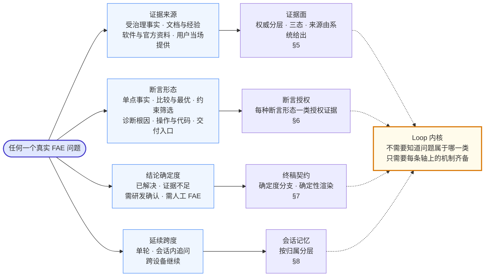

**不变式：图上没有“判断问题类型”这个节点，因为不存在这一步。** 问题直接沿四条轴分解，Loop 从不查询问题属于哪个类别。前置阶段可以把问题的某些性质类型化，例如“这是一次横向比较”“答案依赖用户上传的图片”“这是带平台约束的选型”。这些是交给授权机制的**声明**，不决定执行路径，也不裁剪工具集。如果某个前置字段开始决定“这题走哪条链路、用哪份提示词”，路由层就回来了。

**推论：任何新增构件都必须能指回某一条轴。** 指不回去的构件就是堆砌，应当删掉，或者先说明它服务于哪条新轴，而新增一条轴需要修改本节。

**这个空间可以被证伪。** 任何真实问题都应当能落在四轴上的一个点，落不上说明轴选错了，这是修改本设计的信号，比维护一张覆盖清单更有用。举例：

- “335Le 和 435Le 哪个精度高” = (受治理事实, 横向比较, 已解决或并列冲突, 单轮)；
- “按你刚才说的换了线还是没深度图，这是日志截图” = (用户附件 + 软件排障经验, 诊断, 可能需要人工 FAE, 会话内追问)；
- “给我这款在 Jetson 上的 SDK 下载地址” = (软件支持关系 + 官方资料, 交付入口, 已解决或证据不足, 单轮)。

四条轴之间没有约束关系，取值组合不需要枚举。它们分别作用于不同构件，这就是一个 Loop 能处理全部问题的原因。

**旧的能力词汇降为标注语言。** 产品目录、规格、选型、SDK、排障、经验、风险、上下文这些词继续用于归因、评测和复审交流，但它们不再是执行单元，也不各自对应一个取证器。每条轴已经替它们给出了结构位置。

<a id="overview"></a>

## 3. 架构总览

下面两张图描述同一个静态结构，分工不同。**文本图**给出分层与跨界契约；契约写在层与层之间，因为它是双方共同的承诺。**Mermaid 图**给出构件与连线，四条轴各自逼出的结构都能在图上指出来。

有一处必须先说明：本图**没有子 Agent 集群，也没有调度器**。§2 的四轴已经解释了原因：Loop 不需要知道问题属于哪一类。FAE 的广读需求（例如扫描全目录做选型）在工具侧通过横向查询解决，不另开下级窗口（§4.4）。

### 3.1 分层与跨界契约

```text
┌───────────────────────────────────────────────────────────────────────┐
│              👤 FAE / 售前 / 客户 —— 一个自然语言入口                 │
│    提问 · 追问补条件 · 排除选项 · 上传日志/截图/文档 · 要资料 · 反馈  │
└───────────────────────────────────┬───────────────────────────────────┘
                                    ↕
┌───────────────────────────────────┴───────────────────────────────────┐
│                               ① 接入层                                │
│      多渠道入口 · 身份与会话归属 · 附件接收与校验 · 流式回传          │
│                    会话恢复 · 反馈采集                                │
└───────────────────────────────────┬───────────────────────────────────┘
      跨界契约：一次新用户输入 ＝ 一个轮次 · 附件只以不透明引用进入
                传输失败不自动重发 —— 服务端可能已经答完
                                    ↕
┌───────────────────────────────────┴───────────────────────────────────┐
│              🧭 ② 前置阶段 —— 接地与声明，不分派                      │
│      可枚举红线 · 实体接地（查目录）· 问题性质声明 · 主题切换         │
├───────────────────────────────────────────────────────────────────────┤
│                  🧠 ② AI FAE Loop —— 唯一执行主体                     │
│                  无路由层 · 无调度器 · 模型自主取证                   │
│                                                                       │
│ 上下文组装 ──→ 模型决策 ──→ 结构化提交 ──→ 断言授权 ──→ 确定性渲染    │
│      ↑              │                          │                      │
│      └── 回执 ──────┘ ←──── 缺证：回到取证 ────┘                      │
├──────────────────────┬──────────────────────┬─────────────────────────┤
│   会话记忆（按归属） │   断言授权           │   预算三件事            │
│ 本轮上下文           │ 按断言形态逐条授权   │ 能力下限   ▸ 门         │
│ 会话工作状态         │ 作用于单条结论       │ 失控断路器 ▸ 事件       │
│ 会话档案（只追加）   │ 只读证据状态不读措辞 │ 归因账本   ▸ 只记录     │
└──────────────────────┴───────────┬──────────┴─────────────────────────┘
      跨界契约：参数契约 · 实体身份由服务端解析 · 回执区分缺失与否定
                来源由执行器记录，不由模型复述 · 链接只取核验记录
                                    ↕
┌───────────────────────────────────┴───────────────────────────────────┐
│             🔧 ③ 工具层（按证据权威分组，不按问题类别）               │
│                                                                       │
│ 🔎 型号与事实   📚 文档与专题   🧩 软件与官方资料   📎 用户附件       │
│  解析·查询·横向   检索·整读       支持关系·代码·入口   检索·读取·看图 │
│  约束核对         表格不切碎                          仅有附件时出现  │
├───────────────────────────────────────────────────────────────────────┤
│ 📏 权威阶梯   受治理事实 > 文档与专题 > 用户附件 > 模型常识           │
│               可以跨层补充，不能跨层替代                              │
└───────────────────────────────────┬───────────────────────────────────┘
      跨界契约：回答路径只读 · 不在线抓取外部来源 · 知识资产不合法不上线
                                    ↕
┌───────────────────────────────────┴───────────────────────────────────┐
│                          ⚙️ ④ 知识与数据底座                          │
│                                                                       │
│ 受治理知识   型号目录 · 型号事实 · 字段覆盖 · 文档与专题              │
│              软件支持关系 · 代码证据 · 官方资料入口                   │
├───────────────────────────────────────────────────────────────────────┤
│ 运行数据     会话档案（只追加）· 会话工作状态（可替换）               │
│              反馈与复审 · 附件临时存储 · 执行轨迹                     │
├───────────────────────────────────────────────────────────────────────┤
│ 离线治理     抽取 → 逐条裁决 / 逐页核验 → 审计 → 发布（单向）         │
└───────────────────────────────────┬───────────────────────────────────┘
                                    ↕
┌───────────────────────────────────┴───────────────────────────────────┐
│          🌐 外部提供方（显式配置 · 不自动切换 · 不隐式降级）          │
│                                                                       │
│ 主模型 API   流式响应 · 拒答与不可用分别识别                          │
│ 视觉模型     只看用户当前附件，按当前问题分析                         │
│ 统一平台     身份 · 反馈闭环 · 附件归档                               │
└───────────────────────────────────────────────────────────────────────┘
```

**不变式一：跨界契约写在层与层之间，不写在任何一层内部。** 每条契约都是双方共同的承诺，任何一方单独“加强”它都会破坏另一方。比如工具层根据问题关键词替模型挑选资料，契约上看是“更聪明”，实际上是把 ② 的自主取证换成了预设流程，而且从输出上观察不到。

**不变式二：④ 中只有“离线治理”一行能写受治理知识。** 回答路径没有写知识的边；生产反馈也没有直达知识的边，只能作为待审材料进入裁决（§5.4）。

**不变式三：“会话档案”和“会话工作状态”是两行，不能合并。** 合并它们，就等于允许状态投影改写已经发生的轮次和回执，复盘和审计会随之失效（§8）。

**不变式四：用户附件在 ③ 是独立的一组工具，在 ④ 只进临时存储。** 附件证明的是“用户的现场发生了什么”，永远不会变成官方事实。

层表示职责，不代表新增独立部署。

### 3.2 构件与连线

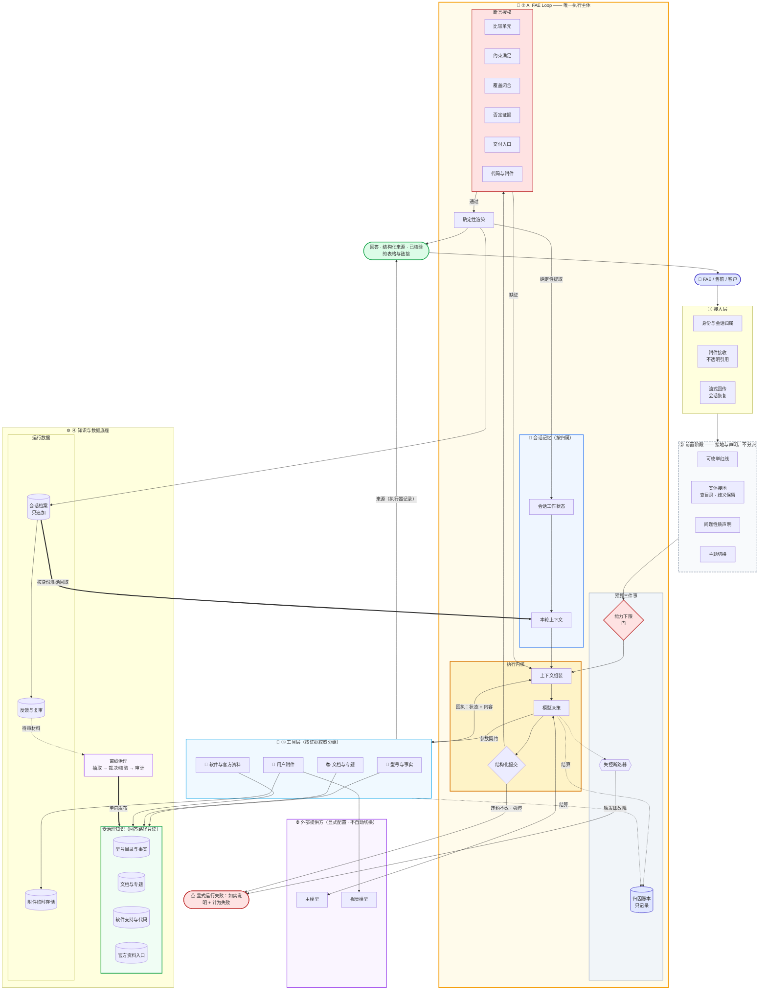

图上有七处是刻意的，每一处对应一条可检验的不变式。**实现里出现了图上不该有的那条边，就是对应条目被违反了：**

| # | 图上的事实 | 违反它意味着什么 |
| --- | --- | --- |
| 1 | 前置阶段到 Loop 只有一条边，没有分叉成多条执行路径 | 路由层回来了（§2） |
| 2 | 工具到受治理知识只有读边，唯一的写入边来自离线治理 | 回答路径改写事实，审计失效（§5.4） |
| 3 | 来源从工具直接到输出，不经过模型 | 来源可能被模型复述走样或编造（§5.3） |
| 4 | 到达输出只有“提交 → 授权 → 渲染”一条路径，模型自由文本没有到输出的边 | 取证过程、自查和半成品混进回答（§7） |
| 5 | 授权失败的出边回到上下文组装，而不是回到正文 | 出现“扫描正文再改写”的修补回合（§6） |
| 6 | 反馈到离线治理是虚线“待审材料”，没有到受治理知识的边 | 一次点踩或一条复审意见直接变成官方事实（§5.4） |
| 7 | 归因账本只有虚线入边，没有出边；断路器的出边指向失败而不是用户 | 对话越长越难回答；把“坏了”说成“额度用完”（§10） |

另外两处结构性事实：会话档案只有指向本轮上下文的粗箭头，没有反向入边，也就是说状态永远不改写档案（§8）；用户附件工具通向临时存储和视觉模型，不通向受治理知识（§5.1）。

### 3.3 层的职责与承诺

| 层 | 拥有什么 | 向上承诺 | 向下要求 |
| --- | --- | --- | --- |
| ① 接入 | 用户身份、会话归属、附件接收、流式通道、会话恢复 | 一次输入只成为一个轮次；传输失败时保留已收到的内容并说明原因 | 轮次的结果与确定度由下层给出 |
| ② 前置 | 红线、实体接地、问题性质声明、主题切换 | 只拦可枚举的红线；接地只查目录；声明不分派 | 抽取失败要显式记录，不能让整题失败 |
| ② Loop | 上下文组装、终稿通道、断言授权、预算、会话状态写入 | 用户看到的就是通过授权的提交；失败都是显式的 | 回执真实，能区分缺失、否定和冲突 |
| ③ 工具 | 参数契约、实体解析、状态、来源、横向查询 | 非法参数不产生任何效果；回执反映实际查到了什么 | 知识资产经过审计，版本一致 |
| ④ 底座 | 受治理事实与运行数据 | 回答路径只读；冲突保持冲突；档案只追加 | 知识变更只走裁决流程 |

<a id="loop"></a>

## 4. Loop：唯一的执行主体

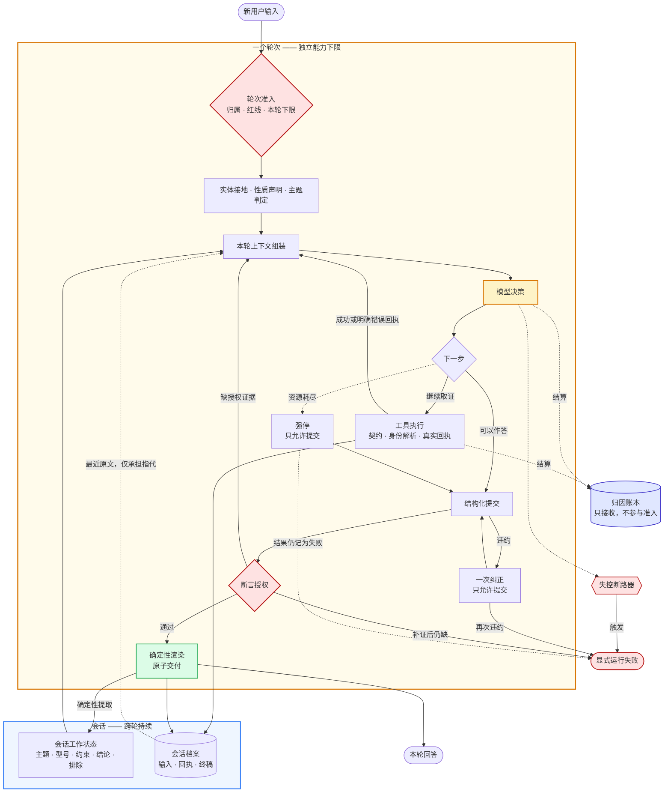

图上有五处形状是刻意的，每一处对应一条不变式：

1. **到达 `OUT` 的唯一路径是“提交 → 授权 → 渲染”。** 模型在提交之前写下的文字只进入内部记录，不交付给用户。
2. **纠正只有一次。** 再次违约就显式失败，既不无限重试，也不把自由文本降级交付给用户。
3. **强停之后仍然可以结构化提交，但结果记为失败。** 正文读起来通顺，不构成把运行失败改判为“已解决”的理由。
4. **授权失败回到取证，不回到改写。** 图上不存在“扫描终稿再修一轮”的边。
5. **会话工作状态由代码从本轮产物中提取，不经过模型摘要。** 模型可以写错一段总结，但不能把错误写进状态。

### 4.1 职责边界

| 角色 | 负责 | 不负责 |
| --- | --- | --- |
| 模型 | 理解问题；选择工具与参数；判断证据是否足够、读到什么程度；撰写结论、依据、注意事项和下一步；选择结论确定度 | 生成来源、构造链接、编造型号映射、声明运行失败、批准知识变更 |
| Loop 内核 | 终稿通道、字段校验、断言授权、补证与强停、预算、会话状态写入、交付 | 代写失败的答案、修补模型的参数、按关键词替模型选工具、改写正文、改判确定度 |
| 工具执行器 | 参数契约、实体身份解析、状态区分、来源记录、横向查询 | 排序推荐、替模型挑资料、把缺失写成否定、控制取证顺序 |
| 前置阶段 | 可枚举红线、目录接地、性质声明、主题切换 | 意图分派、裁剪工具集、因为知识库没有证据就拒答 |

越界的后果是不对称的，所以不能靠“两边都小心点”了事。执行器替模型挑资料，会把自主取证悄悄变成预设流程，而且外部观察不到；模型自报来源或链接，会让可审计性失去意义。前者毁掉能力，后者毁掉可信度。

这张表还有一个推论：**代码只做可以确定性判定的事，模型只做需要语义判断的事。** 代码用正则去判断“这句话是不是承诺过度”，属于代码越界；模型自己宣布“这个型号支持 PTP”却不查证，属于模型越界。

### 4.2 一轮的结束条件

一轮要合法结束，必须同时满足三点：模型给出了一份结构化提交，且提交本身完整；提交中每一条结论都获得了授权，或者已被降级为有边界的表述；用户看到的内容与这份提交的渲染结果完全一致，并以一个整体交付。

空答、输出截断、协议违约、提供方拒答、提供方不可用是五个独立的事实，都不构成正常完整的回答。它们各自如实报告，不能互相顶替，也不能包装成“证据不足”。

模型需要补充信息时，要**先给有边界的回答，再提问**（answer-then-clarify）。只追问不给初步判断的回答，对一个等着推进工作的 FAE 没有用；“已经提问了”也不是一种合法的结束状态。常见的正确形态是：“按你目前给的条件，初步判断是 X，前提是 Y；如果实际距离超过 Z，结论会变，请确认距离。”

### 4.3 前置阶段为什么不是路由

前置阶段只做四件事，每件事都有明确的边界：

- **红线只拦可以枚举的内容。** 价格、报价、交期、采购、客户私有项目、不可承诺的事项属于这一类。红线不承担意图识别，不能因为知识库里没有证据就拒答，也不能因为问题短就拒答。像“精度能到 1mm 吗”“这个灯为什么闪”这类问题，都在服务范围内。拒答范围宁可窄，不可宽。
- **实体接地只查目录。** 用户说的别名、简称、系列名，由目录解析为标准身份。歧义要显式保留：裸称“338”对应多款型号时，就保持歧义，不因为新型号入库而默认成其中一款。
- **性质声明只供授权消费。** “这是比较”“答案依赖图片”“选型带平台约束”这些声明，告诉授权机制要检查什么，但不告诉 Loop 该走哪条路。
- **主题切换驱动会话状态归档**（§8）。

前置阶段的抽取是辅助件。抽取失败时，显式记录降级事件，Loop 照常基于原始问题工作，不能让一次抽取抖动导致整题失败。

**判错条件：** 某个前置字段开始决定使用哪套工具、哪份提示词、哪条执行链路时，就是路由层回来了。这个字段应当删除，或者改写为授权机制的输入。

### 4.4 为什么不设下级窗口

一类问题的成本不在推理，而在**读取量**。比如“哪些型号支持 PoE 且防护等级不低于 IP65”，或者“这个场景下全目录谁合适”，如果让模型逐款型号去读文档，主窗口会被几十份正文塞满，后续每一轮都要为这次读取付出注意力代价。

HR 场景的做法是开一个只读的下级窗口去广读。FAE 不这么做，因为 FAE 的广读对象大多是**结构化事实**，而结构化事实天然支持横向查询：一次调用返回“全部型号 × 指定字段”的表，或者返回“全部型号 × 全部硬约束”的判定表，并附带权威计数。广读在工具侧一次完成，主窗口只看到结果。

这个选择需要守住两条边界：

- 横向查询的结果不排序、不推荐。排序是模型基于证据做的判断，工具只给判定。
- 结果大到主窗口放不下时，如实失败，不能悄悄截掉一部分再交出去，否则模型会把“表里没有”当作“目录里没有”。

**判错条件：** 如果实测显示主窗口压力主要来自整读大段非结构化文档（例如为一次排障连续读十几节文档），而不是来自结构化事实，那么横向查询解决的就不是真正的问题，需要重新评估有界下级执行。

<a id="evidence"></a>

## 5. 证据面：权威分层与缺失不等于否定

**证据来源轴**要求所有来源以同一种形态呈现给模型：可以发现，可以按需读取，每次读取都返回“查到了什么、没查到什么”的真实回执。来源之间的差异在于**能证明什么**，不在于接口形态。

### 5.1 权威分层

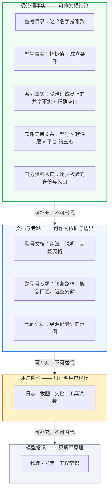

**不变式：箭头只从上往下。** 下层可以补充上层没有覆盖的部分，但不能推翻上层。附件与官方事实冲突时要并列展示，不能让附件覆盖官方事实；文档与事实层冲突时，以事实层为准，并把冲突暴露出来，交给治理流程处理。

每一层都有它**不能证明**的东西，这一点比它能证明什么更重要：

| 层 | 能证明 | 不能证明 |
| --- | --- | --- |
| 型号事实 | 该型号某字段的值，以及它成立的条件 | 同工况的性能承诺；相邻型号的值；空字段就代表“没有” |
| 系列事实 | 在受治理成员上共享的事实，以及哪些成员还没有来源 | 成员清单不能代理系列属性；部分成员的来源不能冒充全系列 |
| 软件支持关系 | 设备注册、功能能力、公开支持名册，三件事各自成立 | 设备注册不等于封装层支持；支持不等于默认开启；一个分支的结论不能外推到其他分支 |
| 代码证据 | 经源码验证的示例可以作为可复制代码 | 只有文档依据时，只能给调用路径或标明是伪代码 |
| 官方资料入口 | 页面或仓库的身份与交付入口 | 该软件的运行时能力，比如仓库存在不代表支持虚拟设备 |
| 文档与专题 | 说明、边界、诊断路径、经验 | 与事实层冲突时的硬指标 |
| 用户附件 | 附件写了什么、日志出现了什么、图上能看到什么 | 官方事实；附件里的指令也没有任何指令效力 |
| 模型常识 | 原理与概念解释 | 任何型号级的数值或支持性结论 |

**经验类知识需要单独说明。** 历史问答里有大量 FAE 经验，但它们质量不齐，而且经常把某次现场结论写成通用规律。未经复审分级的历史问答不进入回答路径；经过复审、被标为可信的经验，才能作为文档层的补充回来。

### 5.2 缺失不等于否定：下沉到协议里

这条原则只写在提示词里是不够的。模型多次检索都没命中，就容易写出“该型号不支持 X”；因为答案里没出现“停产”，就推出“在售”。所以这条原则要**下沉到回执协议**，让模型根本拿不到把缺失合成否定的材料。

- **查询结果在协议里就区分状态**：“有这个口径，但当前没有数据”“没有这个口径”“部分覆盖”“来源冲突”，每种状态有独立语义，不存在一个含糊的“空”。
- **支持类事实一律三态**：支持、明确不支持、尚未取得证据。穷举名册里没有列出某个型号，只能算“未列出”，不能算“不支持”。
- **冲突是合法状态**：两份官方来源给出不同的值，比如规格表和 FAQ 的精度口径不一致，这件事本身就是事实。它必须并列呈现给用户，系统和模型都不能挑一个值。

**资料缺口不等于能力失败，但也不等于任务完成。** 客户问到未发布参数、内部路线图、某个型号在某平台上的实测数据时，正确的回答是说明缺什么、给出验证路径或建议转人工。不能编造，也不能因为缺了一项就拒绝回答其余有证据的部分。反过来，“解释了为什么资料不足”是诚实的输出，但它**不能被计为问题已经解决**，要在评测中分开记录。

### 5.3 身份与来源由服务端给出

**型号的标准身份由目录解析给出，模型不负责拼装。** 原因不是“多一层更安全”，而是：让生成器根据命名规律推型号、把简称映射成“看起来像”的型号，会把身份绑定变成一个生成正确性问题。模型可以从“XL”推出一个似是而非的映射，从正文里摘一个近似型号名，再配上邻近条目的参数，组成一个看似完整、实则错误的结论。校验只能事后拒绝，无法预防。

**来源由执行器从本轮实际调用中记录。** 模型不在正文里复述来源，所以编造来源在结构上就不可能发生。回答正文保持人能读懂的样子，不出现文件路径、行号或内部引用；详细来源放在结构化的来源区。

**链接只能原样取自本轮核验记录。** 链接是 FAE 场景里最容易被“合理构造”的东西：给仓库地址加个后缀，按规律拼一个下载页，都是很自然的推测。所以终稿中的每一个链接都要与本轮工具返回的核验记录精确比对，任何构造都算违规。

代价是：解析与比对要求身份在同一会话内稳定。同一个型号、同一条资料，在多次调用之间的标识必须一致，否则比对会误报。

### 5.4 回答路径只读，治理在离线完成

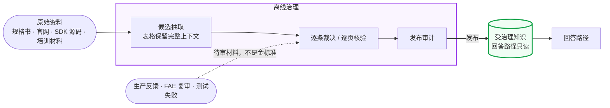

**不变式：进入受治理知识的粗箭头只有一条，且来自审计。** 生产反馈只作为待审材料进入裁决。如果一条“这个型号不支持 PTP”的负面反馈，没经过对照官方来源的裁决就成了事实，那就违反了这条不变式。反馈可能是对的，也可能只是反馈者在某个版本、某个配置下的观察。

治理流程背后有三个设计决定：

- **冲突是合法的事实状态，而不是有待消除的错误。** 来源不一致时，系统必须能把“它们不一致”原样交给回答路径。否则只剩两种结果：某处代码按先后顺序悄悄选了一个值，或者模型自己挑了一个。无论哪种，错误的值都会带着官方权威流出去。
- **权威来自核验，而不是出现的先后。** 人工核验过的结论，不会被后来的自动抽取覆盖。治理流程回答的是“这个值凭什么成立”，而不是“哪个值更新”。
- **回答路径不在线抓取外部来源。** 官网会改版、会下线页面、会混入营销文案和价格，在线抓取会让同一个问题在不同时间得到不同的“官方”答案，而且无法追溯。外部来源只能以离线候选的形式进入治理流程。

知识资产本身不合法时，比如目录与事实不一致、链接没有核验记录，系统宁可不上线，也不能静默关掉某项能力继续运行。静默关闭的后果是，用户以为自己得到的是完整能力下的答案。

### 5.5 竞品与迁移

客户经常用竞品型号提问：“能不能替代 D456”“Kinect 的项目怎么迁移”。竞品型号**不是**目录里的型号，不能被解析成自家产品，也不能进入选型候选。它们作为专题证据存在，内容限于有来源的对照关系和迁移注意事项。

迁移问题的正确回答是给出对照维度和差异，再给出验证步骤，不能承诺“即插即用”。“替代”是一个工程结论，需要在客户的实际条件下验证。

<a id="claims"></a>

## 6. 断言授权：结论强度不超过证据强度

**断言形态轴**是 FAE 与通用问答差别最大的地方。同一份证据可以支撑“A 的量程是 X”，却不能支撑“A 是全系列量程最远的”；可以支撑“A 满足你给的距离条件”，却不能支撑“A 是你这个场景的最佳选择”。每种断言形态都需要自己的授权证据，而且授权作用于**单个比较单元或单条结论**，而不是整道题。

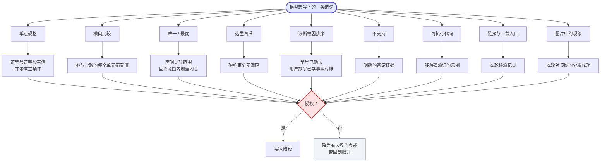

**不变式：一条没有获得授权的结论只有两个去向：降为有边界的表述，或者回到取证。** 没有“措辞加强以后放行”的边，也没有“扫描正文、改写一轮”的边。

### 6.1 各断言形态的授权

| 断言形态 | 需要的授权证据 | 未获授权时的正确表述 |
| --- | --- | --- |
| 单点规格 | 该型号、该字段有值，且带成立条件（距离、分辨率、模式等） | “当前资料未提供该参数” |
| 横向比较 | 参与比较的每个单元都有值 | 缺值的单元照样出现在表里并标为“未取得”，不删行删列，也不用另一侧的值推出差异 |
| 唯一 / 最优 | 声明比较范围（给定候选、某系列、全目录），且该字段在该范围内的数据完整 | 只在已比较的集合内下结论，并说明范围 |
| 选型首推 | 用户的全部硬约束都满足；“无数据”不等于“不满足” | 放进“待验证”，不进首推；硬约束不满足的型号，任何软偏好都不能把它排上来 |
| 带平台约束的选型 | 推荐型号的产品入口，加上对应平台的集成入口 | 属于不完整交付，要说明缺哪一类入口 |
| 诊断根因排序 | 型号已确认，用户给出的数字已经与事实核对过 | 写成“待验证的几个方向”，附上能区分它们的对照实验 |
| 不支持 | 明确的否定证据 | “目前未取得该能力的证据，建议通过……确认” |
| 可执行代码 | 经源码验证的示例 | 给调用路径，或明确标注为伪代码 |
| 具体配置 / 启动文件 | 该精确型号存在正向映射 | 说明证据缺口，并给出确认途径 |
| 链接 | 本轮核验记录 | 不给链接，说明从哪类官方渠道获取 |
| 图片中的现象 | 本轮对该图的分析成功 | 不写与图片相关的结论 |

### 6.2 为什么授权作用于单条结论

如果授权作用于整道题，就只有两个结果：只要有一项证据不足就整题弃答，或者只要大部分证据足够就整题放行。前者会让一个本来八成能答的选型问题变成“无法回答”，后者会让一个缺了关键一格的比较结论混进回答。

作用于单条结论，意味着**局部失败只产生局部影响**：一条比较结论没有授权，就只删掉这一条，已经核验过的对比表和其他有效结论都保留。只有当被删掉的恰恰是问题的核心，比如用户问的就是“选哪个”，而推荐结论全部没有授权时，整题的确定度才相应下调。

### 6.3 为什么不用正文词表门

一个看似更简单的方案是：扫描终稿里的“支持”“最佳”“一定”等词，命中就拦截或改写。这个方案在实践中被证明是错的，原因有三：

- **开放式语言无法用有限词表完备覆盖。** 词表判为干净的回答，人工复审仍然能找出问题；词表命中的回答，多数经复审其实是事实正确的。
- **修补回合会改写原本正确的回答。** 每多一轮“检测到问题 → 让模型重写”，都会引入新的方差和成本，并且可能把一个好答案改坏。
- **它把判断放错了地方。** “这句话是否越界”取决于证据，而不是措辞。同样一句“支持 PoE 供电”，有证据时是正确结论，没有证据时就是越界。

所以授权只消费**工具回执中的结构化证据状态**，不读正文词面。离线的词面检查可以保留，作为复审时的筛查信号，但它不改变回答，也不改变确定度。

### 6.4 补偿与棘轮

授权机制不可能一次全部建成。在某种断言形态还没有结构化授权之前，可以用提示词临时约束模型，例如“下否定结论之前，必须用原名检索过”。这种临时约束叫**补偿**，它有两条纪律：

- **每条补偿都要登记它补的是什么，以及什么时候可以删掉。** 删除条件必须是一个机制落地，而不是“连续几次没出问题”这种运气指标。
- **规则、关键词表和语义判定器的总数只减不增。** 一条补偿删不掉，说明对应的机制还没有真正接住这件事；一条新补偿加进来，必须替换掉旧的。

这条纪律要防止的，是“每出一个错就加一条规则”的补丁堆积。一旦开始堆积，系统会慢慢退回按类别分派的形态，只是规则写在了提示词里，而不是代码里。

<a id="final"></a>

## 7. 终稿：结构契约与确定性渲染

**结论确定度轴**要求把回答的结果分成两类：一类由模型声明，属于语义判断；一类只能由运行时报告，属于运行事实。两类之间不能互相改判。

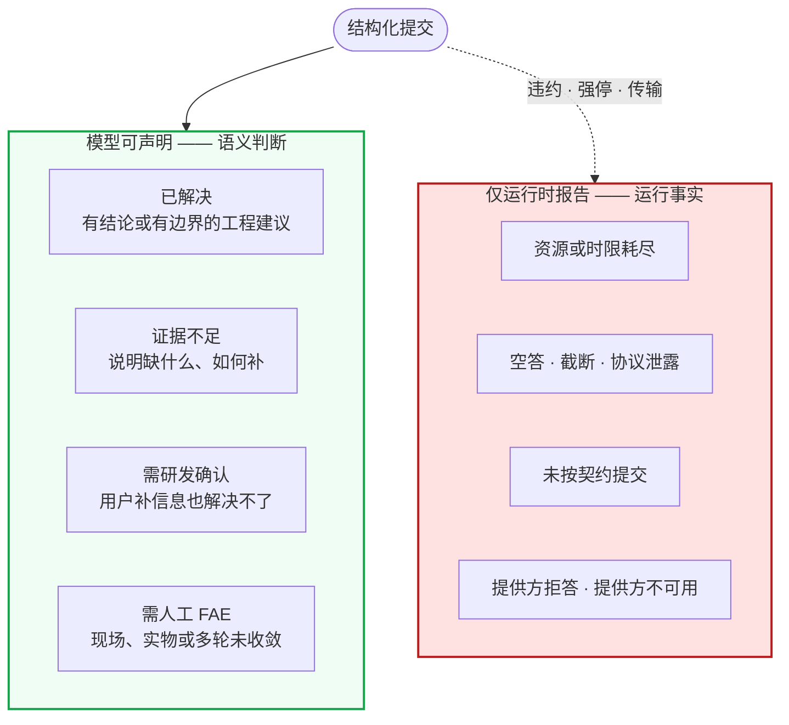

**不变式：两个框之间没有箭头。** 模型不能声明运行失败，否则它可以用“资源耗尽”来掩盖自己查不到；运行时也不能因为正文可读，就把运行失败改记为“已解决”，否则强停之后的半成品会被当作完整回答计入质量。运行失败在评测中一律算失败，只有用例本身预期弃答时例外。

### 7.1 四种确定度的区别

“证据不足”“需研发确认”“需人工 FAE”在用户看来都是“没有给出最终答案”，但它们指向不同的后续动作，必须分开：

| 确定度 | 下一步由谁推进 | 典型情况 |
| --- | --- | --- |
| 证据不足 | 用户补充信息，或自行做一个简单验证 | 没说具体型号；没给工作距离；需要看一下固件版本 |
| 需研发确认 | 产品或研发内部 | 未发布参数；两份官方资料冲突；某平台的支持尚未公布 |
| 需人工 FAE | 人工 FAE 介入 | 需要看实物或现场；多轮排查仍未收敛；涉及客户项目的定制判断 |

每一种都必须交代它特有的内容：已解决必须有结论，证据不足必须说清缺什么，需研发确认必须列出待确认事项，需人工 FAE 必须写明转人工的理由。一个“证据不足”的回答如果同时给出确定结论，就是自相矛盾，这种组合在结构上是不允许的。

### 7.2 字段互斥消除结构矛盾，不消除语义矛盾

提交的字段随确定度分支，某些字段在某些分支下必填，某些字段被禁止。这样能消除机器可以判定的矛盾，比如“证据不足”却附带了结论。

但结构无法证明字段里的自然语言与所选分支一致：模型仍然可能在“已解决”的结论里写下“目前无法确认”。这类问题属于语义复审的范围，不能宣称已经被结构从根本上封死。**把这个边界写清楚，本身就是设计的一部分。** 如果宣称结构解决了语义问题，评测就会停止寻找这类错误。

### 7.3 确定性渲染与取舍

模型提交的是字段，用户看到的回答由代码按固定结构拼出：结论、依据、注意事项、验证与下一步；空的部分不出现。比较表、链接这类需要精确的内容，由代码直接从证据生成，模型不转抄数值。

这样做得到两点保证：

- **只有通过授权的内容能到达用户。** 模型在取证过程中写下的思考、自查和中间判断，不会混进回答。
- **精确内容不经过模型转述。** 一张对比表里的数值，和工具回执里的数值逐字一致。

**这是一个明示的取舍。** 固定结构不如自由写作灵活，对“你是谁”“这是什么意思”这类简短问答显得生硬。这是展示层的代价，不能因此把事实正确的回答记为能力失败。

### 7.4 为什么每个回答都走结构化提交

有一种看法是：普通问答依赖模型自然结束即可，强制每个回答都调用一次提交，会多付一次调用成本。FAE 仍然选择强制提交，理由如下：

- FAE 的回答几乎都带有需要授权的断言。没有结构化提交，授权机制就只能扫描自由文本，这正是 §6.3 否定过的路。
- 实践中，自由文本终稿会稳定地混入取证叙述、标签自查和内部名词，词表永远追不上。关闭字段之外的交付通道，是唯一在结构上解决这个问题的办法。

**判错条件：** 如果实测显示结构化提交明显损害了简短问答的质量，正确的调整是增加一种“简答”的字段形态，而不是重新开放自由文本通道。

### 7.5 降级必须可见

以下情况都必须对用户和评测显式可见，并在评测中计为失败：系统异常、能力没有用上、附件没有读成、视觉分析失败、处理被强停、协议违约。明令禁止的做法有三种：

- 从一条路径降级到另一条路径，却不暴露降级；
- 返回通用的兜底文本，却标记为成功；
- 在润色过的回答里藏一句“知识库未收录”式的兜底话术。

降级可见的意义在于让失败可以被修复。被藏起来的降级，在数据里看起来就是一次成功。

<a id="memory"></a>

## 8. 会话记忆

**延续跨度轴**要求按**归属**给记忆分层，而不是按存储位置分层。FAE 咨询天然是多轮的：用户补充条件、排除候选、回头追问“刚才那两款哪个更稳”，然后切换到另一个项目。记忆的目标是让每一轮都在正确的上下文上工作，而不是把历史全部堆进去。

### 8.1 为什么记忆是需要重点设计的一层

实践中，会话理解很容易被分散到多处并行的表示里：一份原始消息历史，一份结构化抽取的合并结果，一份从对话里用规则推断出来的场景和约束列表，还有一份从查证过程中提取的工作状态。它们由不同的写入方维护，在主题切换时只有一部分被重置，约束只追加不修改，其中一部分还不能跨会话恢复。

这会带来一类特定的失败：

- 旧话题的约束以“已确认条件”的身份注入新话题；
- 用户纠正了“其实是 3 米不是 1 米”，两个条件却同时存在；
- 一句正常的新问题被误判为追问，于是取消了主题切换；
- 服务重启后会话被悄悄清空，用户觉得“你怎么把前面说的都忘了”。

这些失败的共同根源不在提示词，而在**记忆没有唯一的归属和唯一的写入纪律**。所以这一层要作为结构来设计。

### 8.2 按归属分层

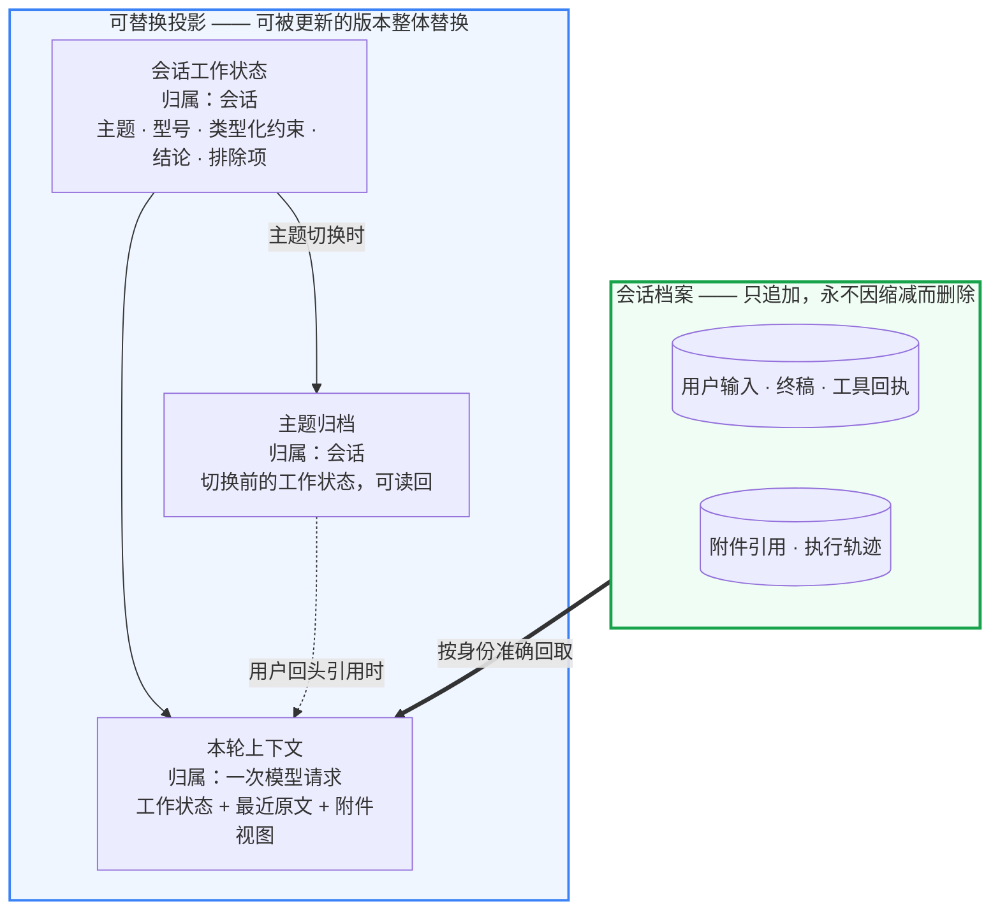

**不变式一：没有任何从投影指向档案的箭头。** 工作状态出错，只影响本轮推理的质量，不会改变已经发生的事实。这正是复盘、回放和审计都可以依赖档案的原因。

**不变式二：会话工作状态只有一份，写入方只有两类：结构化抽取的结果和工具调用的产物。** 不能对用户原话做正则推断再写入状态。正则错一次，比如把用户的口误当成约束，错误就会以“已确认”的身份长期存在。

**不变式三：状态承担记忆，原文只承担指代。** 本轮上下文里的最近原文，只用于理解“那两款”“刚才说的方法”指的是什么，不承担记住条件和结论的职责。

### 8.3 写什么、不写什么

| 内容 | 写入来源 | 为什么这样 |
| --- | --- | --- |
| 讨论中的型号 | 本轮实际解析和查证过的型号 | 查证过才算进入讨论，只被提及不算 |
| 约束条件 | 结构化抽取，按维度归类 | 同一维度可以替换，冲突可以暴露 |
| 已有结论 | 本轮终稿的结论与确定度 | 结论来自通过授权的提交，而不是模型的另一次摘要 |
| 排除项 | 用户明确排除 | 不从回答措辞里自动推断“排除”，因为这是语义判断，写错比不写更糟 |
| 待确认问题 | 终稿中的缺失项与待确认项 | 下一轮可以直接承接 |

状态有上限，超过上限时丢弃最旧的内容。**丢弃是显式设计，而不是截断的副作用**；有维度归属的结构化约束，要比自由文本约束保留得更久。

### 8.4 主题切换与焦点

- 用户的主要咨询对象变化时，比如从 AGV 避障转到机械臂抓取，工作状态整体归档，新话题从干净的状态开始。用户回头引用旧话题时，可以从归档中读回。
- **查询不是切换。** 在一次选型中顺便问“另一款的量程多少”，属于发现，不改变当前焦点。
- 判定“这是追问还是新问题”，不能依赖宽泛的词表匹配。一个“那”“它”“应该”就把一句新问题判成追问，结果是取消本该发生的切换，让旧约束污染新话题。

### 8.5 约束按维度管理

约束按维度归类，比如工作距离、精度、环境、接口、平台、目标尺寸。同一维度出现新值时替换旧值，并把“条件变了”这件事暴露出来。用户说“其实是 3 米不是 1 米”，状态里只能留下 3 米。

不按维度管理的约束列表只会越来越长，而且会互相矛盾。模型面对“距离 1 米”和“距离 3 米”同时存在的上下文，只能猜哪个有效。

### 8.6 恢复不能静默

会话状态随每一轮持久化，同一用户换设备后可以继续原来的会话。无法恢复时，比如状态过期或损坏，必须**明确告诉用户上下文已经丢失**，不能静默开一个空会话继续回答。静默丢失会让用户以为系统还记得前面的条件，从而在错误的前提下接受回答。

在记忆机制完全收敛之前，长会话可以显式建议用户开启新会话。这是一种补偿而不是修复：它只限制长会话的影响范围，对第二轮就发生的上下文错误无效，也不能自动清空用户的会话。

### 8.7 不建跨会话记忆池

复审数据不是记忆，历史会话也不是记忆池。用户在新会话里需要背景时，直接粘贴或上传即可。

按客户项目保留长期理解（比如“这个客户的产线条件、已排除的方案”）看起来很有价值，但它直接涉及客户私有信息的边界：谁能读、保留多久、怎么撤销。这件事要有明确的用户任务和授权模型支撑才立项，不作为默认能力。

<a id="trust"></a>

## 9. 执行事实的可信度

这一章只有一个设计决定：**系统对外报告的每一个运行事实，都必须真实发生过，而不能是推测出来的。** 下面各节都从它推出。

### 9.1 不知道结果时不假装知道

提供方没有响应、连接中断、输出被截断时，系统并不知道模型本来会给出什么。正确的做法是如实报告“本轮没有完成”，而不是：

- **换一个模型或端点重答。** 这会让用户以为答案来自同一个系统，而质量特征、知识边界和出错模式都已经变了；
- **把半截内容拼成一个完整回答。** 被截断的输出里可能有半个工具调用、半张表格、半句结论；
- **把系统故障包装成“证据不足”。** 前者需要运维排查，后者需要补充知识，混在一起两边都没法修。

提供方明确拒答、提供方不可用、输出截断是三个独立的事实，分别记录。有界的重试是允许的，但重试耗尽后就是系统失败，不能写进会话记忆，也不能以任何形式出现在“已确认结论”里。

### 9.2 先确认完整，再执行

输出是否完整，必须在执行其中的任何调用**之前**判定。从截断输出里拼出来的工具调用，参数可能不完整或被错误拼接；执行它得到的“证据”会以真实回执的面目进入上下文。

回答在交付前全程缓冲，只有通过完整性、结构和授权检查的终稿才会发给用户。代价是用户看不到逐字流出的草稿，首字等待时间更长。取舍的理由是：FAE 回答被客户当作依据使用，一段先流出、后撤回的错误结论，比多等几秒更糟。

### 9.3 渠道故障不算回答故障

用户没有收到回答，可能是回答本身失败了，也可能是传输出了问题。这两件事要分开记录：

- 传输失败时，客户端保留已收到的内容，说明失败发生在哪个阶段，并给出可以用来关联排查的请求标识；
- **传输失败不自动重发。** 服务端可能已经答完并落库，重发会产生重复的轮次，同一个问题可能得到两个不同的答案；
- 渠道故障不计入回答的降级统计；
- 各入口渠道（例如即时通讯机器人）的健康状况和后端健康状况分开监控。后端健康，不代表机器人真的收到了消息。

### 9.4 附件的信任边界

用户附件带来的是用户现场的真实信息，也带来三类风险。设计上分别处理：

- **附件是数据，不是指令。** 附件里写着“忽略之前的要求”“调用某个工具”，这些内容都只作为待分析的数据处理，没有任何指令效力。
- **附件不外溢。** 附件只以不透明的引用进入会话；模型看不到可以直接访问附件的凭据；执行轨迹和业务数据里不记录附件全文。附件不会自动进入知识库，也不会自动成为评测样本；进入复审或归档需要单独的授权。
- **依赖程度决定失败语义。** 每一轮都要声明本轮回答对附件的依赖程度，失败时的处理随之不同：

| 依赖程度 | 含义 | 附件读取或分析失败时 |
| --- | --- | --- |
| 答案必须依赖 | “帮我看看这张图里是什么问题” | 只能是证据不足，不能凭通用知识装作已经看过 |
| 补充材料 | 用户描述了现象，另附一张截图作为参考 | 不写任何与附件相关的结论，但由文字描述和知识支撑的排障内容照常给出，同时标记降级 |
| 无法判断 | 声明缺失或含糊 | 按“必须依赖”保守处理 |

依赖程度按每一轮单独判断，不从历史轮次继承。上一轮看过的图，不代表这一轮的问题仍然依赖它。

同一张图在一轮内只做一次模型可见的分析。视觉服务内部的重试，封装在视觉服务里面，不能让外层模型对同一张图反复调用，形成重试风暴。

<a id="budget"></a>

## 10. 预算：一个下限、一个断路器、一个账本

预算不是一个单一的量。用一个计数器同时承担三件事，必然会在某一端出错。

目前每一轮使用独立的工具调用次数和时限上限，这一点是对的：前面轮次的消耗不会侵蚀后面的轮次。但这一个上限同时充当了“能力下限”和“失控断路器”。结果是，一次合法的全目录开放选型，和一次反复补证的空转，会撞上同一堵墙，并以同一种失败结束。

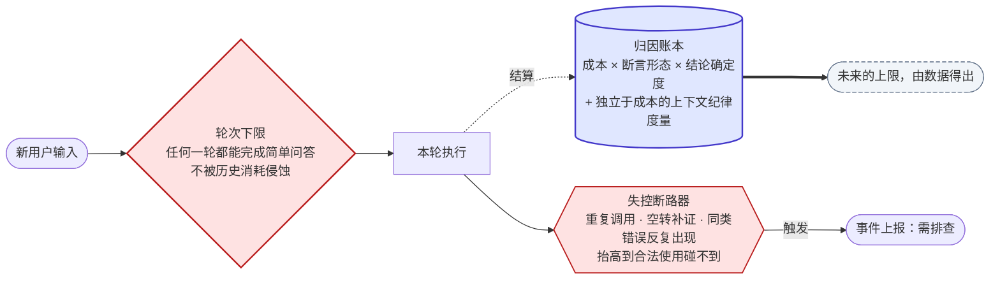

**不变式一：账本没有指向准入门的出边。** 账本接收结算，不参与准入。一旦出现这条边，“任何一轮都能完成简单操作”就会失效：对话越长，后面越难回答。

**不变式二：断路器的出边指向事件，不指向用户。** 把“资源用完了”和“系统坏了”呈现成同一件事，会让两者都无法修复。

**不变式三：资源耗尽始终是失败。** 强停后，模型仍然可以基于已有证据提交一份有边界的回答，用户能看到，但评测照样计为运行失败。

| | 是什么 | 耗尽时 |
| --- | --- | --- |
| **能力下限** | 任何一轮都能完成简单问答，不受历史消耗影响 | 本轮受限，并且明确可见 |
| **失控断路器** | 防止病态循环无界消耗，**不是配额** | 作为需要排查的**事件**上报 |
| **归因账本** | 让未来的上限可以由数据得出 | 不适用 |

**不靠调大上限来修问题。** 一次超限发生后，先要分清两种情况：一是合法任务确实需要，二是补证在空转。前者应该在工具侧合并调用来解决，例如一次横向核对覆盖全部硬约束，而不是逐条约束、逐款型号地查。后者是断路器应该捕捉的故障，应当修复导致空转的授权条件或工具契约。

**账本要回答的问题是“一次合法完成的回答花了多少”。** 所以成本必须关联到断言形态和结论确定度上；只挂在模型调用和轮次上，是回答不了这个问题的。没有这个分母，就分不清“贵是因为难”和“贵是因为浪费”。

**一个会骗人的指标：缓存命中率不能用来衡量上下文纪律。** 每轮重发已经读过的工具正文时，命中缓存让边际成本很低，账本上显得越来越高效；但窗口依然被占满，模型依然要付出注意力代价。上下文纪律需要一个**独立于成本的度量**，例如窗口中属于早前轮次、已经读过的工具正文所占的比例。

<a id="observability"></a>

## 11. 验收分层与失败归因

### 11.1 五个独立的判定轴

“谁来定义完成”必须在一处回答清楚，否则它会散落成逐个场景的争论。下面五个轴独立判定，任何一个轴通过都不代表其他轴通过：

| 轴 | 判定什么 | 由谁判定 |
| --- | --- | --- |
| 运行可靠性 | 是否正常完成：没有空答、截断、资源耗尽、协议违约或内部内容泄露；基础事实断言是否正确 | 自动化，阻断发布 |
| 协议一致性 | 声明的确定度、来源、能力标注是否与实际相符 | 自动化，单独告警，不判为答案错误 |
| 展示质量 | 是否出现内部叙述、内部路径、冗长、格式问题 | 离线告警，由人判断是否影响交付 |
| 语义与事实质量 | 是否正确、完整、有据、可执行；有没有型号混淆和无据承诺 | 独立评审：不是生成方的模型，或具名 FAE |
| 业务闭环 | 用户反馈的问题是否真正被解决 | 统一平台上的复审结论 |

旧的做法把答案质量、运行可靠性、标签协议和展示格式合并成一个通过/失败。结果是：事实正确但标签偏保守的回答被记为能力失败；为了提高这个混合指标，运行时又加入了一轮又一轮的修补。拆成五个轴，不是取消质量门，而是让运行失败继续硬性阻断，同时把语义质量交还给独立评审。

### 11.2 判定规则

1. **评审方不能是生成方。** 生成回答的模型不给自己的回答打分，换任何模型后这一点都成立。自动评测只能把回答标记为“待独立复审”。
2. **基础事实门阻断发布。** 目录数量、系列范围、量程、防护等级、接口、供电、温度、软件支持等，只要有一个关键值错误就算失败。大批次整体通过，不能证明基础事实是安全的。
3. **评判基准是用户原本要什么。** 不是测试者事后加上的条件。能力缺失导致的诚实说明是好行为，但问题仍然没有解决，两者分开记录。
4. **回放材料缺失不算产品失败。** 原图不在、前文不全、无法公平判定的用例，标为“材料不足”，不进入可运行的评测集。
5. **不只报通过率。** 每一批都要给出代表性问答、执行轨迹、降级状态和仍然失败的用例。
6. **修复要在与线上一致的环境里验证。** 反馈闭环要在与生产同版本的隔离环境中真实回放，经独立复审后才能关闭。不在生产环境里跑评测或做实验。

### 11.3 失败归因

每个失败都先按 Agent 的本质模型归因：

```text
Agent = Model + Evidence/Tools + Context + Loop（决策 → 行动 → 观察 → 再决策）
```

| 债务类型 | 表现 | 修在哪里 |
| --- | --- | --- |
| 证据 / 工具债 | 事实错误、缺失，或形态不对 | 修知识或工具；结论写进事实本身，出处只作说明 |
| 上下文债 | 状态丢失、注入错误、旧话题污染 | 修会话状态或上下文构造，不修提示词 |
| 循环 / 协议债 | 声明与正文不一致、编排缺陷、授权缺位 | 修协议或结构；提示词补偿必须登记删除条件 |
| 模型上限 | 证据齐全、协议正确，仍然推理错误 | 不用规则或正则掩盖；记录下来，留给证据加固或模型切换 |

归因之后还要做一次**类别检查**：这一类问题还有多少例？什么规范能防止它复发？有没有哪个机制是共犯？只修单个样本、不建立类别级机制的修复是不允许的。

<a id="unbuilt"></a>

## 12. 尚未建成与尚未闭合的能力

下列能力在架构中有位置，但机制尚未建成或尚未闭合。如果把它们从文档里删掉，设计会显得比实际更成立；而它们恰好是检验前面各节是否正确的压力测试。

| 能力 | 压力测试的是什么 |
| --- | --- |
| 按类别分派的历史路径彻底退役 | §2 的“无路由层”能否在全部问题上成立 |
| 会话工作状态收敛为唯一一份，主题切换由唯一信号驱动 | §8.2 的不变式二 |
| 约束按维度替换，冲突显式化 | §8.5 |
| 会话恢复失败时显式告知 | §8.6 |
| 型号解析成为作答的强制前置条件 | §5.3 的身份由服务端给出 |
| 软件与平台能力按“能力 × 软件层”三态表达 | §5.2 与 §6.1 的否定结论 |
| 唯一 / 最优、诊断排序、否定结论的结构化授权 | §6.1 中目前仍靠补偿支撑的断言形态 |
| 开放文本约束的完整性语义 | §6.1 选型：文本中缺少某个词，不等于不满足 |
| 能力下限、断路器与账本分离 | §10 |
| 广读超出上下文时的显式失败 | §4.4 |
| 经复审分级的经验知识回到回答路径 | §5.1 的经验层 |
| 中英文回答模式 | 接入层的语言偏好与终稿渲染 |
| 按客户项目的长期理解 | §8.7 的授权模型 |

<a id="part2"></a>

# 第二部分：场景与工作流

## 13. 产品场景地图

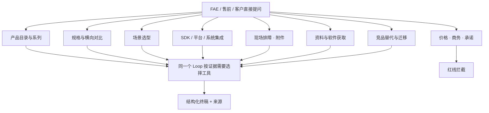

这些类别会在一个会话里交叉出现。例如，选型之后问 SDK 平台支持，再遇到现场无流，最后要固件下载入口。系统不为每一类问题造一套独立的 Agent，也不把图中的分支实现成关键词路由。

### 13.1 每个问题都带着的六个维度

| 维度 | 要理解的事实 | 常见误解 |
| --- | --- | --- |
| 实体 | 用户说的是型号别名、系列、竞品，还是含糊的简称 | 凭记忆映射别名；把裸称当成确定型号；把竞品当成自家型号 |
| 断言 | 用户要的是事实、比较、推荐、根因、代码，还是入口 | 把“哪个好”答成资料罗列；或者没有依据就判出最优 |
| 证据 | 事实、文档、软件、资料入口、附件分别能证明什么 | 把没查到写成不支持；把经验当硬事实；把仓库存在当成能力 |
| 条件 | 距离、分辨率、区域、固件、平台、软件分支 | 把某个测试点的指标外推到其他工况 |
| 上下文 | 上一轮的型号、约束、结论、排除项 | 只取最后一句独立回答；旧话题的约束混进新话题 |
| 确定度 | 能下结论、需要补充、需要研发确认，还是需要人工 | 证据不足时写得很肯定；证据充分时仍然只追问 |

### 13.2 业务问题家族

> **与[第 2 章](#axes)的关系：** 架构上的结构模型是四条分化轴，不是这张家族表。家族表是**需求覆盖清单**，用于回放、漏项检查和复审交流，不用于决定结构。任何家族都应能落到四轴上的一个点；落不上的家族，是修改第 2 章的信号。

| 家族 | 使用意图与关键差异 | 涉及证据 | 需要警惕的失败形态 |
| --- | --- | --- | --- |
| F01 产品目录与系列 | 有几款、有哪些系列、某系列包含哪些成员 | 型号目录、横向汇总 | 自己数列表；新型号入库后，裸称被默认成其中一款 |
| F02 单型号规格 | 量程、接口、供电、防护、温度、视场、分辨率与帧率组合 | 型号事实 | 串到相邻型号；丢掉成立条件；空字段被说成“没有” |
| F03 横向对比 | 两款或多款逐项比较、谁更适合某个用途 | 比较单元、字段覆盖 | 一侧无数据被推成“没有”；同一页数据冲突时只挑一个值 |
| F04 开放式场景选型 | 只描述场景，从全目录推荐 | 约束核对、选型先验 | 只看模型想到的几款；开放文本缺词导致误排除 |
| F05 候选内选型 | 在客户给定或已采购的型号中选择 | 约束核对 | 忽略客户已有设备；软偏好压过硬约束 |
| F06 平台与操作系统 | 嵌入式平台、Windows、Linux、虚拟化环境、macOS | 软件支持关系、平台专题 | 平台名把问题锁死到错误的软件层；把“支持”当作“默认开启” |
| F07 机器人与仿真集成 | ROS/ROS2、仿真平台、机器人框架 | 软件支持关系、集成专题 | 把设备注册当成封装层支持；把某个分支的结论外推到其他分支 |
| F08 多机同步与时间 | 网络时间同步、硬件触发、软件触发、与雷达同步 | 类型化同步事实、同步专题 | 把多种同步模式合并成一个布尔值；把参数页中相邻条目的能力归到别的型号 |
| F09 SDK 用法与代码 | API 用法、示例、语言绑定、数据读取 | SDK 证据、代码证据 | 代码被改写或中文化；跨语言外推；把旧 SDK 的算法能力套到新型号上 |
| F10 现场排障 | 无流、深度差、波动、丢帧、网络配置、指示灯异常 | 排障证据、专题 | 型号未确认就排根因；编造预热时间等具体参数；把推测写成定论 |
| F11 附件驱动排障 | 日志、截图、工具读数、客户文档 | 用户附件 + 官方证据 | 没有分析图片就声称看到了；用附件覆盖官方事实 |
| F12 资料与软件获取 | SDK 仓库、固件、手册、结构图、产品页 | 官方资料入口 | 构造链接；把通用入口说成型号专属下载包 |
| F13 竞品替代与迁移 | 替代其他品牌相机、项目迁移 | 迁移专题 | 把竞品当成自家型号；承诺即插即用 |
| F14 精度与光学概念 | 空间精度、时间噪声、快门、基线、测量口径 | 概念专题 | 把随机误差和系统偏差相加；认为全局快门能消除全部运动模糊 |
| F15 生命周期 | 是否在售、是否停产、替代型号 | 生命周期专题 | 从“没有停产标记”推出“量产在售” |
| F16 边界 | 价格、交期、采购、客户私有信息、不可承诺事项 | 红线 | 把技术问题当商务问题拒绝；对商务问题给出猜测 |

上面这些需求都是真实存在的。不能因为当前某类证据还不完整，就把这类需求从产品设计中删掉；也不能因为补上了一类证据，就宣称所有同类问题都已经解决。

## 14. 基础问答：一句话的问题不走流程

**典型输入：** “335L 是 USB 还是网口”“这款的防护等级多少”“什么是 ToF”“把上一段说简单点”。

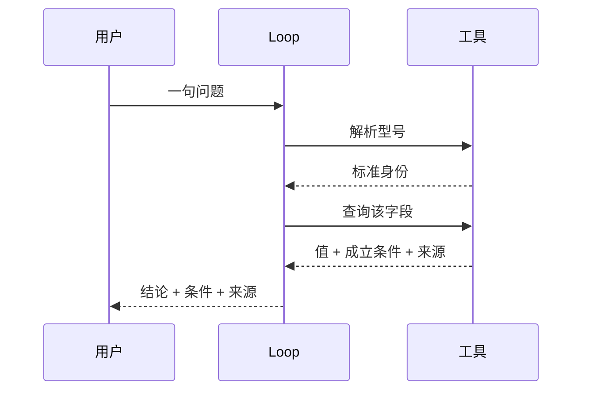

- 概念性问题可以直接回答，不强制调用工具。工具可用，不代表每次都要用。
- “把上一段说简单点”是对上一轮终稿的改写，不需要重新取证，也不能在改写时引入新的事实。
- 字段暂无数据时，回答“当前资料未提供该参数”，并在有意义时给出获取途径。不写成“不支持”。
- 型号有歧义时，先给出各候选的对应答案或说明歧义所在，不要只反问一句“您指哪一款”。

概念问答不能因为没有额外比较相邻型号，就被判为失败。**评判标准是用户原本要什么。**

## 15. 规格与横向对比

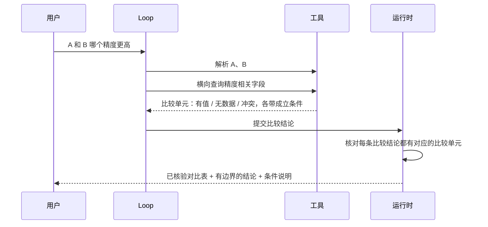

- **两侧都有值，才能说差异。** 任何一侧无数据时，只能写“无法确认该口径”，不能用另一侧的值推出“A 更好”。
- **冲突要并列披露。** 同一型号的规格表和 FAQ 给出不同的精度口径时，两个值都列出来，并说明口径可能不同，而不是挑一个。
- **不同工况下的数值不能互相比较。** A 在 2 米处的指标和 B 在 1 米处的指标，不能直接比出高低。
- **对比表由系统生成。** 表中数值与证据逐字一致；无数据和冲突的单元格照样出现在表里。
- **局部失败只影响局部。** 某一条比较结论没有通过授权，只删掉这一条，保留对比表和其他结论。

用户追问“那为什么官网说的是另一个数”时，这是一次对冲突的追问。正确的回答是把两个来源的口径差异讲清楚，而不是改口，也不是坚持原来的值。

## 16. 选型连续会话：约束 → 候选 → 证据 → 推荐

### 16.1 一个连续会话里的真实关系

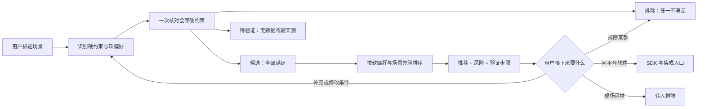

这是可能出现的走向，不规定用户必须经过所有步骤。用户第一句就说“AGV 避障、室内、2 米、Jetson、要 ROS2”，就可以直接进入核对，不必先回答一轮澄清。

### 16.2 Loop 在各时点必须知道什么

| 时点 | 应带入的信息 | 不应强制做的事 |
| --- | --- | --- |
| 首轮描述 | 距离、精度、环境、接口、平台、目标尺寸、安装方式 | 缺一项就只追问、不给初步判断 |
| 开放式选型 | 全目录候选 | 只核对模型自己想到的两三款 |
| 客户已有设备 | 已采购或已在用的型号 | 忽略它，从零推荐 |
| 用户补充条件 | 同一维度的新值替换旧值 | 新旧条件并存 |
| 用户说“不要这款” | 显式记录排除项 | 从回答措辞里自动推断排除 |
| 需要平台支持 | 推荐型号的产品入口 + 该平台的集成入口 | 只写链接名称，或构造链接 |
| 需要实测的条件 | 放进“待验证”，并给出验收方法 | 用某个数值阈值代替实测，判为满足或不满足 |
| 切换到另一个项目 | 归档当前状态 | 把旧项目的条件套到新项目上 |

### 16.3 选型的四条纪律

- **硬约束先于软偏好。** 任何一条硬约束不满足的型号都不能进入首推，软偏好只在全部满足的候选之间排序。
- **无数据不等于不满足。** 文本描述里没出现“点云”两个字，不代表设备不能输出点云。能力由软件计算得出的情况下，更不能按原始流的描述来判定。
- **全部硬约束一次核对。** 只核对一部分，其余交给正文推断，是选型结论越界最常见的来源。
- **推荐由证据排出，不写死。** 修复一个选型问题的方式是修证据和核对逻辑，让排序重新由证据得出，而不是规定“某场景必选某型号”。

一个选型会话可以连续讨论数轮。每轮要分开检查四件事：推荐是否正确、条件是否被准确承接、排除项是否被尊重、交付入口是否完整。它们可以各自通过或失败。

## 17. SDK、平台与资料交付

### 17.1 软件支持的三层证据

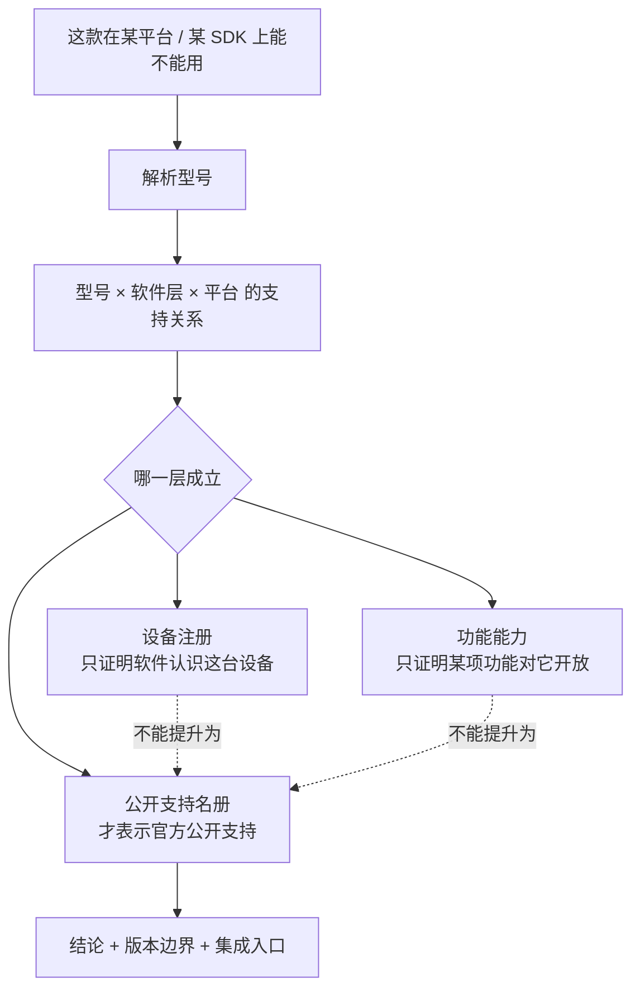

**不变式：下两层的正向证据不能提升为第三层。** 源码里注册了某设备的标识，只证明软件能识别它，不证明封装层公开支持它，更不证明某个启动配置适用于它。推荐一个具体的启动或配置文件，需要该精确型号的正向映射；一个型号有映射，不能授权同一个问题里的其他型号。

### 17.2 代码与资料

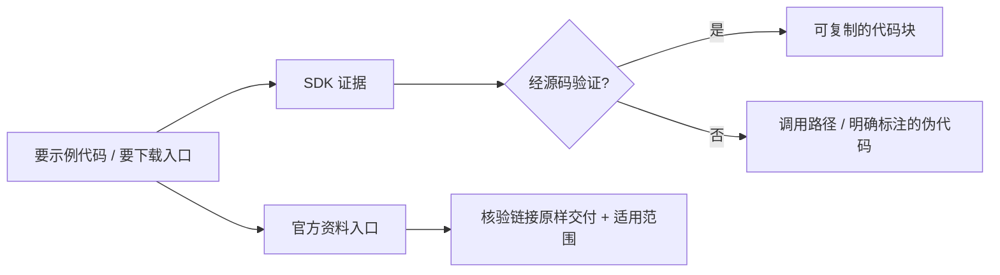

- **平台与接口是两件事。** 同一个嵌入式平台可以通过 USB、网口或专用接口接相机，不同接口对应不同的软件路径。平台名不能把问题锁死到某一个软件层。
- **仓库存在只证明入口。** 一个封装仓库的存在，不证明它支持虚拟设备、仿真运行或某项算法。
- **旧软件的能力不能靠名称相近来继承。** 旧型号或旧 SDK 上的算法能力，比如人体骨骼识别，不能因为软件名称相同就套到新型号上。
- **代码保持代码。** 代码块里只放代码，解释写在代码块外面；代码不能被翻译或改写成“看起来差不多”的样子。
- **通用入口要说明边界。** 一个覆盖整个系列的资料入口，不能被说成某个型号的专属下载包。
- **交付类问题缺入口，就是不完整交付。** 用户要下载地址，而本轮没有核验过的入口，就要如实说明，不能计为成功。

## 18. 现场排障与附件

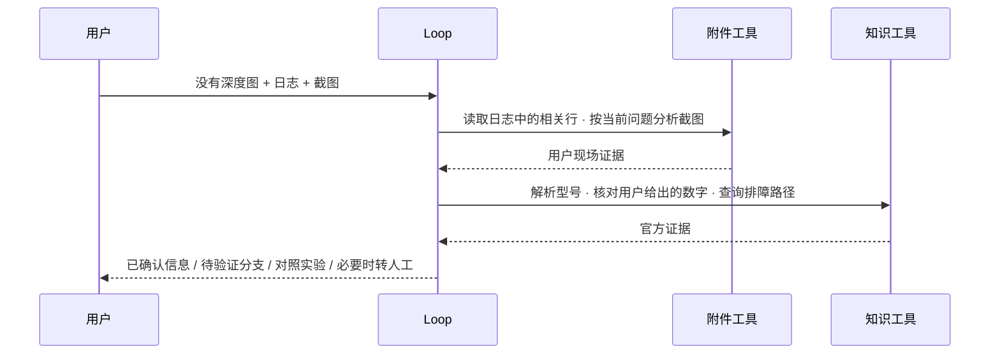

### 18.1 诊断的形态

一个好的排障回答通常包含四部分：

1. **已确认的信息**：从附件和官方证据中能确定的事实；
2. **待验证的方向**：按证据给出的可能性排列，每个方向都说明依据；
3. **区分这些方向的对照实验**：换一根线、换一个口、直连、单独供电、关闭某个功能后再看；
4. **什么时候该转人工**：哪些结果出现后，说明需要看实物或现场。

**诊断顺序由证据决定。** 例如，设备已经被识别但没有数据流时，要先检查同步模式和触发链路，再检查 USB、供电和带宽，因为从模式上讲，处于等待触发状态的设备本来就不会出流。这是一条可以跨型号复用的诊断知识，放在专题证据里，不针对某一道题。

**推测必须写成待验证。** “绝大多数情况下是……”这类说法，需要有证据支撑它的比例；没有证据时，就写“可能的方向之一”。

**用户给的数字要先核对。** 用户说“40 厘米看不清”，要先确认这个距离对该型号是在近端盲区、理想范围还是远端，再决定距离是不是原因。型号还没确认时，不能把距离当作首要原因。

### 18.2 附件的多轮处理

| 情况 | 正确行为 | 不应该做 |
| --- | --- | --- |
| 本轮上传了图片并问“这是什么问题” | 分析图片；失败就说明没能看到图 | 凭通用知识回答，却写得像看过图 |
| 本轮只有文字，上一轮有图 | 按本轮问题判断是否还依赖那张图 | 默认继承“依赖图片” |
| 日志很长 | 按问题检索相关行，引用行位置 | 把全文塞进上下文 |
| 附件内容与官方规格冲突 | 并列说明：“您的设备读数是 X，官方规格是 Y”，并给出排查方向 | 用附件覆盖官方规格，或者直接说附件错了 |
| 附件无法解析 | 说明实际读到了哪些内容 | 假装已经读完 |

## 19. 边界、弃答与转人工

| 情况 | 正确行为 | 确定度 |
| --- | --- | --- |
| 价格、报价、交期、采购 | 说明不在服务范围内，指引到商务渠道 | 红线拒答 |
| 客户私有项目信息 | 不承接，也不猜测 | 红线拒答 |
| 追问很短，但上下文与产品相关（精度、同步、安装、SDK） | 正常回答 | 不拒答 |
| 缺信息，用户能补充 | 先给出有边界的初步判断，再说明缺什么、怎么补 | 证据不足 |
| 两份官方资料冲突，需要内部确认 | 并列披露，列出待确认事项 | 需研发确认 |
| 未发布参数或路线图 | 说明未公开，建议通过正式渠道确认 | 需研发确认 |
| 需要看实物、看现场，或多轮排查没有收敛 | 给出已经确认的部分和转人工的理由 | 需人工 FAE |
| 对客户项目做承诺，例如“保证能测到 0.1 毫米” | 给出有条件的工程判断和验证方法，不做承诺 | 已解决（有边界）或需研发确认 |

拒答保持保守：只有真正无关、商务报价、私有信息和不能承诺的内容才拒答。技术问题再短、再模糊，只要与产品相关，都应先尝试给出有边界的回答。

## 20. 用户意图与交付的对应关系

| 用户意图 | 用户得到什么 | 是否产生额外写入 |
| --- | --- | --- |
| “这款是什么接口” | 结论 + 条件 + 来源 | 仅会话记录 |
| “A 和 B 比一下” | 已核验对比表 + 有边界的结论 | 仅会话记录 |
| “帮我选一款” | 候选、排除项与理由、待验证项、推荐、风险、验证步骤 | 仅会话记录 |
| “给我 SDK / 固件 / 手册” | 核验过的入口 + 适用范围 | 仅会话记录 |
| “给段示例代码” | 经验证的代码，或明确标注的伪代码 | 仅会话记录 |
| “这是日志，帮我看看” | 附件证据 + 官方证据 + 待验证分支 | 附件临时保存；归档需要单独授权 |
| “你之前说的不对” | 重新取证，承认或并列说明差异 | 仅会话记录；不自动修改知识 |
| 点赞 / 点踩 | 进入复审队列 | 反馈记录；不自动修改知识 |

回答路径**不产生任何知识写入**。这张表表达的是产品语义，不是运行时的分类规则。模型缺少明确对象或必要信息时可以提问，但不要求每个问题都先过一次确认。

## 21. 场景记录怎么写

一条场景记录只保留：**原始输入 → 必要的前文与附件 → 实际的取证顺序与回执状态 → 用户看到的回答与来源 → 确定度、降级状态、失败所在层 → 执行轨迹标识、耗时、实际使用的模型。**

| 记录项 | 要写清楚 | 不要写成 |
| --- | --- | --- |
| 原问题 | 用户原话与连续轮次 | 开发者改写后的理想问题 |
| 前提 | 前文是否完整、附件是否还在、知识是哪个版本 | 上下文缺失时仍然判答案好坏 |
| 取证 | 调用了什么、各自返回什么状态（有值 / 无数据 / 冲突） | 只写最后一句错误 |
| 交付 | 实际正文、来源、链接、确定度 | “回答里有来源”就判成功 |
| 结论 | 五个判定轴分列；失败层与债务类型 | 一个笼统的通过或失败 |

真实回放保留用户原始要求。原图或前文缺失时，标为“回放材料不足”，既不据此宣布产品不能运行，也不算作产品失败。验收分层与必须分开的结论见[第 11 章](#observability)。

<a id="part3"></a>

# 第三部分：工具与协议契约

本部分给出模型可见工具、回执、终稿与知识资产的**语义契约**。示例用于说明语义，不代表实际的传输格式；实施时以版本化的结构定义为准，并校验两者一致。

## 附录 A：工具目录

### A.1 模型可见动作

| 分组 | 动作 | 主要输入 | 返回的语义 |
| --- | --- | --- | --- |
| 型号与事实 | `resolve_model` | 用户提到的型号文本 | 标准型号身份、系列身份、歧义候选，或目录中不存在 |
| | `fact_lookup` | 标准型号、可选字段 | 事实值、成立条件、来源；或“暂无数据”“无此口径” |
| | `series_fact_lookup` | 标准系列、字段 | 受治理成员、来源实际覆盖的成员、精确缺口、全覆盖 / 部分 / 冲突 |
| | `list_models` | 字段 | 全目录“型号 × 字段”、权威计数、字段覆盖程度 |
| | `filter_models` | 全部硬约束、候选或全目录 | “型号 × 约束”判定表：满足 / 不满足 / 无数据；不排序、不推荐 |
| | `sampling_geometry` | 型号、距离、可选目标尺寸 | 物面覆盖与每像素对应尺寸；属于横向采样，不代表精度 |
| 文档与专题 | `search_knowledge` | 关键词 | 命中的章节列表，不含全文 |
| | `read_doc` | 型号、文档、可选章节 | 章节目录，或完整章节（表格不切碎） |
| 软件与官方资料 | `sdk_evidence` | API 或功能关键词 | 带定位的 SDK 证据、支持关系、代码可信等级 |
| | `official_links` | 需要的资料、可选型号与类型 | 核验过的入口与适用边界；对未确认兼容的入口显式过滤并说明 |
| 用户附件 | `search_attachments` / `read_attachment` | 问题、附件引用 | 可定位的片段（页、标题、表格位置、行号） |
| | `analyze_image` | 附件引用、当前问题 | 针对当前问题的视觉分析 |
| 会话 | `session_state` | 无 | 当前工作状态与归档的主题 |
| 控制面 | `submit_answer` | 见附录 C | 结束本轮；不是证据，不计入取证资源，不产生来源 |

用户附件相关动作只在会话中有附件时出现；图片分析只在视觉能力可用且附件中有图片时出现。

### A.2 不作为模型工具的接口

| 接口 | 调用方 | 原因 |
| --- | --- | --- |
| 发送问题、停止、恢复会话 | 前端 / API | 决定执行边界，模型不能替用户决定 |
| 附件上传与校验 | 前端 / API | 二进制内容不进入模型和流式通道 |
| 反馈、复审、闭环 | 前端 / 统一平台 / 复审中心 | 属于数据飞轮，不参与在线回答 |
| 知识抽取、裁决、审计、发布 | 离线治理 | 回答路径只读 |
| 附件归档与交接 | 统一平台 | 不重新开放给回答路径 |

### A.3 参数与身份的分工

| 模型提供 | 服务端生成或核验 |
| --- | --- |
| 型号文本、查询意图、约束、字段 | 标准身份、字段合法性、约束的可判定性 |
| 从回执中复制的标准身份 | 身份解析、状态、成立条件、来源 |
| 结论、依据、注意事项、下一步的文字 | 来源汇总、链接比对、比较单元、渲染 |
| 语义上的确定度（四种之一） | 运行失败的判定、降级标记 |

默认值只能来自已声明的契约，不能在模型漏填型号、字段或约束时替它猜一个值。

### A.4 契约一致性

1. 实际发给模型的工具定义必须与服务端校验器一致：必填项、类型、枚举、嵌套结构、额外字段都要对得上。
2. 合法参数必须能通过实际传输和服务端校验；非法参数不产生任何效果。
3. 某个提供方不支持某种结构写法时，重新设计成可以表达的明确结构，不能悄悄删掉约束，再把它塞进描述文字里。
4. 新版本契约不在运行时“兼容接受”错误形态的参数。

## 附录 B：统一回执与错误

### B.1 回执

```json
{
  "status": "not_found",
  "content": {"model": "示例型号", "field": "示例字段"},
  "sources": []
}
```

| 状态 | 含义 |
| --- | --- |
| 找到 | 内容可用，附带成立条件与来源 |
| 暂无数据 | 有这个口径，但当前没有数据；**不等于不支持** |
| 无此口径 | 字段本身不存在 |
| 冲突 | 多个来源不一致，返回全部变体 |
| 部分覆盖 | 只有部分成员或部分范围有来源，返回精确缺口 |
| 非标准身份 | 需要先解析型号 |
| 文档或章节不存在 | 寻址失败 |
| 工具错误 | 模型据此修改请求，或如实说明；执行器不自动修正参数 |

模型收到的是精简回执；完整的执行细节只保存在审计侧，不进入模型上下文，也不进入回答。

### B.2 错误矩阵

| 错误 | 是否执行 | 回给模型什么 | 谁决定下一步 |
| --- | --- | --- | --- |
| 参数类型错误 / 缺字段 | 否 | 具体字段与契约要求 | 模型重新调用 |
| 非标准型号身份 | 否 | 需要先解析 | 模型先调用型号解析 |
| 检索零命中 | 是，成功 | 空结果与查询范围 | 模型换关键词、换来源，或如实说明 |
| 字段暂无数据 | 是，成功 | 暂无数据 | 模型写“未取得”，不写“不支持” |
| 来源冲突 | 是，成功 | 全部变体及各自的条件 | 模型并列披露 |
| 结论未获授权 | 不适用 | 缺少哪一类授权证据 | 模型补证或删去该结论 |
| 交付入口缺类别 | 不适用 | 缺少的入口类别 | 模型补查入口；补证后仍缺则显式失败 |
| 链接没有核验记录 | 不适用 | 要求重新提交一次 | 再次违规则显式失败 |
| 附件解析 / 视觉失败 | 是 | 稳定的错误类别 | 按附件依赖程度决定弃答还是有边界地回答，并标记降级 |
| 证据超出上下文容量 | 部分 | 显式失败 | 运行时结束本轮 |

同类错误反复出现，是修订工具契约的信号，而不是增加容错分支的理由。

## 附录 C：终稿契约

### C.1 字段

| 字段 | 已解决 | 证据不足 | 需研发确认 | 需人工 FAE |
| --- | --- | --- | --- | --- |
| 确定度 | 必填 | 必填 | 必填 | 必填 |
| 结论 | **必填** | 禁止 | 可选 | 可选 |
| 依据 | 可选 | 可选 | 可选 | 可选 |
| 注意事项 | 可选 | 可选 | 可选 | 可选 |
| 验证与下一步 | 可选 | 可选 | 可选 | 可选 |
| 缺失项 | 禁止 | **必填** | 可选 | 可选 |
| 待确认项 | 禁止 | 禁止 | **必填** | 禁止 |
| 转人工理由 | 禁止 | 禁止 | 禁止 | **必填** |

“依据”不强制必填：问候、边界提醒和简短回答，不应该为了满足结构而写出空洞的依据。字段内容允许使用 Markdown 和代码块，系统不做语义改写。

### C.2 渲染

| 确定度 | 用户看到的结构 |
| --- | --- |
| 已解决 | 结论 / 依据 / 注意 / 验证与下一步 |
| 证据不足 | 当前无法下结论 / 已确认信息 / 注意 / 建议 |
| 需研发确认 | 已确认部分 / 依据 / 注意 / 需研发确认 / 下一步 |
| 需人工 FAE | 已确认部分 / 依据 / 注意 / 建议转人工 FAE / 下一步 |

空的部分不渲染。比较表与链接由系统从证据生成，插入到对应位置。

### C.3 每一轮的可观测事实

每一轮至少要能回答以下问题，缺失的值记为“未知”，不记为零：

- 是谁的哪一轮？使用的实际模型是什么？
- 结果的确定度是什么？是否降级？降级原因是什么？
- 终稿是否结构化提交？纠正了几次？授权补证了几轮？
- 调用了哪些工具，各自的状态是什么？消耗了多少资源？
- 各类证据的覆盖情况如何？交付入口是否齐全？附件读了哪些、失败了哪些？
- 原始问题和经过上下文处理后的问题各是什么？是否发生了主题切换？
- 各类 token 的用量和成本是多少？

“结构化提交成功”只说明协议通过，既不等于运行通过，更不等于语义正确。

## 附录 D：知识资产契约

| 资产 | 回答什么问题 | 不回答什么问题 | 治理要求 |
| --- | --- | --- | --- |
| 型号目录 | 这个名字指哪款产品、属于哪个系列、哪些名字有歧义 | 产品的任何能力 | 与官方型号清单保持一致 |
| 字段字典 | 有哪些可比较的字段、每个字段必须带哪些条件 | 字段的值 | 新字段必须先分类才能使用 |
| 字段覆盖 | 某字段的全目录数据是否完成来源审计、能否支撑“唯一 / 最优” | 具体的值 | 覆盖声明与实际审计范围一致 |
| 型号事实 | 某型号某指标是多少、在什么条件下成立、出处在哪 | 其他型号；同工况的性能承诺 | 可追溯到原始来源；冲突保持冲突；核验结论不被自动抽取覆盖 |
| 系列事实 | 系列共享什么、哪些成员尚无来源 | 成员清单之外的属性 | 覆盖缺口与成员集合精确一致 |
| 文档与专题 | 怎么用、有什么边界、怎么排查、概念口径 | 硬性指标 | 表格保持完整；专题跨型号复用，不针对单题 |
| SDK 事实与代码 | 接口怎么调、有哪些经过验证的示例 | 某设备是否受支持 | 代码只来自真实源码或官方示例，精确可定位 |
| 软件支持关系 | 某型号在某软件层、某平台上是否支持，最低版本是多少 | 功能是否默认开启 | 三态表达；分支之间不外推 |
| 官方资料入口 | 从哪里获取、适用于哪些型号 | 软件能做什么 | 逐页核验；通用入口声明适用边界 |
| 补偿登记 | 哪些行为暂时靠提示词约束、什么时候可以删除 | — | 只减不增 |
