# AI-HR 智能体设计

> **目标架构，未全部实施。** 本文是唯一维护的现行设计。第一部分定义系统的分层、边界与关键决策；第二部分描述真实场景与使用工作流；第三部分是字段级接口契约。尚未建成的能力集中在[第 12 章](#unbuilt)，真实运行结果见 `docs/reviews/` 下的验收记录。正文描述设计意图，不表示功能已实现或已通过验证。
>
> 第一部分于 2026-09-22 重新设计：不再按观测到的任务聚类组织，而是从四条分化轴推导结构。被重新决定的前提及其代码证据见 `docs/reviews/2026-09-22-architecture-premises-review.md`。**每张图都承载一条可检验的不变式**，写在图后——实现里出现了图上不该有的那条边，就是对应条目被违反了。

## 目录

**[第一部分：架构](#part1)** —— 读完这一部分即可理解系统形状

- [1. 系统要解决的问题](#premise)
- [2. 任务在架构上的四条分化轴](#axes)
- [3. 架构总览](#overview) —— 分层与跨界契约 · 构件与连线
- [4. Loop：唯一的执行主体](#loop)
- [5. 资料面：三类来源同构](#tools)
- [6. 三级可变性与提交语义](#mutability)
- [7. 三个交付落点](#delivery)
- [8. 三层记忆归属](#memory)
- [9. 执行事实的可信度](#trust)
- [10. 预算：一个保证、一个断路器、一个账本](#budget)
- [11. 验收分层](#observability)
- [12. 尚未建成的能力](#unbuilt)

**[第二部分：场景与工作流](#part2)** —— 用户想完成什么，一段连续会话里发生什么

- 13. 产品场景地图 · 14. 基础对话 · 15. 岗位连续工作 · 16. 岗位库与招聘全貌
- 17. 外部研究、情报与方法 · 18. 候选人材料、面试与人才报告 · 19. 文件工作流
- 20. 组织建议、材料分析与技术学习 · 21. 用户动作与交付的对应关系 · 22. 场景记录怎么写

**[第三部分：工具与接口契约](#part3)** —— 字段级定义

- 附录 A 工具目录 · 附录 B 统一回执与错误 · 附录 C 内容引用与编辑
- 附录 D 岗位 JD/JR HTTP 接口 · 附录 E 文件任务服务面

<a id="part1"></a>

# 第一部分：架构

<a id="premise"></a>

## 1. 系统要解决的问题

Hannah 服务单公司 HR。用户用自然语言提出任务，不负责准备资料、不负责挑选方法。系统自己判断需要什么资料、去哪里取、读到什么程度，然后分析、起草、修改并交付。

这句话里有三个被经常低估的后果，它们决定了全部结构：

**任务形态不能预先分类。** 真实使用里，岗位分析会接上外部对标、再改 JD、最后导出 Word——在同一段对话里。任何按任务类型分派的入口都会在第二轮失效。所以系统不能有路由层。

**"交付"有三种互不相同的东西。** 说一段话、生成一个文件、改一条业务记录，它们的持久化语义、失败语义和可撤销性完全不同。把它们当成同一件事的不同格式，是整类事故的源头。

**用户的工作对象活得比对话长。** 一个招聘需求会被反复修改数天。对话可以结束，对这个需求的理解不该跟着结束。

<a id="axes"></a>

## 2. 任务在架构上的四条分化轴

不为观测到的任务聚类建结构。任务在架构上只沿四条轴分化，每条轴逼出一处结构。其余差异（行业、文体、语言、岗位级别）是内容差异，不产生结构。

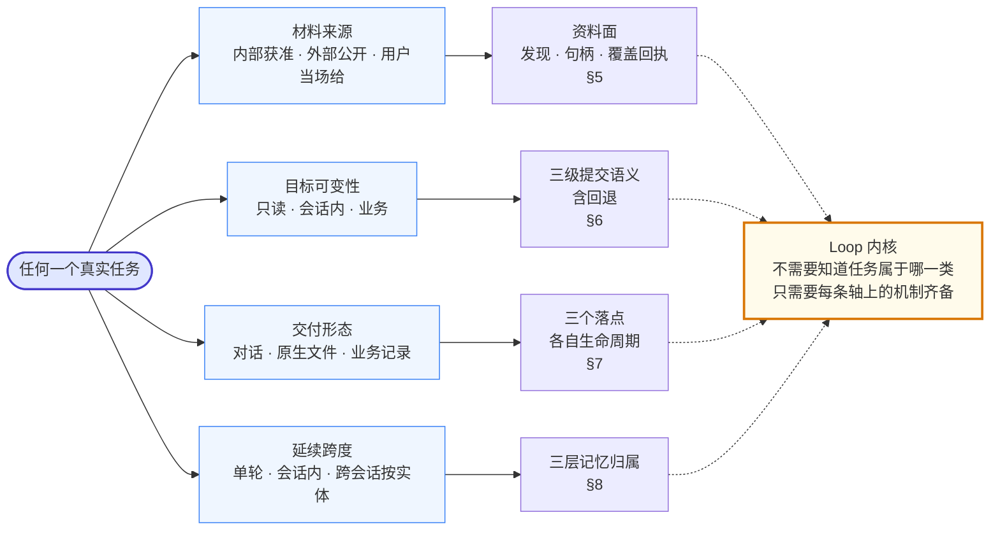

**不变式：图上没有"判断任务类型"这个节点，因为不存在这一步。** 任务直接沿四条轴分解；Loop 从不查询任务属于哪个类别。如果实现里出现了一个先给任务归类、再据此决定路径或工具集的环节，那就是路由层回来了。

**推论：任何新增构件都必须能指回某一条轴。** 指不回去的构件是堆砌，应当删掉或先说明它服务于哪条新轴——而新增一条轴需要修改本节。

**这个空间是可否证的。** 任何真实任务都应能定位为四轴上的一个点；定位不了的任务说明轴选错了，那是修改本设计的信号——比维护一张覆盖清单有用。举例：把一份 PDF 做成 PPT = (用户当场提供, 只读源 + 会话内可变稿, 原生文件, 会话内多轮)；把这版 JD 更新到岗位 = (内部, 业务可变, 业务记录, 跨会话按实体)。

四轴之间没有约束关系，所以取值组合不需要枚举。它们各自独立作用于不同构件，这正是"一个 Loop 能处理全部任务"成立的原因。

<a id="overview"></a>

## 3. 架构总览

两张图描述同一个静态结构，分工不同：**文本图**给分层与跨界契约——契约写在层与层之间，因为它是双方共同的承诺；**Mermaid 图**给构件与连线，四条轴各自逼出的结构在图上都能指出来。

一处必须先说明：本图**没有子 Agent 集群，也没有调度器**。§2 的四轴解释了为什么——Loop 不需要知道任务属于哪一类。图上唯一的下级单元是 §4.3 的"下级有界执行"，它由模型在对话中自己发起、只读、只交回回执，与按类别分派是两回事。

### 3.1 分层与跨界契约

```text
┌───────────────────────────────────────────────────────────────────────┐
│                    👤 HR 用户 —— 一个自然语言入口                     │
│         提问 · 连续改稿 · 上传材料 · 要文件 · 更新岗位 · 回退         │
└───────────────────────────────────┬───────────────────────────────────┘
                                    ↕
┌───────────────────────────────────┴───────────────────────────────────┐
│                               ① 接入层                                │
│        身份授权 · 输入幂等 · 停止与继续 · 流式回传 · 下载票据         │
└───────────────────────────────────┬───────────────────────────────────┘
      跨界契约：一次新用户输入 ＝ 一个轮次，在此获得本轮【能力下限】
                                    ↕
┌───────────────────────────────────┴───────────────────────────────────┐
│                   🧠 ② Hannah Loop —— 唯一执行主体                    │
│                无路由层 · 不按任务类别分派 · 无调度器                 │
│                                                                       │
│ 上下文组装 ──→ 冻结请求 ──→ 模型决策 ──→ 终态分类 ──→ 原子提交        │
│      ↑                          │                                     │
│      └── 回执（成功 / 明确错误）─┘                                    │
├──────────────────────┬──────────────────────┬─────────────────────────┤
│  记忆三层（按归属）  │     下级有界执行     │       预算三件事        │
│ 本轮上下文           │ 独立窗口 · 只读      │ 能力下限   ▸ 门         │
│ 会话工作状态         │ 继承授权不可扩大     │ 失控断路器 ▸ 事件       │
│ 实体理解 ◀ 关键      │ 只交回结果 + 回执    │ 归因账本   ▸ 只记录     │
│ (主对象, 用户)       │ 正文永不回流         │ 配额       ▸ 暂不设     │
│ 活得比会话长         │                      │                         │
└──────────────────────┴────────────┬─────────┴─────────────────────────┘
      跨界契约：参数契约 · 句柄由服务端解析 · 授权在读取时校验
                基版 · 幂等 · 真实回执 · 覆盖范围是回执事实而非叙述
                                    ↕
┌───────────────────────────────────┴───────────────────────────────────┐
│             🔧 ③ 工具层（按四条分化轴分组，不按任务类别）             │
│                                                                       │
│ 👁 发现与读取    🌐 外部研究    📝 业务写入    📄 文件交付            │
│   目录·分页·句柄   搜索·抓取·来源  版本·指针·回退  生成·局部编辑      │
├───────────────────────────────────────────────────────────────────────┤
│ 📦 可变性阶梯   只读 → 会话稿件 →【门】→ 业务记录 ⇄ 回退              │
│ 📮 三个落点     对话(随轮次) · 业务记录(随实体)                       │
│                 · 文件任务(独立状态机)                                │
│                 三者之间没有箭头 —— 不可互相降级                      │
└───────────────────────────────────┬───────────────────────────────────┘
      跨界契约：获准读取 / 显式写入 / 真实持久化回执 · 无静默副作用
                                    ↕
┌───────────────────────────────────┴───────────────────────────────────┐
│                          ⚙️ ④ 业务与数据底座                          │
│                                                                       │
│ 岗位库   官网快照(不可变) → 工作版本(追加) → 当前指针(可回退)         │
│ 情报与方法发布 · 私有材料服务（授权独立于岗位授权）                   │
├───────────────────────────────────────────────────────────────────────┤
│ PostgreSQL                                                            │
│   不可变档案   输入·回执·原文·稿件·文件·账本（只追加，永不删除）      │
│   可替换投影   实体理解·活动对象（可被更宽版本原子替换）              │
│ 附件存储（原件与生成文件）· 平台账号与鉴权下载                        │
└───────────────────────────────────┬───────────────────────────────────┘
                                    ↕
┌───────────────────────────────────┴───────────────────────────────────┐
│          🌐 外部提供方（显式配置 · 不自动切换 · 不自动重试）          │
│                                                                       │
│ 主模型 API   冻结请求 / 流式响应 / 四时钟 / 严格 UTF-8 解码           │
│ Web 检索     搜索是线索；抓取失败就是抓取失败                         │
└───────────────────────────────────────────────────────────────────────┘
```

**不变式一：跨界契约写在层与层之间，不写在任何一层内部。** 每条契约都是双方共同的承诺，任何一方单独"加强"它都会破坏另一方——比如工具层自行按业务关键词替模型挑资料，契约上看是"更聪明"，实际是把 ② 的自主研究换成了预设流程，而且从输出上观察不到。

**不变式二：`实体理解` 标了"活得比会话长"，它在 ② 里但不属于会话。** 归属是 (主对象, 用户)。如果实现把它放进会话生命周期，§8.1 就被违反了。

**不变式三：④ 里"不可变档案"与"可替换投影"是两行，不是一行。** 合并它们等于允许模型摘要覆盖回执事实，审计随之失效（§8）。

层表示职责，不代表新增独立部署。现有 API/Worker、PostgreSQL、附件存储与平台身份边界继续沿用；对话入口不预设引入 AG-UI，版本化工具不预设改为 MCP。

### 3.2 构件与连线

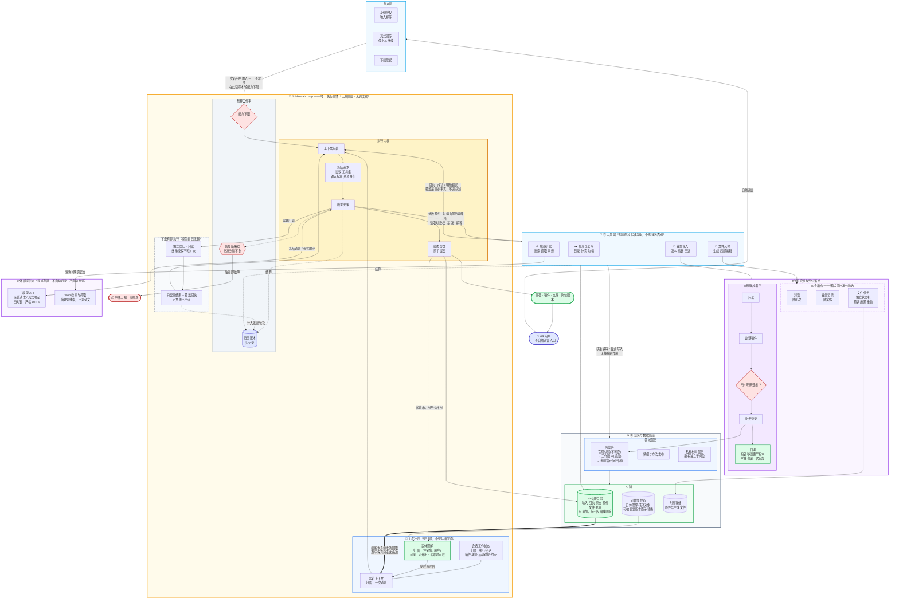

图上有六处是刻意的，每一处对应一条可检验的不变式。**实现里出现了图上不该有的那条边，就是对应条目被违反了：**

| # | 图上的事实 | 违反它意味着什么 |
| --- | --- | --- |
| 1 | 没有"任务归类"节点，`TOOLS` 按轴分组而非按任务类别 | 路由层回来了（§2） |
| 2 | `归因账本` 只有虚线入边，**没有出边** | 出现一条到 `能力下限` 的边，对话越长后面越难执行（§10） |
| 3 | `失控断路器` 的唯一出边指向 `事件上报` | 指向用户就退化成配额，而配额现在不存在（§10） |
| 4 | `实体理解` 有 `轮结束` 入边，且归属写着 (主对象, 用户) | 被并入会话生命周期则理解随会话消失（§8.1） |
| 5 | `不可变档案` 只有 `==>` **出**边指向投影，没有反向入边 | 出现反向边即模型摘要覆盖了回执事实（§8） |
| 6 | `三个落点` 框内三个节点之间**没有任何箭头** | 出现箭头就是降级：Word 请求降成文本、只出大纲称已生成（§7） |

另外两处结构性事实：`下级有界执行` 的出边只到 `上下文组装`，不到 `OUT`——它的产物是资料不是回答（§4.3）；通往 `业务记录` 的路径必须经过 `用户明确要求？` 这道门，且 `业务记录` 必须连着 `回退`——没有回退边，门就得升级成确认菜单（§6.1）。

### 3.3 层的职责与承诺

| 层 | 拥有什么 | 向上承诺 | 向下要求 |
| --- | --- | --- | --- |
| ① 接入 | 用户身份、输入幂等、流式通道、下载票据 | 一次输入只成为一个轮次；停止立即生效 | 轮次边界与能力下限由下层执行 |
| ② Loop | 上下文组装、冻结请求、记忆、结束判定、下级边界 | 模型看到的信息与权限一致；结束是真实的 | 回执真实，成功与失败都能用于下一步决策 |
| ③ 工具 | 参数契约、句柄解析、授权、基版、幂等 | 非法参数不产生副作用；回执反映实际发生的事 | 领域服务提供准确版本与事务保证 |
| ④ 底座 | 岗位/情报/方法/材料/稿件/文件的业务事实 | 版本不可变、写入事务化、授权可重审 | 调用方携带明确身份与基版 |

<a id="loop"></a>

## 4. Loop：唯一的执行主体

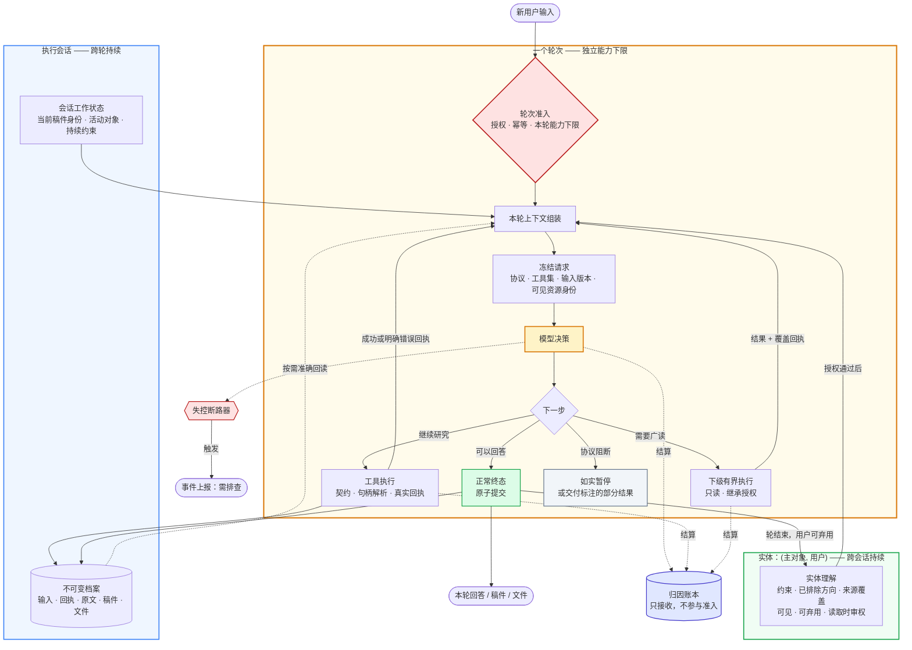

图上有四处形状是刻意的，每一处对应一条不变式：

1. **`轮次准入` 是门，`归因账本` 只有虚线入边、没有出边。** 出现一条从账本回到准入的实线，就是 §10 的"能力下限不被历史消耗侵蚀"被违反。
2. **`失控断路器` 的唯一出边指向事件上报，不指向用户额度提示。** 如果它的出边变成了面向用户的"额度用完"，断路器就退化成了配额——而配额现在不存在（§10）。
3. **`实体理解` 画在会话框外面。** 如果它被移进 `执行会话` 框内，§8.1 就被违反了：理解会随会话一起消失。
4. **`下级有界执行` 交回 `本轮上下文组装`，不交回 `OUT`。** 下级的产物是资料，不是对用户的回答（§4.3）。

### 4.1 职责边界

| 角色 | 负责 | 不负责 |
| --- | --- | --- |
| 模型 | 分析、选择资料与方法、决定读到什么程度、提出工具参数、撰写答案与文档内容 | 生成权限、声明持久化结果、批准正式标准 |
| Loop 内核 | 轮次与能力下限、终态分类、提交与恢复、下级执行的边界 | 代写失败的答案、修补模型的错误参数、按关键词替模型选工具 |
| 执行器 | 参数契约、授权、句柄解析、基版、幂等、真实回执 | 控制研究顺序、替模型挑资料 |

越界的后果是不对称的，所以不能"两边都小心点"了事：执行器替模型挑资料，会把自主研究悄悄变成预设流程，而且无法从外部观察到；模型自报成功，会让持久化事实失去意义。前者毁掉能力，后者毁掉可信度。

### 4.2 一轮的结束条件

合法结束必须同时满足：提供方返回可识别的正常终态且完整文字已收到；本次响应没有待执行的工具调用，且本轮没有结果未知的写入或未完成的文件操作；提交时输入版本、租约与当前权限仍有效，正文与终态原子持久化。

同一响应中若含工具调用，其中的文字是过程说明，不先发布为最终答案。空终态是协议错误，不自动补一句"已完成"。输出截断、连接中断与明确拒绝是三个独立事实，都不构成正常完整答案。

普通回答依赖协议终态，不依赖提交工具。强制提交工具会让一句问答也要多付一次调用，并在阶段切换时制造"提示词要求某动作、工具集不提供该动作"的自相矛盾。

模型需要补充信息时用正常回复直接询问，下一条用户输入自然续接——提问不是一个状态。

### 4.3 下级有界执行

有一类任务的成本不在推理而在**读取量**："读 40 个竞品岗位给出对比表"需要把 40 份正文过一遍，但结论只有一张表。让这些正文进入主窗口，会让后续所有轮次为一次性的读取永久付费。

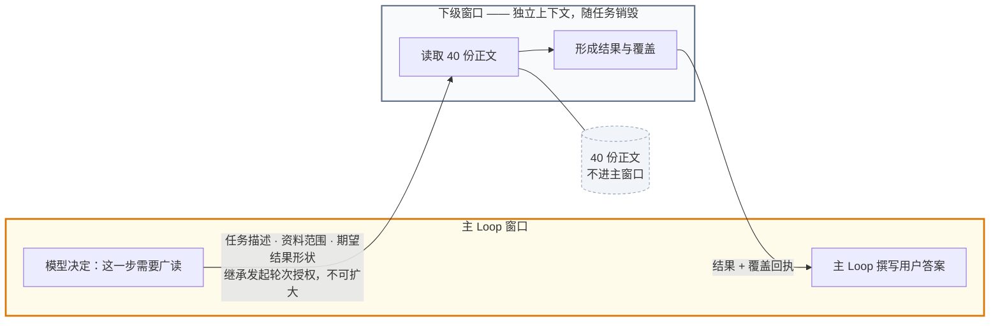

**不变式：跨越窗口边界的只有结果与覆盖回执，正文永不跨越。** 如果下级能做业务写入、或它的输出被直接呈现给用户，本机制就退化成了被否决的子 Agent 架构。

它与"子 Agent + 调度器"的区别不在实现，而在三个问题的答案——这三点是本机制成立的全部理由：

- **谁决定**：模型在对话中决定，不是入口按关键词分派。没有固定路径。
- **什么时候**：任务需要广读时，不是任务属于某个类别时。
- **交回什么**：资料，不是回答。用户看到的答案始终由主 Loop 撰写。

边界必须由内核持有，否则它会变成绕过约束的通道：下级继承发起轮次的授权且不可扩大；下级只读，不做业务写入；覆盖必须以回执形式交回，不能只交回摘要；下级的消耗计入发起轮次；下级失败是一份错误回执，主 Loop 据此改策略或如实说明，不自动重试。

**判错条件：** 如果实测显示主窗口压力主要来自多轮改稿的累积而非单次广读，则本机制解决的不是真问题，应退回纯机械缩减（§8.3）。

<a id="tools"></a>

## 5. 资料面：三类来源同构

**材料来源轴**要求内部资料、外部网络、用户当场提供的材料对模型呈现为同一种东西：可发现、可分页、可按句柄读取、读取范围有回执。差异只在授权域和时效性，不在接口形态。

**产品数据必须对模型自主可发现。** 岗位页能看到的数据，应通过同一授权目录对模型可见。未选中岗位不等于空岗位库——当前选中的岗位是**焦点**，不是**发现边界**。开发脚本预选几条岗位喂给模型，等于把自主研究替换成预设流程，而且从输出上看不出来。

**授权按域分开，不随发现范围放开。** 官方岗位可全库获准发现；候选人材料、面试记录与私有文稿需要独立授权，不因为同一会话里读过岗位就一并开放。授权在**读取时**校验，不由句柄代表——句柄是寻址，不是许可。

**覆盖是回执事实，不是叙述。** 每次读取返回实际覆盖了什么、遗漏了什么、为什么。搜索摘要是线索不是正文，抓取失败就是抓取失败。空结果必须说明查询与遍历范围；HTTP 错误不包装成"未找到"。

**资料缺口不等于能力失败，但也不等于任务完成。** 官网岗位提供不了真实 HC 与招聘转化率，正确行为是说明缺什么并可请用户提供，而不是编造内部指标、也不是拒绝分析已经存在的公开岗位。反过来：**任务本身要求外部研究而系统缺该能力时，"解释了为什么资料不足"是诚实的产出，但任务仍未达成**——它不能记为成功。

### 5.1 身份由服务端解析

目录与回执向模型发放句柄；执行器把句柄解析为准确的不可变引用（类型、ID、版本、hash）。模型不重复构造这个组合。

理由不是"多一层更安全"，而是：**让生成器拼装身份，会把身份绑定变成生成正确性问题。** 模型可以从命名规律推出 ID、从正文里取文件路径片段、再拼上邻近条目的 hash，形成一个看似完整实则错误的引用。校验只能拒绝，不能预防——而被拒绝的那次，用户看到的是一次失败而不是一次错误的读取，这已经是运气好的情况。

代价：句柄必须对 (会话, 资源, 版本) 确定性且逐字节稳定，否则目录块每次变化都会破坏缓存前缀。

<a id="mutability"></a>

## 6. 三级可变性与提交语义

**目标可变性轴**要求三级，每级有不同的提交语义。**级别不能隐式提升**——这是"默认交付是对话"的结构表达，而不是一条需要模型遵守的纪律。

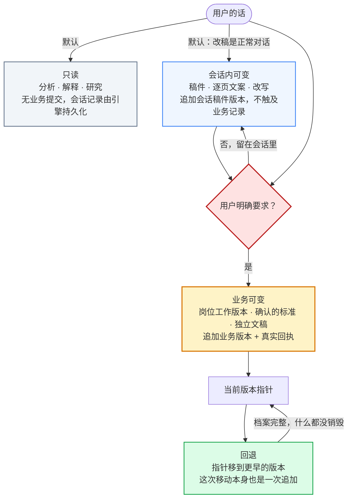

**不变式一：通往"业务可变"只有一条经过门的路径。** 任何绕过 `用户明确要求？` 直达 L3 的箭头，都是级别隐式提升——"起草"被解释成"保存到岗位"、"分析候选人"顺带改了长期岗位标准，都属于这类。

**不变式二：L3 必须有回退边。** 这不是可选的运维便利。没有回退边，那道门就必须升级成确认菜单——见 6.1。

### 6.1 业务写入必须可回退，这才是不做确认菜单的许可证

设计上不要求用户确认模型拟出的任务清单——每轮弹一次确认会让系统难用。但这带来一个真实风险：**不可逆的业务写入，由模型对模糊自然语言的理解触发。** 授权检查挡不住它，因为用户确实有权限，模型只是写错了稿、或者用户只想看草稿它却存了。

解决办法不是把意图识别做得更准（那是不可达的目标），而是**让误读变便宜**：业务记录只追加版本，当前版本是一个指针；回退就是把指针移到更早的版本，而这次移动本身也是一次追加；回退是一等用户动作，出现在动作模型里，不是运维手段。

**为什么这不要求下游具备新能力：** 下游消费方本来就必须处理"当前工作版本变了"——正常发布新版本时就会发生。指针回退产生的是同一个事件，只是携带一个更早的版本号。官网快照不可变且与工作版本分离，回退永远不触及官网同步。

于是误读意图的代价是一次点击，不是数据损失。

### 6.2 分析不触发决策

候选人分析不自动触发录用、淘汰或外部联系。联系文案是草稿，不等于已联系。人才分析不自动改变长期岗位标准。标准的批准是既有的用户确认动作，模型不能自行批准。

这不是对模型的禁令清单，而是可变性分级的直接后果：这些动作全部属于业务可变级，需要经过那道门。

<a id="delivery"></a>

## 7. 三个交付落点

**交付形态轴**要求三个落点各有独立的生命周期与失败语义。

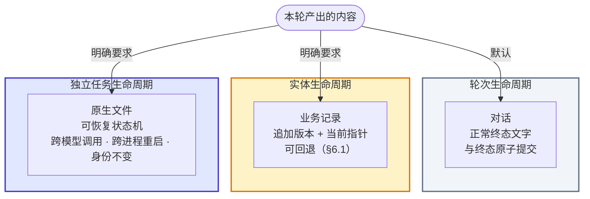

**不变式：三个框之间没有任何箭头。** 它们不是同一件事的三种格式，所以不可互相降级。把 Word 请求降成纯文本然后声称成功、只输出大纲然后说已生成文件、把通用成果的关联冒充专用的岗位更新——都是跨框降级，都是失败而不是优雅退化。

三个框的生命周期各不相同，这是它们必须分开的实质原因：对话随轮次结束；业务记录随实体存续；**文件任务的生命周期独立于模型调用**，所以它是一个可恢复的状态机，而不是一次工具调用的返回值。

### 7.1 对话

默认落点。用户看到"已回答"只表示一轮完成，不代表系统替用户判断业务目标达成。

### 7.2 原生文件

文件能力必须按真实边界拆开，合并它们会在验收时制造假通过：**读取 PDF 文字、生成合格 PDF、编辑既有 PDF 版面是三种能力**；能做到第一件不意味着能做到后两件。扫描件是否做 OCR 必须显式——未配置就说明，不假装已读。

**局部编辑必须锁定准确基版与节点。** "重做第 5–19 页"的正确路径是在指定范围上编辑并校验其他页未变，不是新建整份文件掩盖未指定页的变化。

保真是文件层的硬要求：字体缺字不能通过改写文字"修好"；双语材料的原文、译文对应与字符必须同时保留。渲染失败保留任务与原因，模型据回执修改文档结构；不自动换格式。下载失败先查附件、票据与存储对象，不重新生成一份重复文件。

### 7.3 业务记录

见 §6.1。写入返回真实回执。

### 7.4 动作事实由回执渲染

规定了"模型叙述与已核验事实分离"是不够的：用户看到的东西是模型写的散文。结果未知时不能声称成功也不能重做（§9.2 的对账覆盖这一情形）；但**已知失败**时，如果只是把错误回执放进上下文、靠模型如实转述，整条保证就塌缩成"模型会守规矩"——而这恰恰是本架构声称不依赖的东西。

所以：**答案中关于动作的事实陈述由回执渲染，模型负责解释与下一步建议。** 写没写成、写成了哪个版本、文件生成没生成，这些由回执决定并直接呈现；模型不组合这类句子。

**这是一个明示的取舍**：渲染在表达上比散文僵硬。如果实测显示它破坏了对话质量，可以改为"分离 + 抽检"，但那必须作为**明示的信任决定**写进设计，而不是伪装成已被消除的风险。

<a id="memory"></a>

## 8. 三层记忆归属

**延续跨度轴**要求三层。层级由**归属**区分，不由存储位置区分。

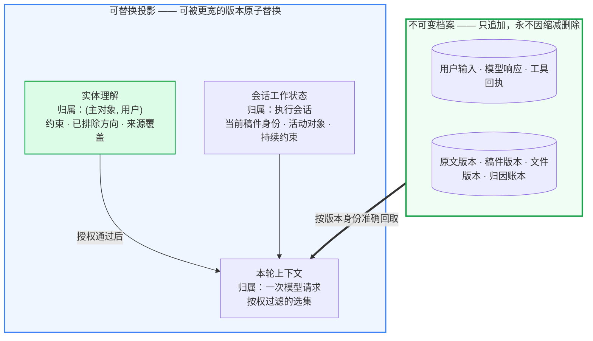

**不变式：没有任何从投影指向档案的箭头。** 模型摘要永不覆盖执行器写入的回执事实；上下文缩减永不删除档案。投影出错只影响本次推理质量，不改变已发生的事实——这是审计、准确回读与逐字保真都依赖同一个机制的原因。

**逐字保真的位置就在那条粗箭头上。** 用户说"JR 不动"时，输出中的原文必须沿"档案 → 本轮上下文"这条准确回取边取得，不是模型凭记忆复写后声明一致。这是档案/投影二分的直接应用，不是一条额外纪律。

### 8.1 为什么实体理解不挂在会话上

系统当前持久化了**内容**（岗位工作版本按实体长期存在），却把**理解**锁在执行会话里，而执行会话在用户切换主对象时结束。于是持久化了廉价的部分，丢掉了昂贵的部分：HR 在一个需求上反复工作数天，每次回来都要重讲上次的结论和已排除的方案。

这是把两件可分离的事绑在了一起：**不建隐式的跨会话记忆池**（对的），和**不要有持久的按实体工作状态**（不对）。授权是读取时的检查，它不要求丢掉延续性。

因此实体理解挂在 (主对象, 用户) 上，并且必须同时满足：追加式；读取时校验授权；**对用户可见且可弃用**（不是隐式生效的记忆）；内容限定为约束、已排除方向与来源覆盖，**显式排除私有候选人材料**。

跨会话仍然不做自动资料搬运：用户需要背景材料就直接粘贴或上传，导航会话不是记忆池。**延续的是理解，不是资料。**

### 8.2 焦点切换

用户主要工作对象改变时可推荐新会话；明确继续同会话时更新焦点并保留仍适用的格式偏好，不把旧岗位的要求暗套到新岗位。查询其他岗位或全库统计不自动改变当前焦点——查询是发现，不是切换。

### 8.3 缩减：先机械，再语义

冗长且可凭准确引用回取的工具正文，机械替换为定位信息，不调用模型。只有跨轮结论、约束与已排除方向才用模型形成语义记忆。

理由：工具正文占据重复传输的大部分，而它本身可逐字回取——用模型摘要它既付调用成本，又引入语义失真，还让摘要失败能阻断主任务。每轮前置摘要更糟：它把一次可选优化变成每轮必经步骤。

代价：机械淘汰可能诱发模型回读，抵消部分收益。必须实测淘汰后同一引用的再读次数，按资源类别决定是否启用。§4.3 的下级有界执行从另一端缓解同一问题——让大批量读取不必进入主窗口。

<a id="trust"></a>

## 9. 执行事实的可信度

### 9.1 流式接收与时钟分离

字节先经**增量严格 UTF-8 解码**，再解析协议事件，然后分类终态。严格解码拒绝无效字节——把无效字节静默替换成占位字符，会让任何流式正文（包括即将保存的 JD/JR）被静默改字。而合法编码的占位字符本身不证明损坏，两者必须区分。

四个时钟分别计量，任何一个都不能被心跳伪造进展：

| 时钟 | 从哪里到哪里 | 不能冒充进展的事件 |
| --- | --- | --- |
| 网络首事件 | 实际发送 → 首个响应事件 | 请求对象创建时间不是发送时间 |
| 首次有效生成 | 实际发送 → 正文/参数/可用思考增量 | 心跳、空的工具起始事件 |
| 生成空闲 | 最近有效增量 → 当前 | 心跳不能无限续期 |
| 绝对执行 | 实际发送 → 本轮绝对期限 | 思考流不绕过资源上限 |

**空闲判定必须能区分"模型在思考"与"流已中断"。** 工具起始事件之后的长时间静默，两种可能都存在。若提供方支持思考内容的可见形式，应把它作为真实生成增量纳入有效增量时钟，而不是单纯放大空闲上限——放大上限会让真正的断流也等满那个更长的时间。

截断的续接请求必须显式包含已收到内容与续接意图，不重发相同字节、不拼补工具 JSON。无依据的自动重试、切模型、切端点均不允许。本地取消不证明上游停止生成：Trace 记录本地取消事实、上游是否确认与晚到用量。

### 9.2 幂等、恢复与对账

| 时点 | 重启或重复调用后应发生什么 |
| --- | --- |
| 操作已登记、尚未发出 | 在有效租约下执行原操作，不生成新身份 |
| 写入与回执已提交 | 直接读取原回执，不再创建版本 |
| **外部请求已发、结果未知** | **按原操作身份核对；无法核对则保持未知，不自动重发** |
| 文件已生成、附件元数据未定 | 用原任务核对临时对象、hash 与提交记录 |
| 新输入或停止先于提交 | 旧租约不得新增写入或最终回答；已发生的外部操作继续留账 |
| 写入先于停止提交 | 保留已提交事实，不伪称取消撤销了数据库版本 |
| 权限撤销 | 读取、恢复、提交、下载全部重审，不借已有句柄绕过 |

加粗那一行是本节的主句：**副作用未知时既不能声称成功，也不能重做。** 准备、发送、接收、提交分别记录；内部事务重入与外部网络重试不是一回事。

工具错误回执进入模型上下文，模型据此改请求、换来源、提问或如实回答。执行器不自动修正 JSON、不补缺字段、不扩大权限。**同类错误反复出现是修订工具契约的信号，不是增加容错分支的理由。**

<a id="budget"></a>

## 10. 预算：一个保证、一个断路器、一个账本

预算不是一个量。用一个计数器承担三件事，必然在某一端出错。

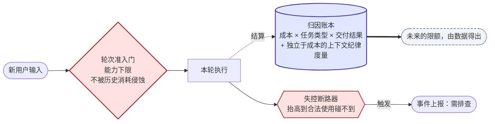

**不变式一：账本没有出边指向准入门。** 它接收结算，不参与准入。一旦出现这条边，"任何一轮都能完成简单操作"就失效了——对话越长，后面越难执行。

**不变式二：断路器的出边指向事件，不指向用户。** 把"没钱了"和"坏了"呈现成同一件事，会让两者都无法被修复。

**不变式三：图上没有配额节点。** 配额是虚线框 `未来的限额` 的产物，现在不存在。

| | 是什么 | 耗尽时 |
| --- | --- | --- |
| **能力下限** | 任何一轮都能完成简单操作，不被历史消耗侵蚀 | 本轮受限，明确可见 |
| **失控断路器** | 防病态循环无界烧钱。**不是配额** | 作为需排查的**事件**上报 |
| **归因账本** | 让限额未来可由数据得出 | 不适用 |

**配额现在不设**（产品决定，2026-09-22）。试用期无法从数据反推限额，提前设的数字一定是错的，而错的限额比没有限额更贵——它会以"执行失败"的形状打断合法工作。

**断路器要抬高到任何合法使用都碰不到。** 触发即意味着出故障了。试用期不豁免病态循环——一个工具反复失败、模型反复重试的会话仍会无界烧钱，那不是用户在努力工作，那是故障。

**账本要能回答的问题是"一次合法完成的任务花了多少"**，所以成本必须接到任务类型与交付结果上；只挂在模型调用和轮次上无法回答它。没有分母，就分不清"贵是因为难"和"贵是因为浪费"。

**一个会骗人的指标：cache 命中率不能当上下文纪律的度量。** 每轮重发已读过的工具正文，命中缓存时边际成本很低，账本上看起来越来越高效，而窗口依然被占满、模型依然要付注意力代价。上下文纪律需要**独立于成本的度量**，例如窗口中属于早前轮次已读工具正文的 token 占比。否则开了缓存之后，效率会越测越好、实际越来越差。

<a id="observability"></a>

## 11. 验收分层

"谁定义完成"必须在一处回答，否则它会散成逐场景的争论。三层独立判定，任何一层通过都不代表另一层通过：

| 层 | 判定什么 | 由谁判定 |
| --- | --- | --- |
| 工程执行 | 是否按契约完成：回执真实、状态正确、档案完整 | 自动化 |
| 内容质量 | 回答与产物是否达到专业标准 | 人工评价 |
| 业务目标 | 用户的任务是否真的办成了 | 用户 |

三条判定规则：**评判基准是用户原本要什么**，不是测试者后加的条件；**能力缺失导致的诚实说明是好行为，但任务仍未达成**，两者分别记录；**回放材料缺失**（原文件不在、旧菜单不全）标为材料不足，既不据此宣布产品不能运行，也不算作产品执行失败。

工程测试通过不能替代完整场景通过。合成模型、真实模型、生产验收分开报告。

<a id="unbuilt"></a>

## 12. 尚未建成的能力

列在架构里但标明未建。删掉它们会让设计看起来比实际更成立，而它们恰好是检验前面各节是否正确的压力测试。

| 能力 | 压力测试的是什么 |
| --- | --- |
| 岗位工作版本写入与回退 | §6.1 的可回退许可证——这是空地，现在是唯一便宜的时机 |
| 实体理解（语义记忆） | §8.1 的归属决定 |
| PPT 生成、美化与指定页重做 | §7.2 的局部编辑与基版锁定 |
| PDF 生成与既有 PDF 编辑 | §7.2 的能力拆分是否真的拆开了 |
| 双语材料字符与字体保真 | §7.2 的保真要求能否落到文件层 |
| 任务级成本归因与上下文纪律度量 | §10 的账本 |
| 下级有界执行 | §4.3，含其判错条件 |
| 动作事实的回执渲染 | §7.4，含其明示取舍 |

<a id="part2"></a>

# 第二部分：场景与工作流

## 13. 产品场景地图

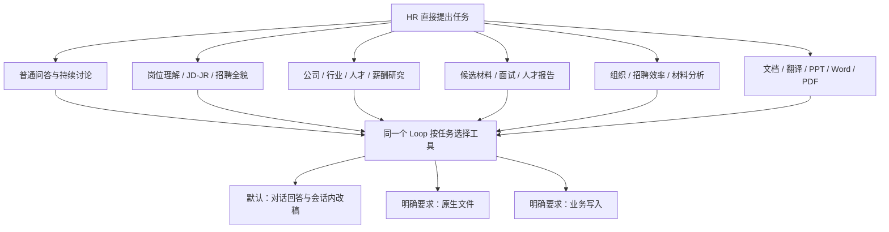

这些类别会在一个会话里交叉。例如岗位分析可以接外部对标、再改 JD，最后导出 Word。不为每类造一套独立 Agent，也不把图中的分支实现成关键词路由。

### 13.1 每个任务都带着的六个维度

| 维度 | 要理解的事实 | 常见误解 |
| --- | --- | --- |
| 目标 | 解释、分析、修改、研究、生成文件或实际更新 | 把"起草"解释成"保存到岗位" |
| 上下文 | 当前岗位、旧稿、上一轮问题、用户持续限制 | 只取最后一句独立运行 |
| 资料 | 内部岗位、附件、情报、Web、方法 | 把材料缺失当模型能力失败；或替模型预拼资料 |
| 输出 | 文字、表格、逐页文案、可编辑文件、PDF | 用户要文案却强制生成文件，用户要文件却只给文字 |
| 动作 | 是否明确要求另存、更新、确认或导出 | 每轮自动保存成果、把草稿当批准版本 |
| 连续性 | 哪版稿、哪些字段保持、当前主题是否切换 | 历史成本扣掉新轮预算、缩减丢掉"JR 不动" |

### 13.2 业务任务家族

> **与[第 2 章](#axes)的关系：** 架构上的结构模型是四条分化轴，不是下面这张家族表。家族表是**需求覆盖清单**——用于回放与漏项检查，不用于决定结构。任何家族都应能定位为四轴上的一个点；定位不了的家族是修改第 2 章的信号。

下表按家族映射原始任务链，用于回放与覆盖检查。这里只映射需求，不把拟新增能力标成已支持。

| 家族 | 使用意图与关键差异 | 涉及能力 |
| --- | --- | --- |
| F01 岗位生成、校准、连续改稿 | 职责与任职要求、多次调整、正式或精简表述；部分明确要求保持原文 | 岗位/历史读取、会话稿件、局部修改 |
| F02 外部对标到 JD/JR | 从外部岗位研究到定稿；人数等敏感信息不外显；保留技术条件 | Web、内部资料、约束记忆、JD/JR 起草 |
| F03 行业、公司、技术生态 | 公司举例 → 选定公司 → 建议 → 优势不足的连续研究 | 情报、Search/Fetch、来源与研究记忆 |
| F04 招聘全貌与竞品岗位 | 全库岗位分析、竞争情况；选岗不是发现边界 | 岗位分页与搜索、来源覆盖、Web |
| F05 公开人才搜寻与交付包 | 明确岗位后找人才线索、人才卡、面试建议和联系文案 | 岗位、公开来源、候选事实区分；不自动联系 |
| F06 面试设计与材料来源切换 | 面试问题、岗位切换、技术面试；不强制无关格式 | 岗位/材料/方法、连续上下文 |
| F07 简历、通话与人才报告 | 面向主管的简短报告、访谈角色归因、突出指定经历 | 私有材料、文本解析、证据与观点区分 |
| F08 履历润色 | 改表达与经历组织 | 原文、会话稿件；不编造经历 |
| F09 组织与招聘效率 | 流程建议、组织问题、招聘效率 | 正常分析、按需补充、方法与情报 |
| F10 材料分析与改进 | 理解已有材料并给改进建议 | 附件读取、覆盖说明、会话输出 |
| F11 双语合同连续修订 | 中外文配对、替换甲方、修乱码、Word 交付 | 原文、双语节点、DOCX、字体与字符保真 |
| F12 材料转 PPT 与指定页重做 | PDF 转 PPT；指定页范围重做 | PDF/PPT 结构、页面映射、原生生成与编辑 |
| F13 PPT 美化排版 | 现有文件视觉调整，通常不要求重写全部内容 | PPT 读取、版式、指定节点编辑、渲染 |
| F14 PPT 文案、结构、标题与页数 | 可粘贴文案、标题、限定页数 | 对话改稿与页面结构；不必生成文件 |
| F15 技术学习与选型 | 学概念、比较技术、选型建议、连续答疑 | 普通问答；时效性需求才按需研究 |
| F16 薪酬市场 | 特定公司、届别、岗位的公开薪酬线索 | Web、时间口径、来源与不确定性 |

PPT、美化、Word 这些需求在源任务里真实存在，不因当前没有工具就删出产品设计；反过来也不能因为新增了某项能力就宣称所有原任务都包含该需求。

## 14. 基础对话：不为一句问答安排业务流程

**典型输入：** "你是谁""这是什么意思""把上一段说简单点"。

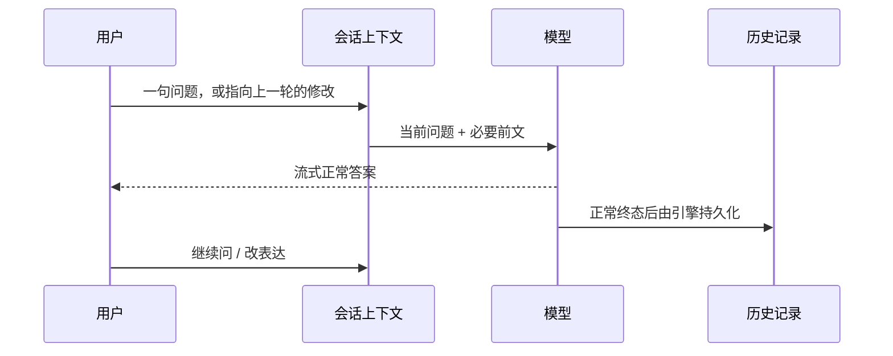

- 不要求先选岗位、读方法或保存文稿。
- 问题确需实时事实时模型可以调用 Web；工具可用不意味着每次都用。
- "需要""都要"在当下会话里有上一轮问题就正常解释，不要求用户重复完整任务。
- 正常生成结束不依赖额外的提交工具。聊天历史是会话服务自动保存的事实。
- 历史回放缺原始菜单时是回放材料不足，不能为适配坏样例给产品加一道强制确认。

概念问答不因未额外比较邻近系统就判为工程失败；面试问题也不因缺少测试者新增的条件就判为无法工作。**评判标准是用户原本要什么，不是测试者后加了什么。**

## 15. 岗位连续工作：理解 → 改稿 → 可选写入或文件

### 15.1 一个连续会话里的真实关系

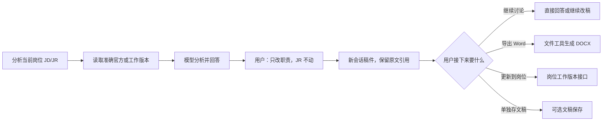

这是可能出现的走向，不规定用户必须经过所有步骤。用户第一句就要求生成 Word，也可以在获得必要资料后直接生成。

### 15.2 Loop 在各时点必须知道什么

| 时点 | 应带入的信息 | 不应强制做的事 |
| --- | --- | --- |
| 选中岗位 | 岗位准确身份、可用版本与资料入口 | 预装整库正文；认为选岗已批准更新 |
| 分析原文 | JD/JR 正文、来源与实际读取覆盖 | 先保存分析才能回答 |
| 用户改稿 | 准确上一稿、持续限制、当前要改的部分 | 从头重查所有方法与来源 |
| "JR 不动" | 原文版本与受保护字段；输出时准确引用 | 让模型凭记忆复写并声明逐字一致 |
| "保存到岗位" | 用户实际指向的稿件、岗位基版与授权 | 把通用成果关联冒充专用岗位更新 |
| 下一轮 | 新轮预算、已有稿件与写入事实 | 用前几轮累计消费阻止本轮简单操作 |

连续改稿要区分四件事：对话质量、原文保真、实际保存语义、预算作用范围。它们各自可以独立通过或失败。

### 15.3 切换岗位与跨会话

用户主要工作对象从一个岗位改为另一个时可推荐新会话；用户明确继续同会话时更新焦点并保留仍适用的格式偏好，不把旧岗位的要求暗套到新岗位。查询其他岗位或全库统计不自动改变当前焦点。

新会话需要背景时，用户直接粘贴或上传即可，**不要求先在旧会话"保存成果"再引用**。跨会话读取私有资料仍需明确授权，不把导航会话当自动记忆池。

## 16. 岗位库与招聘全貌：库本身就是资料源

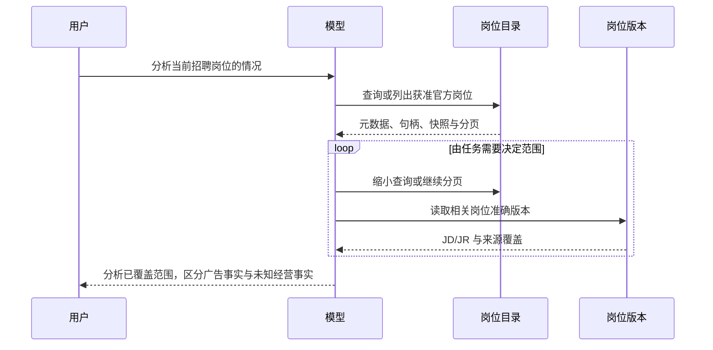

关键是产品数据源能被模型自主发现，不是开发脚本预选几条岗位喂给模型。岗位页已能看到的数据应通过同一授权目录对 Agent 可见；**未选岗位不等于空岗位库**。

需要实际 HC、招聘转化率或招聘进度时，官网岗位不能提供这些事实。模型说明所缺信息或请用户提供；不因用户问"招聘现状"就编造内部指标，也不因没有指标就拒绝分析已存在的公开岗位。

全库与私有范围分开：官方岗位可全库获准发现；候选人、面试记录与私有文稿不随之开放。返回空结果时明确查询与遍历范围，HTTP 错误不包装成"未找到"。

## 17. 外部研究、情报与方法

### 17.1 从问题出发选择来源

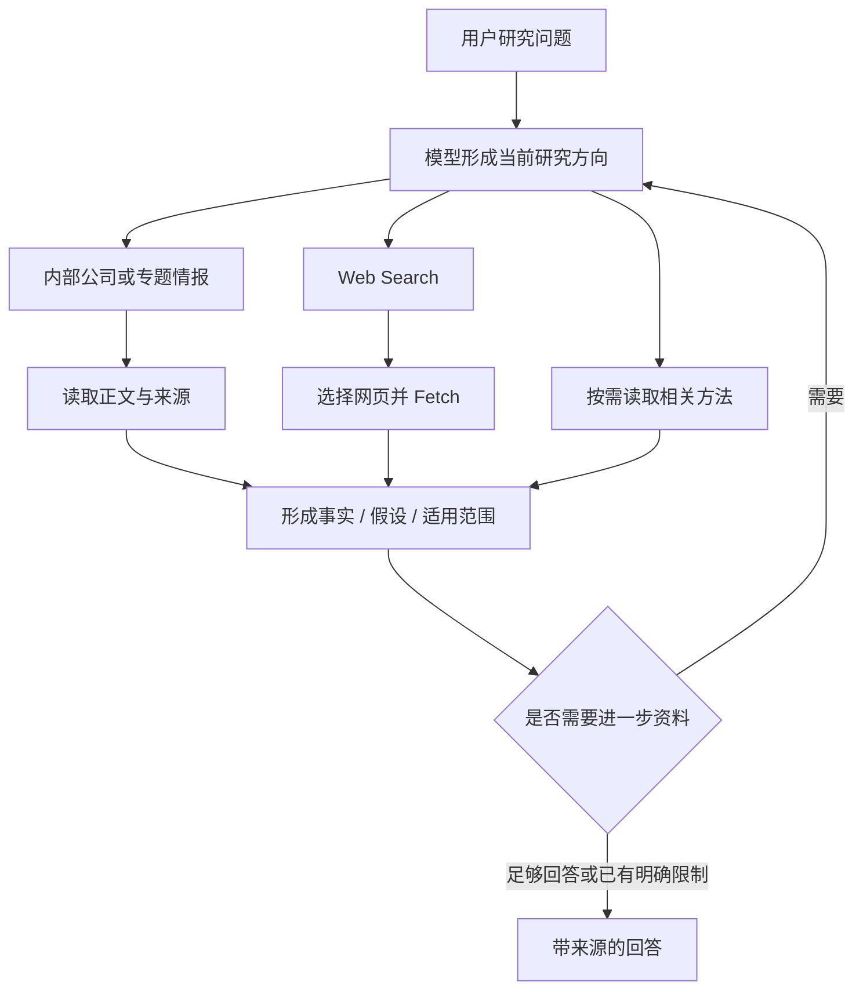

方法帮助分析问题，不是事实来源，也不要求每轮全读。情报中的公司观点与外部公告可能不同，模型应保留来源与时间差异。搜索摘要是线索，抓取失败就记录失败；不把摘要冒充已读全文。

### 17.2 多轮研究的连续性

| 任务推进 | 上下文要保留 | 可选工具行为 |
| --- | --- | --- |
| 先找相关公司与组织实践 | 用户关注的技术或组织范围 | 内部情报、Web 搜索 |
| 用户选择具体公司 | 选择指向、已读公司来源 | 读取或补查该公司正文 |
| 讨论对本公司的建议 | 原问题与已证实事实；本公司缺失信息 | 补充检索或必要提问 |
| 讨论原则、优势与不足 | 前文主张与被排除方案 | 针对新问题补证，不从零全查 |

不是每个研究问题都必须使用固定数量的来源。来源无法访问时允许模型解释实际限制、继续其他获准资料；不自动切换 Web 提供方或伪造抓取结果。研究结论可直接留在会话，用户要报告或 PPT 时再生成文件。

**若任务本身要求外部研究而系统缺少该能力，正确的产出是明确的范围说明，但该任务仍未达成**——不能把"解释了为什么资料不足"记为研究成功。

### 17.3 公开人才与薪酬研究

人才公开资料中的经历、推断出的匹配点、未经确认的求职意向必须分开。联系文案是草稿，不等于已联系。薪酬信息注明年份、届别、岗位、口径与来源范围；不用个别帖子推出确定薪资承诺。

这是业务使用边界，不是"没有这些字段就让 Loop 报错"的控制器。模型负责表达不确定性，工程验证负责来源与工具事实可追溯。

## 18. 候选人材料、面试与人才报告


- 面向主管的报告关注指定经历与简洁表达，不必生成完整候选档案。
- 通话记录要区分谁说的话，不能把招聘方介绍当候选人陈述。
- 履历润色可改变表达，不补造公司、业绩或能力事实。
- 面试设计按当前岗位与用户目的组织；缺具体候选人时仍可提供岗位面试问题，不强制先上传简历。
- 用户切换岗位或技术主题时按最新需求更新上下文；旧材料保留来源身份，不误关联新对象。
- 材料解析不完整、扫描件未 OCR 或附件缺失时明确说明实际读取范围。测试缺原文件与生产解析失败分别记录。

候选事实与长期岗位标准隔离。分析不自动触发录用、淘汰、外部联系或标准批准。

## 19. 文件工作流：不把所有文档需求当成一件事

### 19.1 四种文档意图

| 用户原意 | 正确路径 | 常见误设计 |
| --- | --- | --- |
| "这段变成两页 PPT 文案，给我标题" | 会话中给逐页文案；有需要才读材料 | 强制生成文件，再因缺模板报错 |
| "把这份 PDF 做成 PPT" | 读 PDF → 形成页面内容 → 创建 PPTX → 下载 | 只输出大纲就说已生成 |
| "这个 PPT 美化一下" | 读原文件结构与预览 → 调整版式 → 新文件 | 从头重写全部内容，丢原页与原图 |
| "重做第 5–19 页" | 锁定准确基版与节点 ID → 指定范围编辑 → 校验其他页 | 以新建整份文件掩盖未指定页的变化 |

连续文案修改涉及多个不同片段，不同的"两页"限制不能叠成一份不存在的全局文档约束。标题与用词反馈是正常创作过程，不是每次都要触发新的保存节点。

### 19.2 Word、双语合同与 PDF

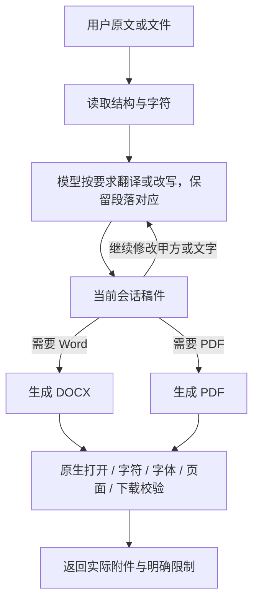

双语合同包含替换名称、乱码反馈与 Word 请求。原文、译文对应与字符保真都要保留；字体缺字不能通过随意替换文字"修好"。文档工具负责真实文件，内容审查不冒充法律批准。

PDF 输入、PDF 输出与编辑现有 PDF 是三种能力：能提取 PDF 文字不等于能改 PDF 布局，也不等于能生成合格 PDF。扫描件是否做 OCR 必须显式；未配置就说明，不假装已读。

### 19.3 用户停止或生成失败

已生成的文件与会话绑定，停止后仍按权限可追溯。渲染失败保留任务与原因，模型可根据回执修改文档结构；不自动换格式——把 Word 请求降成纯文本后声称成功是不允许的。下载失败先查附件、票据与存储对象，不重新调用模型生成一份重复文件。

## 20. 组织建议、材料分析与技术学习

这些需求容易被过度流程化，实际应允许简短输入直接开始讨论。

| 场景 | 正常行为 | 需要补充时 |
| --- | --- | --- |
| "如何提高招聘效率" | 先给清楚的分析框架或可讨论建议 | 涉及本公司具体决策时再问必要事实 |
| "分析这份材料并改进" | 读取用户实际提供的内容，说明覆盖 | 文件不可访问或解析不足时明确指出 |
| "介绍一种技术、解释概念" | 直接清楚回答 | 实时产品或供应商能力需要来源时再查 |
| "比较几个方案" | 围绕用户用途与约束分析 | 价格、版本等时效性事实按需研究 |

不把"先补全组织结构""必须给完整评分表""先确认任务目标清单"作为所有问题的前置条件。用户没有要求保存或文件时，默认交付就是对话。

## 21. 用户动作与交付的对应关系

| 用户意图 | 用户得到什么 | 是否产生额外业务写入 |
| --- | --- | --- |
| "你是谁""这是什么" | 对话答案 | 仅会话记录 |
| "分析这个岗位""看看招聘现状" | 基于来源的分析；必要时说明信息缺口 | 仅会话记录 |
| "职责改简洁些，JR 不动" | 会话内新稿，与准确旧稿保持关系 | 仅会话记录 |
| "单独存一份这版稿子" | 可独立管理的文稿版本 | 可选文稿存储 |
| "把这版 JD/JR 更新到这个岗位" | 岗位工作版本及真实写入回执 | 岗位 JD/JR 版本写入 |
| "导出 Word / 做成 PPT / 给我 PDF" | 实际可下载的对应文件 | 文件生成与附件存储；不附带更新岗位 |
| "确认这个标准" | 明确确认后的标准版本 | 既有用户确认接口；模型不能自行批准 |

表格表达产品语义，不是运行时的分类规则。模型缺明确目标、准确稿件或必要授权时可以提问，不要求所有任务先过一次确认菜单。

## 22. 场景记录怎么写

一条场景记录只保留：**原始输入 → 必要前文与附件 → 实际工具顺序 → 用户看到的回答或文件 → 工程错误与停止位置 → 版本、耗时、成本。**

| 记录项 | 要写清楚 | 不要写成 |
| --- | --- | --- |
| 原任务 | 用户原话与连续轮次 | 开发者重写的理想任务 |
| 前提 | 原文件是否在、旧菜单是否完整、岗位数据是否同步 | 数据没准备就让模型去撞错 |
| 启动 | 启动或未启动，及直接原因 | 含义不明的阶段术语 |
| 工具 | 参数类型、结果事实、操作与回执 | 只有最后一句提供方错误 |
| 交付 | 实际正文、原生文件、数据库版本 | "模型说保存了"就判成功 |
| 结论 | 工程执行状态；用户内容评价另列 | 新添一堆业务完成条件 |

真实回放保留原始任务要求。原文件或菜单缺失时标"原始回放材料缺失"，不据此宣布产品不能运行，也不据此把它算成产品执行失败。验收分层与必须分开的结论见[第 10 章](#observability)。


<a id="part3"></a>

# 第三部分：工具与接口契约

本部分是模型工具、回执、内容引用与岗位写入的**字段级契约**。标注"待实施"的接口尚未存在于运行代码；实施时以版本化 schema 生成本表并校验一致。

## 附录 A：工具目录

### A.1 模型可见动作

所有参数为顶层结构；`?` 表示可选。下表不是最终 JSON Schema。

| 动作 | 主要参数 | 返回 | 状态 |
| --- | --- | --- | --- |
| `list_resources` | `kinds, filters?, page?` | 目录元数据、句柄、next_cursor、查询覆盖 | 已有，新参数修订 |
| `search_resources` | `query, kinds?, filters?, page?` | 匹配目录、句柄、覆盖信息 | 已有，新参数修订 |
| `read_resource` | `ref, range?` | 正文、准确版本、返回区间与覆盖 | 已有，统一形状 |
| `read_history` | `locator, range?` | 当前会话获准原消息/工具回执 | 已有，统一形状 |
| `save_note` | `findings, exclusions, questions, source_refs` | 会话笔记版本 | 已有，限于语义记忆，不是业务成果 |
| `web_search` | `query, limit?` | 来源线索、查询事实、是否截断 | 已有，统一错误信封 |
| `web_fetch` | `url, extraction_limit?` | 网页快照句柄、正文、提取限制 | 已有，统一错误信封 |
| `save_draft` | `title, content` | 独立文稿身份及版本 | 替代普通 `save_result` 用途；明确另存才用 |
| `edit_draft` | `draft_ref, edits` | 新文稿版本、修改范围 | 替代普通 `edit_result` 用途 |
| `save_standard_proposal` | `title, items, basis, base_ref?` | 未批准的结构化标准提案版本 | 从原 `save_result` 拆出的既有能力，不新增批准权限 |
| `update_position_profile` | `position_ref, expected_version, changes` | 岗位 JD/JR 工作版本及字段变更 | 待实施；只更新已有岗位 |
| `read_document` | `file_ref, selector?` | 文件结构、稳定节点、可读正文和限制 | 待实施；补足 PPTX/结构化文档读取 |
| `create_document` | `format, title, content, layout?` | 真实文件、内容版本及渲染报告 | 待实施：DOCX / PPTX / PDF |
| `edit_document` | `file_ref, edits` | 原生新版本文件、变更清单 | 待实施；受支持节点/版式内编辑 |
| `export_document` | `file_ref, format` | 同一内容的另一个文件格式 | 待实施；明确支持的转换对 |

`save_note` 不是每轮必调；自动压缩由上下文服务按需发起、单独计费。来源与读取回执由执行器积累，不要求模型每次保存一份业务文稿来"证明做了工作"。

`list/search` 首次传查询，后页使用同一查询加 `page.cursor`。cursor 绑定查询 hash 与授权范围。查询模式与 cursor 模式不藏在难以等价投影的根级组合子里——根级 `anyOf`/`oneOf` 在部分线路会被降级成 description 文本，必填性随之丢失。显式不匹配报 `cursor_query_mismatch`，不猜原查询。

### A.2 不作为普通模型工具的接口

| 接口 | 调用方 | 原因 |
| --- | --- | --- |
| 接受输入、停止、追加预算 | 用户前端/API | 决定执行边界，模型不能替用户加额度或刷新轮次 |
| 工作租约、操作核对、文件状态查询 | Worker | 基础调度，不让模型轮询基础设施 |
| 最终正文提交 | 流接收/Loop 内核 | 新协议原子持久化正常模型终态 |
| 文件下载票据 | 前端/平台下载服务 | 每次按当前权限发放，不把长效 URL 交给模型 |
| 正式标准确认 | 用户确认界面/API | 保存提案与批准是不同授权 |

既有标准提案能力不得在换工具名时丢失：`save_standard_proposal` 承接既有结构化提案，`items` 沿用逐项身份/内容结构，`basis` 保留来源和既有证据校验，`base_ref` 用于准确版本更新；用户确认入口不变。新通用 `save_draft`/`edit_draft` 不冒充结构化标准提案接口。候选人/面试记录等既有领域 HTTP 接口继续存在；是否新增专门模型写工具须另有具体用户任务。

### A.3 参数与执行身份的分工

| 模型提供 | 服务端生成/核验 |
| --- | --- |
| 搜索意图、正文、标题、输出格式 | owner、work、input_revision、attempt、operation_id |
| 从已见目录复制的资源/文件/岗位句柄 | 句柄解析、真实数据库 ID、版本/hash、读取权限 |
| 编辑哪个准确基版、修改哪些节点 | 乐观锁、操作幂等、内容摘要、当前租约 |
| 来源引用和明确业务目标 | 来源可用性、实际读取覆盖、写入授权 |

默认值只来自已声明契约（如查询 limit 的服务端默认值）；不能在模型漏填基版、目标或内容时猜一个值。当前岗位可在上下文中以显式句柄提供；写接口收到这个句柄，而不是靠标题模糊定位。

### A.4 契约一致性验证

1. 从冻结生产请求中取出实际发给模型的 schema，与该修订服务端验证器对比。
2. 每动作检查 required、对象/数组类型、枚举、嵌套结构、额外属性、长度与组合约束。
3. 合法参数必须通过实际传输与服务端；非法参数不得执行副作用。
4. 供应方不支持某语法时，重设计为可表达的明确结构；不能悄悄删约束再塞进 description。
5. 有限样本与属性测试只提供覆盖证据，不宣称数学证明参数集合等价。支持 `strict` 的实际链路才可启用该字段；网关拒绝的字段不盲发。

旧修订继续原样解释；新修订不在运行时"兼容接受"字符串数组、错包装和自动改名。

## 附录 B：统一回执与错误

示例为目标语义，非既有 wire 输出。模型收到精简回执；完整执行身份与私有原响应保存在审计侧。

```json
{
  "operation_ref": "op_example",
  "status": "failed",
  "effect_state": "not_started",
  "error": {
    "code": "invalid_arguments",
    "stage": "contract",
    "field": "edits[0].expected_text",
    "message": "此字段必须是字符串；本次未执行修改"
  }
}
```

| 字段 | 约束 |
| --- | --- |
| `status` | `succeeded / failed / pending / unknown`；pending 仅执行器中间态 |
| `effect_state` | `not_applicable / not_started / not_committed / committed / unknown`；区分只读与真实写入 |
| `data` | 已校验业务结果；成功写入包含准确新版本 |
| `error` | 原因、失败阶段、必要字段路径；不泄露未授权对象 |
| `coverage` | 搜索/读取的实际覆盖、缺失与分页；不用空数组暗示完整 |
| `timing / provider` | 审计侧记录实际时钟、状态码、request ID；无值标未知 |
| `stop_details` | 提供方返回 refusal 时的类别与解释；线路未透传则记"已知被剥除"，不记未知 |

失败操作可能已产生外部费用，即使 `not_committed`；副作用事实与费用分开。已写入但客户端未收到，不返回"肯定失败、请重试保存"。

### B.1 错误矩阵

| 错误 | 是否调用服务 | 回给模型什么 | 谁决定下一步 |
| --- | --- | --- | --- |
| 参数类型/缺字段 | 否 | 精确字段与契约要求 | 模型重新形成调用或回答 |
| 资源句柄无效 | 否 | 当前句柄不可用；不泄露猜测目标 | 模型重新发现获准资源 |
| 无访问权 | 不读取私有正文 | access_denied 与安全原因 | 模型调整范围或向用户说明 |
| 保存范围不符 | 无写入 | 拒绝的是关联/写入，区别于内容读取 | 模型选择合法目标 |
| 搜索零匹配 | 是，成功 | 空结果、查询与覆盖 | 模型改查询、换来源或解释 |
| Web HTTP 错误 | 已发出 | 状态码（若取得）、阶段和错误类型 | 模型决定是否另查；不隐式重发 |
| 响应超限/提取不完整 | 已收到全部或部分 | 实际字节与限制、是否有可用正文 | 模型选择其他来源或有限使用 |
| 基版冲突 | 无提交 | 原基版、可获准返回的当前版本 | 模型读取后重做修改；不覆盖 |
| 文件渲染失败 | 有任务，未交付 | 节点/格式/资源错误及原任务身份 | 模型改内容/格式或说明限制 |
| 写入结果未知 | 不确定 | 原操作身份，不声称完成 | 执行器先核对；不能新 ID 再写 |

## 附录 C：内容引用与编辑

### C.1 内容模型

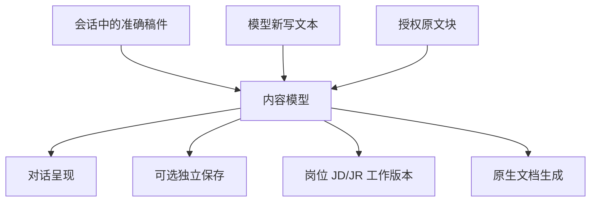

`content` 支持两种显式输入：`content_ref` 指向会话内已持久化的准确内容版本，或 `blocks` 携带本次新内容；二者不能同时提供，也不接受"上一版"这类由服务端猜测的指代。模型可从活动对象取得准确身份，不必为生成文件先重复保存。

块的目标最小集合：段落、标题、列表、表格、图片引用、原文引用。PPT 增加 slide/notes；段落、表格单元与 slide 有稳定节点 ID。模型负责语义与视觉意图，渲染器负责实际分页、字体回退和版式几何。

### C.2 原文引用块

```json
{
  "type": "source_block",
  "source_ref": "r_example",
  "selector": {"field": "requirements"}
}
```

示例句柄仅演示。`source_block` 由执行器按准确源版本取原文，解析时重审权限。

**引用与断言分离：** 引用块在该字段于本会话内至少有一次有效读取回执时即合法（`memory_only` 及以上），因为模型并未对内容作断言，保真由执行器保证；模型据正文作出**新判断**时才要求当前请求内的逐字曝光。输出 Unicode 原文不自动修空格、标点和换行；目标格式必要的布局换行与实际正文字符分别校验。

### C.3 编辑契约

```json
{
  "draft_ref": "version_example",
  "edits": [
    {
      "node_id": "responsibility_2",
      "expected_text": "这个准确版本中该段的完整原文",
      "replacement": "用户要求的新表述"
    }
  ]
}
```

服务端先确认准确版本，再在该节点内逐字验证。节点内不唯一、原文不符或节点不存在均返回具体错误，不模糊匹配。整段替换、插入、删除使用不同显式 edit 类型；缺少 `replacement` 不自动解释为删除。已有整数 offset 只服务旧修订，新契约由服务端在已匹配节点内计算。

结构化提案与逐项清单类成果当前不支持局部编辑，须完整重提并重新校验结构；执行器不静默改成另一动作。

独立文稿尚未保存时，普通会话改稿直接给出新的会话稿件，无须调用 `edit_draft`。编辑工具用于持久文稿与文件，不让每次文字润色变成数据库事务。

## 附录 D：岗位 JD/JR HTTP 接口（待实施）

| 接口 | 行为 |
| --- | --- |
| `GET /api/hr/positions/{id}/working-profile` | 返回当前工作 JD/JR、版本及对应官方快照身份；未建立返回明确空状态 |
| `PUT /api/hr/positions/{id}/working-profile` | 在 expected_version 上更新指定字段；幂等、授权与事务保护 |
| `GET /api/hr/positions/{id}/working-profile/versions/{version}` | 准确历史版本读取 |

`expected_version=null` 仅表示"明确创建首个工作版本"；若已存在则冲突。`changes` 中未出现的字段保持原值；清空字段必须显式操作，不把空值当"沿用"。JD 与 JR 可独立更新，第一版未提供的字段必须从明确来源引用或保持缺失。

成功回执至少包含 position_ref、新工作版本、更新字段、基版、对应官方来源版本、操作身份。数据库内版本、当前指针与回执同事务提交。岗位详情与 Agent 资源目录均读这套工作版本；返回时明确区分 `official_snapshot` 与 `working_profile`。

当前代码仅有官方岗位读取/导出与通用成果关联。`save_result(kind=jd)` 成功不等于岗位接口成功。

## 附录 E：文件任务服务面（待实施）

`POST /api/hr/document-jobs`、`GET /api/hr/document-jobs/{id}` 是提议的受控服务面，不绕开既有平台身份与附件下载票据。

任务 `request_hash` 包含内容版本、格式、模板/渲染器版本与外部资源摘要；同任务恢复不重新取一个可能变化的网页图片。本地渲染进程禁任意脚本、宏和外网读取，限制 CPU、内存、文件大小与执行时间。

交付校验分四项：格式（MIME、容器结构、原生解析器可打开）、内容（结构与请求对应，受保护原文精确对照）、视觉（渲染页图检查越界、遮挡、缺字与字体替换）、下载（存储对象存在、hash 与大小一致、当前身份可下载、撤权后拒绝）。局部修改须保持未指定节点，版式重排造成的必要分页变化明确列出。

