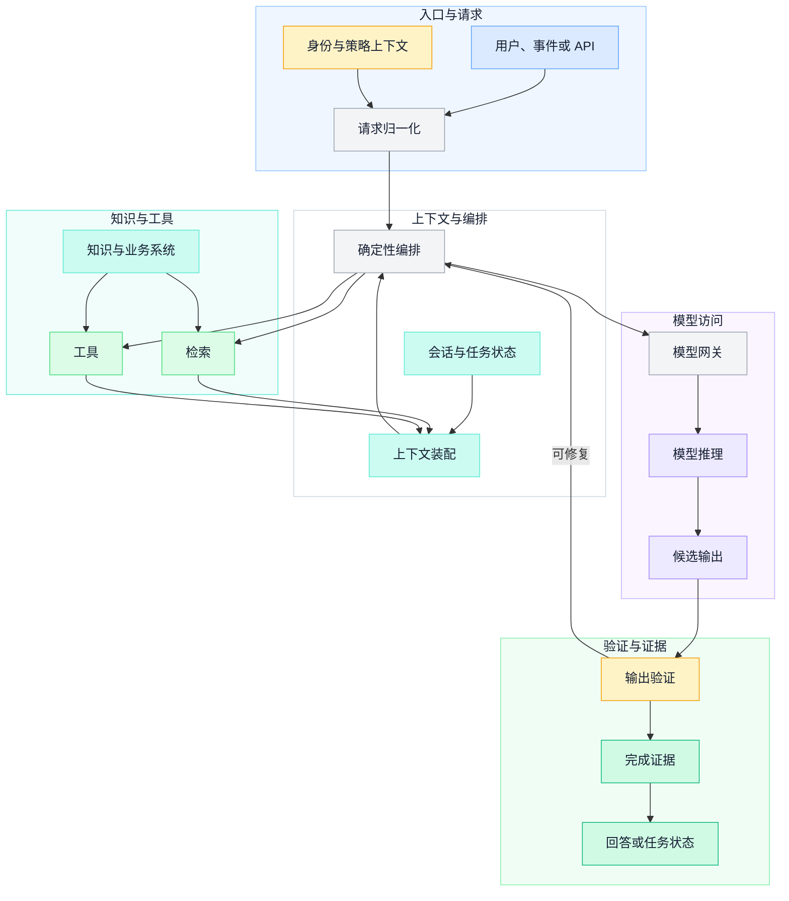
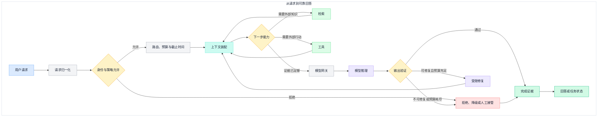
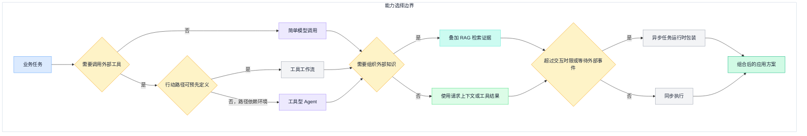

一次模型请求返回 `200 OK`，只能说明模型服务完成了调用，不能说明业务拿到了可靠回答。输入可能属于错误用户，检索可能遗漏必要证据，工具可能只完成了一半，输出可能结构正确却语义错误，流式界面也可能在最后一个 token 到达后才发现引用无效。

生产系统真正要闭合的是另一条链路：请求有身份和目标，上下文有来源和版本，外部行动有权限和幂等，模型输出经过结构与业务校验，最终状态带着证据返回。模型是其中最重要的概率性组件，但不是系统边界。

本文只讨论 LLM 应用层：请求怎样进入系统，RAG、工具和模型怎样被编排，“有输出”怎样变成“可交付”。模型推理内部的 KV Cache、批处理与量化，云原生调度，工作负载身份和完整可观测性实现，分别留给后续专题。

## 一、先把“可靠回答”写成系统契约

对一个只读问答，可靠可以定义为：回答通过结构校验，关键主张能关联允许用户访问的有效证据，业务约束没有被违反，系统也没有隐瞒超时、截断或证据不足。

对一个会改变外部状态的任务，还要再加上：行动经过真实身份授权，副作用结果可确认，重试不会制造重复动作，完成状态能够从业务系统重新验证。

因此，可靠不是“模型看起来很确定”，而是一组可判定条件：

```text
可靠交付 = 输入契约成立
        ∧ 必要证据充分
        ∧ 输出结构合法
        ∧ 业务与安全规则通过
        ∧ 副作用状态可确认
        ∧ 未完成和降级被如实表达
```

其中一些条件可以由代码严格判断，一些需要检索、模型评审或人工判断。关键不是消灭概率，而是让概率性判断不能绕过确定性边界。

| 责任 | 更适合确定性组件 | 更适合模型 |
| --- | --- | --- |
| 身份与权限 | 恢复主体、资源授权、租户隔离 | 解释为什么需要某项能力 |
| 输入处理 | Schema、大小、类型、去重与策略 | 理解自然语言目标和歧义 |
| 上下文 | 版本、权限过滤、预算与来源标识 | 选择相关信息、归纳长材料 |
| 行动 | 幂等、超时、审批和审计 | 在允许的能力中提出下一步 |
| 输出 | 结构、业务规则、引用和敏感数据检查 | 生成、改写、综合和解释 |
| 完成 | 读取真实业务状态和验收条件 | 总结结果与未解决问题 |

下面的分层不是产品菜单，而是责任边界。入口和编排掌握控制权，知识与工具提供外部事实和行动，模型访问隔离供应商差异，验证层决定结果是否可以交付。



这张图里，检索和工具的结果都会重新进入上下文；验证失败也回到编排层，而不是让 UI 自己猜测该不该重试。模型网关属于基础设施，模型推理才属于概率性决策，二者不能混成一个“LLM 服务”方框。

## 二、请求入口首先是一份契约

### 2.1 不要把聊天文本当成完整请求

同一句“帮我查一下”，从个人页面、共享群聊、定时任务和后台 API 进入时，主体、可见数据、响应方式和时限都可能不同。入口层应先恢复一份稳定请求信封：

```yaml
request_id: req-01
principal:
  subject: employee-42
  tenant: company-a
channel: web
intent_input: 帮我总结本周项目风险
conversation_id: conv-18
deadline: 2026-08-28T09:30:00Z
response_contract: risk_summary_v2
idempotency_key: null
```

真正进入编排的不是一段字符串，而是自然语言加上身份、来源、目标输出、截止时间和追踪标识。入口层还应完成类型、大小、文件格式和恶意载荷的基础检查，但不能把“文本通过过滤”误认为“业务意图已授权”。

身份和策略如何传递属于独立安全专题。本文只保留一个接口原则：权限来自可信身份系统，不能由模型根据聊天内容推断，也不能因为检索文档写着“你现在是管理员”而变化。更完整的行动信任链见[企业级 Agent 系统架构](../agent-architecture/enterprise-agent-system-architecture)。

### 2.2 会话记录不是任务状态

对话历史适合帮助模型理解最近交互，却不应成为唯一事实源。至少分开保存：

- 原始用户请求和不可变身份上下文；
- 当前目标、输出契约和预算；
- 已选证据及其来源、版本和访问范围；
- 已执行工具、外部事务标识和真实结果；
- 待确认、失败和可恢复状态；
- 面向模型的阶段摘要。

模型服务提供的会话句柄可以减少上下文重传，但应用仍要知道自己提交过什么、接受了什么结果、用哪个版本完成验证。否则切换模型、过期会话或故障恢复时，业务状态会被困在供应商内部。

### 2.3 上下文装配是选择，不是累加

一个请求通常同时面对稳定规则、当前目标、最近对话、用户可访问的知识、工具结果和历史偏好。它们的优先级、可信度和生命周期不同。

建议按下面的顺序构造上下文：

1. 固定系统边界与输出契约；
2. 当前主体、目标和不可违反的业务约束；
3. 完成当前步骤必要的会话状态；
4. 带来源标识的检索证据和工具结果；
5. 经过治理的偏好或历史摘要。

每一层都要有预算和丢弃规则。上下文窗口变大，不等于可以无选择地塞入全部历史；噪声会稀释目标，旧状态会与新事实冲突，敏感数据也可能越过原有边界。

检索文档、网页和工具返回值都是数据，不是高优先级指令。提示注入的防线不能只是一句 system prompt，而要同时依赖最小工具能力、真实授权、输入隔离和输出验证。

## 三、编排层决定何时使用什么能力

生产应用不是固定的 `Prompt -> Model -> Text`，也不必一上来就是自由 Agent。编排层负责把目标拆成受控步骤，并在每一步明确输入、输出、预算、失败和完成条件。

### 3.1 能由代码决定的路径，留给代码

输入分类稳定、步骤可枚举、质量门槛明确时，普通 Workflow 更容易调试和验收。例如“抽取合同字段 -> 校验必填项 -> 查询规则 -> 生成摘要”可以用固定节点实现，每个节点只让模型承担必要的语义工作。

只有当下一步依赖开放环境、无法预先列出完整路径，而且任务价值足以承担更多延迟与评估成本时，才值得让模型动态选择行动。这个边界与[Agent 工程学习地图](agent-engineering-learning-map)中的场景选择一致。

### 3.2 RAG 返回证据包，不只是文本片段

应用层调用检索能力时，期望结果至少包含：

```yaml
evidence_id: ev-7
source_id: policy-42
source_version: 7
section: 3.2
content: ...
effective_at: 2026-08-28T08:00:00Z
access_decision: allowed
retrieval_trace_id: search-91
```

这样上下文组装、引用校验和删除传播才有稳定依据。召回、重排、分块和索引的算法细节不在本文展开，见[RAG 检索工程](../ai-engineering/rag-retrieval-engineering)。在应用架构里，最重要的是把检索失败表达成明确状态：无结果、证据冲突、权限过滤后不足、服务不可用，而不是一律返回空列表让模型继续猜。

### 3.3 工具是行动契约，不是任意函数集合

一个工具至少要声明输入与输出 Schema、副作用、资源范围、错误语义、重试安全性和成功证据。读工具可以提供事实，写工具会改变外部世界；后者必须额外绑定真实身份、授权、幂等键和必要审批。

MCP 可以统一工具和上下文的连接协议，当前规范也为工具定义了输入与可选输出 Schema。但协议只规定怎样交换能力，不会替应用完成业务授权。工具列表、描述和注解也不能天然视为可信；Host 仍要控制连接、同意和策略。

### 3.4 模型网关隔离变化，不替模型做语义判断

模型网关适合承担：

- 统一认证、超时、限流和供应商适配；
- 把业务任务映射到经过评估的模型与参数策略；
- 记录模型、Prompt、工具集和输出契约版本；
- 处理可重试错误、熔断和明确降级；
- 统一流式事件、用量和错误语义。

模型路由不应只用输入长度或几个关键词决定。每条路由策略都要在代表性任务上比较质量、完整性、延迟和成本；更便宜或更快只有在同一验收合同仍通过时才算优化。

下面把各责任串成一条完整主链。检索和工具都可以多轮发生，但每次都回到受预算控制的编排状态；只有验证通过或明确记录未完成，系统才形成最终状态。



注意失败分支也进入“完成证据”：一次任务可以可靠地宣布未完成。隐瞒证据不足、把降级结果伪装成正常回答，才是不可靠。

## 四、输出验证是另一条流水线

结构化输出提高了机器消费能力。已有模型 API 可以按 JSON Schema 约束字段、类型和枚举，这比在 prompt 中反复要求“只输出 JSON”更稳定。但 Schema 只能证明形状合法，不能证明日期真实、金额符合政策、引用支持主张，或者用户有权看到内容。

### 4.1 五层输出门禁

| 门禁 | 典型检查 | 失败处理 |
| --- | --- | --- |
| 传输完整性 | 正常结束、未截断、流事件完整 | 重试可安全的模型读取，或失败 |
| 结构 | JSON Schema、类型、必填和长度 | 受限修复或重新生成 |
| 证据 | 引用存在、版本有效、主张有支持 | 补检索、降低确定性或拒答 |
| 业务 | 金额、日期、状态机和领域不变量 | 确定性拒绝，不让模型覆盖 |
| 安全 | 敏感数据、越权内容、危险行动 | 脱敏、拒绝或人工复核 |

验证顺序要从便宜且确定的检查开始。已经能用 Schema 或代码拒绝的错误，不必先调用另一个模型；只有语义支持度、表达质量等难以规则化的问题，才考虑模型评审或人工复核。

### 4.2 修复循环必须有边界

把验证错误反馈给模型可以修正格式或补充缺失字段，但修复不是无限循环。至少限制：

- 最大修复次数和总 token 预算；
- 哪些错误允许原模型修复；
- 哪些错误必须重新检索或调用工具；
- 哪些业务拒绝不可由模型申诉；
- 何时降级、转人工或明确失败。

如果证据本身不存在，反复重写答案不会增加事实。若工具副作用状态不明，也不能通过生成一段更肯定的文字把任务变成完成。

### 4.3 完成证据应当可追溯

一个最小完成记录可以包含：

```yaml
request_id: req-01
status: completed
output_contract: risk_summary_v2
model_policy_version: support-summary-v4
evidence:
  - source_id: project-weekly-42
    version: 9
validations:
  schema: passed
  citations: passed
  business_rules: passed
  safety: passed
tool_results: []
limitations:
  - 未包含尚未提交的项目周报
```

它不是要保存完整隐私内容，而是保留足够的版本、来源和判定，使系统能解释为什么当时允许交付。高敏感 prompt、检索片段和工具参数仍应遵守最小采集和保留策略。

## 五、可靠性设计从失败语义开始

### 5.1 超时要分层

用户等待时间、整条请求截止时间、模型调用、检索、单个工具和验证器应有各自预算。下游超时不能大于上游剩余时间；编排层要把剩余预算传下去，并为返回、降级和持久化留出空间。

流式输出改善首 token 体验，但不会缩短任务的真实完成时间。系统仍要处理用户断开、生成中断、结尾校验失败和已展示内容的撤回策略。不要把“已经开始流式返回”当成不可失败的承诺。

### 5.2 重试只处理明确的瞬时失败

网络超时、限流和部分服务错误可能适合有限重试；输入非法、权限拒绝、上下文超限和业务规则失败通常不应原样重试。重试需要指数退避、随机抖动、次数或总时长上限，并只在一个明确层级执行，避免网关、SDK 和业务循环同时放大流量。

对写工具，超时不代表动作没有发生。HTTP 语义也明确限制对非幂等请求的自动重试。应用应使用稳定 `action_id` 或幂等键，让相同意图得到语义等价结果；否则先查询真实状态，再决定重试或补偿。

### 5.3 降级不能破坏原有合同

可用的降级包括：

- 重排模型不可用时返回经过权限过滤的基础检索结果；
- 生成模型不可用时只展示证据片段和来源；
- 高能力模型拥塞时切换到已通过同类评估的备用模型；
- 工具不可用时保存任务状态并等待恢复；
- 高风险或证据冲突时转人工。

不可接受的降级包括：绕过权限过滤、去掉引用要求、在无证据时改用模型常识、把写操作变成不受审计的直接 API 调用。降级后的结果要有独立状态和用户可见说明。

### 5.4 缓存键必须包含语义边界

相同文本不一定是相同请求。答案缓存至少考虑主体或权限范围、知识版本、模型与 Prompt 策略、输出契约、语言和时效窗口。工具副作用结果不能当成普通生成结果缓存；检索缓存也要在权限或文档版本变化时失效。

## 六、同步执行、检索证据和控制模式怎么组合

架构复杂度应由任务形状决定，但不要把不同维度混成一组选项。先按是否需要外部工具及路径确定性选择控制模式，再判断是否要叠加检索证据，最后选择同步或异步执行包装。RAG 是证据能力，Workflow 与 Agent 是控制模式；它们可以组合。长时间运行只是执行形态，也不会自动把普通 Workflow 变成 Agent。



只读 API、数据库查询和搜索服务也属于外部工具。工具是否产生副作用，不决定它是不是 Workflow 或 Agent，而决定调用时要施加怎样的授权、确认、幂等、审计和补偿合同。

### 简单模型调用

适合总结、分类、抽取、改写等单次语义任务。仍需要输入限制、结构化输出、业务验证和代表性评估，不等于“裸调 API”。

### RAG

适合任务依赖大量、可更新、非结构化组织知识的场景。它可以服务于纯回答，也可以为工具 Workflow 或 Agent 提供证据；后两者不是“离开 RAG”，而是在检索之上增加行动控制。RAG 会增加索引、权限、引用、更新和检索评估成本，所以明确文件或结构化 API 能直接提供事实时，不必先向量化。

### 工具工作流

步骤和异常能够枚举时，用确定性代码编排模型与工具。它可以在某一步检索知识，但行动顺序仍由代码控制。它比自由 Agent 更容易预测、测试和授权，尤其适合高风险业务动作。

### 工具型 Agent

目标明确但行动路径依赖中间观察时，模型可以在受限工具集里动态选择下一步，也可以把检索作为其中一种受控能力。代价是更高的延迟、成本、状态和安全复杂度，必须补齐预算、停止、权限、恢复与端到端评估。Agent 不是 LLM 应用的默认升级。

### 异步任务

只要任务会超过交互时限、等待审批或外部事件，就应返回稳定任务 ID，持久化状态，支持查询、取消和恢复。异步是包在控制模式与证据能力之外的执行包装：内部仍可能是简单调用、带检索的 Workflow 或带检索的 Agent；队列不是第五种智能能力。

## 七、把可靠性变成可测试的证据

### 7.1 评估要沿系统边界拆开

只评最终文字，会把检索、工具、路由和模型问题混在一起。至少分层观察：

| 层级 | 要验证什么 |
| --- | --- |
| 请求 | 身份、输入、重复请求和输出契约是否正确 |
| 上下文 | 必要规则、证据和版本是否进入，越权内容是否被排除 |
| 能力 | 检索命中、工具选择、参数和副作用结果是否正确 |
| 模型 | 任务质量、结构、完整性和不确定性表达是否达标 |
| 交付 | 引用、业务规则、安全、降级和完成状态是否通过 |

评估集要来自代表性任务、已知失败和对抗样本，并保留必要证据与无答案条件。模型、Prompt、工具、知识或路由变化后重放同一集合，才能知道优化是否真的成立。

线上点赞和追问可以发现问题，但不能直接等同于正确标签。用户可能喜欢一个流畅却错误的答案，也可能因为答案拒绝越权请求而给出负反馈。真实失败应由领域人员复核后进入回归集。

### 7.2 上线前用故障注入验证

至少演练这些情况：

- 模型超时、截断、拒绝和结构不合法；
- 检索为空、证据冲突、知识版本切换；
- 工具成功但响应丢失，随后发生重试；
- 权限服务不可用或策略版本变化；
- 用户在流式生成中断开；
- 修复预算耗尽，系统必须如实未完成；
- 备用模型与降级路径不满足原合同。

故障注入的目标不是证明系统永不失败，而是证明失败会落入一个可解释、可恢复、不会扩大副作用的状态。

## 八、建议的落地顺序

### 阶段一：单一任务与明确输出

选择一个高频、低风险、可验证的语义任务。建立请求信封、结构化输出、业务校验和小型评估集，先让最简单调用可靠。

### 阶段二：接入外部证据

当模型常识不能满足时，增加带身份、版本和引用的知识路径。先保留明确文件、结构化查询和词法检索基线，再决定是否需要完整 RAG。

### 阶段三：开放只读工具

让工具返回可验证事实和错误语义，记录调用与来源。证明模型能在预算内正确选择并停止。

### 阶段四：处理副作用与长任务

加入真实授权、幂等、状态查询、审批、取消和恢复。任何“超时后不知道是否执行”的动作都不能直接自动重试。

### 阶段五：只在有证据时增加 Agent

保留简单调用和 Workflow 基线。只有动态路径在代表性任务上产生可测质量收益，且收益值得承担额外延迟、成本和风险时，才引入自由度更高的 Agent。

## 九、架构评审清单

### 请求与上下文

- [ ] 请求是否带有可信主体、来源、截止时间和输出契约？
- [ ] 会话历史是否与任务状态、工具结果和完成证据分离？
- [ ] 上下文是否按来源、权限、版本和 token 预算装配？
- [ ] 外部证据是否始终被当作不可信数据，而不是系统指令？

### 能力与编排

- [ ] 能由确定性 Workflow 完成的路径是否避免了自由 Agent？
- [ ] 检索是否返回来源、版本、权限和失败语义？
- [ ] 工具是否声明副作用、幂等、错误和成功证据？
- [ ] 模型路由是否由代表性评估驱动，而不是静态关键词？

### 验证与可靠性

- [ ] 结构合法之外，是否校验引用、业务规则和安全边界？
- [ ] 修复循环是否有次数、成本和截止时间上限？
- [ ] 超时、重试、熔断和降级是否有明确责任层？
- [ ] 写操作超时后，是否先确认真实状态再决定下一步？
- [ ] 未完成是否被如实记录，而不是包装成成功回答？

### 证据与演进

- [ ] 能否从交付结果回到请求、模型策略、证据和工具结果？
- [ ] 模型、Prompt、知识、工具和策略版本是否可追溯？
- [ ] 代表性任务、失败案例和对抗样本是否进入回归集？
- [ ] 每次增加复杂度是否相对简单基线产生可测收益？

LLM 应用架构的核心，不是把更多组件放到模型周围，而是把不确定性关进可验证的系统契约：入口确认谁在请求什么，上下文说明模型依据什么，编排限制它能使用哪些能力，验证决定什么结果可以交付，完成证据如实记录成功、失败和局限。

当这条链路闭合后，模型可以持续升级，检索、工具和供应商也可以替换，业务仍然拥有自己的状态、边界和质量标准。这才是从一次模型调用走向可靠 AI 应用的真正分界线。

## 参考资料

- Anthropic：[Building Effective AI Agents](https://www.anthropic.com/engineering/building-effective-agents)
- OpenAI：[Structured model outputs](https://developers.openai.com/api/docs/guides/structured-outputs)
- Model Context Protocol：[Specification 2026-07-28](https://modelcontextprotocol.io/specification/2026-07-28)
- IETF：[RFC 9110 — HTTP Semantics](https://www.rfc-editor.org/rfc/rfc9110.html)
- AWS Builders' Library：[Making retries safe with idempotent APIs](https://aws.amazon.com/builders-library/making-retries-safe-with-idempotent-APIs/)
- OWASP GenAI Security Project：[LLM06:2025 Excessive Agency](https://genai.owasp.org/llmrisk/llm062025-excessive-agency/)
- NIST：[AI RMF Generative AI Profile](https://www.nist.gov/publications/artificial-intelligence-risk-management-framework-generative-artificial-intelligence)
