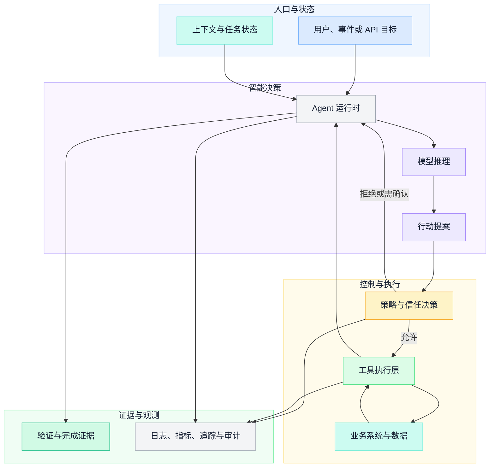
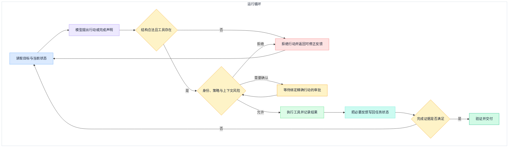
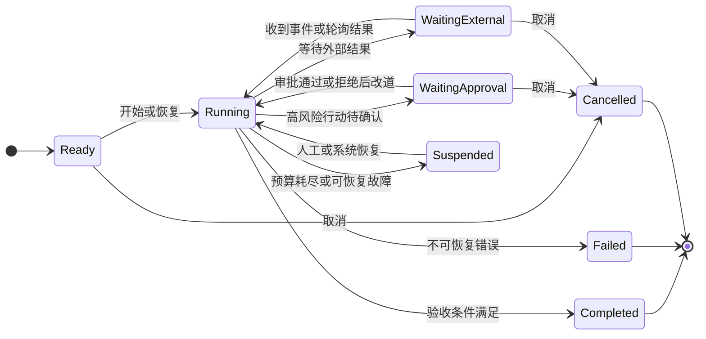
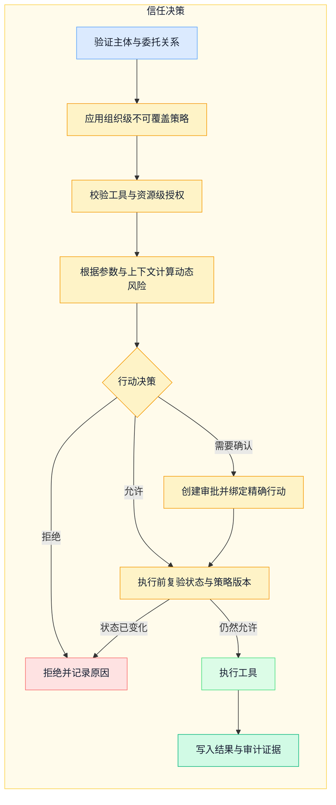
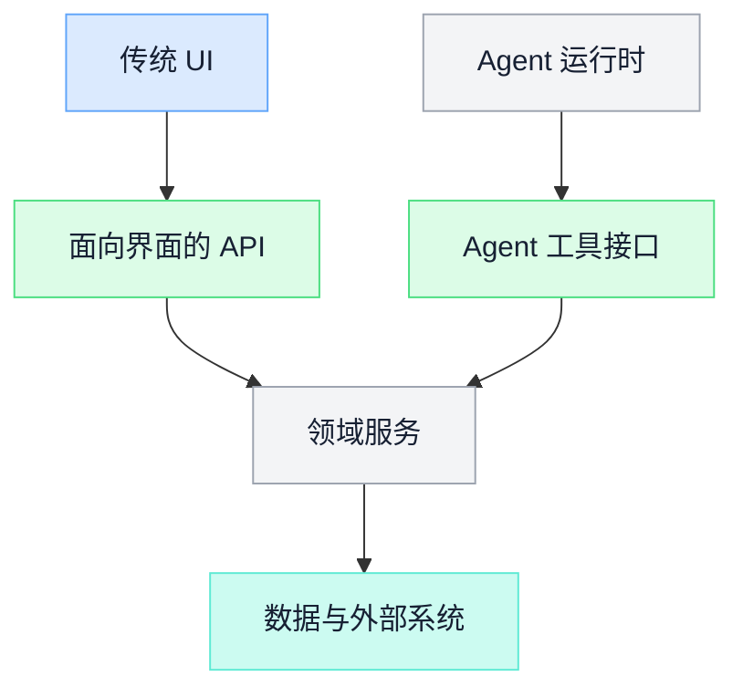

企业级 Agent 不是在现有平台上增加一个聊天框，也不是让模型直接调用全部 API。它是一套受控行动系统：模型提出下一步行动，运行时维护任务状态，工具改变外部世界，策略层决定行动边界，评估系统证明结果是否可靠。

本文给出一套通用架构。它不预设某个框架、模型或业务平台，也不主张对话取代所有界面。高频、确定、需要快速扫视的操作仍可能更适合传统 UI；Agent 更适合目标明确但路径需要动态规划、需要跨能力协作的任务。

## 一、先从责任边界定义 Agent

一个可生产使用的 Agent 系统至少包含五类责任：

| 责任域 | 核心问题 |
| --- | --- |
| 推理与规划 | 下一步应该做什么，什么时候停止 |
| 运行时与状态 | 任务现在处于什么状态，失败后如何恢复 |
| 工具与能力 | Agent 能读取或改变哪些外部资源 |
| 信任与治理 | 哪些行动允许自动执行，谁承担责任 |
| 观测与评估 | 过程发生了什么，结果是否达到目标 |

模型只承担第一类责任的一部分。权限、幂等、超时、审批、审计和恢复都应由确定性软件控制，而不是依赖模型“记得遵守”。



## 二、分层架构

### 2.1 入口与身份层

入口可以是 Web、IM、API、定时任务或事件订阅，但它们应收敛到同一身份和任务模型。入口层负责：

- 恢复真实用户或服务身份；
- 绑定租户、组织、角色和授权范围；
- 创建稳定的任务与会话标识；
- 标记请求来源、交互能力和数据边界；
- 对外部事件设置可信等级和去重键。

不同入口不应各自实现一套 Agent loop，否则权限、审计和恢复行为会逐渐分裂。

### 2.2 编排与运行时层

运行时负责推进任务，而不是替业务系统实现业务规则。它维护：

- 当前目标和验收条件；
- 已完成、进行中、待确认和失败的步骤；
- 工具调用预算、时间预算和成本预算；
- 等待审批或外部事件的可恢复状态；
- 子任务依赖和取消传播；
- 最终结果及其证据。

### 2.3 能力与工具层

工具层把业务能力转换为模型可理解的行动契约。它可以使用 MCP 或内部协议，但协议本身不等于权限系统。认证、授权、参数过滤、速率限制、审计和幂等仍由企业系统负责。

### 2.4 治理层

治理层统一管理组织策略、工具风险、审批、数据使用、模型白名单和审计。它必须在模型之外执行，并能覆盖用户偏好和 Agent 自己提出的策略。

### 2.5 观测与评估层

观测记录“发生了什么”，评估判断“做得是否正确”。二者既要覆盖模型调用，也要覆盖工具选择、权限决策、人工接管和最终业务结果。

## 三、Agent 循环与持久化状态机

### 3.1 最小行动循环



每一轮都要有上限。最少需要控制：

- 最大推理轮次；
- 最大工具调用数；
- 单工具超时和总任务截止时间；
- 重试次数与退避策略；
- 同一副作用动作的重复保护；
- 模型和外部服务成本预算；
- 人工审批的有效期。

预算耗尽时不能伪装成完成。系统应返回当前状态、已取得的证据、未完成原因和可恢复入口。

### 3.2 把“推理阶段”和“业务状态”分开

`REASONING`、`EXECUTING` 更像短暂运行阶段；`WAITING_APPROVAL`、`SUSPENDED` 和 `COMPLETED` 才是需要持久化、能够跨进程恢复的业务状态。混在一个枚举里，容易让恢复逻辑依赖某个进程的内部步骤。



持久化记录至少包括状态版本、当前目标、完成证据、待执行行动、已使用预算、审批引用和最后一次安全检查结果。状态更新使用乐观锁或等价并发控制，避免两个执行器同时推进同一任务。

### 3.3 工具副作用与重试

读操作可以在明确条件下重试；写操作必须考虑幂等。每次副作用行动应具有稳定的 `action_id` 或幂等键，并记录：

- 请求参数摘要；
- 目标资源和预期版本；
- 执行前策略决策；
- 实际结果和外部事务标识；
- 是否允许重试以及如何补偿。

超时并不表示操作没有发生。Agent 在重试前必须先查询外部状态或使用幂等接口，不能仅凭“没有收到响应”再次执行。

## 四、工具契约：从 API 列表到行动能力

### 4.1 好工具的必要信息

| 字段 | 作用 |
| --- | --- |
| 名称与描述 | 帮助模型在相近工具间做选择 |
| 输入 Schema | 限制参数类型、范围和必填关系 |
| 输出 Schema | 提供稳定的成功证据和错误语义 |
| 副作用声明 | 说明读、写、外部发送或不可逆影响 |
| 资源范围 | 限定目录、租户、对象或环境 |
| 幂等语义 | 说明重复调用是否安全 |
| 风险基线 | 给策略引擎提供初始风险，不替代动态判断 |
| 数据分类 | 标明输入输出可能包含的敏感信息 |

工具描述是给模型的选择线索，不是安全边界。即使模型构造了符合 Schema 的参数，策略层仍要用真实身份和目标资源重新授权。

### 4.2 工具粒度

过细的工具迫使模型用大量轮次拼装一个业务动作，增加成本和部分失败；过粗的工具隐藏关键决策，削弱权限控制和可观测性。

合适的粒度通常是“一个语义完整、可以独立授权和验收的动作”。对于需要多次 UI API 才能取得完整判断依据的场景，可以增加面向 Agent 的聚合查询；对于高风险写入，不宜为了减少调用次数把多个审批边界合并到一个工具里。

### 4.3 MCP 的位置

MCP 为 AI 应用连接工具和数据提供开放协议。采用 MCP 可以统一发现和调用方式，但生产落地仍要单独设计：

- 服务身份与用户委托身份如何传递；
- 每个工具的授权范围由谁计算；
- 远程连接、凭证和服务器供应链如何治理；
- 大结果如何分页、摘要和追溯；
- 长任务、取消和重复请求如何处理；
- 协议版本升级如何兼容。

协议版本会演进，业务工具契约不应绑定未稳定的扩展特性。对核心能力建立契约测试和兼容策略，比假设“用了标准就自动互通”更可靠。

## 五、信任层级：按行动风险决定自动化程度

### 5.1 风险不是工具名的固定属性

同一个查询工具，在普通目录中可能低风险，在敏感数据域中可能高风险；同一个写工具，修改自己的草稿与发布到生产环境也不是同一风险。因此信任决策应综合：

- 调用者身份、角色和委托关系；
- 目标资源、租户和环境；
- 数据敏感度与影响范围；
- 动作可逆性和补偿成本；
- 当前任务来源和输入可信度；
- 参数异常、频率和历史行为；
- 组织政策与法规要求。

### 5.2 四级行动模型

| 层级 | 自动化边界 | 人的参与 | 示例 |
| --- | --- | --- | --- |
| L0：建议 | 不改变外部状态，只形成建议或草稿 | 人决定是否采纳 | 方案分析、生成草稿 |
| L1：受限执行 | 低影响、可恢复、范围明确 | 事后可审阅 | 读取授权数据、更新个人草稿 |
| L2：确认执行 | 有业务副作用或影响他人 | 对具体行动事前确认 | 外部发送、修改共享配置 |
| L3：强化控制 | 高影响、难恢复或高敏感 | 多人审批、职责分离或禁止自动执行 | 生产删除、权限提升、资金动作 |

这是一套设计起点，不是跨业务通用的固定映射。每个组织都要用自己的风险承受度校准。

### 5.3 完整决策链



审批不能只绑定一句自然语言摘要。至少要绑定工具、目标资源、关键参数、影响范围、策略版本、过期时间和 `action_id`。参数、资源版本或策略变化后，旧审批自动失效。

高风险控制组件异常时应默认失败关闭。低风险读取是否允许降级继续，需要在威胁模型和可用性目标中显式决定；不能采用“一切 Hook 超时都放行”的全局规则。

### 5.4 权限只能由外部系统提升

Agent 可以建议调整自动化等级，但不能根据自己的成功次数给自己提权。权限变化必须经过组织策略规定的审批、评估和审计。异常行为可以触发自动降权或熔断，因为收紧权限不增加行动能力。

## 六、Hooks 与策略执行

Hook 是把检查、通知和质量门禁接入生命周期的机制。常见时机包括输入进入、工具执行前后、上下文压缩、子任务结束和主任务停止。

### 6.1 硬约束与软判断分开

| 类型 | 实现方式 | 例子 |
| --- | --- | --- |
| 硬约束 | 确定性策略、代码或规则引擎 | 禁止访问其他租户、限制生产删除 |
| 软判断 | 模型评审或人工判断 | 调查证据是否充分、回复是否清晰 |

模型型 Hook 不适合作为唯一安全控制，因为它仍具有概率性。硬约束必须在模型之外执行。

### 6.2 Hook 的工程要求

- 明确输入输出 Schema；
- 规定超时、失败和重试语义；
- 对高风险前置 Hook 使用失败关闭；
- 保证幂等，避免重复副作用；
- 限制递归触发和停止检查次数；
- 记录策略版本、决策和耗时；
- 防止 Hook 自身取得超过任务需要的权限。

工具已经执行后，后置 Hook 无法“撤销”副作用。需要回滚时必须调用显式补偿动作，而不是把后置检查结果写成 `deny`。

## 七、上下文、记忆与恢复

### 7.1 上下文分层

```text
稳定约束：组织政策、Agent 角色、项目规范
任务状态：目标、计划、决策、待审批和预算
工作证据：相关文档、查询结果、测试和错误
外部资源：知识库、工单、监控和业务记录
历史记忆：经治理的偏好、结论和可复用经验
```

稳定约束不能在压缩时丢失；大型工具结果应存储为可追溯制品，在上下文中只放摘要和引用；恢复任务时应从持久化状态重建，不假设模型仍记得完整对话。

### 7.2 记忆不是聊天记录的永久化

进入长期记忆前需要：

- 明确来源与所属主体；
- 区分事实、偏好、结论和假设；
- 设置信任度、有效期和可撤销机制；
- 防止外部不可信内容直接写入高权重记忆；
- 支持用户查看、更正和删除；
- 记录哪次行动使用了哪条记忆。

记忆污染会跨会话放大错误，因此写入记忆本身也是一个受治理的工具动作。

## 八、子 Agent：用隔离解决复杂度

多 Agent 的价值主要来自责任和上下文隔离，而不是角色数量。

### 8.1 什么时候值得拆分

一个子任务同时满足以下条件时更适合委托：

- 有清晰输入和完成标准；
- 需要专门工具或独立权限；
- 中间材料很多，但主流程只需要结论与证据；
- 可以独立超时、取消和重试；
- 失败不会破坏共享状态。

### 8.2 委托契约

```yaml
task_id: stable-id
objective: 要解决的问题
inputs:
  references: []
constraints:
  allowed_tools: []
  max_actions: 12
  deadline: 2026-08-27T12:00:00Z
  max_risk_level: L1
expected_output:
  conclusion: string
  evidence: array
  unresolved: array
```

返回结果要包含结论、证据、未解决问题和已采取行动。主 Agent 负责整合，但不能把子 Agent 的自由文本自动当成事实。

### 8.3 共享状态原则

子 Agent 默认不直接修改共享计划。需要写入时，通过同样的工具权限、版本检查和审计链路执行。取消父任务时，应向子任务传播取消信号；父任务完成前，要处理仍在运行或等待审批的子任务。

## 九、结构化制品与生命周期

AI 更适合在有限 Schema 中生成可验证制品，而不是直接生成任意生产代码。候选制品可以包括工作流、规则、Agent 定义、提示模板和呈现配置。

```text
draft -> validated -> reviewed -> canary -> active -> deprecated
```

每个阶段有不同含义：

- `draft`：只有来源和初步内容；
- `validated`：结构合法，不代表业务正确；
- `reviewed`：责任人确认风险和适用范围；
- `canary`：在受限流量或影子环境中验证；
- `active`：按版本生效并可回滚；
- `deprecated`：停止新使用但保留追溯记录。

Schema 校验只能证明“形状正确”，不能证明策略合理。上线仍需离线评估、历史回放、人工评审或灰度验证。

从历史轨迹提炼工作流也不能仅以“步骤经常重复”为准。要先确认这些步骤代表正确实践、输入边界稳定、异常路径可枚举，并且确定性工作流确实比自由 Agent 更安全或更经济。

## 十、观测、审计与评估

### 10.1 观测数据模型

一次任务应该能关联：

- 会话、任务、父子任务和用户身份；
- 模型请求、响应状态和用量；
- 工具提案、权限决策、审批和执行结果；
- Hook 触发和策略版本；
- 状态迁移、重试、恢复和人工接管；
- 最终完成证据和用户反馈。

OpenTelemetry 可以提供统一的 traces、metrics 和 logs 传输及语义约定，但 GenAI 相关约定仍会演进。平台应固定自己依赖的约定版本，并避免默认采集 prompt、工具参数和结果全文，因为它们可能包含代码、凭证或个人信息。

### 10.2 审计与调试日志不同

调试日志帮助定位故障，可以采样和限期保留；审计记录证明谁批准并执行了什么，需要更严格的完整性、访问控制和保留策略。不能把普通应用日志等同于不可篡改审计。

### 10.3 三层评估

| 层级 | 测试对象 | 例子 |
| --- | --- | --- |
| 工具与策略 | Schema、授权、幂等、风险判断 | 越权参数必须被拒绝 |
| 单步 Agent | 意图、工具选择、参数和停止判断 | 同义请求选择正确工具 |
| 端到端任务 | 规划、审批、恢复和业务结果 | 中途故障后恢复且不重复写入 |

此外需要持续做安全评估：prompt injection、工具滥用、跨租户访问、记忆污染、过度授权、资源耗尽和供应链风险。

准确率目标必须基于真实基线和风险设定。高风险动作不能只依赖模型分类准确率达到某个百分比，必须由确定性策略兜底。

## 十一、接入存量系统

Agent 不应重写已经验证的业务内核。常见做法是让传统 UI 和 Agent 工具共享同一领域服务，但使用不同的消费接口：



Agent 工具可以提供更适合推理的聚合查询和明确的副作用动作，但不能绕过领域层的授权和业务校验。

新旧入口共享数据并不自动保证行为一致。需要对同一业务动作验证：

- 授权结果是否一致；
- 幂等和并发控制是否一致；
- 审计字段是否完整；
- Agent 聚合结果是否保留关键语义；
- Agent 不可用时是否有明确降级路径。

## 十二、分阶段落地

### 阶段一：只读闭环

建立身份、任务状态、工具注册、观测和评估；只开放受控查询，证明意图到证据的完整链路。

### 阶段二：可逆低风险动作

加入幂等、版本检查、补偿、审计和人工接管，开放范围明确的可恢复写入。

### 阶段三：审批型动作

让审批绑定精确行动，支持过期、拒绝、取消和恢复；用端到端测试覆盖并发变化和重复回调。

### 阶段四：子 Agent 与长任务

只有在单 Agent 的上下文或职责边界出现明确问题后，才增加委托协议、子任务状态和取消传播。

### 阶段五：制品和经验固化

在有足够高质量轨迹后提炼工作流，经过 Schema 校验、历史回放、评审和灰度再生效。自动生成不等于自动上线。

## 十三、架构评审清单

### 循环与状态

- [ ] 停止条件和完成证据是否明确？
- [ ] 预算耗尽是否返回未完成，而不是伪装成功？
- [ ] 等待审批、等待外部结果和中断是否可恢复？
- [ ] 副作用动作是否有幂等和补偿策略？

### 权限与安全

- [ ] 每次工具执行是否重新使用真实身份授权？
- [ ] 风险是否结合资源、参数和环境动态计算？
- [ ] 审批是否绑定精确行动并具有有效期？
- [ ] 高风险控制故障是否默认失败关闭？
- [ ] Agent 是否无法自行提升权限？
- [ ] Prompt injection、记忆污染和工具供应链是否进入威胁模型？

### 工具与子 Agent

- [ ] 工具是否有稳定 Schema、副作用和错误语义？
- [ ] MCP 与业务授权是否保持分层？
- [ ] 子任务是否有输入、预算、权限和输出契约？
- [ ] 父子任务的取消、超时和失败是否能够传播？

### 观测与评估

- [ ] 是否能从最终结果追溯到工具、审批和证据？
- [ ] 调试日志与审计记录是否分开治理？
- [ ] 敏感 prompt 和工具内容是否默认最小采集？
- [ ] 模型、Prompt、工具或策略变更是否触发回归评估？

企业级 Agent 的核心不是让模型拥有更多自主权，而是让每一份自主权都有边界、状态、证据和责任人。循环引擎解决“怎样持续行动”，信任层级解决“哪些行动可以发生”，工具契约解决“怎样安全地改变外部世界”，评估体系解决“如何证明系统真的完成了目标”。这四部分形成闭环，Agent 才从演示进入工程系统。

## 参考资料

- NIST：[AI Risk Management Framework](https://www.nist.gov/itl/ai-risk-management-framework)
- NIST：[Generative AI Profile](https://nvlpubs.nist.gov/nistpubs/ai/NIST.AI.600-1.pdf)
- OWASP：[Agentic AI — Threats and Mitigations](https://genai.owasp.org/resource/agentic-ai-threats-and-mitigations/)
- Model Context Protocol：[Specification](https://modelcontextprotocol.io/specification/2026-07-28)
- OpenTelemetry：[Semantic conventions](https://opentelemetry.io/docs/specs/semconv/)
