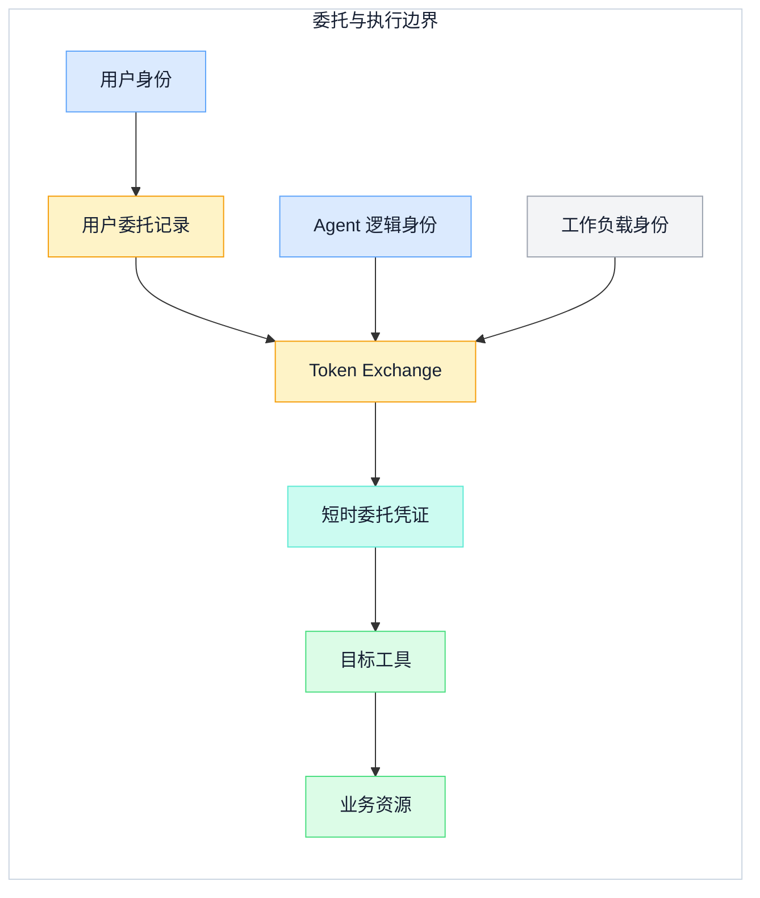
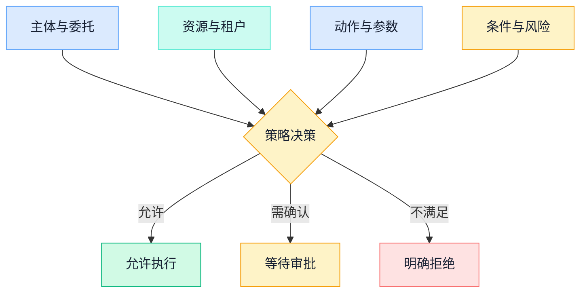
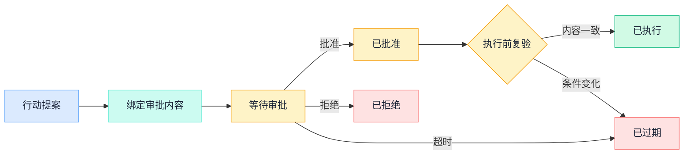

## 一、问题与边界：Agent 不是用户权限的复制品

当 Agent 只能生成文字时，错误通常停留在回答里；当它能发消息、改配置、查客户数据或触发付款时，模型输出就成了行动提案。真正的安全边界不在提示词，而在每次行动之前能否回答三个问题：它代表谁、当前运行实例是谁、为什么允许它对这个资源执行这个动作。

这三个问题不能压缩成一个“Agent 账号”。用户身份表达权利来源和责任主体，Agent 身份表达被部署的能力与策略边界，工作负载身份表达此刻实际发起调用的进程。把三者混在一个长期密钥里，会同时失去用户委托范围、运行实例可信度和事后归因。

本文只深入身份、委托、授权和审计。[企业级 Agent 系统架构](enterprise-agent-system-architecture)已经说明运行循环、任务状态、工具契约和信任层级；这里不再重画全景状态机，而是把一次工具行动从“用户意图”追到“可验证结果”。

## 二、三类主体：用户、Agent 与工作负载

三类主体各自回答不同问题，生命周期也不同。

| 主体 | 回答的问题 | 稳定标识 | 不应携带的能力 |
| --- | --- | --- | --- |
| 用户 | 谁提出目标、谁有权委托 | 用户、租户、组织关系 | 不把全部个人权限自动复制给 Agent |
| Agent | 哪个逻辑能力在代办 | Agent 定义、版本、策略集 | 不因模型声称需要就自行扩权 |
| 工作负载 | 哪个运行实例在调用 | 进程、任务、节点或工作负载身份 | 不共享跨环境、跨工具的长期静态密钥 |

Agent 身份应绑定版本和责任边界。例如，同名“采购助手”的只读分析版本与可创建订单版本必须是可区分的授权主体。工作负载身份则应随运行实例证明和轮换：实例被替换后，新实例重新取得身份材料，旧实例不能仅凭复制来的秘密继续行动。SPIFFE 的通用框架说明了这种模式：工作负载可以通过 API 获得短时密码学身份文档，并用它建立相互认证或验证签名。

因此，一次请求至少要保留两条关系：`subject` 是权利所来自的用户，`actor` 是实际行动的 Agent；工作负载身份再证明“哪个实例正在扮演 actor”。只记录用户会掩盖代理行为，只记录 Agent 又无法证明用户是否有权委托。

## 三、用户委托与短时凭证

用户说“帮我处理一下”不是完整授权。有效的用户委托至少应固化目标、可用工具、资源范围、动作范围、有效期、风险上限和撤销方式。自然语言可以解释意图，但系统必须把可执行边界转换为结构化记录，再由确定性策略执行。

OAuth 2.0 Token Exchange 为跨服务交换安全令牌定义了标准请求框架。`subject_token` 表达“代表谁”，可选的 `actor_token` 表达“谁在行动”；`resource`、`audience` 与 `scope` 用来请求面向目标服务的权限。授权服务器仍需验证客户端或工作负载，并根据本地策略决定是否签发。协议本身不替部署者定义信任模型，也不会自动建立输入、输出令牌之间的撤销联动。

一个稳妥的交换流程是：授权服务接收用户授权记录、Agent 身份和已认证的工作负载身份，只签发面向单一目标或紧密资源集合的短时凭证。输出权限应收敛为以下交集，而不是继承任一主体的最大权限：

```text
有效权限 = 用户当前权限
         ∩ 用户委托范围
         ∩ Agent 固有边界
         ∩ 工作负载可信条件
         ∩ 目标资源策略
```

看图时先区分三条输入线：用户委托给出权利来源，Agent 逻辑身份限定能力，工作负载身份证明当前调用实例；三者只在交换点汇合。



主路径是“委托记录 + 两种代理身份 → Token Exchange → 短时凭证 → 目标资源”。代价是每个目标都要有可表达的资源和权限模型，交换服务也成为关键依赖；收益是泄露窗口、横向移动范围和撤销半径都明显小于共享用户令牌或平台主密钥。

短时并不自动等于安全。系统还要校验签发者、受众、有效期、授权范围和凭证绑定，并明确撤销传播。若用户权限被收回、Agent 版本下线或工作负载失去信任，已签发凭证应尽快失效；对高风险操作，可以进一步使用一次性行动凭证。

## 四、资源、动作与条件共同决定授权

工具是否出现在模型可选列表中，只决定 Agent 能否提出调用，不代表调用已经获准。最小权限必须落实到下游系统实际使用的身份和权限；否则，一个“只读总结”工具若用可写全库的通用账号连接数据库，模型侧再严格的描述也挡不住越权影响。

每次授权至少需要以下输入：

- **主体**：用户、Agent、工作负载及其委托链是否仍有效；
- **资源**：租户、环境、对象标识、资源版本和数据敏感度；
- **动作**：读取、创建、修改、外部发送、删除或授权变更；
- **参数**：规范化后的关键参数和影响范围，而不只是工具名；
- **条件**：时间、来源、用户是否在线、输入可信度、调用频率与异常信号；
- **策略版本**：哪个版本的组织规则作出决定，是否附带脱敏、限量或复验义务。

NIST 的零信任架构把保护重点放在资源，而不是网络位置：处于内网、属于某个集群或由企业拥有，都不构成隐式信任。对 Agent 而言，这意味着授权点必须在工具执行前使用真实资源和当前上下文重新判断，不能因为上一轮调用通过就沿用结论。

看图时关注四类输入都指向同一个确定性决策点；模型只提出动作，不参与决定自己是否获准。



主路径把同一工具在不同资源、参数和条件下拆成不同决策。权衡是策略输入更多、缓存命中更少，但这正是从“给 Agent 一个角色”走向逐行动授权所需的成本。高风险授权服务不可用时应失败关闭；低风险读取能否使用短时缓存，必须由明确的可用性与威胁模型决定。

## 五、风险分级与审批绑定

风险不是工具的永久标签。读取自己的公开草稿，与导出整个租户的客户数据可能调用同一查询工具；修改个人草稿，与发布到外部渠道也可能使用同一写入接口。分级应同时考虑数据敏感度、影响人数、可逆性、金额或配额、输入可信度，以及用户是否正在场。

可以先用三类处置建立最小闭环：范围明确且可恢复的低风险行动自动执行；有外部副作用、影响他人或来源可疑的行动要求事前确认；权限提升、批量删除、重大资金或不可逆动作进入职责分离、多方审批，或根本不开放给 Agent。该处置只细化单次授权，不取代主文章中的整体信任层级。

审批不能绑定一句“同意执行”的摘要。审批绑定至少包含：

- `action_id` 与幂等键；
- 工具和动作的稳定标识；
- 目标资源、租户、环境和预期资源版本；
- 规范化关键参数的摘要与影响范围；
- 用户、Agent、工作负载和委托记录标识；
- 策略版本、审批人、审批时间和过期时间。

看图时观察审批不是一个布尔值，而是一组有过期和复验规则的状态；批准后仍不能绕过执行前检查。



主路径是“提案 → 审批绑定 → 批准 → 复验 → 执行”。如果参数、资源版本、委托、策略或有效期发生变化，旧批准转为失效并重新发起，而不是静默套用。这样会增加高风险路径的等待时间，却能避免审批对象与最终执行对象不一致。

## 六、工具凭证隔离：模型看能力，执行器拿凭证

模型需要看到的是工具名称、输入约束、副作用和风险提示，不需要看到访问令牌、私钥或连接密码。推荐把凭证获取放进受控执行器：模型提交结构化行动，策略点授权，凭证代理再凭工作负载身份换取面向目标的短时凭证，执行器完成调用后只返回经过过滤的业务结果和证据引用。

隔离至少包括四个维度：

1. **按工具隔离**：邮件读取与邮件发送使用不同能力和权限，不因一个连接器支持两者就一起开放。
2. **按资源隔离**：开发、测试、生产以及不同租户使用不同受众和资源范围。
3. **按任务隔离**：凭证有效期不超过任务所需窗口，高风险行动尽量绑定 `action_id`。
4. **按执行器隔离**：不同 Agent 或工具执行器不共享主密钥、缓存目录和可导出的环境变量。

凭证引用可以进入任务状态，原始凭证不能进入 Prompt、长期记忆、工具参数摘要或普通日志。若为减少交换延迟而缓存凭证，缓存键必须包含工作负载、用户委托、目标资源和 scope，剩余有效期要覆盖单次调用；任何边界变化都应造成缓存未命中。

OWASP 将过度功能、过度权限和过度自主性归为 Excessive Agency 的主要根因。控制顺序也因此很清楚：先减少可见工具与开放函数，再收紧下游身份的实际权限，最后对高影响动作增加人的批准；仅靠记录日志并不能阻止越权发生。

## 七、审计证据：证明谁授权、谁行动、发生了什么

审计证据不是把所有 Prompt 和响应永久保存。完整原文可能含个人数据、业务秘密甚至凭证，既扩大暴露面，也未必能证明某个确定性决策。更可靠的方法是围绕稳定的 `action_id` 记录结构化事件，并让提案、决策、审批和执行可以关联。

| 阶段 | 最小证据 | 要证明的事实 |
| --- | --- | --- |
| 提案 | 用户、Agent、工作负载、委托记录、工具、资源、参数摘要 | 谁代表谁提出了什么 |
| 决策 | 策略版本、输入属性摘要、允许/拒绝/需审批、义务和理由码 | 为什么当时可以继续 |
| 审批 | 审批绑定摘要、审批人、结果、时间和过期时间 | 人批准的是否就是待执行行动 |
| 执行 | 凭证实例标识、外部事务标识、资源版本、结果、重试与补偿 | 实际发生了什么且是否重复 |

记录凭证的不可逆标识或签发记录引用，不记录原始 Token。用户是 `subject`，Agent 是 `actor`，工作负载是执行实例，三者不能挤进一个模糊的 `user_id`。调试日志可以采样和短期保留；审计证据应有独立访问控制、保留策略、时钟与完整性保护。

一条可用证据链应能回答：执行时用户权限是否仍有效，委托是否覆盖该资源与动作，Agent 与工作负载是否被允许，审批是否绑定相同内容，执行结果是否对应同一个 `action_id`。缺任一环节，都只能说明“系统打过日志”，不能证明行动合规。

## 八、落地清单

### 身份与委托

- [ ] 用户、Agent、工作负载是否有独立且可版本化的主体标识？
- [ ] 用户委托是否结构化记录范围、期限、风险上限与撤销方式？
- [ ] Token Exchange 是否验证主体、行动者、工作负载与目标受众？
- [ ] 权限是否取用户、委托、Agent、工作负载和资源策略的交集？

### 授权与审批

- [ ] 每次工具调用是否使用真实资源、动作、参数和条件重新授权？
- [ ] 下游系统使用的实际身份是否只有完成任务所需的最小权限？
- [ ] 审批绑定是否覆盖 `action_id`、资源版本、参数摘要、策略版本和有效期？
- [ ] 执行前是否复验委托、资源与策略，变化后让旧审批失效？

### 凭证与审计

- [ ] 原始凭证是否始终位于模型上下文、长期记忆和普通日志之外？
- [ ] 不同工具、租户、环境与执行器是否隔离凭证和缓存？
- [ ] 审计证据是否分别记录用户、Agent 和工作负载，并贯穿提案到结果？
- [ ] 用户撤权、Agent 下线或工作负载失信时，短时凭证能否及时停止使用？

最小权限的目标不是让 Agent 什么都不能做，而是让每次能力都有清晰来源、窄范围和短生命周期。用户委托给出权利来源，工作负载身份证明当前实例，资源级策略决定行动边界，审批绑定覆盖高风险变化，审计证据负责把整条链路还原出来。只有这五部分同时成立，“代表用户行动”才不是一张无法追责的万能通行证。

## 参考资料

- IETF：[RFC 8693 — OAuth 2.0 Token Exchange](https://www.rfc-editor.org/rfc/rfc8693)
- NIST：[SP 800-207 — Zero Trust Architecture](https://csrc.nist.gov/pubs/sp/800/207/final)
- SPIFFE：[SPIFFE Overview](https://spiffe.io/docs/latest/spiffe-about/overview/)
- OWASP：[LLM06:2025 Excessive Agency](https://genai.owasp.org/llmrisk/llm062025-excessive-agency/)
