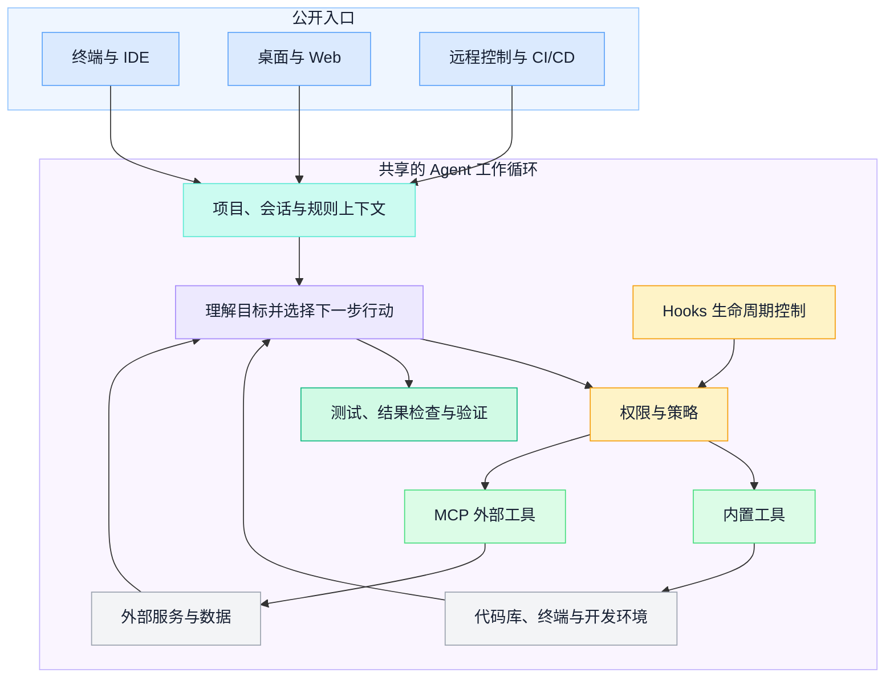
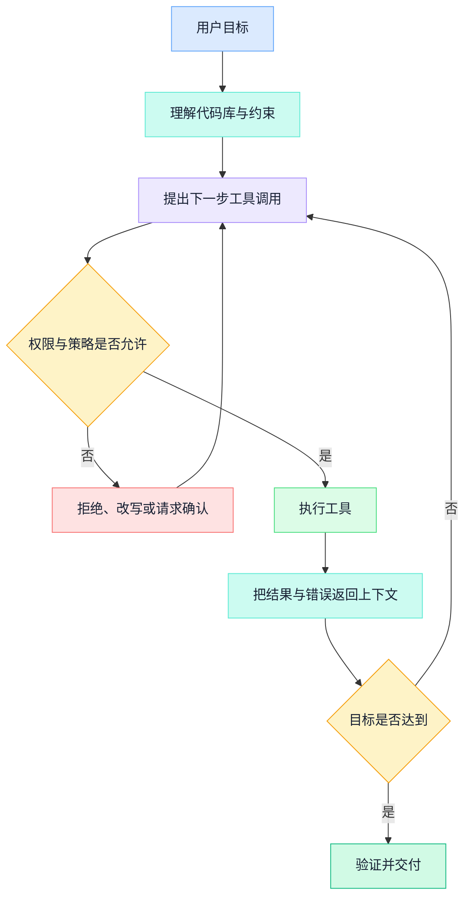
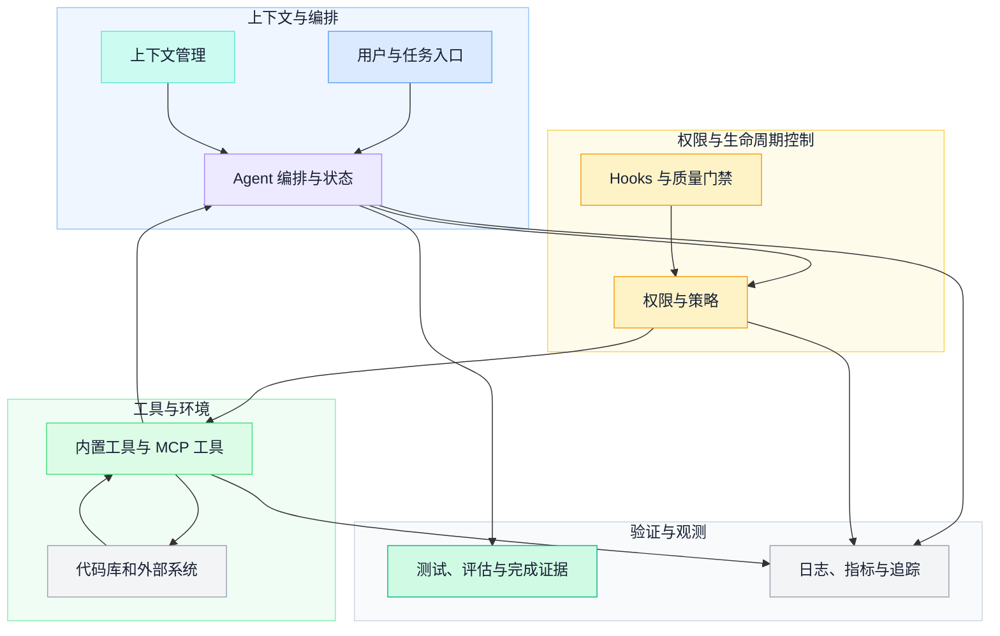

Claude Code 值得研究的地方，不是某个未经公开的内部调度算法，而是它怎样把模型放进真实软件工程环境，并让模型的行动受到工具、权限、上下文和工程反馈的共同约束。

本文只分析官方公开的产品能力。官方文档没有说明的内部实现，会明确写成工程推断；版本相关的事件名称、配置字段和界面能力，应始终以当前文档为准。

## 一、先确定事实边界

根据当前官方概览，Claude Code 是一个 agentic coding tool，可以读取代码库、编辑文件、运行命令并连接开发工具。它已经不只存在于终端，也提供 IDE、桌面、浏览器等使用界面。不同界面的交互方式和执行位置可能不同，但核心仍是一条“理解目标—选择行动—读取反馈—继续判断”的 Agent 链路。

这组事实支持我们讨论以下设计问题：

- 模型如何取得完成工程任务所需的工具；
- 高风险行动如何被权限和策略限制；
- 项目规则、任务状态和工具结果如何进入上下文；
- 确定性的质量门禁如何接入概率性的模型循环；
- 长任务如何观测、评估和恢复。

它们不支持我们直接断言 Claude Code 内部使用了某种隐藏状态机、固定数量的 Hook、固定的上下文阈值，或者某个版本具有未经官方披露的性能提升。

把当前公开能力按责任而不是产品菜单组织，可以得到下面这张图。入口形态会继续演进，但官方文档明确说明这些界面共享同一套 Agent 工作循环；图中的分层是便于理解的工程分解，不是对内部组件的还原。



## 二、核心不是聊天，而是受控行动循环

传统代码补全的主要执行单位是“下一段代码”；工程 Agent 的执行单位更接近“为完成目标而采取的下一步行动”。一个简化循环如下：



这张图是通用工程抽象，不是对 Claude Code 内部调用顺序的还原。它强调四个互相制约的角色：

| 角色 | 责任 | 不应承担的责任 |
| --- | --- | --- |
| 模型 | 理解目标、提出行动、解释反馈 | 独自决定全部安全边界 |
| 工具 | 读取或改变外部环境，返回结构化结果 | 替模型判断最终业务目标 |
| 权限系统 | 决定哪些行动可以自动执行、询问或拒绝 | 用一个总开关替代细粒度规则 |
| 验证系统 | 用测试、静态检查和评估证明结果 | 只检查模型最后一句话是否流畅 |

Claude Code 的产品价值因此不只是“会写代码”，而是把这四类责任组合进开发工作流。

## 三、工具设计决定 Agent 能做什么

官方工具参考列出了文件读取、编辑、搜索、命令执行和子 Agent 等内置能力；外部工具可以通过 MCP 接入。对架构设计而言，工具数量不是重点，重点是工具是否给模型提供了清晰的行动契约。

一个适合 Agent 的工具至少需要说明：

- 前置条件：需要哪些身份、目录、网络或项目状态；
- 输入约束：参数的类型、范围以及互斥关系；
- 副作用：只读、写入、外部发送、删除或不可逆操作；
- 成功证据：返回什么结果可以证明动作完成；
- 失败语义：错误是否可重试，怎样避免重复副作用；
- 审计信息：谁在什么会话中以什么参数触发了动作。

把已有 API 全部暴露给模型，通常不会自然形成一个好 Agent。面向人类界面的 API 可能要求调用者记住页面流程、内部 ID 和隐含状态；Agent 工具更适合围绕一个清晰动作设计，并返回足够支持下一步判断的结果。

## 四、权限是一套策略系统

Claude Code 的当前权限文档描述了声明式规则、权限模式、用户确认和 Hook。规则可以按工具及其参数范围控制行动，额外工作目录也进入同一权限边界。企业还可以用受管理配置约束个人或项目设置。

对于自研 Agent，可以把权限问题拆成四层：

1. **能力边界**：这个 Agent 是否拥有某个工具。
2. **参数边界**：工具只能作用于哪些目录、资源、命令或数据范围。
3. **行动决策**：本次调用自动允许、需要确认，还是必须拒绝。
4. **责任证据**：策略来源、用户确认和执行结果如何留痕。

一个实用的默认原则是：读取低敏感信息可以较宽松，修改本地可恢复文件需要可追踪，外部发送、生产变更、凭证访问和不可逆操作需要更严格的策略或人工确认。

```text
工具调用请求
  -> 检查能力是否存在
  -> 检查参数是否越界
  -> 应用组织与项目策略
  -> 必要时请求人确认
  -> 执行并记录结果摘要
```

这不是特定产品的权限实现顺序，而是一种便于审计的设计分解。真正应避免的是让模型靠 prompt 自行判断“这个命令应该没问题”。安全策略必须由确定性系统执行。

## 五、Hooks 把确定性规则接入 Agent 生命周期

官方把 Hooks 定义为 Claude Code 生命周期特定位置触发的用户命令或处理器。它们可以在工具使用、权限请求、任务结束、上下文压缩等阶段执行，用于格式化、检查、通知、审计和阻断。

Hooks 的关键价值不是事件有多少个，而是让组织能把确定性规则放在正确的生命周期位置：

| 时机 | 适合的规则 | 例子 |
| --- | --- | --- |
| 用户请求进入时 | 补充或校验任务上下文 | 关联工单、分支和目标环境 |
| 工具执行前 | 阻断高风险动作 | 禁止修改受保护路径 |
| 工具执行后 | 验证局部结果 | 格式化、lint、记录变更摘要 |
| Agent 准备停止时 | 检查完成条件 | 测试是否执行、需求是否遗漏 |
| 会话或上下文变化时 | 保存关键状态 | 在压缩前保留决策与未完成项 |

Hook 不是所有问题的答案。需要语义判断的任务可能仍要模型或人工参与；可能重复触发的 Hook 要有幂等性和次数上限；耗时检查应避免无界阻塞主循环。

更重要的架构启发是：不要把发布规则、敏感路径、审计要求和测试门禁全部写进 system prompt。Prompt 表达意图，Hook 和策略系统执行不可妥协的约束。

## 六、上下文是分层资源，不是越大越好

Claude Code 通过项目说明文件、Skills、会话历史、文件读取、工具结果和外部资源取得上下文。子 Agent 可以使用独立上下文处理专门任务，再把结果返回主流程。

一个可维护的上下文体系通常包含：

```text
长期稳定层：组织政策、项目规范、架构约束
任务状态层：当前目标、计划、决策、未完成项
工作证据层：相关代码、文档片段、测试和工具结果
外部资源层：MCP 资源、工单、监控和知识库
压缩结果层：长任务中的阶段摘要与恢复点
```

不同信息的生命周期不同。把长期规则埋在聊天记录里，会让恢复和复用变得困难；把所有文件预先塞进上下文，会增加成本并稀释关键信号；只保留摘要又可能失去追溯证据。

因此需要同时提供摘要和来源：模型先看到足以判断下一步的结构化结果，必要时仍能回到原始文件、日志或外部记录核对。

## 七、扩展机制解决不同层次的问题

Claude Code 当前官方文档把 CLAUDE.md、Skills、subagents、Hooks、MCP 和 plugins 放在同一扩展体系中。它们不是互相替代的同义词：

| 扩展方式 | 主要用途 | 典型边界 |
| --- | --- | --- |
| 项目说明文件 | 提供稳定的项目上下文与规则 | 不负责执行外部动作 |
| Skill | 封装可复用的方法、步骤与相关资源 | 仍通过已有工具行动 |
| Subagent | 在专门上下文中处理可委托任务 | 需要明确委托与返回契约 |
| Hook | 在生命周期节点执行确定性控制 | 不适合承载开放式业务推理 |
| MCP | 连接外部工具和上下文资源 | 必须治理认证、权限和输出 |
| Plugin | 打包和分发一组扩展能力 | 需要供应链与版本管理 |

理解这些边界，比记住某个版本支持多少命令更有长期价值。

### MCP：协议化外部能力

MCP 使 Agent 可以通过统一协议发现和调用外部工具、读取资源。它降低了集成的重复开发，但不会自动解决安全和质量问题。

接入一个 MCP server 前仍要回答：

- 服务如何认证，凭证存放在哪里；
- 哪些工具和资源应该暴露给哪些人或 Agent；
- 工具描述和结果会占用多少上下文；
- 外部动作是否需要审批和幂等键；
- 超时、限流、断连和部分成功如何恢复；
- 日志是否会包含敏感输入或输出。

### Subagent：专业化与上下文隔离

官方文档说明自定义 subagent 可以拥有自己的提示、工具限制和上下文，并可按配置取得 Skills、MCP 或持久记忆。它的主要价值是隔离关注点，而不是证明“Agent 越多越强”。

值得委托的任务通常具有清晰边界，例如代码审查、测试失败分析或资料检索；返回结果应有稳定格式。若任务高度耦合、共享状态频繁变化，强行拆成多个 Agent 反而会增加协调成本。

## 八、可观测性要覆盖过程和结果

Claude Code 官方监控文档提供基于 OpenTelemetry 的指标、事件和可选追踪导出，并把权限决策、工具活动和 MCP 连接等事件纳入可观测范围。遥测需要显式配置，敏感内容是否进入日志也需要单独治理。

自研 Agent 至少应能回答：

- 用户目标最终是否完成，由什么证据证明；
- 使用了哪些工具，成功、失败和重试分别多少次；
- 哪些动作被策略或用户拒绝；
- 时间和模型消耗集中在哪些步骤；
- 用户在哪一步接管、修改或放弃；
- 失败来自模型判断、上下文、工具、权限还是外部系统；
- 同类失败是否已经进入回归评估集。

只记录最后一段回答，无法帮助团队改进 Agent。另一方面，无选择地保存完整 prompt、代码和工具参数也可能造成新的数据风险。观测设计必须同时考虑诊断价值、最小采集、脱敏、访问控制和保留周期。

## 九、从 Claude Code 抽象出的自研 Agent 架构

将上述公开设计抽象后，可以得到一个通用工程框架：



这套架构最容易被低估的是权限、状态和验证。Demo 可以在无约束环境中展示工具调用；生产系统却必须处理任务中断、并发修改、凭证、私有数据、外部副作用、上下文膨胀和结果验收。

## 十、阅读产品架构时要避免的误区

### 把产品行为当成内部实现

看到一个工具在行动前询问权限，只能说明产品暴露了审批行为，不能据此断言其内部组件数量和执行顺序。公开文章应把事实、推断和建议分开。

### 把版本清单当成架构

事件名、配置项和界面会持续变化。长期有价值的是生命周期扩展、分层权限、协议化工具和过程观测这些设计原则。

### 把多 Agent 当成默认升级

Subagent 适合隔离专门任务，但它也引入上下文传递、权限分配、结果合并和失败传播。先证明单 Agent 无法清晰承担任务，再引入协作拓扑。

### 把权限提示当成完整安全体系

弹窗只能完成一次决策。生产安全还需要身份、最小权限、参数约束、组织策略、审计、凭证隔离和异常响应。

## 十一、落地检查清单

如果团队正在设计自己的工程 Agent，可以用下面的问题做评审：

- Agent 的停止条件和完成证据是什么？
- 每个工具的副作用、权限范围和错误语义是否清楚？
- 哪些动作允许自动执行，哪些必须人工确认？
- 组织策略能否覆盖个人配置？
- 长期规则、任务状态和临时证据是否分层存放？
- 大型工具输出是否可以摘要并回溯原文？
- Hook 是否幂等、可测试，并有耗时或触发次数上限？
- Subagent 的委托边界、工具权限和返回格式是否明确？
- 外部工具是否具备认证、限流、审计和恢复策略？
- 是否同时评估最终结果、行动过程和人工接管点？
- 遥测是否遵循最小采集和敏感信息保护原则？

Claude Code 展示的不是一套必须照搬的“Agent OS”，而是一组值得借鉴的工程选择：让模型进入真实环境，同时用工具契约、权限策略、分层上下文、生命周期扩展和可观测性控制行动。研究这类产品时，最重要的能力不是猜内部实现，而是从公开事实中提炼可验证、可复用的架构原则。

## 参考资料

- Anthropic：[Claude Code overview](https://code.claude.com/docs/en/overview)
- Anthropic：[How Claude Code works](https://code.claude.com/docs/en/how-claude-code-works)
- Anthropic：[Tools reference](https://code.claude.com/docs/en/tools-reference)
- Anthropic：[Configure permissions](https://code.claude.com/docs/en/permissions)
- Anthropic：[Automate workflows with hooks](https://code.claude.com/docs/en/hooks-guide)
- Anthropic：[Extend Claude Code](https://code.claude.com/docs/en/features-overview)
- Anthropic：[Create custom subagents](https://code.claude.com/docs/en/sub-agents)
- Anthropic：[Monitoring](https://code.claude.com/docs/en/monitoring-usage)
