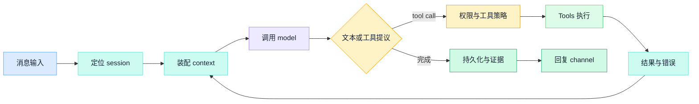
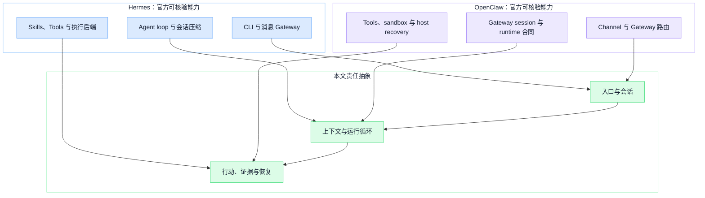
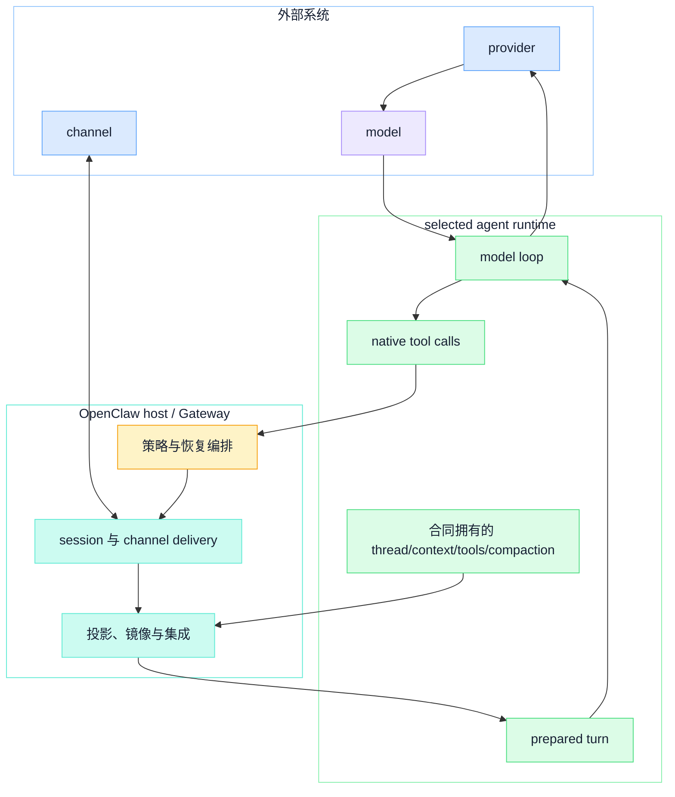

## 一、先定义比较方法

这篇文章不比功能清单，也不按工具数量、渠道数量或社区热度排名。它只回答一个更稳定的问题：一个开源 Agent 运行时，究竟要为哪些长期责任负责。

源稿旧称 `Clawdbot` 仅用于项目更名核验；当前项目名是 OpenClaw。本文以 2026-08-28 读取的 Hermes 与 OpenClaw 官方仓库快照为事实边界，不沿用旧稿中的版本、营销描述或成熟度结论。

文中的证据分为三级：

- **官方文档明示**：项目在 README 或官方文档中定义了能力、状态或责任。
- **公开代码直接证明**：当前快照中可以定位到对应的循环、策略、存储或恢复路径。
- **从公开结构可以推断**：文章为了比较而做的责任抽象，不等于项目内部的组件命名或执行顺序。

还要先分开四个常被混用的概念：

| 层 | 职责 | 不负责什么 |
| --- | --- | --- |
| provider（模型/API 提供方） | 认证、端点、模型发现与请求传输 | 不拥有业务会话和渠道路由 |
| model（模型） | 完成本轮推理，产生文本或工具调用提议 | 不单独执行确定性权限策略 |
| agent runtime（Agent 运行时） | 在 OpenClaw 的当前合同中，接收 prepared turn，驱动 model loop，处理 native tool calls，返回 finished turn | 不自动拥有 Gateway session、channel delivery、平台策略和恢复编排 |
| channel（消息渠道） | 接收与发送平台消息，承载来源和投递目标 | 不决定模型循环、canonical thread 或工具权限 |

对 OpenClaw 还要把 OpenClaw host/Gateway 与 selected agent runtime 分开：前者负责 session 与 channel delivery、策略与恢复编排；后者负责准备好的一轮模型循环。canonical thread、context、tools 与 compaction 由谁拥有，要看所选 runtime 的明确合同；host 通过投影、镜像或集成来连接这些状态，而不是把它们强行重写成同一种内部实现。

这样的 host/runtime 分工，才构成可核验的 ownership boundary。

## 二、共同的运行主线

无论入口是 CLI、桌面客户端还是聊天渠道，两个项目都要处理相同的核心链路：识别会话，装配 context，请求 model，检查工具边界，执行行动，把结果回填上下文，直到返回答案或发生中断。

这是通用责任模型，不是对任一项目内部调用顺序的还原。关键不是“有没有聊天界面”，而是一次行动中的状态、权限、副作用与完成证据由谁拥有。

## 三、context 与 session：不只是聊天记录

Hermes 的官方 README 明示把 CLI 与消息 Gateway 作为入口，并提供跨会话搜索、记忆和上下文压缩。当前公开代码中，`agent/conversation_loop.py` 会恢复或构建 system prompt，保存会话，并在模型窗口压力下调用压缩路径。这些是公开代码可以直接核对的责任。

OpenClaw 的会话文档明确，Gateway 拥有平台 session 状态，直聊、群组、定时任务与 Webhook 按来源路由到不同 session。它的 runtime 文档把 selected agent runtime 收窄为一个 prepared model loop：接收 prepared turn、驱动模型输出、处理 native tool calls，再把 finished turn 交回 OpenClaw。若某个 runtime 合同拥有 canonical thread、context 或 compaction，host 会投影或镜像所需状态，而不是把 Gateway session 与 runtime thread 当成同一个对象。

因此，context 至少包括稳定规则、当前任务状态、会话历史、工具结果与压缩摘要；session 还要回答串行、存储、重置、并发与恢复。缺少独立状态与所有权合同时，长任务容易使这些边界变得不可验证。

## 四、Skills 与 Tools：知道怎么做，不等于被允许做

Hermes 的 `tools/skills_tool.py` 把 Skill 组织成可发现的 Markdown 指令，先列出元数据，再按需加载主文和引用文件。`model_tools.py` 从注册表发现工具，根据会话的 toolset 缩小模型可见与可调用范围。

OpenClaw 的 Skills 文档也把 Skill 定义为包含 `SKILL.md` 的指令包，并说明加载优先级、可见性、环境门禁和会话快照。官方 sandbox 文档同时明确：工具策略决定哪些工具存在并可调用，沙箱决定工具在哪里运行，两者不是一件事。

这个分层很重要：Skills 提供过程知识，Tools 提供带有输入、结果与副作用的行动接口，确定性策略才负责最终放行。一份操作手册不会自动成为授权。

## 五、memory：持久化的是什么

Hermes 的官方入口把记忆、用户信息、历史会话搜索和 Skill 学习放在同一个长期使用故事中。这可以支撑“陈述性信息与过程性方法分开保存”的设计理解，但不能仅凭 README 宣称所有学习结果都经过质量验证。

OpenClaw 的官方记忆文档明示区分稳定用户偏好、精炼长期记忆和日期型工作笔记，再通过 memory tools 与可替换插件做搜索和回忆。它也明确说明，memory 可以保留审批语境，但不能代替硬策略。

两者都提醒我们：会话 transcript、长期 memory 和 Skill 不是同一类状态。它们的写入条件、信任来源、过期方式和删除语义都应分开设计。

## 六、channel 与远程执行：一个是路由，一个是行动

Hermes 的 README 把终端界面与消息 Gateway 列为两类入口；其终端工具公开代码把本地、容器与远程环境放在执行后端边界内。OpenClaw 的 Gateway 和 channel routing 文档则明示，回复回到消息来源，模型不自行选择渠道；连接的 node 另行声明能力和命令。

因而，渠道只负责消息入口、回复路由与平台协议适配。如果一条消息最终触发远程命令、文件修改或浏览器操作，远程执行必须回到运行时的工具与权限边界，而不能因为消息来自“已连接渠道”就自动获权。

## 七、sandbox、permissions 与 recovery：不要把一个开关当成体系

沙箱回答“在哪里执行”，工具策略回答“允许调哪个工具”，参数约束和人工审批回答“这一次具体行动能否发生”。更完整的主体、委托和最小权限设计，见 [Agent 身份与最小权限](../agent-architecture/agent-identity-access-control)。

Hermes 当前公开代码可以证明，终端路径有执行后端和审批检查，工具目录还会按会话授予范围缩小。其 `gateway/session_db_recovery.py` 中的恢复对象是按路径缓存的 SessionDB handle：同一路径采用单飞打开；失败后在后续访问继续尝试；指数退避间隔封顶。这里没有“总重试次数上限”的合同，也不等于证明所有中断工具都能在重启后续跑。

OpenClaw 官方文档明示把 sandbox、tool policy 和 elevated exec 分成不同控制面；host/Gateway 的重启恢复文档还规定哪些会话、投递、后台任务与定时状态持久化，以及副作用结果不确定时如何限制恢复工具。它同时列出了不会恢复的进程内终端等边界，因此不能简化为“重启完全无感”，更不能把恢复编排笼统算成 selected agent runtime 的内部能力。

恢复之前要先把工具分成可重放、幂等、已有完成回执、结果不确定与不可重放。没有这个契约，recovery 可能把一次故障放大成重复副作用。host 与 selected runtime 的集成边界还应暴露中断原因、尝试、工具结果和投递回执，证据模型见 [LLM / Agent 可观测性](../ai-engineering/llm-agent-observability)。

## 八、两个项目的责任映射

下图左右两侧只放官方文档或当前公开代码可核对的事实；中间是为了阅读而做的责任归纳，不声称两个项目的内部实现等价。

从公开结构可以推断：Hermes 将很多工程力量放在一个可从终端或消息入口驱动的长期 Agent 上，而 OpenClaw 更显式地分别声明 host/Gateway 与可替换 runtime 的合同。这个差异是阅读视角，不是优劣结论；它也不表示 Gateway session 与 runtime canonical thread 是等价实现。

本文推断：选择开源 Agent 运行时时，比“已经接了哪些功能”更值得追问的，是会话真相、工具权限、远程路由和失败恢复分别属于谁。

## 九、能力边界如何验收

一个可维护的 Agent 系统不应用一层提示词或一个 runtime 名称包办所有责任。对于 OpenClaw，host/Gateway 与 selected agent runtime 是相邻而非吞并关系；状态所有权由 runtime 合同逐项声明。

这张图只表达当前 OpenClaw 合同：channel delivery 和平台 session 留在 host/Gateway；selected runtime 完成 prepared turn。若所选 runtime 原生拥有 canonical thread、context、tools 或 compaction，host 通过投影、镜像或集成衔接，而不是夺取其内部真相。

实际验收时，可以用以下问题取代产品宣传页：

- provider 或 model 切换后，会话所有权和工具策略是否仍然一致；
- Gateway session、runtime canonical thread 与压缩摘要分别由谁拥有，哪些只是投影或镜像；
- Skills 的可见性、Tools 的可调用性与 sandbox 的执行位置是否分开；
- channel 身份、会话路由与远程节点权限是否能对应到同一次行动；
- host 的恢复编排与 selected runtime 的续跑能力怎样交接，能否识别已完成、可重放、结果不确定和不可重放的副作用；
- 最终回复之外，是否保留了模型路由、工具决策、执行结果和投递回执。

Hermes 和 OpenClaw 提供了两份不同的公开工程样本。真正可迁移的知识不是它们当前的功能多少，而是如何把模型推理、长期状态、可执行能力和可恢复证据组成一个有边界的运行时。

## 参考资料

- Nous Research：[Hermes Agent 官方仓库](https://github.com/NousResearch/hermes-agent)
- OpenClaw：[OpenClaw 官方仓库](https://github.com/openclaw/openclaw)
- Hermes：[SessionDB recovery source](https://github.com/NousResearch/hermes-agent/blob/35328345d5e3b5badc47271bdb8828e1fd2d25f4/gateway/session_db_recovery.py)
- OpenClaw：[Agent runtimes](https://github.com/openclaw/openclaw/blob/468054f93c431bfe192327f439efe325be52f2b4/docs/concepts/agent-runtimes.md)
- OpenClaw：[Agent runtime architecture](https://github.com/openclaw/openclaw/blob/468054f93c431bfe192327f439efe325be52f2b4/docs/agent-runtime-architecture.md)
- OpenClaw：[Agent loop](https://github.com/openclaw/openclaw/blob/468054f93c431bfe192327f439efe325be52f2b4/docs/concepts/agent-loop.md)
- OpenClaw：[Restart recovery](https://github.com/openclaw/openclaw/blob/468054f93c431bfe192327f439efe325be52f2b4/docs/gateway/restart-recovery.md)
