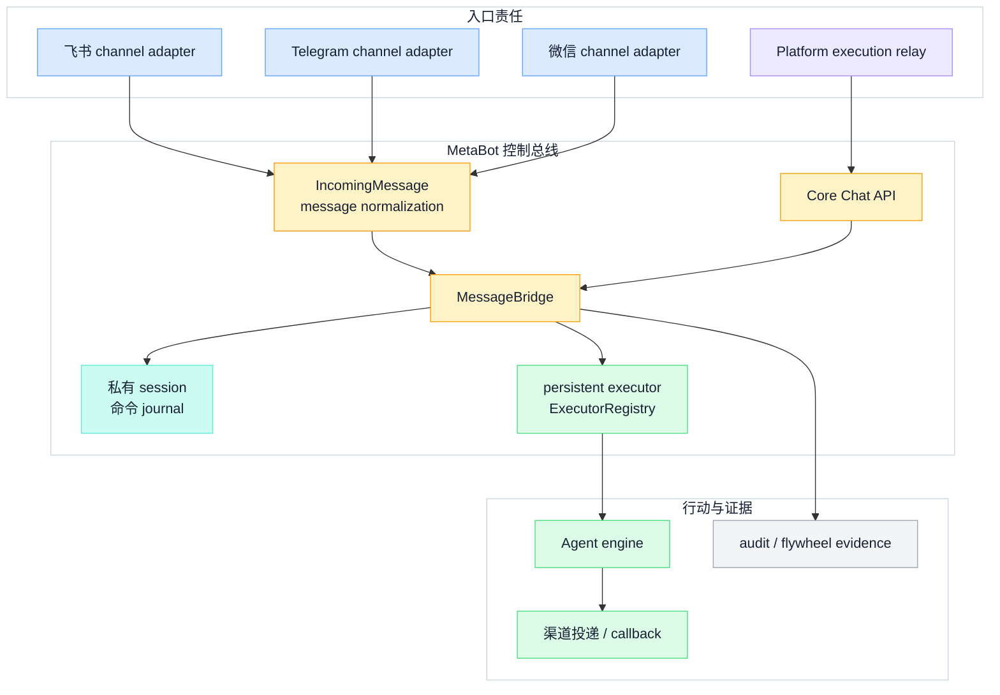
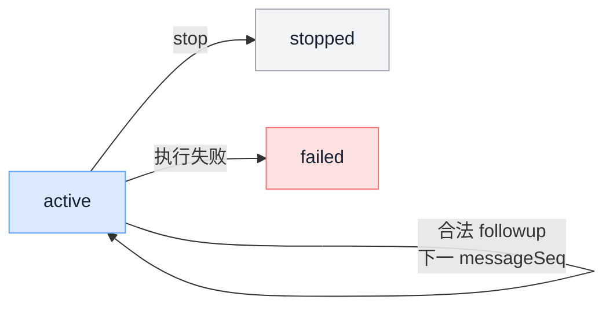
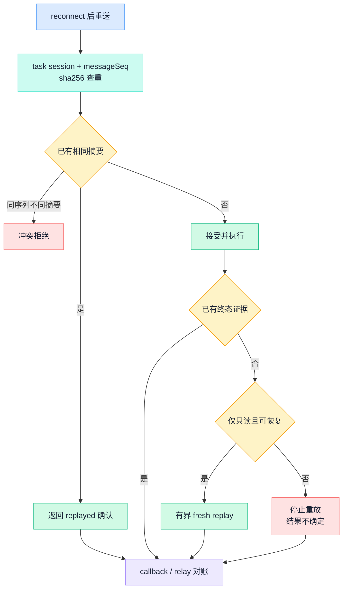

## 一、远程控制不是把聊天消息转发给 Agent

当 Agent 可以读写文件、执行命令和调用外部系统时，从手机或聊天工具发出一句话，已经不是普通聊天，而是一条跨网络、跨会话、可能产生副作用的远程命令。一个可靠的控制总线至少要回答：消息来自哪个渠道，如何进入统一合同，绑定到哪个会话，由谁授权，命令处于什么状态，断线后能否重试，以及什么证据足以宣布完成。

本文不复述通用 Agent loop。运行循环、Skills、Tools 与 sandbox 的共同边界已经在 [Hermes 与 OpenClaw：开源 Agent 运行时的设计边界](open-source-agent-runtime)中展开；更完整的主体与委托模型见 [Agent 身份与最小权限](../agent-architecture/agent-identity-access-control)，证据设计见 [LLM / Agent 可观测性](../ai-engineering/llm-agent-observability)。这里聚焦 MetaBot 的 channel adapter、message normalization、identity/session binding、persistent executor、command lifecycle、idempotency、reconnect、audit 与 remote-control risk。

为了避免把旧设计稿写成现状，本文采用四种明确措辞：

- **当前代码直接证明**：在当前提交的入口、存储、状态转换或恢复代码中可以定位；
- **已提交文档明示**：部署合同或运维文档声明了责任，但不单独证明运行时行为；
- **从当前公开结构可以推断**：根据相邻责任形成的工程抽象，不冒充内部实现；
- **本文推断**：作者给出的设计建议，需要另行实现和验收。

## 二、渠道适配层只负责接入，不负责授予能力

当前代码直接证明，飞书事件入口、Telegram 消息入口和微信轮询入口都把各自协议映射为同一个 `IncomingMessage`：其中包含 `messageId`、`chatId`、`chatType`、`userId`、文本和可选媒体引用。不同渠道支持的消息类型、群聊触发方式和投递能力并不完全相同；“存在适配器”不代表每个渠道都具有同样的卡片、身份、文件或恢复语义。

message normalization 的价值是让后续层面对稳定字段工作：渠道入口负责解析平台事件、清理提及、提取文本与媒体，`MessageBridge` 再处理命令、排队、问题回复、执行与输出。`prompt-normalizer` 只处理特定执行引擎的命令形式，它不是身份归一化器，也不是授权网关。

图中的两类入口不会自动合并身份。渠道消息进入 `IncomingMessage`，Platform 任务则进入 Core Chat 合同；它们可以共用执行总线，却必须保留各自的信任来源。

## 三、身份、会话和授权必须分开

渠道入口能够观察 sender identity，例如渠道分配的用户标识；`SessionManager` 当前以 `chatId` 定位执行会话，并把引擎会话标识、工作目录和少量会话设置持久化。`SessionRegistry` 还提供显式的会话链接记录，但链接动作本身只表达“这些入口继续同一会话”，不能证明操作者属于同一企业主体。

因此要守住两条硬边界：**渠道消息身份 ≠ 平台授权身份**，**会话绑定 ≠ 授权**。群聊成员、渠道 user ID、chat ID、历史 session ID 都不能单独决定工具权限。真正的授权仍应基于平台验证主体、目标 Agent、能力版本、资源范围和本次风险决策。

当前 Platform 代码已经定义最小 `requester_subject`，但 MetaBot collaboration v3 的实际适配器没有给 payload 设置该字段，客户端在构造 collaboration 请求时也没有把它送入 Core Chat 合同。换言之，**当前 collaboration v3 请求没有贯通 Platform 验证主体**。这不是文档措辞问题，而是当前代码边界；在主体真正端到端贯通并验收前，不能宣称 MetaBot 已继承 Platform 授权身份。

## 四、MessageBridge 是协调器，不是事实的唯一所有者

当前代码直接证明，`MessageBridge` 负责接收规范化消息、识别控制命令、维护每个聊天的运行任务和等待队列、调用执行引擎、更新渠道卡片，并发出活动与审计事件。它提供了远程交互的协调点，但其中部分运行任务和队列是进程内状态；进程重启后，不能仅凭旧卡片或旧通知推断当前仍在执行。

Platform relay 入口走 `core_chat_collaboration_v3`。命令包含稳定的任务会话、`messageSeq`、父运行引用和 callback 地址；MetaBot 返回 `accepted` 或 `replayed` 后，Worker 再通过 callback 收集顺序事件并上传 relay。这里必须坚持：**消息确认 ≠ 命令完成**。`accepted` 只表示命令被当前边界接收，`replayed` 只表示相同序列与摘要已被 journal 识别；最终结果仍要等待 terminal event、relay 终态和业务证据。

## 五、persistent executor 维持执行上下文，不承诺副作用连续

当前代码直接证明，Claude 路径的 persistent executor 由 `ExecutorRegistry` 按 `chatId` 管理。注册表负责获取、释放、空闲回收、异常后的恢复入口和会话恢复标识；单个执行器一次只接受一个活动 turn。`SessionManager` 保存可恢复的引擎会话映射，而持久执行器保存当前进程内的 turn、后台活动与交互状态。

这使用户下一条消息可以继续同一个 Agent 上下文，但“会话可恢复”与“外部行动可重放”完全不同。执行器恢复的是模型会话和控制上下文；文件写入、远程 API 调用、工单更新或部署操作的真实结果仍属于目标系统。没有事务标识、幂等键或完成回执时，恢复层无法从 session ID 推导副作用是否发生。

## 六、命令生命周期：持久会话状态与单次运行状态不同

`CoreChatSessionStore` 当前以追加 journal 保存 collaboration 命令。首次合法命令建立 `active` 会话；后续命令必须使用连续的 `messageSeq` 和正确的父运行引用。stop 将会话置为 `stopped`，执行错误可置为 `failed`，两种终态都不能被后续命令复活。

这张图只画代码证明的持久命令会话状态。Core Chat 的单次 run 另外维护 `running`、完成、失败或取消等进程内状态，Platform relay 又维护排队、租约、已派发、运行和终态。成功的 followup 需要继续复用会话，所以“某次运行完成”并不把整个 task session 关闭。

取消也不是一个瞬时事实。取消请求表示上游提出意图；Worker 可能把 stop 送到 MetaBot；MetaBot 的 **stop 回执** 只说明停止请求在该边界得到处理。只有运行终止、relay 对账完成并确认目标系统状态后，调用方才能决定任务最终是取消、失败、中断，还是结果不确定。

## 七、断线恢复先判断事实，再决定是否重放

连接恢复只解决“现在又能通信”，不解决“断线期间命令到底执行到哪里”。因此，**重新连接 ≠ 可以盲目重放**。

当前代码直接证明，命令 journal 会对规范化命令计算 `sha256`，相同 task session 与 `messageSeq` 的相同摘要返回既有记录，不同摘要产生冲突；序列缺口和错误父引用也被拒绝。这是接收侧 idempotency，能够防止同一命令因响应丢失而被当作新命令再次接收。

执行侧恢复更保守。当前 turn recovery 会先检查是否已经恢复出完整终态、是否观察到工具副作用，以及调用方是否正在停止；provider failure 只有在工具效果为只读、没有可用终态答案且错误属于可恢复类别时才允许有界重放。**不确定副作用不得自动重复**，本地写入或外部行动也不能因为“可能幂等”就被当成只读。

图中“有界 fresh replay”只对应当前代码明确允许的窄条件，不是通用重试承诺。渠道 SDK 的自动重连、HTTP 重试、命令幂等和工具副作用幂等是四个不同层次，必须分别验证。

## 八、三层状态必须对账

当前 Platform 与 MetaBot 集成不是一个数据库里的单一状态机，而是三个事实域：

| 状态所有者 | 持有什么 | 不能替代什么 |
| --- | --- | --- |
| Platform | Brain loop、公共 Agent task、delivery、relay job/event、授权与取消意图 | 不能代替 MetaBot 私有 session，也不能宣称目标系统副作用已发生 |
| MetaBot | channel 会话、`SessionManager`、命令 journal、执行器与流式 callback | 不能把渠道身份提升为 Platform 授权，也不能单独决定公共任务所有权 |
| 目标系统 | 文件、代码仓、工单、部署或其他真实业务副作用 | 不会因为上游 ack 自动留下可对账的完成证据 |

把责任写成一句话就是：**Platform 持有公共任务与 relay 状态**，**MetaBot 持有私有会话与执行状态**，**目标系统持有真实副作用**。一次远程任务只有在这三层的标识、顺序、终态和证据能够相互关联时，才具备可解释的 command lifecycle。

当取消、超时或网络响应丢失时，保守流程是：先冻结自动重复，查询 Platform 任务与 relay 事件，再查看 MetaBot journal、运行记录和 callback，最后用目标系统的事务标识或结果证据核对真实副作用。任何一层缺失，都应标记为结果不确定，而不是把“最后看到的状态”冒充全局事实。

## 九、audit 与回执：记录事实，不制造事实

当前代码直接证明，MetaBot 有几类互补证据：结构化 audit 记录任务开始、排队、完成、错误、超时和控制命令；活动事件关联 turn、attempt 与 runtime instance；flywheel envelope 记录消息、run、tool call、结果和 evidence；合成探针 receipt 记录接收、启动、工具完成、文本或文件投递等阶段。

这些记录的用途不同：

- audit 适合回答谁从哪个会话触发了什么控制动作，但其中的 prompt 摘要仍需按敏感数据治理；
- flywheel 适合关联消息、执行、工具与证据，写入失败不应反向控制用户消息处理；
- delivery receipt 只证明某次卡片、文本或文件投递尝试的结果，不证明 Agent 的业务目标已经完成；
- relay terminal event 是公共任务对账依据，仍应携带目标系统可验证的 deliverable、evidence 和 limitation。

完整的字段、采样与保留策略应复用可观测性文章的证据模型，而不是在控制总线里再造一套“日志即真相”的定义。

## 十、remote-control risk 决定它适合用在哪里

远程控制的主要风险不是消息丢了一条，而是低信任入口触发了高权限行动。至少要防范渠道账号被接管、群聊误触发、Prompt 注入扩散、错误会话绑定、密钥泄露、命令重复、取消迟到和敏感结果投递到错误会话。

当前代码中的 bearer API、固定 Bot 策略、队列、会话隔离、恢复判断和证据记录提供了基础控制点，但它们不能合并成“默认安全”的结论。尤其是拥有文件和命令工具的 Agent，仍需确定性的 capability allowlist、参数约束、工作目录隔离、高风险审批、短时凭证和目标系统事务证据。

适用场景是：需要异步通知、跨设备控制、长任务跟进，并且行动边界能够被工具策略与目标系统回执约束的工程任务。不适用场景是：把聊天账号直接当企业授权、把消息发送成功当事务提交，或让不可逆操作在结果未知时自动重放。

从当前公开结构可以推断：MetaBot 最稳定的价值不是“支持多少入口”，而是把渠道协议、私有会话、持久执行和公共 relay 放在可分离的责任边界上。

本文推断：要把这条链升级为更强的企业控制面，优先级应是贯通 Platform 验证主体、为副作用工具定义幂等与查询合同、让取消与未知结果进入统一对账流程，再扩展更多渠道；入口数量不应先于信任与恢复语义。
