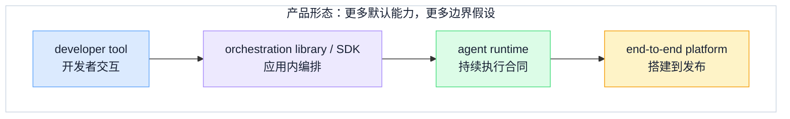
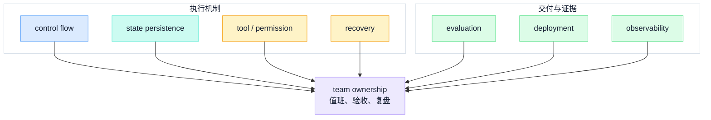
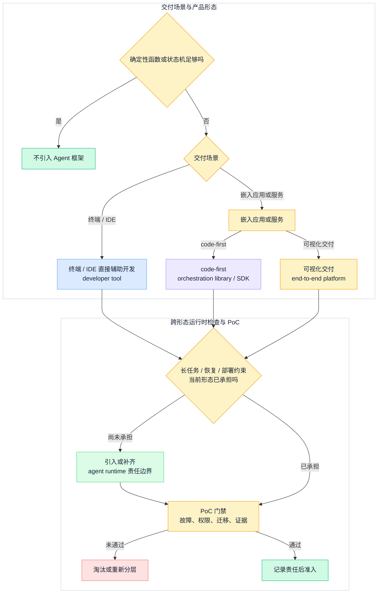

## 一、先问是否需要框架

框架选型常被误写成产品菜单对比。真正的起点应该是：这个问题是否需要 Agent，是否需要框架，以及团队愿意把哪些责任交给外部抽象。

以下情况先用普通函数、队列或状态机：

- 输入、步骤和停止条件都是确定的；
- 一次模型调用加一个受控工具就能完成任务；
- 任务不需要跨轮状态、中断恢复或人工接管；
- 团队尚未定义工具副作用、完成证据和业务错误语义。

只有当模型需要在多步中持续做判断，且状态、工具、恢复和评估已成为稳定的工程问题时，框架才可能降低复杂度。否则，它只是在尚未理清的业务问题外再包一层术语。

## 二、四类产品形态不是同一层的替代品

本文用四类形态建立对话起点。一个产品可以跨越相邻形态；下面的归类只表示截至 2026-08-28 的主要定位和本文把它当作什么样本，不是永久唯一归属。

| 产品形态 | 默认服务对象 | 常见责任边界 | 团队仍需拥有 |
| --- | --- | --- | --- |
| developer tool | 直接操作代码、终端或 IDE 的开发者 | 提供人机交互、本地工具与开发任务循环 | 业务服务、租户、部署、运维与最终审计 |
| orchestration library / SDK | 在代码中组合模型、工具与控制流的应用开发者 | 提供循环、图、交接、事件或状态抽象 | 运行进程、存储、权限、发布和故障响应 |
| agent runtime | 需要持续执行、中断、续跑和工具回路的 Agent | 负责 turn 或 run 的执行语义，可能拥有会话、沙箱或压缩合同 | 业务授权、真实副作用、交付证据和运行环境边界 |
| end-to-end platform | 希望在统一界面搭建、测试、发布和运营 AI 应用的团队 | 提供可视化工作流、知识、插件、发布与平台管理 | 数据边界、企业 IAM、版本管理、可迁移性和平台退出预案 |

这四类形态从专用交互到更完整的交付面，通常带来更多默认能力，也带来更多平台假设。

这不是从低到高的成熟度阶梯。团队可以用编排库构建非常可靠的服务，也可以在端到端平台上做出无法审计的工作流。形态只告诉我们“默认由谁做什么”，不能代替验收。

具体样本可分别阅读 [Claude Code 架构](claude-code-architecture)、[Hermes 与 OpenClaw 运行时](open-source-agent-runtime) 以及 [MetaBot 远程控制总线](metabot-agent-control-bus)。本文不重复它们的内部边界，只把它们当作三种不同形态的工程样本。

## 三、用八维责任取代功能宽表

对每个候选，不要只记录“有”或“没有”，而要写清机制、状态所有者、故障语义和验收证据。核心原则是：**框架提供机制 ≠ 团队责任被外包**。

| 责任维度 | 团队必须回答的可验收问题 |
| --- | --- |
| control flow | 哪些步骤确定，哪些由模型判断；分支、循环、暂停和停止条件能否被测试？ |
| state persistence | canonical state 在哪里；谁负责 schema 演进、并发、隔离、保留和删除？ |
| tool / permission | 工具的主体、参数边界、凭证、审批、副作用与审计由谁确定性执行？ |
| recovery | 进程退出、网络中断或模型失败后，哪些步骤可重放，哪些必须对账？ |
| evaluation | 任务成功用什么证据定义；离线数据集、安全用例和发布回归由谁维护？ |
| deployment | 运行位置、网络、密钥、租户、容量、灰度、回滚和灾备是否满足组织约束？ |
| observability | 能否关联请求、模型、工具、状态迁移、人工介入、成本和最终证据？ |
| team ownership | 产品、应用开发、平台、安全、数据和 SRE 分别对哪些合同值班与复盘？ |

下图不比较产品，它把八个维度收敛到同一个 team ownership 中心，用来防止团队把某个框架名称当成责任人。

如果一个候选的官方文档只覆盖其中几项，并不等于它做错了。它只是告诉团队：剩余责任需要自己实现，或者与另一个运行时、平台产品组合。

## 四、候选集：只按执行日官方边界归类

下表来自 2026-08-28 实际打开的官方页面。页面存在不等于已证明生产可用；官方页面未给出明确 lifecycle 状态时，本文不自行评估成熟度。

| 候选 | 截至执行日的官方定位/显式状态 | 本文主要形态样本 | 必须另行验收的边界 |
| --- | --- | --- | --- |
| [LangGraph](https://docs.langchain.com/oss/python/langgraph/overview) | 官方定位为低层编排框架与运行时，聚焦持久执行、流式输出、人在回路和持久化；页面未给出明确 lifecycle 状态 | orchestration library / SDK，邻接 agent runtime | 持久层选型、状态迁移、业务权限、部署和跨组件观测 |
| [CrewAI](https://docs.crewai.com/index) | 官方以 Agents、Crews 和 Flows 组织协作与编排，Enterprise journey 另列部署、监控和 RBAC；页面未给出明确 lifecycle 状态 | orchestration library / SDK，邻接 end-to-end platform | 开源框架与企业平台的合同分界、状态恢复、权限与数据导出 |
| [Microsoft Agent Framework](https://learn.microsoft.com/en-us/agent-framework/overview/) | 官方明示它是 AutoGen 与 Semantic Kernel 的直接继任者，包含 Agent、Harness Agent、Workflows 与 Integrations；Go 版为 public preview | orchestration library / SDK，邻接 agent runtime | 各语言能力差异，预览范围不写成稳定承诺，团队仍负责质量、安全和第三方边界 |
| [OpenAI Agents SDK](https://developers.openai.com/api/docs/guides/agents) | OpenAI Docs 把它定位为代码优先的 Agent SDK；SDK 运行循环和工具调用，服务器拥有部署、工具实现、状态存储与审批决策；页面未给出明确 lifecycle 状态 | orchestration library / SDK | 自有存储、权限策略、执行环境、恢复语义与发布门禁 |
| [Google ADK](https://adk.dev/) | 旧官方入口重定向 `adk.dev`；当前页面覆盖多语言开发框架、Agent Runtime、部署、观测与评估，未给出统一 lifecycle 状态 | orchestration library / SDK，邻接 agent runtime | 语言与运行面差异、非 Google 环境的部署责任、状态迁移和评估可移植性 |
| [Dify](https://docs.dify.ai/en/home) | 官方定位为开源 AI 应用平台，可搭建 Agent、Agentic Workflow 和 Chatbot，并通过 Web 或 API 发布；可使用云端或自托管，页面未给出明确 lifecycle 状态 | end-to-end platform | 云端与社区版边界、工作流版本化、IAM/审计集成、数据导出和升级回滚 |
| [Coze Studio](https://github.com/coze-dev/coze-studio) | 官方仓库定位为开源一站式可视化 Agent 开发平台；仓库明示公网部署需评估安全风险，且开源版与商业版存在能力差异 | end-to-end platform | 安全加固、版本差异、插件与代码节点边界、二次开发和升级路径 |
| [Claude Agent SDK](https://code.claude.com/docs/en/agent-sdk/overview) | 官方定位为在自有进程中运行 Claude Code agent loop 的 Python/TypeScript 库；托管长任务属于独立 Managed Agents 产品，页面未给出 SDK 明确 lifecycle 状态 | agent runtime，以 SDK 嵌入 | 自托管的进程、沙箱、session 基础设施、认证方式与商业条款 |

这些候选不在同一抽象层。把 Dify 的可视化发布和 LangGraph 的低层状态图放进一个扁平功能表，得到的只是产品面积大小，不是架构适配度。

## 五、锁定成本来自真相状态和团队工作方式

选型不只决定代码怎么写，还决定什么成为系统真相。需要显式评审四类退出成本：

- **数据/状态可迁移性**：会话、checkpoint、memory、工作流图、评估结果和审计证据能否导出，是业务 schema 还是专有内部对象？
- **扩展点**：工具、中间件、Hook、插件、MCP、自定义节点和事件流是否有稳定合同，是否要修改上游内核？
- **运行环境**：代码运行在自有进程、容器、托管沙箱还是平台云上，网络、凭证、数据域和故障域由谁控制？
- **退出成本**：如果上游改变 API、计价、托管区域或产品路线，团队需要重写多少工作流、恢复逻辑、观测和审批接口？

团队所有权也要落到角色：产品负责任务成功定义，应用团队负责业务状态和工具合同，平台团队负责运行面与升级，安全团队负责主体、权限和审计政策，SRE 负责 SLO、故障演练和回滚。如果这张责任表填不出来，就还没到做技术准入的时候。

## 六、从原型到生产：先定义淘汰条件

原型的任务是证明交互和价值，PoC 的任务是暴露责任缺口。候选在任一硬约束上不成立，就应停止扩大投入：

- 无法在需要的数据域或网络边界部署；
- 权限判断只能放在 prompt，危险工具无法按主体、资源和参数收窄；
- 长任务中断后无法识别已完成、可重放和结果不确定的副作用；
- 会话与工作流状态不能版本化、导出或做迁移演练；
- 无法追溯模型、工具、状态、人工介入与最终交付证据；
- 不能用固定评估集和故障注入在升级前重放关键任务；
- 团队无法说明运行事故、框架升级和安全复盘分别由谁接手。

一个有效的 PoC 门禁至少包含：一条代表性业务任务，一次进程退出或网络中断，一次高风险工具拒绝，一次状态导出/导入，一次版本升级回归，以及一份可以从请求追到交付物的证据包。每项都要在实验前写下通过或淘汰标准。

## 七、决策树：先收窄形态，再做 PoC

决策树不输出产品名称。它先判断确定性实现是否已足够，再按交付场景收窄形态：在终端或 IDE 中直接辅助开发，才进入 developer tool；嵌入应用或服务，则继续区分 code-first 编排与可视化交付。长任务、恢复和部署是跨形态检查；它们决定是否需要引入或补齐 agent runtime 责任边界，之后才统一进入 PoC。

通过 PoC 不表示候选从此不会变。准入记录应保留执行日、官方定位、未确定项、实验证据、责任人和退出条件；当这些边界发生变化时，重新跑门禁。

## 八、选型评审清单

- 不用 Agent 框架的方案是什么，为什么不足？
- 候选的主要产品形态是什么，它又跨越了哪个相邻形态？
- 八个责任维度中，哪些由框架提供机制，哪些由团队实现并值班？
- canonical state 、工具副作用和最终交付证据分别由谁拥有？
- 官方文档中哪些是明示状态，哪些只是定位描述，哪些仍不确定？
- 数据/状态可迁移性、扩展点、运行环境和退出成本是否有实验证据？
- PoC 是否真的注入了中断、权限拒绝、状态迁移和升级回归？
- 淘汰条件、例外审批、准入责任人和重新评审触发器是否已写入决策记录？

选型的最终交付物不是一个产品名，而是一份可以被追问的责任合同：团队知道框架帮自己承担了什么，没有承担什么，如何用故障、权限、评估和迁移证据持续验证这条边界。

## 参考资料

- LangChain：[LangGraph overview](https://docs.langchain.com/oss/python/langgraph/overview)
- CrewAI：[CrewAI Documentation](https://docs.crewai.com/index)
- Microsoft：[Microsoft Agent Framework](https://learn.microsoft.com/en-us/agent-framework/overview/)
- OpenAI Docs：[Agents SDK](https://developers.openai.com/api/docs/guides/agents)
- Google：[Agent Development Kit](https://adk.dev/)
- Dify：[Dify Documentation](https://docs.dify.ai/en/home)
- Coze：[Coze Studio official repository](https://github.com/coze-dev/coze-studio)
- Anthropic：[Claude Agent SDK overview](https://code.claude.com/docs/en/agent-sdk/overview)
