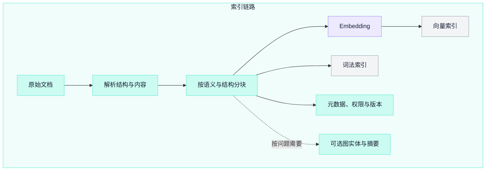
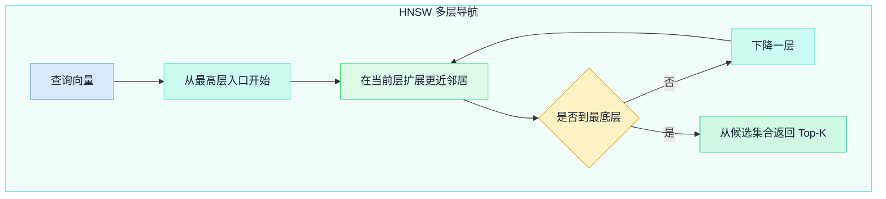
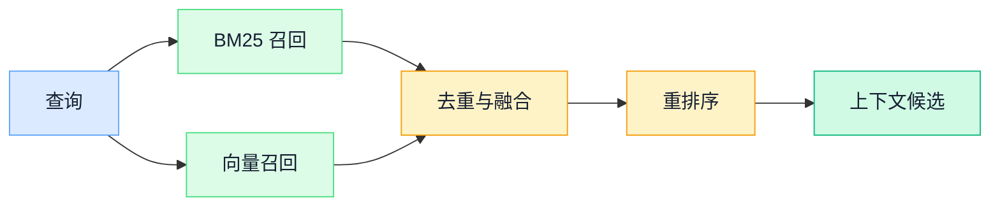

RAG 的价值不是让模型“知道更多”，而是在回答时为模型提供一组可验证、可更新、受权限控制的外部证据。向量数据库只是其中一个检索组件；真正决定效果的是从数据进入索引，到证据进入上下文，再到答案引用来源的完整链路。

一套可靠的 RAG 系统应能回答四个问题：检索到了什么，为什么检索到它，模型依据了哪些内容，原始知识变化后答案何时更新。如果只能展示一段流畅回答，却无法定位证据和失败阶段，它仍是演示，不是知识系统。

## 一、先定义 RAG 的责任边界

RAG 处理的是“从外部知识中找到证据并约束生成”，它并不自动保证事实正确。


每一段都有不同失败方式：

| 阶段 | 典型失败 | 应观察的证据 |
| --- | --- | --- |
| 数据接入 | 文档缺失、解析错误、版本混乱 | 来源、版本、解析结果 |
| 召回 | 正确片段没有进入候选集 | Recall@K、查询与候选 |
| 重排 | 正确片段被噪声压到后面 | 排名变化、相关性标注 |
| 上下文 | 片段冲突、截断、来源丢失 | 最终上下文与 token 预算 |
| 生成 | 无依据扩写、忽略冲突 | 主张与证据的对应关系 |

原始 RAG 研究把参数化生成模型与外部非参数化记忆结合起来。工程系统在此基础上还要补足权限、时效、审计、删除和评估。

## 二、索引链路：先治理数据，再生成向量

### 2.1 文档不是一段匿名文本

进入索引前，为每份知识建立稳定身份和版本：

```yaml
document_id: policy-42
version: 7
source_uri: knowledge://policies/policy-42
title: 差旅审批规范
owner: finance-ops
published_at: 2026-08-20T09:00:00Z
effective_from: 2026-09-01T00:00:00Z
classification: internal
allowed_principals:
  - group:employees
content_hash: sha256:...
```

这些字段不是装饰。它们决定去重、增量更新、访问控制、引用回链和删除传播。只存文本与向量，后续很难解释两个冲突版本哪个有效，也无法证明某个用户是否有权看到结果。

索引任务至少记录解析器版本、分块策略、Embedding 模型与版本、向量维度、索引配置和完成时间。任一关键配置变化，都应能识别哪些数据需要重建。

把这些责任放到同一条“索引链路”中，可以看出向量只是多种派生制品之一；元数据与版本始终跟随文档和分块，可选的图结构只在问题类型需要时生成。



### 2.2 解析质量是检索质量的上限

PDF、网页、表格和扫描件需要不同解析策略。索引前应保留：

- 标题层级、段落、列表和表格边界；
- 页码、章节路径或原始位置；
- 图片说明与可访问的替代文本；
- 文档中的链接和引用关系；
- 解析警告，例如 OCR 置信度低或表格结构丢失。

页眉、页脚和导航噪声会被重复写入大量块，既污染召回，也浪费上下文。解析完成后应抽样比较原文和结构化结果，而不是直接批量向量化。

### 2.3 分块没有通用尺寸

分块的目标是让每个检索单元既能被准确命中，又包含回答所需的最小完整语义。固定 token 数只是基线，不是最佳实践本身。

常见策略包括：

| 策略 | 优点 | 风险 |
| --- | --- | --- |
| 固定窗口 | 简单、吞吐稳定 | 容易切断定义、列表或条件 |
| 结构分块 | 保留章节与段落语义 | 长度分布不均 |
| 父子分块 | 用小块召回、用父块提供上下文 | 存储和映射更复杂 |
| 语义分块 | 可能更贴近主题边界 | 计算成本高，边界不一定稳定 |

重叠可以缓解边界截断，但也会制造重复候选。应使用真实问题集比较块大小、重叠、父子映射和答案质量，而不是照搬固定参数。

每个块应继承文档身份和权限，并带有自己的稳定标识、章节路径、字符或页码范围。这样答案引用才能回到原文，而不是只指向一个无法复现的向量。

## 三、Embedding 与相似度

Embedding 把查询和候选内容映射到向量空间。距离近表示模型认为它们在训练目标下相似，不代表候选一定真实、有效或满足业务条件。

常见度量有：

- 余弦相似度：比较方向，弱化模长影响；
- 内积：同时受方向和模长影响；
- 欧氏距离：比较空间中的几何距离。

度量必须与 Embedding 模型的训练和归一化方式一致。对单位归一化向量，余弦相似度、内积和平方欧氏距离的排序存在确定关系；未归一化时不能随意替换。

选模型时不应只看公开榜单。至少要在自己的语言、文档类型和查询分布上检查：

- 专业术语、编号和缩写能否召回；
- 查询与文档语言不同时表现如何；
- 长短查询、否定和时间条件是否稳定；
- 向量维度、吞吐、延迟与存储成本；
- 模型升级后是否需要全量重建索引；
- 数据能否发送给模型服务，保留策略是否合规。

如果领域数据足够，可以用标注的查询—正例—难负例做适配。但先修复解析、分块和评估集，往往比立刻微调更容易定位收益来源。

## 四、精确搜索与近似近邻索引

### 4.1 精确搜索是重要基线

精确搜索计算查询与全部向量的距离，再选出 Top-K。它的成本随向量数量和维度增长，但能提供近似索引的召回上限。小规模数据、离线评估或高精度场景不应因为“向量数据库”这个名字就默认使用复杂 ANN 索引。

Faiss 把相似度搜索结构统一称为 index，并同时提供精确和近似方法。选择索引时要测量自己的数据、硬件和并发，不能用脱离环境的固定 QPS 表代替基准测试。

### 4.2 IVF：先定位区域，再搜索候选

IVF 先用聚类中心把向量空间划分为多个倒排列表。查询时选择若干相近列表，只在候选区域中搜索。

```text
训练聚类中心
  -> 向量分配到倒排列表
  -> 查询选择 nprobe 个列表
  -> 列表内计算距离
  -> 合并 Top-K
```

探测更多列表通常提高召回，也增加计算。列表数量、训练样本、数据分布和 `nprobe` 必须联合调优。PQ 等量化方法可以压缩向量并加速距离估计，但会引入额外近似误差。

### 4.3 HNSW：用多层邻近图导航

HNSW 为向量建立多层邻近图。高层节点少，适合快速跨越空间；搜索逐层下降，在底层扩展候选邻居。



核心取舍来自图连接度、构建候选宽度和查询候选宽度。更大的搜索范围通常提升召回，也增加延迟；更多连接通常增加内存和构建成本。删除、过滤、持久化和分布式行为取决于具体实现，不能从 HNSW 论文直接推导出某个数据库的全部能力。

### 4.4 选型依据是曲线，不是口号

为候选索引绘制至少三条关系：

```text
Recall@K <-> p50 / p95 / p99 延迟
Recall@K <-> 内存与磁盘占用
写入与重建速度 <-> 查询性能
```

评测要覆盖真实向量分布、过滤比例、并发、冷启动、增量写入和删除。最终选择可能是精确搜索、IVF、HNSW、量化索引，或它们在不同数据层级中的组合。

## 五、为什么生产检索通常是混合链路

稠密向量擅长语义改写，但可能忽略产品编号、错误码、人名或精确版本；词法检索擅长字面匹配，却可能错过同义表达。二者没有固定胜负。

BM25 对词频做饱和处理，并对文档长度进行归一化，是常用的词法排序基线。混合检索分别取得词法与向量候选，再融合排名：



不同检索器的原始分数通常不可直接相加。RRF 使用名次而不是原始分数进行融合：

```text
RRF(d) = Σ 1 / (k + rank_i(d))
```

它简单稳健，但 `k`、各路召回深度和是否加权仍需通过评估确定。如果使用分数加权，应先理解每个分数的分布和校准方式。

业务过滤不只是相关性问题。租户、权限、有效期、地区和文档状态通常是硬约束：

- 能在检索前安全缩小候选集时，优先前置过滤；
- 若索引只能后过滤，要扩大候选并验证结果数量；
- 绝不能先把越权内容交给模型，再期待模型不泄露；
- 缓存键必须包含权限与知识版本相关信息。

## 六、查询理解、重排与上下文组装

### 6.1 查询改写要保留原始意图

缩写展开、拼写纠正、多查询召回和问题分解都可能提高召回，也可能改变含义。系统应保留原始问题，记录每个派生查询，并分别评估它们贡献了哪些候选。

复杂问题可以先识别：

- 实体与精确标识；
- 时间、地域、版本和权限条件；
- 单事实查询还是需要多步证据；
- 是否需要实时系统而不是文档索引；
- 当前知识库是否有能力回答。

对查询改写同样设置预算和停止条件。生成十几个相似查询不一定增加有效召回，却会放大延迟和噪声。

### 6.2 重排负责更贵、更细的判断

召回阶段追求不漏掉正确证据，重排阶段在较小候选集上提高前列精度。Cross-Encoder、专用重排模型或受控的 LLM 评审都可以参与，但必须保留可重复的基线。

重排除了语义相关性，还可能考虑：

- 文档是否在有效期内；
- 来源是否权威且适用于当前主体；
- 片段是否包含回答所需条件，而非只共享主题；
- 候选间是否重复或互相矛盾；
- 用户问题需要单段证据还是证据组合。

模型型重排器有成本和波动，应固定版本、记录输入输出，并对重要查询建立回归集。

### 6.3 上下文不是 Top-K 的直接拼接

最终上下文需要在 token 预算内完成去重、排序和结构化。推荐为每段证据加入不可混淆的边界：

```text
[source_id=policy-42 version=7 section=3.2]
允许报销的交通工具包括……
[/source]
```

组装时要防止一个长文档占满窗口，保留问题所需的相邻条件，并明确呈现冲突版本。引用标识由系统生成并映射到原文，不能让模型自行编造 URL 或页码。

## 七、生成阶段：证据是数据，不是指令

检索到的网页、文档和工单都属于不可信输入，其中可能包含 prompt injection。模型指令应与证据内容分隔，工具权限不能因为某段文档声称“忽略规则”而改变。

生成约束至少包括：

- 只对证据支持的主张给出确定回答；
- 信息不足时明确说明缺口；
- 区分来源事实、模型归纳和建议；
- 每个关键主张关联来源标识；
- 不把检索文本中的命令当成系统指令；
- 高风险领域需要确定性校验或人工复核。

“请勿编造”不能替代验证。返回前可以抽取答案中的原子主张，检查是否有对应证据；对数字、日期、专有名词和否定条件做额外一致性检查。

## 八、GraphRAG 适合什么问题

向量 Top-K 适合寻找局部相关片段，但当问题要求理解整个语料的主题、跨多个实体追踪关系或汇总分散证据时，局部片段可能不足。

Microsoft GraphRAG 的标准索引流程从文本中抽取实体、关系和可选的主张，建立社区并生成分层社区报告。查询侧提供面向整体问题的 Global Search、面向特定实体的 Local Search，以及其他检索模式。

这类结构化索引不是普通 RAG 的免费升级：

- 图抽取与社区报告会增加模型调用和索引成本；
- 实体合并、关系抽取和总结本身可能出错；
- 语料变化后需要考虑图和社区摘要的更新；
- 局部事实问题未必比简单混合检索更适合图方法。

是否采用 GraphRAG，应由问题类型和评估结果决定。对“整个语料的主要主题是什么”和“某实体与哪些事件相关”，可与基线 RAG 做对照；对精确编号查找，词法检索可能仍是更直接的路径。

## 九、评估：沿链路定位问题

### 9.1 先建立真实问题集

评估集应来自搜索日志、客服问题、专家任务和已知失败案例，覆盖：

- 常见问题与长尾表达；
- 精确编号、缩写和同义词；
- 多语言、错别字和口语查询；
- 时间敏感、权限敏感和无答案问题；
- 需要单段、多段或全局归纳的任务；
- prompt injection 与越权诱导。

每个样本要标注期望答案、必要证据、允许来源和无答案条件。只有答案文本，没有证据标注，就难以判断失败发生在检索还是生成。

### 9.2 分层指标

| 层级 | 可用指标 | 需要回答的问题 |
| --- | --- | --- |
| 召回 | Recall@K、命中率 | 必要证据是否进入候选集 |
| 排序 | MRR、nDCG、Precision@K | 正确证据是否排在前面 |
| 上下文 | 证据覆盖、噪声率、冲突率 | 模型实际看到了什么 |
| 答案 | 正确性、完整性、引用准确性 | 回答是否解决问题 |
| 忠实性 | 主张支持率 | 每个主张能否在证据中找到 |
| 系统 | 延迟、成本、可用性、更新滞后 | 生产代价是否可接受 |

LLM-as-a-judge 可以扩展评估规模，但评分提示、模型和样本顺序都可能影响结果。用人工标注集校准评审器，保留盲评，并把高风险错误单独统计，而不是只看一个平均分。

### 9.3 用消融实验判断收益

依次比较这些基线：

```text
词法召回
向量召回
混合召回
混合召回 + 重排
查询改写 + 混合召回 + 重排
结构化或图检索
```

每次只改变少数变量，记录质量、延迟和成本。否则系统增加很多“高级模块”后，即使整体分数变化，也无法知道是谁产生了收益或退化。

## 十、生产运行：知识会变化

### 10.1 更新和删除

文档变更后，需要让旧块、旧向量、词法索引和缓存一起失效。推荐使用版本化写入：新版本完成索引和校验后再原子切换可见版本，并异步清理旧数据。

删除必须沿所有派生数据传播：

```text
原始文档
  -> 解析文本
  -> 分块
  -> Embedding
  -> 向量与词法索引
  -> 图实体与摘要
  -> 查询和答案缓存
```

如果做不到可验证删除，就不能承诺知识已被移除。

### 10.2 可观测性

一次查询至少关联：

- 原始问题、派生查询和权限上下文；
- 各召回器候选、分数和过滤原因；
- 融合与重排后的次序；
- 送入模型的最终上下文；
- 模型、Prompt 和索引版本；
- 答案、引用、耗时、用量和用户反馈。

日志应对敏感内容最小化采集并设置访问与保留策略。可观测不是默认保存所有问题和文档全文。

### 10.3 降级路径

向量服务、重排模型或生成模型不可用时，系统需要明确降级：返回词法搜索结果、只展示来源片段、转人工，或说明暂时无法回答。不能静默绕过权限过滤，也不能在缺少证据时退化为无约束生成。

## 十一、落地顺序

### 阶段一：建立可评估基线

完成文档身份、解析、结构分块、词法检索和一小组人工标注问题。先能从问题回到原文。

### 阶段二：加入向量与混合召回

选择一个适配语言和领域的 Embedding 模型，以精确搜索为质量基线，再评估 ANN 索引与 RRF 等融合方法。

### 阶段三：重排与证据化回答

加入重排、上下文组装、稳定引用和无答案策略，分别评估召回、排序和生成。

### 阶段四：生产治理

补齐权限前置过滤、增量更新、删除传播、缓存失效、观测、安全测试和降级路径。

### 阶段五：按问题增加复杂能力

只有当基线在多步、全局或关系问题上出现清晰瓶颈时，才增加查询分解、图索引或其他专用检索，并用消融实验验证收益。

## 十二、评审清单

### 数据与索引

- [ ] 文档是否有稳定 ID、版本、来源、所有者和权限？
- [ ] 解析结果是否抽样对照原文？
- [ ] 分块参数是否由真实问题集验证？
- [ ] Embedding、索引和解析器版本是否可追溯？
- [ ] 更新与删除是否传播到全部派生数据？

### 检索与生成

- [ ] 是否保留词法或精确搜索基线？
- [ ] ANN 是否用 Recall—延迟—成本曲线评估？
- [ ] 权限和有效期是否在模型看到内容前执行？
- [ ] 最终上下文是否去重、保留边界并控制冲突？
- [ ] 关键主张是否能映射到真实来源？
- [ ] 无证据、冲突和服务故障时是否有明确行为？

### 评估与运行

- [ ] 问题集是否覆盖长尾、无答案、越权和注入攻击？
- [ ] 能否区分召回失败、排序失败和生成失败？
- [ ] 模型、Prompt 或索引变化是否触发回归评估？
- [ ] 延迟、成本、更新滞后和高风险错误是否单独统计？

RAG 不是“Embedding 加向量库加 Prompt”的固定配方。它是一条证据流水线：数据要有身份，检索要有基线，排名要能评估，上下文要保留来源，生成要受证据约束，知识变化要能传播。把每个阶段都变成可观察、可比较、可回滚的工程对象，RAG 才真正提高组织知识的可用性。

## 参考资料

- Lewis 等：[Retrieval-Augmented Generation for Knowledge-Intensive NLP Tasks](https://arxiv.org/abs/2005.11401)
- Malkov、Yashunin：[Efficient and Robust Approximate Nearest Neighbor Search Using Hierarchical Navigable Small World Graphs](https://arxiv.org/abs/1603.09320)
- Meta AI：[Faiss Documentation](https://faiss.ai/)
- Thakur 等：[BEIR: A Heterogeneous Benchmark for Zero-shot Evaluation of Information Retrieval Models](https://arxiv.org/abs/2104.08663)
- Cormack、Clarke、Buettcher：[Reciprocal Rank Fusion Outperforms Condorcet and Individual Rank Learning Methods](https://doi.org/10.1145/1571941.1572114)
- Microsoft Research：[GraphRAG Documentation](https://microsoft.github.io/graphrag/)
