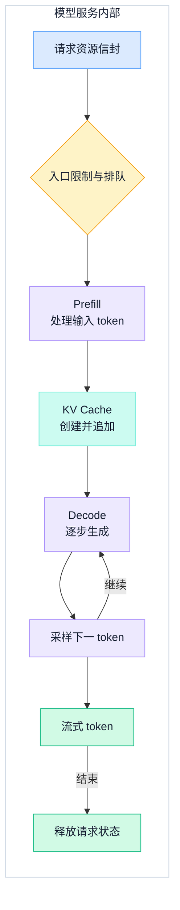
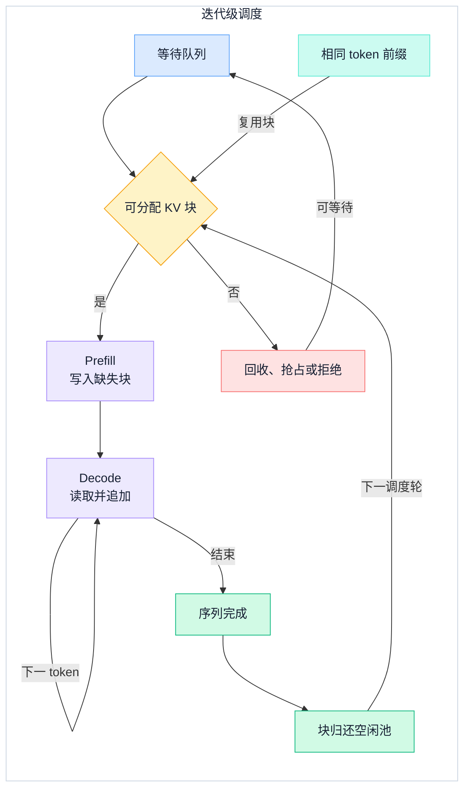
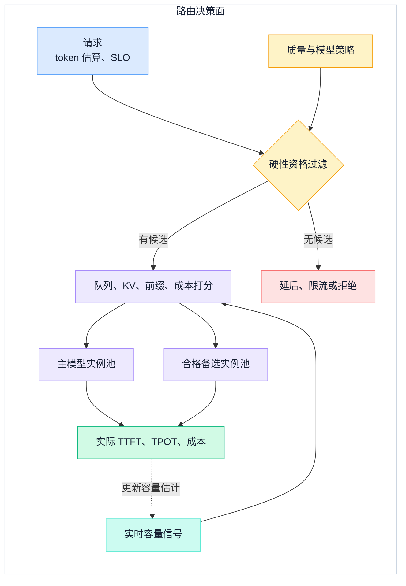

## 一、先把推理服务写成可验收的契约

一个模型能被加载，不等于它已经成为推理服务。生产系统还要在流量波动、输入输出长度变化和资源有限时，持续回答三个问题：什么时候开始返回，之后以什么速度生成，每个可交付 token 消耗多少容量与成本。

本文从模型服务边界开始。上游如何做应用请求编排、RAG、工具调用、Prompt 组装与输出验证，见[LLM 应用系统架构](../foundations/llm-application-system-architecture)。这里只接收已确定的模型策略、token 序列、截止时间和质量约束，追踪它们在排队、显存和执行引擎中的数据路径。

推理 SLO 不应只写一个“平均延迟”。至少分开以下指标：

| 指标 | 回答的问题 | 典型风险 |
| --- | --- | --- |
| TTFT（Time to First Token） | 请求从到达到首 token 用了多久 | 排队或长输入 Prefill 抬高首包等待 |
| TPOT / ITL | 进入生成后，输出 token 之间的间隔如何 | 大 Prefill 批次或资源竞争造成卡顿 |
| 端到端延迟 | 完整输出何时结束 | 输出长度分布的长尾被平均值遮住 |
| 输入 / 输出 token 吞吐 | 单位时间实际处理多少工作 | 只报请求数，忽略长度差异 |
| SLO goodput | 有多少工作在延迟与质量门槛内完成 | 用超时输出虚增吞吐 |
| 单位成本 | 每个有效输出 token 分摊多少运行成本 | 只看峰值算力，忽略空转和拒绝 |

指标还必须带分位数、流量类型和时间窗口。短输入长输出与长输入短输出的负载，即使请求数相同，也会制造完全不同的瓶颈。

## 二、Prefill 与 Decode 是两种不同的负载

自回归生成不是一次完整的前向计算，而是两个性质不同的阶段：

- **Prefill** 处理输入 token，建立每层注意力需要的 Key/Value 状态。一次能处理多个 token，通常更能使用并行计算能力，输入长度直接影响 TTFT。
- **Decode** 在已有状态上逐步生成新 token。每步要读取模型权重与已缓存状态，并把新 Key/Value 追加进缓存；单请求每步工作较小，更容易受内存带宽和批次规模影响。

因此，“这台机器每秒能处理多少请求”不是稳定容量指标。服务端至少要知道估算输入 token、最大输出 token、截止时间和对应模型构建，才能在入队前判断是否还有资源。

下图只画模型服务内部的主数据路径，将首 token 之前与之后的工作明确分开。



图中的流式返回与内部执行可以重叠，但不能混淆度量：TTFT 在第一个 token 离开引擎时结束，TPOT 则持续到请求完成。缓存不在连接断开时自然消失，引擎还要明确终止、抢占和释放语义。

## 三、连续批处理的本质是逐步调度

静态批处理等整批请求都完成再换下一批。当输出长度不同，短请求完成后的位置不能及时被复用，整批还会被最长序列拖住。

连续批处理把调度点移到每次模型执行迭代：已结束序列离开，等待请求填入可用位置，未结束序列继续生成。这会减少空泡，但并不意味着批次越大越好。

调度器每个迭代都在分配三种希缺资源：

1. 本轮可处理的 token 预算；
2. 可容纳活动序列的 KV Cache 块；
3. 请求的时间预算，包括 TTFT 与已在生成请求的 TPOT。

一个大 Prefill 可以占用整轮计算，让正在 Decode 的序列出现明显间隔。将长输入分块只是一种候选手段：它能控制单轮工作量，也会增加调度和中间状态复杂度。是否采用，应由真实输入长度和抖动数据决定。

### 3.1 排队是延迟的一部分

排队时间不应被包进“模型慢”这个模糊结论。至少分开到达后等待、Prefill、首 token 后生成和结束清理的时间。如果排队长度持续增长，系统已经超过可持续容量；继续无限接收只会把明确拒绝变成集体超时。

入口限制应在入队前估算资源信封，并支持有界队列、截止时间、租户或业务等级配额、过载拒绝与可观察的重试提示。公平不是每个请求占一个位置；长序列对 token 预算和缓存的占用远大于短序列，配额应反映实际工作量。

## 四、KV Cache 是容量账本，不只是加速开关

Decode 之所以不需要反复计算全部历史 token 的 Key 和 Value，是因为它们被保存在 KV Cache 中。代价是缓存会随“并发序列数 × 每条序列已缓存 token”增长。

对常见 Transformer 结构，可用下式做粗略账本：

```text
单 token KV 字节
≈ 2 × 层数 × KV head 数 × head 维度 × 每元素字节数

活动 KV 字节
≈ Σ(每条活动序列的已缓存 token 数) × 单 token KV 字节
```

具体实现还会受模型的注意力结构、并行切分、缓存精度、页块元数据和对齐影响。它适合容量预算，不能取代对实际引擎的显存剖析。

### 4.1 分页管理解决动态分配问题

若按每条请求的最大序列长度预留连续空间，短请求会留下大量未用区域，不同生命周期又会制造碎片。PagedAttention 的核心是把每条序列看到的逻辑块映射到非连续物理块，只在需要时分配新块，并能通过引用计数和写时复制共享已有块。

分页减少了连续预留与外部碎片，但没有让缓存变成无限：末尾块仍可有内部空闲，块表和调度也有开销。页块大小必须在碎片、元数据、内核效率和复用粒度之间实测，不存在适用所有模型的固定值。

### 4.2 前缀缓存只省掉重复输入计算

当多个请求在同一模型构建上具有完全相同的 token 前缀，引擎可复用对应缓存块，跳过这一段 Prefill。复用键必须绑定实际 token、模型与影响计算的配置，而不是用一个原始字符串做模糊匹配。

前缀命中能降低共享部分的 Prefill 时间，但不会让新 token 的 Decode 变快。如果输出很长、前缀重复少，或缓存为保留冷前缀而挤压活动请求，它反而可能没有净收益。要同时观察命中 token 数、被跳过计算、保留字节和驱逐压力。

下图把连续批处理和缓存放进同一个状态机：批次位置会反复复用，而每条序列的块有独立生命周期。



这个状态机提醒一个容易被忽略的事实：“最大并发数”不是独立开关。同样数量的活动序列，可以因已缓存 token、前缀命中率和结束长度而占用截然不同的显存。

## 五、量化与投机解码优化的是不同瓶颈

### 5.1 量化先改变存储与带宽账本

量化用较低精度表示权重、激活或 KV Cache。它们是三个不同决策：只压缩权重可以减小模型常驻内存，却不会按同样比例扩大 KV 容量；压缩 KV 会影响长序列与并发容量，也对注意力数值误差更敏感。

更少字节不自动等于更低延迟。收益取决于引擎是否有匹配的高效内核、硬件是否支持该数据路径、反量化或 scale 处理开销，以及当前负载是计算受限还是带宽受限。每种精度都要在同一评测集上比较任务质量，并在目标硬件上重新测量 TTFT、TPOT、吞吐与峰值内存。

### 5.2 投机解码用额外工作换取更少串行步数

投机解码先由较便宜的提议器生成多个候选 token，再由目标模型在一次前向计算中验证。被接受的候选可以减少目标模型的串行 Decode 步数；候选被拒绝时，系统按目标分布继续生成。符合算法条件的验证可保持目标分布，但浮点数值、批处理和实现细节仍可影响逐 token 可复现性。

净收益大致由四个因素决定：候选接受长度、提议器成本、目标验证成本、当前批次的并行利用率。它更可能在中低请求率、内存带宽受限且接受率足够高的负载上改善交互延迟。在已经饱和的高吞吐批次中，额外的提议器、缓存和验证并不免费。

因此不要带着一个通用加速倍率上线。监控至少包含每个位置的接受 token 数、平均接受长度、提议与验证耗时、TPOT 和整体吞吐；只有在相同质量契约下净收益为正，才应保留。

## 六、路由先筛可用模型，再在资源信号中选择

推理路由有两个层次。第一层是资格：候选模型构建必须满足上游传入的质量等级、上下文上限、模态、数据位置和数值精度约束。不合格模型不应因为便宜或空闲而进入后续打分。

第二层才比较实时信号：等待 token、最老请求年龄、活动序列数、KV 空闲块、前缀命中潜力、模型是否已预热，以及在当前容量下的边际成本。路由结果要带决策原因，便于解释延迟突变和质量降级。

对同一模型的多个副本，纯粹选最短队列可能破坏前缀局部性，只按缓存命中路由又可能造成热点。实用策略通常在缓存亲和、排队延迟和 KV 余量之间设置上限与权重，并在过载时将保护引擎放在最高优先级。

下图将稳定的质量契约与变动的运行信号分开，避免把路由写成一串无法验证的关键词规则。



图中“无候选”是正常结果，不是异常逃生口。备选模型只有在同类请求的评测门槛内才能代替主模型；否则应明确延后或拒绝，不能用更快但不合格的输出粉饰可用性。

### 6.1 Prefill / Decode 分离是可选的扩展方式

统一引擎简单且没有 KV 跨池传输，但大 Prefill 与持续 Decode 会争用同一调度周期。当两阶段的流量比例和资源需求长期不对称时，可以把它们放到独立实例池，分别扩展并由路由器衔接。

分离的代价是新的数据面：Prefill 产生的 KV 必须传到 Decode 实例，因而引入带宽、缓冲区、定位、超时和失败恢复问题。只有当分阶段的 SLO 与容量收益超过传输成本和运维复杂度时，这种架构才值得保留。

## 七、容量测算要同时看内存、计算和排队

容量不是一个从硬件规格表中查出的常数。一个可复现的容量流程应从真实轨迹开始：

1. 分别统计输入 token、输出 token、到达间隔、共享前缀和质量等级的分布，保留峰值时段与长尾。
2. 先给模型权重、引擎工作区、通信与安全余量留出显存，剩余部分才是 KV 预算。
3. 由每 token KV 字节与长度分布计算内存上限，再用实测批次曲线找出计算或带宽上限。
4. 用开环到达测试排队稳定性，同时用闭环测试观察用户等待影响；不能只让下一个请求等上一个完成。
5. 在预期 SLO 下找到最大稳定 goodput，再为故障、发布、突发和估算误差留出余量。

可用一个简化不等式做评审起点：

```text
活动序列 KV 需求
+ 权重
+ 运行时工作区
+ 安全余量
≤ 可用设备内存
```

通过这个内存门槛，仍只能说“放得下”。还要证明在给定到达率下，队列不会无界增长，TTFT 和 TPOT 分位数不越界。当平均在系请求数为 `L`、实际完成率为 `λ`、平均在系时间为 `W` 时，稳态下的 `L = λW` 能帮助检查测量是否自洽，但不能用平均值代替长尾压测。

## 八、优化要在延迟、吞吐、质量与成本之间对账

推理优化很少在所有维度同时变好。评审时可把每项改动写成一行可证伪假设：

| 改动 | 期望收益 | 必须同时观察 |
| --- | --- | --- |
| 提高每轮 token 预算 | 增加批并行度与吞吐 | TTFT、TPOT 抖动、队列年龄 |
| 启用前缀复用 | 降低重复输入的 TTFT | 命中 token、保留字节、驱逐与租户隔离 |
| 降低权重精度 | 减小常驻内存和带宽 | 任务质量、内核支持、真实延迟 |
| 降低 KV 精度 | 扩大长序列或并发容量 | 注意力数值误差、转换开销 |
| 启用投机生成 | 在合适负载下降低 TPOT | 接受长度、额外显存、饱和吞吐 |
| 强化缓存亲和路由 | 提高前缀命中 | 热点、队列不均、故障转移 |

单位成本的分母必须是真正有效的工作，而不是引擎曾经计算过的所有 token。一个实用口径是：

```text
每有效输出 token 成本
= (加速器租用 + 主机与传输 + 闲置容量 + 失败重算)
  / 在 SLO 内完成的输出 token
```

这会让一些看似高吞吐的结果回归现实：过大批次可能增加总 token/s，却让更多请求超过延迟预算；激进量化可能提高容量，却让模型跌出质量门槛。只有 SLO goodput 与质量不退化时，成本下降才是有效优化。

## 九、上线前检查清单

### 服务契约

- [ ] 是否分开了 TTFT、TPOT、端到端延迟、token 吞吐与 SLO goodput？
- [ ] 每个指标是否带分位数、负载类型和统计窗口？
- [ ] 输入 token、输出 token、截止时间和质量等级是否在入队前可用？

### 调度与过载

- [ ] 队列是否有界，并能区分排队、Prefill 与 Decode 耗时？
- [ ] 连续批处理是否同时限制活动序列、每轮 token 与 KV 预算？
- [ ] 长输入、长输出和突发流量是否有公平、拒绝与恢复语义？

### 缓存与优化

- [ ] 是否用模型结构与缓存精度计算每 token KV 字节？
- [ ] 是否观察缓存分配、驱逐、重算、前缀命中 token 和污染风险？
- [ ] 量化和投机解码是否在目标硬件、真实轨迹与代表性质量集上比较？

### 路由、容量与成本

- [ ] 路由是否先做硬性资格过滤，再看队列、KV、缓存局部性与成本？
- [ ] 备选模型是否在同类流量上通过相同质量门槛？
- [ ] 容量测试是否覆盖开环到达、冷启动、峰值、故障和发布余量？
- [ ] 单位成本是否包含闲置、失败重算和超出 SLO 的无效工作？

LLM 推理服务的核心不是选一个运行时名字，而是建立可对账的资源循环：请求按 token 工作量入队，Prefill 与 Decode 获得与其负载特性匹配的调度，KV Cache 从分配到释放都可见，优化与路由同时受 SLO 和质量约束，容量以稳定 goodput 而非短时峰值验收。

当这些账本能在同一流量轨迹上重放，团队才能说清一次更改究竟减少了计算、降低了缓存压力，还是只把延迟从一个队列搬到了另一个队列。

## 参考资料

- Kwon 等：[Efficient Memory Management for Large Language Model Serving with PagedAttention](https://arxiv.org/abs/2309.06180)
- vLLM 项目：[Official Documentation](https://docs.vllm.ai/)
- NVIDIA：[TensorRT-LLM Architecture Overview](https://nvidia.github.io/TensorRT-LLM/architecture/overview.html)
- SGLang 项目：[Official Documentation](https://docs.sglang.ai/)
