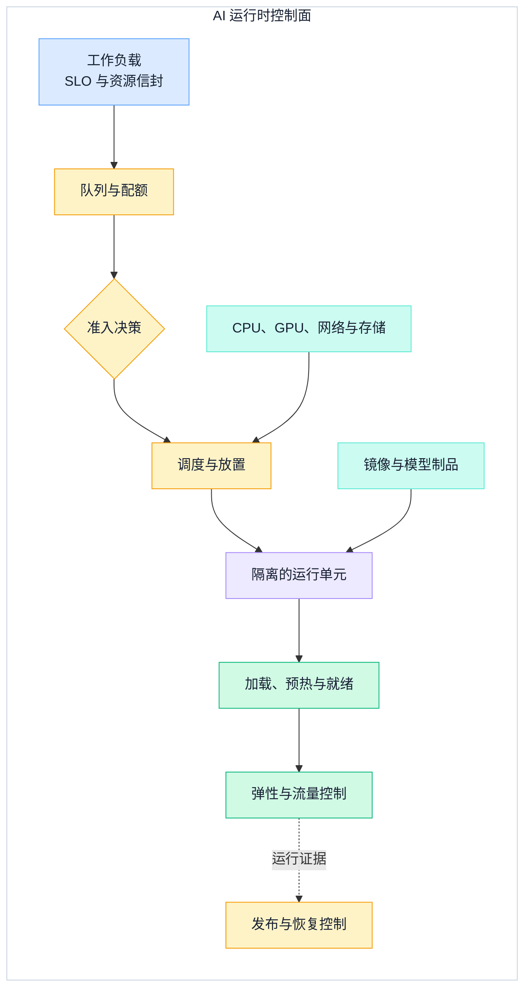
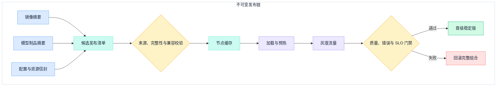
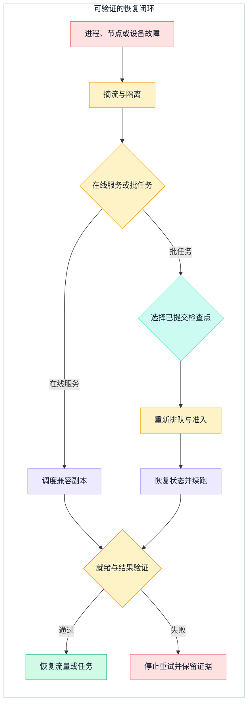

## 一、AI 工作负载为何不能照搬普通无状态服务

普通服务的运行单元往往由镜像、配置和少量启动时间决定；AI 工作负载还要同时绑定异构设备、模型制品、较长的加载与预热过程，以及可能跨多实例协同的网络路径。一个容器成功启动，只能证明进程存在，不能证明模型已加载、设备可用、版本相容，更不能证明它已经具备接流量或恢复任务的条件。

因此，AI 云原生运行时要回答的不是“怎样安装 Kubernetes”，而是六个更窄的问题：工作量如何声明，稀缺设备如何暴露，谁能进入队列，模型制品怎样到达节点，实例何时可接流量，以及中断后从哪里继续。Kubernetes 提供声明式收敛与 Pod 到节点的匹配机制；Kueue 把配额消费前的等待、准入和抢占显式化；KServe 展示了模型生命周期、版本跟踪与灰度发布的控制面边界。平台仍需把这些能力组织成一条可验收的运行链。

本文不展开模型服务内部算法。Prefill、Decode、连续批处理、KV Cache 与投机解码的资源机制，见同分类的[LLM 推理服务工程](./llm-inference-serving-engineering)；这里把模型服务当作需要被打包、放置、扩展、发布和恢复的运行单元。

下图先划定运行时的责任分层。它不是组件清单：每一层都必须给下一层提供可验证的状态，而不是只提交一个对象后等待奇迹发生。

这条链的验收点依次是：资源能否被准确表达、等待是否有界、放置是否满足约束、制品是否可验证、实例是否真正就绪，以及变更和中断能否回到已知状态。只看副本数会遗漏其中大部分风险。

## 二、先写计算、显存与网络的资源信封

CPU 与 GPU 不是两种可互换的“核数”。CPU 常承担入口解析、数据预处理、压缩、制品校验和控制逻辑；GPU 等加速设备承担特定计算，并受设备内存、互联和驱动兼容约束。即使主计算落在 GPU，CPU 不足也会让数据准备和请求处理成为瓶颈；设备数量足够，也不代表单个模型、运行时工作区与并发状态一定放得进显存。

Kubernetes Device Plugin 的作用是让 GPU、NIC、FPGA 等需要特定初始化的设备向 kubelet 注册并成为可请求的扩展资源。官方文档明确指出，这类扩展资源按整数计数，不能超配，设备也不能在容器之间直接共享。这个抽象解决了“节点有哪些设备、工作负载申请几个”的问题，却不会自动表达设备内存、互联拓扑、模型是否装得下或共享策略是否安全。

因此，一个可调度的 AI 资源信封至少应包含：

- CPU、主机内存与临时存储的基线和峰值；
- 加速设备类型、数量，以及运行时能够验证的内存和兼容条件；
- 单机还是多实例协同，允许的故障域与网络带宽等级；
- 镜像、模型和检查点的拉取量，节点缓存命中或未命中时的启动预算；
- 在线服务的就绪期限，或批任务的最大排队、运行和检查点间隔。

资源请求必须来自目标模型和真实轨迹的测量，而不是从硬件目录推导一个固定利用率。平台可以为资源信封提供模板，但每个模型构建仍要在目标设备上证明“放得下、启动得了、跑得稳”。

## 三、把排队、准入与节点调度分成三次决策

Pending Pod 会进入 kube-scheduler 的调度队列，但这不等于平台已经有具备租户配额、公平和取消语义的工作负载级队列。真正的工作负载级队列还要记录等待顺序、优先级、所需资源规格和等待时间。对 Kueue 管理的工作负载，准入决定何时可以开始创建 Pod，随后才由 kube-scheduler 完成 Pod 到节点的放置；未纳入 Kueue 管理的普通 Pod 不经过这层准入。

Kueue 的官方边界正是管理配额如何被工作负载消费，并决定等待、准入或抢占。它不替代 kube-scheduler 的 Pod 到节点放置，也不接管任务生命周期。把职责分开后，平台可以避免两种常见失真：队列看到空配额却忽略实际节点供给，或调度器反复处理注定无法同时获得整组资源的工作负载。

一次准入评估应同时检查：

1. 租户与业务优先级是否有可消费配额；
2. 请求的资源规格是否存在可行供给，而不只是总设备数相加；
3. 多实例任务是否需要整组资源同时就绪；
4. 制品和检查点的数据位置是否会把启动时间推过期限；
5. 抢占是否能释放足够资源，以及被中断任务是否具备可恢复检查点。

隔离也在这里落地。配额隔离防止一个租户吃完稀缺设备；节点和运行时隔离限制故障与性能干扰；网络、存储和缓存边界防止模型或中间制品跨租户泄漏。优先级不是绕过隔离的通行证，抢占也必须留下原因、受影响对象和恢复位置。

## 四、镜像与模型制品必须分开版本化

把数十或数百 GB 的模型权重塞进应用镜像，看似得到一个文件，实际把引擎升级、依赖修复与模型迭代绑成同一条慢发布链。反过来，只写一个可变模型路径，又会让相同部署声明在不同时间加载不同内容。更稳妥的做法是把运行时镜像与模型制品分别设为不可变输入，再用一个发布清单将它们绑定。

一个发布单元至少要钉住：运行时镜像摘要、模型权重与分词器等制品摘要、推理配置、接口契约、资源信封、兼容性结果和回滚目标。标签可以供人阅读，摘要才用于重现。制品进入运行环境前应校验来源、完整性和授权，加载后还要通过最小推理与资源健康检查；文件下载完成不等于版本可服务。

### 4.1 节点缓存是加速层，不是事实来源

节点缓存能缩短重复加载路径，也能避免并发副本重复拉取同一模型，但它必须允许被删除和重建。缓存键应绑定制品摘要及会改变加载结果的格式版本；写入应先落到临时位置，校验完成后再原子地提升为可见版本，避免其他实例读到半成品。

缓存控制还要覆盖容量上限、并发下载合并、最近使用信息、驱逐优先级和损坏隔离。发布期间可以暂时固定当前版与上一稳定版，为灰度和回滚保留热路径；空间不足时宁可回到受控的制品源，也不能把一个过期但同名的目录当作命中。

## 五、弹性要围绕“可服务容量”，不是容器数量

AI 实例从创建到可服务，通常要经历节点供给、镜像准备、模型制品下载、设备分配、模型加载、预热和就绪检查。扩出一个尚未加载模型的副本不会增加容量；在长冷启动期间继续接收流量，只会把资源不足伪装成排队和超时。

弹性控制应组合观察入口队列年龄、已准入工作量、实际就绪容量、设备内存压力、模型加载时间和服务 SLO，并把冷启动提前量纳入决策。在线服务需要有界排队和过载拒绝；批任务更适合通过准入节流等待。两者可以共享设备池，但不能共享同一种“看到 CPU 高就加副本”的规则。

缩容也不是简单删除空闲实例。控制器应先停止新流量，等待在途请求进入可终止点，再释放设备和缓存引用。批任务若没有最新检查点，缩容或抢占会把已完成计算变成重算成本；在线实例若持有会话状态，则需先证明状态已外置或请求可重放。弹性策略的验收指标应是稳定的可服务容量与恢复代价，而不是峰值副本数。

## 六、灰度发布要绑定完整制品，而不是只换模型名

KServe 官方说明把模型生命周期、版本跟踪、灰度发布和 A/B 测试放在控制面，并用数据面承接标准化请求。平台可以采用这一责任边界，但发布门禁仍需由自己的质量、性能与恢复契约定义。

下图只画制品到流量切换的路径。调度已经在上一节完成，失败恢复则留给下一张图，避免把三种控制循环混成一幅全景。

灰度门禁不能只看进程存活或 HTTP 成功。至少要比较模型加载成功率、业务质量样本、错误与超时、延迟分位数和资源余量，并明确观察窗口与自动停止条件。回滚时应切回上一版“镜像 + 模型 + 配置 + 资源信封”的完整组合；只回滚模型，可能让它落在不兼容的引擎或配置上。稳定流量恢复后再清理失败候选，便于保留诊断证据。

## 七、检查点让故障恢复从重启变成续跑

控制器可以重建运行单元，却无法凭空重建设备内存中的计算进度。对长时间训练、微调或批推理任务，检查点必须是业务状态的一部分：模型和优化状态、数据读取位置、随机状态、分片与并行布局，以及恢复所需的代码和配置版本，都要能在任务中断后重新解释。

检查点应写入独立于故障节点的持久位置。写入过程先生成带摘要的候选，再以清单或提交标记声明完整，恢复端只选择已提交且兼容的版本。保存频率在持久化开销与最大重算窗口之间取舍；平台应按实际写入时间、失败频率和任务价值设置，而不是规定一个通用分钟数。

在线推理通常不恢复某个进程的设备内存，而是恢复服务容量和请求语义：将故障实例移出流量、补充兼容副本，并由上游依据幂等键、截止时间和已返回结果决定是否重试。批任务则从最近可用检查点重新取得配额和设备。两类工作负载共用故障检测与制品校验，但恢复点不同。

下图单独画恢复流程，强调“重启成功”之前还有故障分类、检查点选择和重新准入，之后还有结果一致性验证。

重试必须有预算和停止条件。若同一制品在多个健康节点上重复加载失败，应优先隔离候选版本，而不是不断换节点；若检查点校验或版本兼容失败，应回退到更早的已提交点，或明确进入人工处置。每次恢复都应记录故障类别、被隔离资源、使用的制品和检查点摘要、重算范围与最终验证结果。

## 八、平台团队落地清单

### 资源与调度

- [ ] 每个工作负载是否声明 CPU、主机内存、设备、存储、网络和启动期限？
- [ ] Device Plugin 暴露的设备计数之外，是否另行验证显存、拓扑和兼容条件？
- [ ] 排队、配额准入和节点调度是否是可观测、可解释的独立决策？
- [ ] 抢占是否只发生在有检查点或可安全重试的工作负载上？

### 制品与隔离

- [ ] 镜像、模型制品、配置和资源信封是否由不可变摘要绑定？
- [ ] 节点缓存是否可重建，并具有校验、原子提升、容量与驱逐策略？
- [ ] 租户配额、运行时权限、网络、存储和缓存边界是否同时生效？
- [ ] 模型加载、预热和最小推理是否都通过后才报告就绪？

### 弹性与发布

- [ ] 扩缩容是否围绕实际就绪容量、队列年龄、冷启动和 SLO，而非单一 CPU 指标？
- [ ] 灰度门禁是否同时覆盖质量、错误、延迟、资源余量和观察窗口？
- [ ] 回滚目标是否是上一版完整组合，并保留可快速命中的模型制品？
- [ ] 发布失败时是否先恢复稳定流量，再清理诊断证据？

### 检查点与恢复

- [ ] 检查点是否独立于故障节点，并以摘要和提交状态证明完整？
- [ ] 恢复前是否校验代码、模型、配置、数据位置和并行布局兼容性？
- [ ] 在线请求与批任务是否分别定义重试、续跑和最大重算窗口？
- [ ] 恢复演练是否覆盖进程、节点、设备、制品损坏和检查点不可用？

AI 云原生运行时的核心产物不是一套对象模板，而是一组能收敛、能解释、能回退的控制循环。资源信封使需求可调度，队列和准入保护稀缺设备，制品摘要与节点缓存使发布可重现，实际就绪容量驱动弹性，完整组合支持灰度与回滚，检查点和恢复验证则把中断成本控制在可接受范围内。

## 参考资料

- Kubernetes：[Scheduling, Preemption and Eviction](https://kubernetes.io/docs/concepts/scheduling-eviction/)
- Kueue：[Overview](https://kueue.sigs.k8s.io/docs/overview/)
- KServe：[Official Documentation](https://kserve.github.io/website/)
- Kubernetes：[Device Plugins](https://kubernetes.io/docs/concepts/extend-kubernetes/compute-storage-net/device-plugins/)
