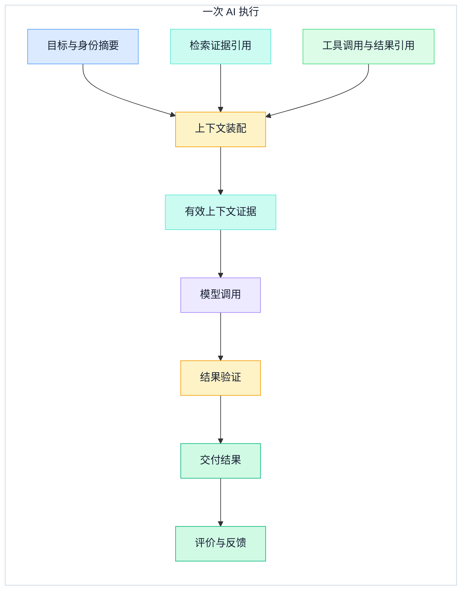
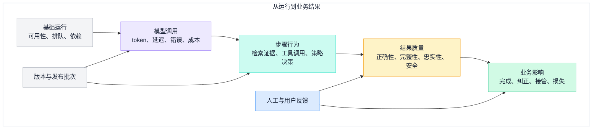
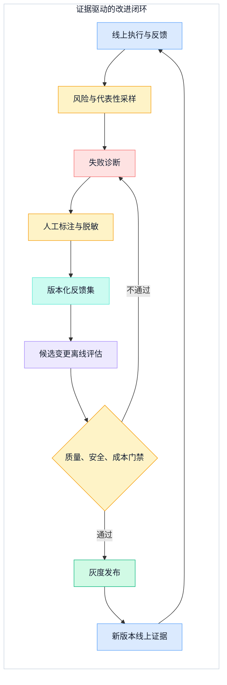

## 一、服务没有报错，不等于 AI 结果可靠

传统服务监控很擅长回答：请求有没有到达、哪个依赖变慢、CPU 是否饱和、错误率是否越过 SLO。对 LLM / Agent，这些问题仍然重要，却只覆盖了“系统是否运行”。一次调用即使返回 `200 OK`，仍可能使用了错误的 Prompt 版本、过期的检索证据、没有权限的工具结果，或者生成了一段流畅却不满足业务目标的回答。

AI 可观测性还必须回答另外三类问题：

- **为什么得到这个结果**：模型、Prompt、知识快照、工具和策略分别是什么版本？
- **这个结果是否合格**：结构、证据、任务完成度、安全和人工判断是否通过？
- **下一次怎样更好**：线上失败如何进入可复现的反馈集，变化如何经过离线评估再上线？

因此，观测对象不只是一次 HTTP 请求，而是一次从目标到结果的**执行证据链**。日志、指标和 trace 是承载证据的信号，不是最终目的。本文不重复[LLM 应用系统架构](../foundations/llm-application-system-architecture)中的请求编排，也不展开[RAG 检索工程](rag-retrieval-engineering)的召回算法和[企业级 Agent 系统架构](../agent-architecture/enterprise-agent-system-architecture)的运行控制；只讨论这些组件应留下什么证据，以及如何用证据驱动质量改进。

先给可观测性的验收边界一个简洁定义：

```text
可追溯 = 能从结果回到请求、版本、步骤、证据和决策
可评估 = 能用任务合同判断结果是否合格，并说明判定依据
可改进 = 能把代表性失败复现为数据集，并比较变更前后差异
```

没有这三点，平台只是收集了更多数据；具备这三点，团队才拥有一条能用于排障、审计、评估和发布决策的共同事实链。

## 二、把一次 AI 结果定义为最小证据单元

一次执行应先有稳定的 `execution_id`，再关联跨服务的 `trace_id`、业务请求和可能存在的父子任务。它们承担不同责任：

| 标识 | 回答的问题 | 生命周期 |
| --- | --- | --- |
| `execution_id` | 哪一次 AI 执行产生了这个结果 | 跟随结果与评估记录 |
| `trace_id` | 这次执行跨过了哪些服务和依赖 | 跟随分布式调用链 |
| `request_id` | 哪个入口请求触发了执行 | 跟随接口与业务请求 |
| `conversation_id` | 结果属于哪个对话上下文 | 跟随会话，但不能替代任务状态 |
| `parent_execution_id` | 它由哪个上级任务委托 | 跟随父子任务关系 |

W3C Trace Context 规定了跨组件传播 `traceparent` 与可选 `tracestate` 的通用格式；`traceparent` 中的 `trace-id`、`parent-id` 和 `trace-flags` 让不同组件能够延续同一条 trace。它解决的是相关性与互操作，不证明调用内容可信，也不要求所有组件服从上游采样决定。跨信任边界时，是否接受、重启或清理 trace 上下文仍要遵守本地安全策略。

下面只画一次调用需要串起的证据。它不描述完整应用架构，而是强调每一步产生什么可回看的记录。



这条链允许步骤并行、重复或分支，但每个结果都必须能回到同一个执行证据单元。尤其要区分“有哪些可用信息”和“模型这一次实际看到了什么”：检索候选、工具历史与完整会话都只是输入来源，只有经过权限、优先级、截断和 token 预算处理后送入模型的 effective context，才能解释本次输出。检索只记录选中了哪些来源和版本，工具只记录提出、授权、执行与返回的事实；算法和运行循环仍由各自主文章负责。

### 2.1 内部证据模型要稳定，外部语义映射要可演进

平台应先定义自己能够长期解释的内部证据模型，例如：

```yaml
execution_id: exe-42
trace_id: 4bf92f3577b34da6a3ce929d0e0e4736
request:
  contract: support_answer_v3
  principal_scope: tenant-a/support
versions:
  model_policy: support-router-v7
  resolved_model: model-family/revision
  prompt_template: support-answer-v12
  tool_contracts: [ticket-read-v4]
  knowledge_snapshot: kb-2026-08-28-09
effective_context:
  assembly_rule_version: context-assembler-v8
  task_state_snapshot_ref: state://task/exe-42/v7
  prompt_messages_ref: evidence://prompt-messages/exe-42/call-1
  retrieval_evidence_refs: [ev-17, ev-23]
  tool_result_refs: [tool-result-81]
  input_token_budget: 32000
  used_input_tokens: 2400
  truncated: true
  content_digest: sha256:...
steps:
  retrieval_evidence_ids: [ev-17, ev-23]
  tool_action_ids: [act-81]
model_calls:
  - call_id: call-1
    resolved_model: model-family/revision
    usage_source: provider_response
    billing_or_tokenizer_basis: provider/revision
    retry_of: null
    input_tokens: 2400
    output_tokens: 260
    cache_read_tokens: 1200
    cache_write_tokens: 0
    reasoning_tokens: null
execution_usage:
  source_call_ids: [call-1]
  input_tokens: 2400
  output_tokens: 260
outcome:
  status: delivered
  validation_set: answer-gates-v5
  limitations: []
```

这里强调的是语义责任，不是要求所有团队使用相同存储表。`effective_context` 是模型调用前冻结的不可变证据：它同时引用装配规则、会话或任务状态快照、实际采用的 Prompt 变量与消息摘要、真正进入模型输入的检索和工具结果，以及截断、token 预算与最终内容摘要。默认保存内容哈希或受控引用，不保存敏感原文；需要调查原文时，通过单独授权的证据存储解引用。

版本字段要保存平台实际采用的标识；如果供应商只提供模型别名，也要记录调用时解析到的供应商、端点、参数策略和响应标识，避免未来把相同别名误认为相同实现。对于多轮或工具型任务，每次模型调用都产生自己的 effective context；后续调用不能借用第一次调用的上下文摘要冒充实际输入。

截至 2026-08-28，OpenTelemetry 官方页面已把 GenAI semantic conventions 迁到独立仓库，当前整体状态仍标为 **Development**；原属性注册表中的 GenAI 条目也已标为 Deprecated 并指向新仓库，独立仓库的 Schema URL 仍是待完成项。因此，`gen_ai.*` 不是永久字段合同。更稳妥的做法是：

1. 内部证据模型保存业务长期需要的语义；
2. 导出适配器记录所采用的 OTel GenAI 约定版本或提交版本；
3. 对每个内部字段维护到外部约定的**可演进映射**；
4. 升级约定时执行兼容测试和历史查询验证，而不是原地改名后假设无影响。

OpenTelemetry 仍然非常适合作为 traces、metrics 与 logs 的采集和传输基础。这里的边界只是：使用标准来提高互操作性，同时保留平台对业务证据语义的所有权。

## 三、结构化 trace 要表达 AI 步骤，而不是保存思维过程

一条可用 trace 的根 span 代表一次 AI 执行，子 span 代表可独立计时和判定的外部步骤，例如模型调用、检索请求、工具执行、策略检查和输出验证。对每个 span，最有用的是：

- 操作类型、开始与结束时间、状态和错误类别；
- 实际调用的模型、Prompt、工具契约或知识快照版本；
- 输入输出规模，如 token、候选数量或结果大小；
- 策略决策、重试次数、降级原因和外部事务标识；
- 与最终质量判定、用户反馈和离线样本的关联。

不要把模型隐藏推理或完整思维过程当成必采字段。它既不是稳定接口，也可能包含敏感信息和误导性的中间表达。真正需要保存的是可验证的输入契约、外部证据、行动、结果和决策理由。

### 3.1 父子 span、事件和链接各有用途

- 同一同步调用链中的步骤使用父子 span，便于还原关键路径；
- 某个 span 内发生的重试、策略拒绝、输出截断等离散事实可以记录为 event；
- 批任务、异步队列或“从线上案例生成离线评估样本”这类不属于同一时间树的关系，使用 link 或显式业务关联，不要制造虚假的父子时长。

span 的 `OK` 只能表示操作按协议完成，不能自动表示回答正确。模型成功返回、工具成功执行和最终业务验收是三种不同结果，必须分别记录。

### 3.2 传播 trace，不传播隐私

`traceparent` 适合通过 HTTP 等协议传播跨组件关联；业务身份、Prompt、用户文本和授权内容不应塞进传播头。传入的 trace 上下文也不是可信身份凭证，服务仍要独立认证和授权。

内容采集遵循“默认摘要，按需受控展开”：

- 默认记录 Prompt 模板版本、变量名集合、内容哈希和长度，不记录完整 Prompt；
- 默认记录工具名、契约版本、参数摘要和结果引用，不记录密钥或完整敏感响应；
- 默认记录检索证据 ID、来源版本、权限判定和分数摘要，不复制整段知识；
- 只有在明确用途、访问控制、脱敏和保留期限成立时，才保存受限的原始样本。

哈希也不是天然匿名：输入空间较小时可能被枚举。高敏感内容要使用受控引用或密钥化摘要，并把解引用权限与普通 trace 查询分开。

### 3.3 采样不能切断质量证据

全量保存每个 span 的全部内容通常不可持续，完全随机采样又容易丢掉低频高损失案例。建议把数据分成三层：

1. **全量轻量结果记录**：执行标识、版本、状态、聚合用量、质量门禁结果和反馈引用；
2. **可采样 trace**：步骤时序、重试、依赖、错误和更细的属性；
3. **受控案例制品**：经脱敏和审批保存的输入、证据、输出与人工标注。

尾部采样可以优先保留失败、慢调用、高成本、策略拒绝、人工纠正和新版本流量，再对正常样本保留代表性基线。采样条件和保留周期应来自风险与调查需求，不照搬固定百分比。

## 四、信号必须分层，否则指标会互相冒充

AI 系统至少存在五层信号：基础运行、模型调用、步骤行为、结果质量和业务影响。它们相互关联，但不能互相替代。GPU 利用率低可能解释延迟，却不能证明回答差；点赞率高可能反映体验，却不能证明引用真实。



这张图的方向不是因果证明，而是调查和验收顺序：先确认结果属于哪个版本与执行，再逐层检查质量、步骤和运行信号。发布判断需要多层证据，不能用最容易采集的一层替代其他层。

### 4.1 基础运行与模型调用信号

基础运行继续使用流量、错误、延迟、饱和和依赖状态。模型调用再补充：

- 输入与输出 token、上下文是否截断、完成原因；
- 端到端延迟、TTFT、TPOT 或流式事件间隔；
- 限流、超时、重试、降级和路由结果；
- 供应商调用费用、自托管资源成本和缓存命中结果；
- 模型策略版本、实际模型和参数策略。

延迟定义必须与[LLM 推理服务工程](llm-inference-serving-engineering)保持一致。可观测平台负责关联并展示这些信号，不在本文重新解释 Prefill、Decode 或服务内部调度。

usage 必须按每次模型调用记录，并绑定 `call_id`、实际模型、供应商返回来源以及计费或 tokenizer 口径。重试调用也生成独立记录并计入执行级汇总，不能用最后一次成功响应覆盖前面的消耗。供应商可用时，将缓存读取、缓存写入、推理 token 等额外计费分类分桶，并保留供应商原始字段、单位和计费版本；供应商未返回的类别标记为未知，不推算成零。

执行级 token 和费用由调用级记录按 `source_call_ids` 归集，因此一次包含规划、工具回填、重试和最终生成的任务不会被误写成单次调用。不同模型的 tokenizer 和计费分类可能不同，跨模型比较优先使用实付成本/有效结果，不直接比较裸 token；token 更适合解释同一口径下的上下文和生成变化。

### 4.2 步骤行为信号

步骤层关心外部能力是否按合同工作：

| 步骤 | 最小证据 | 质量问题 |
| --- | --- | --- |
| 检索 | 查询引用、知识快照、证据 ID、过滤与排序摘要 | 必要证据是否进入最终上下文 |
| 工具 | 工具与契约版本、参数摘要、授权决策、结果和事务 ID | 是否选对工具、参数是否正确、副作用是否确认 |
| 策略 | 策略版本、输入摘要、允许/拒绝/审批及理由代码 | 高风险行动是否被正确控制 |
| 验证 | 验证器版本、各门禁结果、修复次数和最终状态 | 结果为什么允许或不允许交付 |

检索证据要能回到原来源，但本文不解释向量索引；工具调用要能回到授权与业务结果，但本文不重画 Agent 状态流转。

### 4.3 质量与安全信号

质量指标必须依赖任务类型。一个抽取任务可以测字段准确率和缺失率；知识问答可以测主张支持率、引用准确性和无答案判断；行动任务可以测目标完成、工具选择、参数正确性和副作用一致性。

安全信号至少区分：策略拒绝、越权尝试、敏感数据暴露、提示注入命中、危险工具提案和人工接管。安全门禁命中率本身不是越高越好；要结合真实攻击、正常请求误拒和影响等级分析。

线上代理信号只能作为线索。例如“用户没有追问”不等于回答正确，“用户点踩”也不一定表示系统错误。质量评估需要确定性校验、经过校准的模型评审和领域人工三者按风险组合，并保存评审器、评分规则与样本版本。

## 五、版本是解释质量变化的坐标系

如果只记录模型名，几乎无法解释线上变化。一次结果至少要关联以下版本：

- 模型路由策略、实际模型版本和修订标识；
- Prompt 模板、系统约束和变量装配规则；
- 工具清单、工具契约与授权策略；
- 知识快照、索引构建和检索策略；
- 输出合同、验证器与质量评分规则；
- Agent 或 Workflow 定义、应用版本和发布批次。

Prompt 版本不能只用“最新”表示。推荐保存不可变版本号与规范化内容摘要，同时记录模板变量和值的受控摘要。模型服务无法提供精确权重版本时，要如实标记可见粒度，不伪造可重复性。

每次发布把变更集合绑定到同一个 `release_id`，例如“Prompt v12 + 路由 v7 + 评审器 v5”。这样线上质量下降时可以按批次切分，不会把同时发生的几个变化混成一个原因。

版本记录还有一个常被忽略的作用：防止评估污染。评估样本、候选实现和评审器版本必须分开；如果用同一个模型同时生成答案、改写参考答案并给自己打分，平均分再稳定也不能证明质量提升。

## 六、成本与 SLO 要绑定有效结果

对 AI 调用，只看平均延迟和 token 总量会产生错误激励：系统可以用更短但不完整的回答降低成本，也可以通过提前失败改善平均延迟。SLO 应同时覆盖运行、质量和业务结果。

一个可操作的 SLO 组合可以是：

```text
资格条件：请求属于定义明确、可自动评估的任务集合

运行 SLI：在截止时间内形成终态的执行占比
质量 SLI：终态中通过任务合同和证据门禁的结果占比
安全 SLI：高风险策略按预期拒绝或审批的占比
成本 SLI：每个 SLO 内有效结果的总实付成本
业务 SLI：无需人工纠正且完成目标的结果占比
```

分母必须明确。超时、取消、人工接管、无答案和降级不能随意排除，否则指标会在失败最多时看起来最好。对不同风险和任务类型分别设目标，不把一个聊天总结和一个生产写操作平均成同一个质量分。

### 6.1 延迟要按阶段解释

端到端时间至少拆成排队、上下文准备、检索、模型、工具、验证和交付。对 Agent 任务，还要区分机器执行时间与等待审批、等待外部事件的挂起时间。用户感知 SLO 可以包含等待，但容量分析不能把人工等待误判为计算瓶颈。

### 6.2 成本要按执行归集

一次执行成本不仅有模型 token：还可能包括模型调用、检索与重排、工具服务、推理资源、存储与传输、失败重试以及人工复核。先把每项实付或分摊成本关联到 `execution_id`，再固定测量窗口 `W` 与资格任务集合 `Q`；分子和分母必须使用同一窗口、同一集合：

```text
每个 SLO 内有效结果成本
= `W` 内 `Q` 的全部执行相关实付成本
  / `W` 内 `Q` 通过质量与时限门禁的有效结果数
```

分子包含 `W` 内 `Q` 的失败、重试、降级与最终成功所产生的相关成本，不能只统计成功调用后再除以较窄的有效结果数。这个指标能暴露“便宜模型导致更多重试”“更长 Prompt 提升一次通过率”之类的真实取舍。成本归因不完备时要标记覆盖率，不用估算值冒充财务账单。

### 6.3 避免指标基数失控

`execution_id`、`trace_id`、用户 ID、完整 Prompt 和工具参数属于高基数或敏感数据，应放在 trace、受控日志或证据存储中，不作为常规时序指标标签。指标维度应使用有限的任务类型、版本、结果类别、风险级别和发布批次，再从异常聚合跳转到具体 trace。

## 七、评估集是从观测到工程决策的桥

仪表盘能发现变化，评估集才能比较候选方案。建议把数据集拆成三个相互关联但用途不同的集合：

| 集合 | 来源 | 用途 | 更新原则 |
| --- | --- | --- | --- |
| 基准集 | 代表性真实任务与领域专家设计 | 比较稳定能力与发布门槛 | 版本化、避免频繁追逐单点 |
| 失败回归集 | 已确认的线上错误、事故和高风险边界 | 防止已知问题复发 | 每个样本绑定根因和修复证据 |
| 探索集 | 新流量、长尾和分布变化 | 发现未知失败和新需求 | 定期抽样、人工分层分析 |

每个样本至少包含任务合同、受控输入、必要证据、允许行动、期望结果或评分量表、风险等级和来源时间。对没有唯一标准答案的任务，保存多个可接受条件和不可接受边界，比写一段“标准文案”更有用。

### 7.1 分层评估，不只评最终文本

一次端到端失败可能来自证据不足、工具参数错误、模型回答差或验证器误判。评估结果要沿同一证据链拆分：

- 检索证据是否充分、可访问且处于有效版本；
- 工具是否选对、参数是否正确、结果是否被正确理解；
- 模型输出是否满足任务、证据和结构要求；
- 安全策略是否既拦截风险，又没有造成不可接受的误拒；
- 最终业务状态是否真的达到验收条件。

### 7.2 模型评审也要被评估

模型评审适合扩展语义评估规模，但必须用人工标注集校准，记录评审模型、Prompt、顺序和评分版本，并检查与领域人员的一致性。高风险错误、不同语言、不同人群和无答案场景要单独看，不能被总体平均分淹没。

当供应商模型具有不可见更新或非确定性时，目标不是承诺逐 token 重放，而是保存足够环境与版本证据，在多次运行的分布上比较候选，并明确不可复现部分。

## 八、用户反馈要经过诊断，不能直接当标签

点赞、点踩、重新生成、复制、编辑、追问、人工接管和最终业务结果都是反馈信号，但含义不同：

- 点赞可能评价语气，而不是事实；
- 点踩可能来自权限拒绝，却恰好说明安全策略正确；
- 用户改写能揭示期望差异，但不保证改写内容正确；
- 没有继续操作可能是任务完成，也可能是用户放弃；
- 工具执行成功不代表业务目标达成，仍需读取真实状态。

反馈进入训练或回归前，需要按任务类型抽样、去标识、归因和人工确认。保存“原执行 -> 反馈事件 -> 诊断结论 -> 数据集样本”的引用链，才能区分体验问题、知识缺口、Prompt 缺陷、工具错误和策略冲突。

下面的闭环只画从线上证据到发布决策的路径。它不会把每一条负反馈自动送回模型，而是先经过筛选和标注，再用同一评估合同比较候选。



NIST Generative AI Profile 强调持续监测、生成内容来源、结构化反馈和独立评估。落到工程上，这意味着线上反馈既不是装饰性计数，也不是未经审查的训练数据；它是需要治理的证据来源。涉及个人或敏感内容时，还要明确告知用途、限制访问、规定保留和删除方式。

## 九、从最小闭环开始落地

不要第一天就建设一个包揽所有信号的大平台。更稳妥的顺序是让证据链逐步闭合。

### 阶段一：统一标识与版本

- 为每次执行生成稳定 `execution_id`，并与 `trace_id`、业务请求关联；
- 建立模型策略、Prompt、知识、工具、验证器和发布批次的版本登记；
- 定义轻量结果记录，先覆盖状态、用量、门禁和限制。

验收标准：从任一交付结果能查到它使用的版本和最终判定。

### 阶段二：串起关键步骤

- 为模型、检索、工具、策略和验证创建结构化 span；
- 贯通跨服务 trace，上报分阶段延迟、token 和实际成本；
- 对高基数标识与敏感内容实施分层存储、脱敏和访问控制；
- 建立失败、慢调用、高风险与版本流量的采样规则。

验收标准：能从异常聚合下钻到一次完整执行，并解释失败发生在哪一步。

### 阶段三：建立质量评估

- 为一个高价值任务定义输出合同、质量维度和人工量表；
- 建立基准集、失败回归集和评审器校准集；
- 将运行、质量、安全、成本和业务 SLI 放入同一发布看板；
- 所有指标记录定义、分母、覆盖率和版本。

验收标准：一个候选版本能与当前版本在同一数据集和同一门禁下比较。

### 阶段四：闭合反馈与发布

- 把线上纠正、接管和真实业务结果关联回执行；
- 建立采样、诊断、脱敏、标注和数据集准入流程；
- 变更先离线评估，再灰度并按发布批次比较；
- 对质量或安全退化保留停止、回滚和人工接管机制。

验收标准：已确认失败会进入回归，修复经过评估，灰度结果能够证明改善或触发回滚。

## 十、评审清单

### 证据链

- [ ] 每个结果是否有稳定执行标识并能关联跨服务 trace？
- [ ] 是否能回到模型、Prompt、知识、工具、策略和验证器版本？
- [ ] 检索与工具是否只保存必要证据，并保留可解引用来源？
- [ ] span 成功、质量合格和业务完成是否被分别表达？
- [ ] 异步步骤与离线样本是否使用真实关联，而不是伪造父子时长？

### 信号与治理

- [ ] 运行、模型、步骤、质量和业务信号是否分层？
- [ ] 高基数标识是否避免进入常规指标标签？
- [ ] Prompt、工具参数和结果全文是否默认最小采集？
- [ ] trace 传播是否没有被误用为身份或授权？
- [ ] OTel GenAI 映射是否记录采用版本并允许演进？

### 评估与反馈

- [ ] SLO 是否同时考虑时限、质量、安全、成本和业务结果？
- [ ] 失败、降级、接管和无答案是否有明确分母规则？
- [ ] 评估集是否包含代表性任务、已知失败和长尾探索？
- [ ] 模型评审是否经过人工校准并记录自身版本？
- [ ] 用户反馈是否经过诊断、脱敏和人工确认再进入反馈集？
- [ ] 每次变更是否先离线比较，再灰度并按发布批次验证？

LLM / Agent 可观测性的核心，不是把所有 Prompt 和响应都存下来，而是为每一个结果保留恰到好处的证据：它从哪里来，使用了什么版本，经历了哪些外部步骤，为什么被允许交付，真实效果怎样，以及这个案例如何推动下一次改进。

当调用链、质量、成本与反馈共享同一个执行坐标，团队才能从“看见服务在运行”走向“证明 AI 在正确地工作”，并让每次优化都经得起复现、比较和回滚。

## 参考资料

- OpenTelemetry：[Generative AI semantic conventions](https://opentelemetry.io/docs/specs/semconv/gen-ai/)
- OpenTelemetry：[GenAI attribute registry](https://opentelemetry.io/docs/specs/semconv/registry/attributes/gen-ai/)
- W3C：[Trace Context](https://www.w3.org/TR/trace-context/)
- NIST：[Artificial Intelligence Risk Management Framework: Generative Artificial Intelligence Profile](https://www.nist.gov/publications/artificial-intelligence-risk-management-framework-generative-artificial-intelligence)
