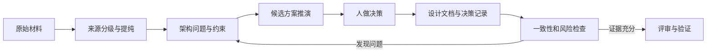

AI 参与架构设计，真正有价值的部分不是代写一份很长的文档，而是帮助团队更快地整理证据、比较方案、暴露矛盾和维护一致性。架构责任并没有转移：人仍然要定义边界、做取舍、承担决策结果，并证明设计能够满足真实约束。

本文给出一套可复用的协作方法。它不依赖某个具体模型或项目，也不以生成速度作为成功标准。

## 一、先定义什么叫 AI Native 架构设计

“AI Native”不是把需求文档全部交给模型，然后接受一份自动生成的总体设计。更准确的定义是：把 AI 作为持续参与设计过程的分析和检查能力，让材料、决策、验证和修订形成可追溯闭环。



这个过程中，AI 适合做高覆盖率工作，人负责高责任判断：

| 工作 | AI 适合承担 | 人必须承担 |
| --- | --- | --- |
| 材料处理 | 分类、摘要、关联、矛盾提示 | 判断来源可信度和是否纳入 |
| 方案推演 | 展开候选、列出影响、寻找遗漏 | 定义约束、权衡并拍板 |
| 文档表达 | 生成初稿、图表和交叉引用 | 确定层次、读者和最终表述 |
| 质量检查 | 全文检索、一致性检查、反例生成 | 判断问题是否成立并负责修复 |
| 决策记录 | 整理讨论和影响范围 | 说明为什么这样做以及谁负责 |

一句话概括：AI 扩大分析覆盖率，人保持决策权和责任链。

## 二、阶段一：材料治理决定质量上限

架构设计常见的输入包括需求、代码、接口、数据模型、运行数据、历史决策、故障复盘、竞品资料和团队约束。它们的时效性和权威性不同，不能平铺给模型。

### 2.1 给来源分级

可以先建立简单的来源等级：

| 等级 | 含义 | 例子 | 使用方式 |
| --- | --- | --- | --- |
| 决策依据 | 能直接约束当前设计 | 已批准需求、代码、真实指标、正式规范 | 结论必须与其一致 |
| 待核实输入 | 有参考价值但可能过期或片面 | 旧设计、访谈记录、调研稿 | 先交叉验证再使用 |
| 表达参考 | 只参考结构和写法 | 优秀文档、图表模板 | 不继承其中的事实 |
| 隔离材料 | 可能污染主体判断 | 测试夹具、演示数据、未经确认的设想 | 单独分析，不进入事实集 |

“代码一定比文档权威”也不是普遍真理。代码能说明系统现在做了什么，却未必说明它应该继续怎么做；需求能说明目标，却可能没有反映实际边界。架构师要明确每类材料回答的问题，而不是选一个来源包办全部事实。

### 2.2 先建立事实表，再让 AI 写正文

事实表至少包含：

- 事实或约束本身；
- 来源位置和更新时间；
- 可信等级；
- 存在的冲突；
- 需要谁确认；
- 会影响哪些架构决策。

AI 可以帮助抽取和关联，但不能自行把冲突“平均”成一个看似合理的答案。发现不一致时，应保留冲突并交给负责人判断。

### 2.3 输入要最小充分

材料不是越多越好。先围绕当前架构问题选择最小充分证据，再按需读取细节，可以减少旧结论、无关实现和敏感信息对判断的干扰。

## 三、阶段二：人定骨架，AI 帮助展开

模型擅长补充内容，因此也很容易把总体设计写成材料汇编或概要设计。开始写作前，人要先定义：

- 目标读者是谁，他们要用文档做什么决定；
- 设计覆盖和不覆盖哪些范围；
- 哪些约束不可改变，哪些仍待验证；
- 文档的逻辑链是什么；
- 每一章应该回答哪个架构问题；
- 什么细节必须移到独立文档。

一种常见的总体设计骨架是：

```text
背景与目标
  -> 场景、约束与非目标
  -> 关键决策和候选方案
  -> 系统边界与责任划分
  -> 核心链路和数据流
  -> 安全、可靠性、性能和运维
  -> 演进与验证计划
  -> 风险、待验证项和决策记录
```

这不是固定模板。关键是章节顺序能够支持读者从问题走到决策，而不是复刻输入材料的目录。

### 控制设计层次

总体设计应说明组件责任、依赖方向、关键协议和质量属性，不必提前锁定所有类名、字段和默认值。判断一段内容是否过细，可以问：

> 如果实现方式改变，但架构约束没有改变，这段内容是否仍需要写在总体设计中？

如果答案是否定的，它更适合进入接口、实现或运维文档。

## 四、阶段三：把 AI 用于方案推演

有了骨架之后，AI 的作用不应停留在“把这一节写长一点”，而应帮助团队系统地推演设计。

### 4.1 一次只解决一类问题

每轮推演明确一个目标，例如：

- 检查责任边界是否重叠；
- 为关键链路寻找单点故障；
- 比较两个部署方案的恢复复杂度；
- 检查权限模型能否覆盖高风险动作；
- 从失败场景反推必要的状态和幂等设计；
- 检查某个核心术语在全文是否含义一致。

同时要求模型重写架构、调整术语、补充性能设计和修正文案，容易让判断过程失去可追踪性。

### 4.2 让模型生成反例，而不只是支持结论

如果只问“这个方案有什么优点”，模型很容易顺着已有方向补充理由。更有效的提问包括：

- 在什么约束下这个方案会失败？
- 哪个隐含假设最值得先验证？
- 如果反对这个决策，最强的三个论据是什么？
- 哪两个章节对同一概念给出了不同责任？
- 有哪些操作能绕开当前安全边界？
- 哪项能力看似存在，但缺少完成证据？

AI 提出的质疑不是结论。人需要回到证据，判断它是有效反例、误解，还是需要新增的验证项。

### 4.3 把候选方案放在同一约束下比较

选型不应以“某方案知名”或“功能最多”为依据。先定义场景约束和评估维度，再比较候选：

| 维度 | 要回答的问题 |
| --- | --- |
| 适配性 | 是否匹配当前运行形态、团队能力和系统边界 |
| 可演进性 | 关键抽象能否随业务变化而调整 |
| 安全治理 | 身份、权限、审计和数据边界是否可控 |
| 可靠性 | 失败、重试、恢复和降级如何实现 |
| 可观测性 | 能否定位问题并形成验证证据 |
| 集成成本 | 与现有系统的耦合和迁移代价是什么 |
| 退出成本 | 方案失效时能否替换或回退 |

“不采用”不等于“没有借鉴价值”。记录每个候选解决得好的问题，可以避免选型结论变成简单淘汰赛。

## 五、阶段四：验证收敛，而不是润色收尾

评审反馈分为不同类型：

| 类型 | 处理方式 |
| --- | --- |
| 表述问题 | 修正文案并检查交叉引用 |
| 事实问题 | 回到来源，更新事实表和受影响结论 |
| 一致性问题 | 明确唯一术语或责任，再全局修订 |
| 设计问题 | 重新打开决策，比较方案和影响范围 |
| 验证缺口 | 新增验证方法、负责人和完成条件 |

最危险的做法，是把设计问题当成文字问题处理。例如评审发现某个高风险动作没有可执行的审批路径，仅把“禁止”改成“严格控制”并没有完成设计。需要补齐身份、策略、审批、超时、审计和异常处理的闭环。

AI 很适合在决策改变后搜索所有受影响的位置，但批量修改之前必须由人先给出唯一的新定义。否则它只会把矛盾传播得更整齐。

## 六、AI 的三种协作角色

### 6.1 执行者：提高表达和整理效率

适合的任务包括材料分类、结构化摘要、表格和图的初稿、格式统一以及交叉引用检查。输入应包含读者、层次、边界和输出契约。

### 6.2 挑战者：寻找薄弱假设

主动要求 AI 站在安全、运维、开发、评审者或反对者角度提出问题。它的价值是扩大检查覆盖率，而不是代替专家判断。

### 6.3 审视者：检查整个设计是否自洽

在文档接近收敛时，让 AI 检查：

- 每个核心断言是否有依据；
- 同一术语是否保持同一含义；
- 组件责任是否重叠或出现空白；
- 图、表和正文是否描述同一套架构；
- 非目标是否在后文章节被悄悄引入；
- 风险是否都有缓解措施或验证路径；
- 已修改的决策是否仍残留旧表述。

这三个角色不是模型能力自动升级的结果，而是人改变了任务设计：从要求生成，转向要求反证和系统检查。

## 七、区分架构判断与实现假设

设计严谨不等于每个地方都写得非常具体。没有证据的精确数字，会把假设伪装成承诺。

| 类型 | 写法 | 例子 |
| --- | --- | --- |
| 已确认约束 | 明确锁定，并记录来源 | 数据必须留在指定信任边界 |
| 架构判断 | 说明备选、依据和影响 | 状态持久化与执行进程解耦 |
| 实现假设 | 标注假设和验证方法 | 缓存策略预计能满足目标延迟 |
| 待验证决策 | 记录触发条件、负责人和截止点 | 峰值规模压测后确定分片策略 |

对于每个待验证项，至少写清楚：不知道什么、为什么重要、如何验证、什么结果会改变当前设计。

## 八、维护决策链，而不只是最终文档

总体设计呈现“决定做什么”，决策记录说明“为什么这样决定”。二者最好分开维护并相互引用。

一条可复用的决策记录包含：

1. 背景和要解决的问题；
2. 约束、事实和来源；
3. 考虑过的候选方案；
4. 权衡和最终判断；
5. 对组件、团队和交付的影响；
6. 风险、待验证项和回退条件。

AI 可以从讨论记录中整理初稿、发现受影响章节，并在决策变化时列出需要同步的位置。但最终理由必须由决策者确认，不能让模型事后编造一条看似完整的论证链。

## 九、质量门禁

AI 生成的架构内容至少经过以下检查：

### 事实门禁

- 核心事实能定位到来源；
- 易变化的产品能力和指标重新核验；
- 示例、假设和真实数据明确区分；
- 没有来源的数字被删除或标为待验证。

### 逻辑门禁

- 问题、约束、方案和结论之间能形成推导；
- 反对方案不是为了证明既定结论而刻意弱化；
- 组件责任、数据流和依赖方向没有冲突；
- 安全、可靠性和运维要求进入主链路，而不是附录口号。

### 文档门禁

- 标题层级和术语一致；
- 图、表、正文和交叉引用同步；
- 总体设计没有陷入实现细节；
- 修订记录说明改了什么以及为什么改。

### 人工门禁

- 关键领域专家审查相关章节；
- 重大取舍有明确负责人；
- 评审意见逐条关闭，不由 AI 自行宣布解决；
- 最终发布者完整阅读过目标文档。

## 十、常见失败方式

### 把材料全部塞给模型

结果通常是旧结论、测试数据和正式约束被混在一起。应先做来源分级和最小充分选择。

### 用篇幅衡量设计质量

模型很容易生成完整但空泛的章节。每一节都应回答一个设计问题，并能指出依据、取舍或验证方法。

### 只让 AI 证明当前方案

这会放大确认偏差。应明确要求反例、失败场景和替代方案，并由人回到证据判断。

### 机械做全文替换

同一词语在不同上下文可能承担不同含义。先确认概念变化，再逐处判断；自动搜索只能定位候选位置。

### 让模型替决策者补理由

如果一项决策没有真实讨论和证据，流畅的理由只会掩盖问题。它应该进入待验证清单，而不是被包装成既定结论。

## 十一、可复用工作清单

### 开始前

- [ ] 明确读者、范围、非目标和成功标准
- [ ] 为材料标注来源、时效和权威等级
- [ ] 隔离演示、测试和未经确认的材料
- [ ] 建立事实冲突和待确认清单

### 推演中

- [ ] 每轮只解决一类架构问题
- [ ] 候选方案使用同一组约束和维度比较
- [ ] 要求 AI 提出反例和最强反对意见
- [ ] 重要结论区分事实、判断和假设
- [ ] 决策变化后检查全部影响位置

### 发布前

- [ ] 每个关键断言都有依据或验证路径
- [ ] 图、表、正文和术语保持一致
- [ ] 领域专家完成相关章节审查
- [ ] 决策记录能够解释主要取舍
- [ ] 发布者完整阅读并承担最终责任

AI 的最大价值不是替架构师写得更快，而是让证据整理、方案推演、反例发现和一致性检查变得更系统。人负责定义什么是正确的问题、接受什么风险、做出什么取舍；AI 负责扩大分析和检查的覆盖范围。只有当这条责任边界清楚时，AI 才真正进入架构工程，而不只是进入文档写作。
