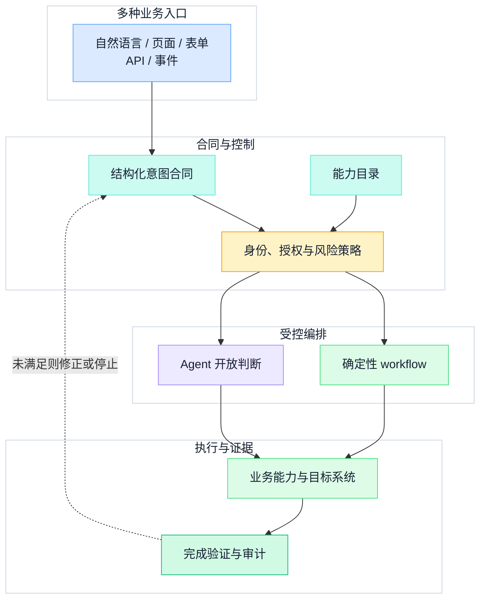
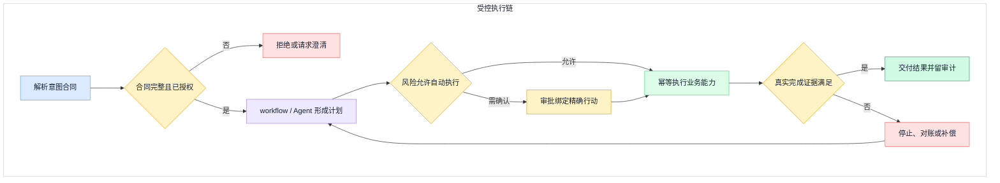
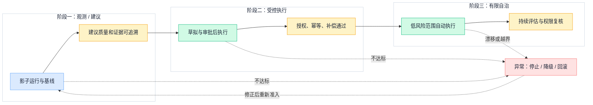

## 一、固定旅程解决什么，又遗漏什么

传统业务平台把已知任务编码为菜单、页面、表单和固定流程。它擅长处理高频、稳定、步骤明确的操作：用户可以快速扫视数据，系统可以即时校验字段，团队也容易解释每一步为什么存在。

问题出现在目标清楚而路径不固定的任务中。例如，“找出本周退款率上升的原因，给出可执行方案，超过预算的动作先让我确认”，可能跨越指标、订单、客户、规则和审批多个模块。若仍要求用户先理解系统边界，再手工拼接页面，平台把协调成本留给了人。

意图驱动不是把原有入口全部改成聊天框。intent entry 可以来自多种交互，自然语言只是入口之一，表单、页面、API 和业务事件仍可并存；高频操作和复杂数据浏览也常常继续由 UI 提供更高的信息密度。变化发生在入口之后：平台把用户目标转换为可验证合同，再选择确定性流程或受控 Agent 完成它。

这也不是“为旧平台加一层对话”。如果底层能力没有稳定契约，权限仍靠入口猜测，最终结果无法核验，那么模型只能替用户点击更快，不能建立可靠的业务平台。

## 二、意图是一份执行合同

一句自然语言可能含糊、省略上下文，也可能来自没有权限改变目标对象的人。因此，意图不能等同于用户原话。本文把意图定义为一份**结构化、可验证、可授权的执行合同**：

| 字段 | 必须回答的问题 |
| --- | --- |
| 目标 | 希望改变或确认什么业务结果？ |
| 对象 | 作用于哪个租户、资源、时间范围或数据集合？ |
| 约束 | 哪些规则、范围和先决条件不能被规划绕过？ |
| 权限主体 | 谁发起、代表谁行动，授权在何种上下文中有效？ |
| 风险等级 | 影响范围、敏感度、可逆性和失败代价是什么？ |
| 预算 / 时限 | 可以使用多少时间、调用、资金或人工注意力？ |
| 完成条件 | 哪些业务状态成立才算完成？ |
| 证据要求 | 需要哪些目标系统事实、回执或交付物支持完成判断？ |
| 可撤销 / 补偿边界 | 失败或取消后，哪些动作可回滚，哪些只能补偿或人工处置？ |

入口层可以通过追问、默认值、上下文和表单补齐合同，但不能静默猜测高风险字段。合同不完整时，正确状态是“待澄清”或“拒绝”，不是先执行再解释。

意图合同也应版本化。目标或关键参数变化后，原计划、审批和预算需要重新计算；旧审批不能被复用于新对象。完整的身份、委托和信任模型属于[企业级 Agent 系统架构](../agent-architecture/enterprise-agent-system-architecture)，本文只关注它如何约束业务平台的意图执行。

## 三、能力目录：规划能够选择什么

Agent 不应该在运行时猜测系统拥有哪些 API。平台需要一个机器可读、由团队治理的能力目录（capability catalog），每项能力是可以独立授权、执行和验收的业务动作。

```yaml
capability_id: order.refund.request
input_schema: RefundRequestV2
output_schema: RefundReceiptV1
authorization: delegated_user_and_resource_policy
risk_level: contextual_L2
idempotency: required_with_action_id
side_effects: creates_refund_request
slo: acknowledge_within_defined_window
owner: commerce-platform
evidence: target_transaction_and_receipt
version: 2.1.0
```

这份目录至少要覆盖以下责任：

- `capability_id` 和版本给计划、审计与兼容检查一个稳定引用；
- 输入输出 Schema 限制参数形状，但不代替业务合法性校验；
- 授权声明说明主体、资源和委托关系如何复验；
- 风险、副作用、幂等与补偿语义决定是否需要审批以及如何恢复；
- SLO 和 owner 让超时、故障和升级路径有明确责任人；
- evidence 说明工具返回什么只能算“已受理”，什么能够证明业务结果。

规划只能选择已注册、当前可用且通过授权过滤的能力。发现能力缺口时，可以创建需求或候选制品，但不能临时生成一段代码并直接进入生产。Schema 合法只证明形状正确；新能力仍要经过测试、责任人评审、灰度和可回滚发布。

## 四、业务平台的四层结构

意图驱动平台可以收敛为四层：多入口接收请求；合同与策略层建立边界；编排层选择确定性 workflow 或 Agent；执行与证据层改变目标系统并核验结果。



这张图的关键不是增加了多少组件，而是让边界可执行：模型没有能力目录之外的动作；编排没有策略之外的捷径；目标系统的业务规则不会因入口变化而被绕开；平台也不能凭生成的文字自行宣布完成。

## 五、确定性 workflow 与 Agent 的边界

[Anthropic 对 workflows 与 agents 的区分](https://www.anthropic.com/research/building-effective-agents)很实用：前者由预定义代码路径编排模型和工具，后者由模型动态决定过程和工具。业务平台不必在两者之间二选一，而应按问题结构组合：

| 问题形态 | 首选机制 | 原因 |
| --- | --- | --- |
| 顺序固定、分支可枚举、规则强 | 确定性 workflow | 行为可预测，便于测试、审计与恢复 |
| 需要语义判断，但动作路径已知 | workflow 中的模型步骤 | 只把局部判断交给模型，不扩大行动边界 |
| 子任务和证据路径难以预先枚举 | 受控 Agent | 动态规划有价值，但每一步仍受能力和策略约束 |
| 低复杂度分类或抽取 | 单次模型或传统规则 | 不必为“Agent 化”支付额外延迟和错误累积成本 |

原则可以写得很明确：**确定性 workflow 拥有已知顺序和硬约束，Agent 只处理开放判断。** Agent 可以选择能力、补充计划或请求澄清，不得绕过授权、审批、业务校验和完成验证。规则和确定性流程不会全部消失，它们反而成为 Agent 能够安全行动的轨道。

从简单方案开始还有一个现实收益：团队可以先证明单个能力和单条业务链路正确，再决定是否需要更长循环或多 Agent。复杂架构只有在真实任务的质量、成本或吞吐证据支持时才增加。

## 六、信任等级与 human-in-the-loop

自主程度不是平台的一项全局开关，而是“主体 × 能力 × 对象 × 参数 × 环境”的动态判断。同一个查询在公开知识库中可能低风险，在敏感客户域中则需要更严格的控制。

本文只使用四个渐进业务层级，不重画完整信任全景：

| 层级 | Agent 可以做什么 | 人如何参与 | 必要控制 |
| --- | --- | --- | --- |
| 建议 | 读取授权信息并给出方案 | 人判断是否采纳 | 来源、限制与未决问题 |
| 草拟 | 形成待发布内容或待执行计划 | 人校对并决定下一步 | 草稿隔离、差异和版本 |
| 审批后执行 | 提交绑定精确对象和参数的行动 | 人对具体副作用事前确认 | 审批有效期、执行前复验、幂等 |
| 有限自治 | 在低影响、可恢复、范围明确的合同内执行 | 人负责抽查、异常接管与权限调整 | 预算、熔断、补偿、持续评估 |

human-in-the-loop 不是失败后的人工装饰。人要在系统设计时拥有清晰角色、足够上下文、可理解的行动差异和真正可用的拒绝、修改、暂停与接管能力。[NIST Generative AI Profile](https://www.nist.gov/publications/artificial-intelligence-risk-management-framework-generative-artificial-intelligence)强调按组织风险容忍度配置治理活动、明确人的监督责任并持续监测；它提供的是跨行业风险管理框架，不替任何具体业务决定自动化等级。

[OpenAI 的实践指南](https://cdn.openai.com/business-guides-and-resources/a-practical-guide-to-building-agents.pdf)把失败阈值和高风险行动列为常见人工介入触发点，并建议用多层 guardrails。当前[官方 Agents SDK 文档](https://developers.openai.com/api/docs/guides/agents)也把工具实现、状态存储和审批决策保留给服务端。这里采用的是稳定工程原则，而不是把某个 SDK 的当前行为写成永久产品合同。

平台并非完全自治。权限扩大必须来自组织策略、评估和责任人批准；Agent 可以触发自动降权、熔断或转人工，但不能根据自己的历史成功率给自己提权。

## 七、完成证据：从“调用成功”到“目标成立”

一次受控执行必须让计划、风险决策、副作用和结果处于同一条完成证据（completion evidence）链中。



完成证据必须来自目标系统真实状态、事务回执或可验证交付物，并且能够关联意图版本、`action_id`、授权主体和目标对象。不同任务的证据不同：退款需要支付或订单系统中的事务状态，报告需要可读取且通过校验的制品，通知需要区分“平台受理”“渠道投递”和“收件人确认”。

不能用模型自述证明完成。HTTP 200 不等于完成证据，消息已发送不代表业务完成，流程到末节点也不意味着目标成立。超时尤其需要谨慎：它表示调用方不知道结果，不表示副作用没有发生；重试前应先按幂等键查询目标系统，无法判定时进入对账或人工处置。

完成判断失败后，系统要保留已执行动作、未知状态、剩余预算和恢复入口。可逆动作可以回滚，不可逆动作只能执行显式补偿；“把状态改回去”并不总能消除已经发生的外部影响。

## 八、渐进迁移：先证明，再扩大

渐进迁移（progressive migration）适合从一条真实但低风险的业务链路开始。每个阶段都要有准入门禁、失败出口和回退方式，而不是先承诺终局形态。



阶段一只观测真实请求并给出建议，建立人工基线和错误分类；阶段二开放草拟与审批后执行，先证明身份、幂等、审计和补偿链；阶段三只在评估稳定、影响可控的范围开启有限自治。范围扩大以真实完成率、人工接管原因、补偿率、越权拒绝和业务损失为依据，而不是以模型回答更流畅为依据。

整个迁移过程必须可停、可降级、可回滚。Agent 不可用时，关键业务仍能回到既有页面或流程；新策略发生漂移时，平台能够收紧权限而不是继续试错；新能力和新 workflow 按普通软件制品发布，不由所谓“自我进化”绕过评审与上线门禁。

迁移中的材料治理、方案推演和设计评审方法可参见[AI Native 辅助架构设计](ai-native-architecture-design)。本篇不重复那套协作方法，只把它落实为业务平台的准入证据。

## 九、常见反模式

### 只换入口，不改责任边界

聊天框背后仍然调用粗粒度管理员 API，既没有用户委托，也没有资源级授权。解决方式不是增加提示词，而是先重构能力合同和策略执行点。

### 把自然语言直接当执行指令

没有对象、风险、预算和完成条件的原话不足以驱动副作用。平台应补齐意图合同，并让用户看到关键解释与变更差异。

### 用 Agent 替代已知硬流程

稳定的顺序、合规规则和事务约束交给自由规划，会增加成本和不确定性。把开放判断留给 Agent，把硬边界编码在 workflow、策略和领域服务中。

### 把人在环当成万能兜底

如果审批者看不到对象、参数、差异和证据，按钮只是把风险转移给人。人工介入必须有明确触发、足够上下文、响应时限和接管后的恢复路径。

### 把受理回执当成完成

队列入列、HTTP 响应或工具返回都可能只是中间状态。意图合同必须预先指定如何从目标系统验证最终业务结果。

### 自动生成后直接生效

模型生成规则、workflow 或能力描述可以提高制品生产效率，但不能替代测试、评审、灰度和发布责任。候选制品必须像代码一样版本化、可追溯和可回滚。

## 十、落地检查清单

### 意图与入口

- [ ] 自然语言、页面、表单、API 和事件是否收敛到同一意图合同？
- [ ] 合同是否包含主体、对象、约束、风险、预算、完成条件与证据？
- [ ] 缺失字段和歧义是否会触发澄清或拒绝，而不是静默猜测？

### 能力与编排

- [ ] 能力目录是否声明 Schema、授权、副作用、幂等、SLO、owner、证据和版本？
- [ ] 规划是否只能选择已注册且当前授权的能力？
- [ ] 已知顺序和硬约束是否由确定性 workflow 或领域服务负责？
- [ ] Agent 是否被限定在确有价值的开放判断中？

### 信任与执行

- [ ] 风险是否结合主体、对象、参数、环境和可逆性动态判断？
- [ ] 审批是否绑定精确行动、策略版本和有效期？
- [ ] human-in-the-loop 是否具有拒绝、修改、暂停和接管能力？
- [ ] 副作用是否有幂等键、执行前复验、未知结果对账和补偿路径？

### 证据与演进

- [ ] 完成条件是否由目标系统事实或可验证制品证明？
- [ ] 是否区分受理、执行、投递和业务完成？
- [ ] 是否先建立观测与人工基线，再扩大执行权限？
- [ ] 每个阶段是否有评估门禁、停止条件、降级入口和回滚方案？

意图驱动的价值，不是让用户少看几个页面，而是把跨模块目标变成平台能够理解、授权、执行和证明的合同。只有能力边界、确定性流程、开放判断、人的责任和完成证据同时成立，平台才真正从“提供功能”走向“受控地完成目标”。

## 参考资料

- Anthropic：[Building effective agents](https://www.anthropic.com/research/building-effective-agents)
- NIST：[Artificial Intelligence Risk Management Framework: Generative Artificial Intelligence Profile](https://www.nist.gov/publications/artificial-intelligence-risk-management-framework-generative-artificial-intelligence)
- OpenAI：[A practical guide to building agents](https://cdn.openai.com/business-guides-and-resources/a-practical-guide-to-building-agents.pdf)
- OpenAI：[Agents SDK](https://developers.openai.com/api/docs/guides/agents)
