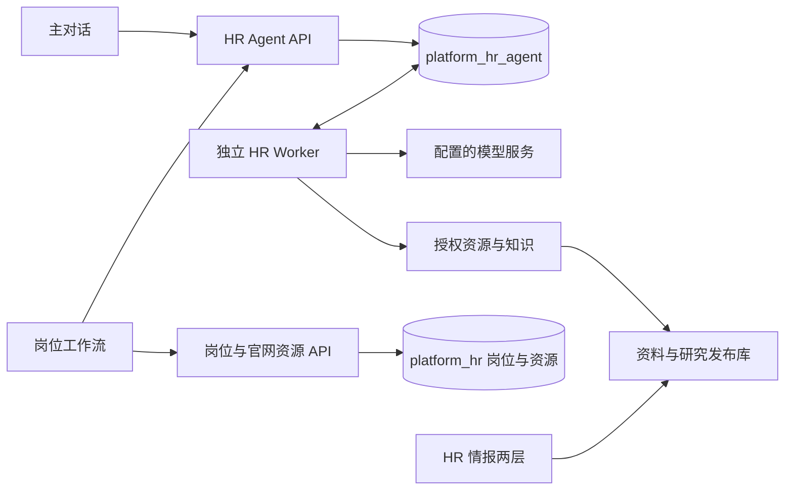

# HR 当前实现全景（2026-09-15）

本文记录已存在的实现与可核查边界，不是新设计或待执行任务书。范围是 HR 及其依赖的平台身份、附件、发布能力，不代表整个平台所有产品。

## 1. 基线与结论

| 项目 | 本次核实结果 |
| --- | --- |
| 实现调查基线 | 初次调查 `master` / `origin/master` 均为 `5482a04b17d8b06d801f60eb384947687cc0deac`；后续主线发布 `570ea625` 另加入扫码入口修复与发布文档 |
| 主线最近交付 | 当前岗位标准与成果接云端、岗位改单列列表、删除旧前端路由/页面/客户端及专用测试；临时实施分支已合并并删除 |
| 当前生产版本 | 2026-09-15 已部署主线 `570ea62547a6955dbf146b53e2a8eef5a5adfbf5`，API healthy；24 个其他容器保持发布基线 |
| 最近一次门禁核实 | 2026-09-15 发布核验 schema107、phase = cloud、旧链非终态计数 0 |
| 已发布范围 | 岗位阅读闭环、单列列表、旧前端删除及扫码入口修复已部署；页面交互由用户验收 |
| 操作范围 | 初次文档调查后按用户授权完成两次 API 发布；未执行模型调用、生产业务写入或数据库删除 |

当前实现是一套以云端 Hannah 对话为工作入口、以岗位和 HR 情报为阅读入口的产品。执行状态、回答结束、成果保存、标准确认分别存在；页面显示回答不代表成果已保存，更不代表标准已生效。

**旧前端删除已完成，旧后端完整清除尚未完成。** 上轮删除 31 个文件，整体差异为新增 1371 行、删除 9988 行，净减少 8617 行（含文档和测试）。旧接口、旧后端类和表仍有残留，详见 §9；其中部分 `backend/app/hr` 模块仍服务当前岗位与情报，不能把整个目录视为废代码。

证据：[最近验收](reviews/2026-09-14-hr-position-cloud-reading.md)、[最终审查](../.superpowers/sdd/legacy-exit-final-review.md)、[最新发布记录](releases/2026-09-15-mainline.md)。

## 2. 用户入口与实际页面

主导航只有「对话」「岗位」「HR 情报」。专业方法、候选人材料、候选人工作、公司与专题情报位于主工作台内部；没有独立的旧方法导航弹层。

| URL / 入口 | 当前组件与行为 |
| --- | --- |
| `/hr/` | `HrLoopWorkspace`；支持 `position`、`work` 参数选择已有岗位/工作 |
| `/hr/agent` | 同一云端主工作台的入口别名 |
| `/hr/chat` | 同一云端主工作台；不是旧会话页 |
| `/hr/positions` | `HrWorkspacePage` → `HrPositionIndex`；单列岗位列表、搜索、状态过滤、分页读取 |
| `/hr/positions/{id}` | `HrPositionWorkflow`；岗位总览、五阶段阅读、材料与文件 |
| `/hr/positions/{id}/{chat\|context\|candidates\|artifacts}` | 当前岗位组件的分区路由；`context` 指向要求，`candidates` 指向候选人评估，`artifacts` 指向材料文件，`chat` 落在总览 |
| `/hr/panorama` | `HrPanoramaWorkspace`；原始资料 / AI 分析报告两层 |
| `/hr/conversations/{id}`、岗位下旧 conversations 路径、`/hr/panorama/reports/{id}` | 路由已删除，解析为 not-found；没有旧页面兼容跳转 |

`HrWorkspacePage` 名字仍在，但已重写为很薄的当前岗位/情报宿主，不再装载旧聊天、旧候选人或旧成果面板。存在两个 React 顶层组件，不等于仍存在两套可工作的 HR 执行链。

从岗位进入主对话，只带当前用户、岗位和未发送草稿；候选人入口可指定打开当前材料/工作面板。草稿存在模块内存中，不把私人正文放进 URL 或持久浏览器存储；领取时核对用户与岗位。打开入口本身不提交工作、不调用模型。刷新或离开进程后的这类临时草稿不能视为已持久保存。

源码：[路由](../webui/src/router.ts)、[装载](../webui/src/App.tsx)、[页面宿主](../webui/src/workspaces/hr/HrWorkspacePage.tsx)、[入口传递](../webui/src/workspaces/hr/hrCloudLaunch.ts)。

## 3. 主对话与执行闭环

### 3.1 已实现的动作

1. 读取服务配置、近期工作和专业方法目录；选择岗位、候选人或明确参考，也可从普通问题开始。
2. 上传材料后等待附件检查和正文解析，显示材料状态与覆盖限制；把准确正文引用带入输入。
3. `POST /works` 创建持久工作；工作具有 thread、输入修订、预算和冻结引用。已有工作可重新打开并读取输入、消息、事件和成果。
4. 独立 HR Worker 领取工作，构造上下文、调用模型、提交工具结果，持续更新检查点。
5. 用户可回答问题、追加输入、取消或申请增加预算；追加带预期修订，写动作带幂等键。
6. 成果可查看、下载、关联已有岗位或带准确版本继续讨论；标准建议经用户逐项确认后独立生效。

主界面约每 2.5 秒轮询工作/消息/事件。模型适配器能接收供应商流式事件，但运行时通过 `collect_reply` 收集完整回复后提交；**尚未实现面向用户的逐字输出**。HTTP 轮询与供应商 SSE 不能当成前端实时文本流。

### 3.2 持久状态与运行边界

| 维度 | 当前契约 |
| --- | --- |
| 工作状态 | `queued`、`running`、`waiting_user`、`waiting_budget`、`completed`、`cancelled`、`failed`、`blocked` |
| 回答状态 | `none`、`partial`、`ended`；与工作状态分开 |
| 执行阶段 | `research`、`finalizing`；收尾阶段限制继续发现/读取资源 |
| 检查点 | 开放问题、阅读记录与未读区间等；摘要带来源，不把摘要当原文 |
| 执行身份 | work、输入 revision、租约 epoch、worker 共同约束提交；心跳失败停止该执行尝试 |
| 默认租约 | 配置默认 60 秒，心跳 15 秒；实际部署值由运行配置决定 |
| 预算 | 模型调用次数、总 token、活动秒数累计；追加预算不清零原消耗，并受服务上限约束 |
| 计量 | 供应商报告与保守估算共同约束扣记；`reported/estimated/mixed` 不是实际账单证明 |
| 超窗 | 有界阅读与摘要压缩；无法容纳的固定输入/历史明确阻断，不靠加预算扩大上下文窗口 |

工具操作先登记，提交结果受事务、幂等和租约约束。恢复会重新校验权限、依赖、冻结输入与配置，不能把技术重试等同于业务成功；取消回执也不表示删除已有材料或成果。

源码：[服务](../backend/app/hr_agent/service.py)、[运行时](../backend/app/hr_agent/runtime.py)、[Worker](../backend/app/hr_agent/worker.py)、[上下文](../backend/app/hr_agent/context.py)、[模型边界](../backend/app/hr_agent/model.py)、[契约](../backend/app/hr_agent/contracts.schema.json)。

### 3.3 模型实际拥有的五个工具

| 工具 | 功能 |
| --- | --- |
| `list_resources` | 按范围发现材料、方法、成果、情报、标准 |
| `read_resource` | 阅读准确引用及指定正文区间，记录实际覆盖 |
| `save_note` | 保存工作笔记及来源 |
| `save_result` | 新建或修订结构化成果及引用关系 |
| `ask_user` | 留下需要用户补充的问题，进入等待 |

没有模型用的确认标准、建岗、发消息、Shell 或任意 HTTP 工具。工具顺序由模型决定；五阶段页面不是强制执行状态机。公司研究目前围绕已导入/发布的资料开展，不能写成具备任意联网搜索或自动爬取全网的能力。

## 4. 岗位、标准与成果

### 4.1 岗位本身

岗位身份仍来自 `platform_hr.positions`。列表/详情沿用 `/api/hr/positions`，官网原文沿用 official-versions；官网导入代码在 `backend/app/hr/importers.py`、`import_cli.py`。岗位来源可显示官网或已有 manual 岗位，列表支持 active/draft/archived 状态。

当前页面已删除「待确认」「确认新建」「合并到岗位」「忽略」「用对话新建岗位」旧流程。**没有可用的新建岗位 HTTP 闭环**；主对话也不能把未存在的岗位自动写入岗位库。云端校验岗位时仍查询当前 owner 的 `platform_hr.positions`，不存在则 404。已有导入能力不等于本次核实了生产自动同步任务及其新鲜度。

### 4.2 当前标准的唯一页面来源

主对话与岗位工作流都读 `GET /api/hr/agent/positions/{id}/standards/current`。确认写入 `platform_hr_agent.standards` / `standard_revisions`。官网职责、任职要求是来源事实；标准是用户明确认可的要求；标准建议是独立成果，三者不自动互相覆盖。

只有 `kind=standard_proposal` 有可确认 changes；其他成果的 changes 必须为空。确认请求包含准确提案、所选 change IDs 和预期标准 revision，可执行新增/替换/删除，保留未选原项。并发基准变化返回 409；读取新标准后需要基于该标准修订建议，不能静默覆盖。模型没有直接确认权限。候选人来源不能通过改标题或换成果类型变成通用岗位标准。

岗位页仅阅读当前标准及建议，确认交互在主对话。旧 `position_context_versions` 不再作为当前标准来源，也不再提供旧标准历史区。当前云端标准自己的不可变版本仍保留，这是当前能力，不是旧系统兼容。

### 4.3 当前成果与五阶段映射

成果保存到 `results` / `result_revisions`，关系在 `result_links`，来源关系在 `reference_edges`。范围列表返回可用成果的最新修订；按 `kind/id/revision/sha256` 的准确引用读取指定版本。正文保存时的 objects 与后续用户 link 是不同维度：后续关联岗位的有效成果不要求原正文 objects 已含该岗位。

| 五阶段 | 实际成果 kind |
| --- | --- |
| JD / JR、要求与建议 | `role_calibration`、`jd`、`requirements`、`standard_proposal` |
| 人才搜寻 | `sourcing` |
| 候选人 | `candidate_assessment` |
| 面试 | `interview_plan`、`interview_record` |
| 招聘复盘 | `retrospective` |
| 不放进岗位五阶段的独立研究 | `research` |

岗位页按 position 范围取完分页，再读取准确正文；支持展开和准确修订 Markdown 下载。搜寻与复盘已按不同 kind 展示，不再共用旧 `hr.analysis.v1`。普通读取错误显示失败，不伪装为零条；鉴权失败关闭内容，晚到的旧岗位/旧账号/卸载响应不能恢复已关闭页面。

**材料与文件仍是独立资源视图**：`HrPositionResourcesPanel` 读 `/positions/{id}/resources` 中的 materials/artifacts，以附件票据预览、下载或批量下载；它不是当前云端成果的另一权威，也没有把所有云端 Markdown 自动生成旧 position_artifacts。该页面仍显示部分来源对话/轮次 ID 前 8 位，术语整理并未完全结束。

源码：[岗位页](../webui/src/workspaces/hr/HrPositionWorkflow.tsx)、[标准事务](../backend/app/hr_agent/standards.py)、[成果](../backend/app/hr_agent/results.py)、[资源文件](../webui/src/workspaces/hr/HrPositionResourcesPanel.tsx)。

## 5. 候选人、材料与面试记录

当前实现只有云端候选人面板对用户开放；旧 `HrCandidateWorkspace` 及 JSON facts 编辑框已删除。

| 环节 | 当前行为与边界 |
| --- | --- |
| 批量材料 | 平台附件上传/检查 → 独立材料解析 → 候选批次/逐文件条目 → 模型研究草稿；展示逐文件状态，不以批次成功掩盖单文件失败 |
| 人工建档 | 姓名、已审阅摘要、明确新建或关联已有候选人、局限确认；引用准确草稿和 row version，提交带幂等键 |
| 解析/阅读不完整 | 需要用户明确 `reviewed_limitations`；缺少核对可返回 409 `review_required` |
| 同名与合并 | 不按同名自动合并；关联会追加材料/核对记录，并保留已有档案姓名与摘要 |
| 字段编辑能力 | 当前确认表单不是任职经历/学历等逐字段事实编辑器；没有把 JSON 编辑换成完整结构化事实系统 |
| 候选人工作 | 选择已确认候选人，读取原始材料、确认草稿、关联成果和面试原文；选择准确内容后带入主对话 |
| 跨岗位 | 入口允许选择当前用户的跨岗位候选人；不是岗位专属 ATS 名册。选择内容仍检查候选人/岗位一致性 |
| 标准版本 | 不为统一页面新增“只可用当前标准版本比较”的硬门槛；不同版本材料必须保留各自依据，不能伪装成同一标准 |
| 面试原文 | 用户标题与文本经附件链保存，再登记为 `user_supplied`；AI 整理成果 `interview_record` 单独标识 |
| 原文表单限度 | 当前文本登记最多 32000 字；提交 `occurred_at=null`、`interview_plan_ref=null`，页面未提供这两项完整录入 |
| 规模限制 | 候选人目录 API 默认 limit 50、最多 100；当前面板请求 100 人，批次目录请求 50 批，均未实现游标分页；不能承诺任意规模全量名册 |

文本/PDF/DOCX 解析与覆盖说明已有实现；不能据此承诺 OCR、扫描件完整识别或解析忠实性已全面验收。附件原件、提取正文、模型草稿、人工核对记录是不同层次。

个人材料进入批次即登记 personal 来源；发送给模型前递归检查材料及派生成果的处理授权，缺少授权明确拒绝。最近发布记录中真实个人材料处理保持关闭，本次未读取或修改供应商许可。**功能代码存在不等于线上已允许处理真实简历。**

源码：[材料面板](../webui/src/workspaces/hr/HrLoopCandidatesPanel.tsx)、[核对表单](../webui/src/workspaces/hr/HrLoopCandidateReview.tsx)、[候选人工作](../webui/src/workspaces/hr/HrLoopCandidateWorkspace.tsx)、[建档服务](../backend/app/hr_agent/candidates.py)、[面试登记](../backend/app/hr_agent/interview_records.py)、[个人来源授权](../backend/app/hr_agent/personal_processing.py)。

## 6. HR 情报与专业方法

### 6.1 情报两层

- 原始资料：公司聚合、岗位列表、岗位正文、来源版次/时间与缺口；通过 `source_library.py` 和 `source_content` 发布内容读取。
- AI 分析报告：研究目录、问题和结论、覆盖与限制；通过 `research_library.py` 和 `research_content` 发布内容读取。
- 两层共享公司选择，支持具体版次/岗位回溯与滚动恢复；报告尚未生成不阻止查阅已有原文。
- 原来的 company/topic/archive 页面与 report 路由已删除，现行两层没有被一起删除。

主对话中的 `HrLoopIntelligencePicker` 走云端 knowledge 接口，先看范围/正文再携准确情报引用进入讨论。页面资料/报告读接口与云端知识接口不是同一个 URL；准确关联由发布资源与服务端资源读取实现，不能由页面标题自动推断。刷新目录不会静默替换已选准确版本。

仓库里的静态目录数量或历史“12 公司/3437 岗位”等记录，不当作当前生产实时库存；本次未做生产资料全量计数或逐篇研究质量复验。

### 6.2 方法与角色

不可变知识发布目录提供角色、方法清单与正文，工作冻结知识身份。用户可在主对话预览方法并明确带入，模型也可自主发现/阅读；没有按关键词强制套模板的产品工作流。用途、来源、适配边界与案例仍属于专业内容质量，不以成功读取文件代替专业验收。

源码：[两层情报](../webui/src/workspaces/hr/HrPanoramaWorkspace.tsx)、[资料库](../backend/app/hr/source_library.py)、[研究库](../backend/app/hr/research_library.py)、[知识发布读取](../backend/app/hr_agent/knowledge.py)、[情报选择](../webui/src/workspaces/hr/HrLoopIntelligencePicker.tsx)。

## 7. 后端 API 与数据地图

### 7.1 当前云端 API

下列路径统一前缀 `/api/hr/agent`，在 [routes.py](../backend/app/hr_agent/routes.py) 装载。写动作使用正式身份、CSRF 与 UUID 幂等键；具体读取还校验 owner/对象/材料权限。路由存在不代表服务配置不完整时仍能受理，未就绪时拒绝。

| 方法 | 路径 | 用途 |
| --- | --- | --- |
| GET | `/configuration` | 当前预算配置 |
| POST | `/works` | 创建/幂等重放工作 |
| GET | `/threads`、`/threads/{thread_id}/works` | 工作历史 |
| GET | `/works/{work_id}`、`/input`、`/messages`、`/events`（后三者接在 work 路径后） | 状态、冻结输入、分页消息与事件 |
| POST | `/works/{work_id}/inputs`、`/cancel`、`/budget-extensions` | 追加、取消、增加预算 |
| GET | `/knowledge`、`/knowledge/{resource_id}/revisions/{revision}` | 方法/情报目录与准确正文 |
| POST / GET | `/materials/{attachment_id}/parse` / `/materials/{attachment_id}` | 发起解析 / 材料状态与引用 |
| GET | `/results` | thread 或对象范围过滤；后端还支持 kind，当前前端在岗位页本地按 kind 分组 |
| GET | `/results/{result_id}/revisions/{revision}`、其 `/file-info`、`/file` | 准确成果、文件元信息与下载 |
| POST | `/results/{result_id}/links` | 关联核验过的对象 |
| POST / GET | `/positions/{position_id}/standards/confirm` / `/standards/current` | 用户确认 / 当前标准 |
| POST / GET | `/candidate-batches` | 建立 / 读取候选批次 |
| GET | `/candidate-batches/{batch_id}`、`/candidate-items/{item_id}` | 批次与单文件状态 |
| POST | `/candidate-items/{item_id}/retry`、`/confirm` | 单项重试 / 人工建档 |
| GET | `/candidates`、`/candidates/{candidate_id}` | 云端候选人目录与详情 |
| POST / GET | `/candidates/{candidate_id}/interview-records` | 登记 / 列出面试原文 |
| GET | `/candidates/{candidate_id}/interview-records/{record_id}` | 读取准确原文 |

### 7.2 当前仍用的其他接口

| 接口 | 当前用途 |
| --- | --- |
| GET `/api/hr/positions`、`/{position_id}` | 岗位列表、详情、对象身份 |
| GET `/api/hr/positions/{id}/official-versions`、`/{version_id}`、`/{version_id}/export` | 官网来源版本和 Markdown 导出 |
| GET `/api/hr/positions/{id}/resources`，POST 资源 `/ticket` | 材料/文件读取与授权下载 |
| GET `/api/hr/panorama/sources`、`/{company_key}`、`/{company_key}/jobs/{job_id}` | 现行原始资料层 |
| GET `/api/hr/panorama/research`、`/{document_id}` | 现行 AI 分析报告层 |
| 平台 `/api/v1/attachments/*` | 上传、检查、元数据与短效票据下载；不绕过附件身份和持久化 |

### 7.3 持久化与模块职责

| 所属 | 当前实体或代码职责 |
| --- | --- |
| `platform_hr.positions` | 仍为当前岗位身份；不是已删除数据库 |
| `platform_hr_agent.threads/works/inputs` | 线程、工作与冻结输入 |
| `model_attempts/operations/entries/events/read_records` | 模型尝试、工具幂等、消息、进度、阅读覆盖 |
| `results/result_revisions/result_links/reference_edges` | 成果、版本、对象关联、来源依赖 |
| `standards/standard_revisions` | 用户确认标准及不可变修订 |
| `budget_extensions` | 有界预算追加回执 |
| `material_parses/material_parse_requests/material_authority_proofs` | 解析与授权证据 |
| `candidate_batches/candidate_intake_items/personal_materials` | 逐文件接收和个人来源标记 |
| `candidates/candidate_documents/candidate_positions/candidate_interview_records` | 云端候选人、材料、岗位关系、面试原文 |
| 平台附件与对象存储 | 原件、衍生正文、票据、擦除；HR 不复制一套上传存储 |
| 知识发布目录 | 角色与方法、可读情报；版本与摘要经过验证 |
| `repository.py/repository_views.py` | 事务、加密持久化、状态/范围投影 |
| `access.py/resources.py/material_authority.py` | 用户权限、对象/准确引用范围、材料当前可用性 |

新 HR schema 来自独立迁移 096、097、098、099、101。切换门禁为 102–105，平台附件维护相关 100、106、107；编号跨功能，不能把“HR schema107”理解成每张新 HR 表都来自同一迁移。旧迁移文件没有删除或改写，运行时校验固定校验和与角色权限。

## 8. 身份、配置与运维

- 复用平台企业会话、HR 使用授权、目录新鲜度与 CSRF。用户是默认数据边界；缺少授权器不放行空范围，跨用户请求不能因知道 UUID 而读取数据。
- 材料/成果读取和发送前分别检查当前权限与来源；内容撤权后不能靠旧列表或缓存继续读取。共享团队标准、面试官独立协作和组织级共享尚未成为当前权限模型。
- `HrAgentSettings.enabled` 默认 false。开启要求 provider、budget、diagnostic 配置文件，内容密钥、知识目录、工作目录，以及可选发布评审文件。配置路径/内容/版本校验失败则拒绝装配。
- 模型请求默认超时 120 秒、配置最大 600 秒；实际模型、网关、输出上限和预算必须读部署配置。本次不读取密钥文件，不把仓库默认值当生产值。历史 HR 指定 Opus 5 配置及公开样例证据保留原记录，不由名称认证底层模型。
- 云端 API 总会装载路由，但服务未就绪时不能执行；Worker 独立进程，处理解析、候选条目推进和模型工作。当前 HR 不经旧 MetaBot/PTY/Claude Code 执行。
- 门禁有 `legacy`、`draining_legacy`、`cloud`、`draining_cloud`；105 已实现 `draining_cloud → cloud` 原链恢复。恢复旧执行器并非当前承诺，不提供自动回退旧链入口。
- 公共 health 仅证明共享 API 存活。owner `/api/v1/manage/hr-readiness` 与 Worker 私有探针分别核验；API 装配快照不证明 Worker 实时健康。
- 平台附件已有条件写入、永久擦除 fence、版本级清理、租约和有界重试；这些是共享底座，旧 HR 页面删除不删除它们。代码协议和现有测试不等于本次重新跑了生产擦除演练。

2026-09-15 已部署主线 570ea625，包含登录页 SPA 导航缺失/过期 challenge 的扫码入口修复；未核验用户实际扫码、受认证模型请求、全文输出质量或最新出站配置。后续维护必须使用[最新发布记录](releases/2026-09-15-mainline.md)所指完整有序 Compose 覆盖；仅基础 Compose 会漏掉实际镜像/配置覆盖。

## 9. 已删除、仍残留与未完成

### 9.1 已经退出主线前端

旧详情抽屉、岗位动作/上下文面板、旧聊天知识面板、旧轮次成果、旧候选人工作台/分析卡、旧 panorama/company/topic 页面及它们的专用 API/types/CSS/测试已删除。`hrApi` 仅保留岗位读方法；`hrR12Api` 仅保留官网版本和资源读取/下载。旧候选人 JSON facts 编辑代码不再存在于当前界面。

没有保留旧标准/成果阅读区，没有把历史字段映射为当前标准，没有恢复废弃建岗写接口。

### 9.2 仍存在的旧后端代码，不得写成“已删干净”

| 残留 | 代码证据与现状 |
| --- | --- |
| 旧标准读取 | `position_intelligence_routes.py` 仍有 `/context`、`/context/versions`、`/context/compare`，main 在相应服务可用时装载；新岗位页已不读 |
| 旧候选人接口与解析链 | `candidate_routes.py`、`candidate_service.py`、`candidate_repository.py`、`candidate_parser_*` 等仍在；main 有条件装载，写入另受原切换闸门控制；不能称为 API 已删除 |
| 旧成果读取 | `tool_routes.py` 的 `/api/v1/hr/.../results` 由 main 有条件挂载，代码明确保留历史读取；当前 HR 页面不再使用 |
| 旧岗位草稿/包读取 | `routes.py` 仍含 GET position-drafts / conversation position-package；写建岗接口已退役 |
| 旧情报目录/报告接口 | `panorama_routes.py` 仍有 topics、companies、current、reports、export/evidence；当前原始资料/AI 报告层读 sources/research |
| 旧对象兼容校验 | `resources.py` 对 candidate 先查新库，找不到还会查询 `platform_hr.candidates`；这是实际残留，不是纯注释 |
| 旧执行资产 | HR v5/v6/v7、relay/direct 等历史代码与契约仍在仓库；部分与其他产品共用，前端退出不等于整套共享执行基础设施被删除 |
| 旧数据库与迁移 | 未删除旧业务表、数据或迁移。当前岗位和部分资源还依赖 `platform_hr` |

这些属于后端退役尚未完成的范围登记，本次只写现状，不据此重新设计历史兼容或恢复旧功能。哪些后端文件可安全删除，需要按当前装配与共享依赖核对，不能用整个 `hr` 目录名判断。

### 9.3 当前缺口与产品边界

| 项目 | 当前结论 |
| --- | --- |
| 最新主线部署 | 已完成，生产 570ea625；详见最新发布记录 |
| 建岗闭环 | 未实现；只能选已有岗位，不能承诺确认后自动进入岗位库 |
| 旧后端整体退役 | 未完成，具体残留如上 |
| 逐字输出 | 未实现；目前完整回复提交后轮询展示 |
| 结构化候选事实编辑 | 未实现；当前是姓名/摘要/建档决策/局限核对 |
| 真实简历生产处理 | 最近发布保持关闭，本次未重新授权或核验开通 |
| 岗位文件与云端成果 | 两种不同资源视图，未统一成所有成果自动文件化 |
| 全面术语与布局整理 | 尚未完成；资源页仍有 ID 前缀，列表仍有“内部上下文”等表达 |
| 候选人目录规模 | 当前 limit 目录，无前端游标分页 |
| 岗位页失败粒度 | 成果列表或任一正文读取失败会使该次成果区失败，不承诺逐成果部分成功呈现 |
| 专业/真人验收 | 已有公开/合成材料的工程和部分模型记录，不等于所有招聘场景、人类专业评审或真实账号生产闭环通过 |
| 对外动作 | 没有自动联系候选人、自动录用/淘汰、薪酬承诺、官网 JD 发布或多人审批能力 |

## 10. 验证证据与维护方式

| 证据类型 | 已有结果 | 不能推出的结论 |
| --- | --- | --- |
| 新岗位标准/成果 API 回归 | 12 项通过，真实一次性 PostgreSQL、正式会话/授权/CSRF/幂等与事务路径 | 使用本地钉钉交换/模型边界替身，不是实际模型专业验收 |
| 既有成果/文件回归 | 13 项通过，含准确修订和撤权 | 部分身份/范围替身，不替代新增正式身份用例 |
| 本机实际 TCP HTTP | 两条贯通用例通过；支持标准确认和岗位范围成果读取 | 不是独立 Worker 故障或生产验收 |
| 前端组件与构建 | 删除过程中全量 1074 项通过并有两个旧断言失败；旧专用 P0 用例/CSS 断言已处理，随后相关 53 项、17 项与最终构建通过 | 不是最终状态重新全量全绿；测试数有重叠，不能累加 |
| 浏览器 | 当前真实组件配本地 API 夹具，验证导航、单列岗位、滚动容器、工作流滚动与 Markdown 下载 | 不是受认证生产浏览器或真实后端端到端验收 |
| 历史真实模型 | B/C/D 公开/合成材料记录分别保留 | 不把某个样例通过扩为 W1–W12 全部通过或人类专业签收 |
| 初次文档调查 | 代码/路由/配置/迁移静态核对、远端主线与生产 current/容器只读核对、文档链接检查 | 没有重跑业务测试、浏览器或进程故障演练 |

详细证据：[最近闭环验收](reviews/2026-09-14-hr-position-cloud-reading.md)、[B](reviews/2026-09-10-hr-cloud-loop-b.md)、[C](reviews/2026-09-11-hr-cloud-loop-c.md)、[D](reviews/2026-09-11-hr-cloud-loop-d.md)、[当前实现最终审查](../.superpowers/sdd/legacy-exit-final-review.md)。

2026-09-15 用户调整验收分工：接口、后台与必要的组件测试由开发侧负责，浏览器和页面验收交给用户，不再主动连接浏览器。

后续修改以 master 的准确提交为开发基线；生产问题先核实实际 release。场景、权限、上下文、工具、成果或执行行为变化同步[总体架构](../HR总体架构设计.md)与[工作流](../HR_Agent工作流.md)。历史方案保留其当时记录，不按未勾选项自动施工；本文列出的缺口也不自动构成新功能或发布授权。
