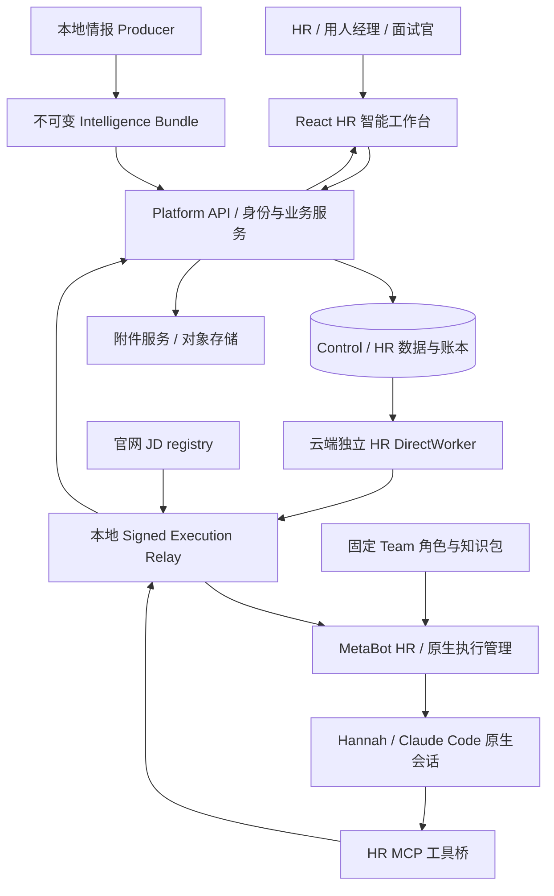
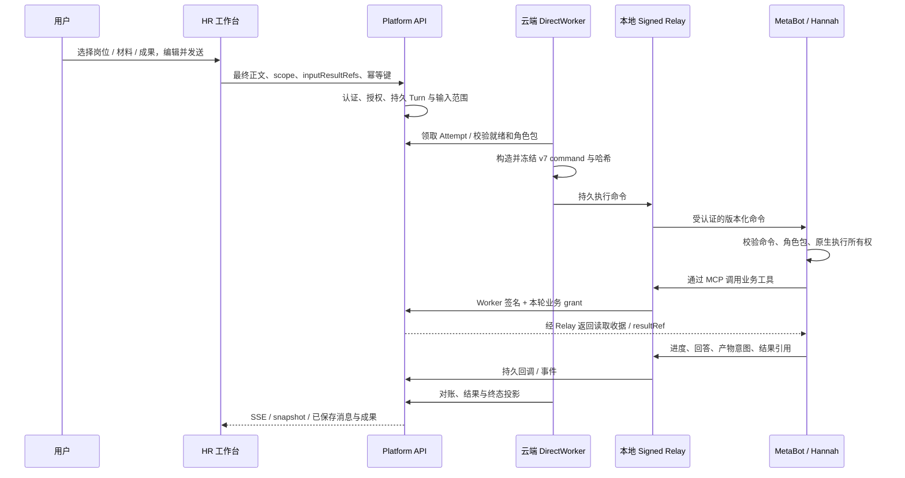
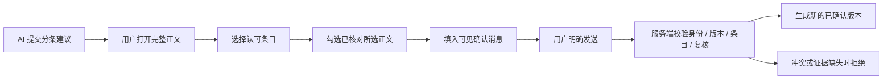
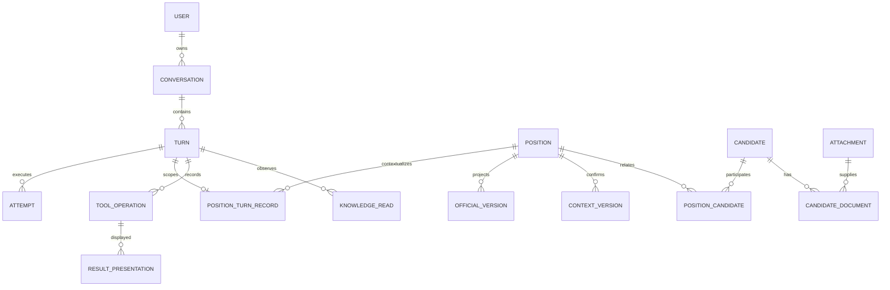

> **历史归档，2026-09-09。** 已被根目录两份主文档替代，仅作需求与旧实现快照。 [当前总体架构](../../../../../../../HR总体架构设计.md) / [当前工作流](../../../../../../../HR_Agent工作流.md)。以下原状态/授权/未勾选项是历史记录；不证明当前仍待实施。相对链接已按归档位置重定位。

# HR Agent 与 HR 智能工作台整体架构设计

日期：2026-09-09  
文档性质：当前实现的架构说明、已确认产品原则、尚未闭合的设计及后续建议。  
阅读对象：产品负责人、HR、用人经理、前后端开发、Agent / 运行时开发及运维。


目录：

- [0. 阅读规则与事实基线](#chapter-0)
- [1. 产品定位、服务对象与边界](#chapter-1)
- [2. 已确认的整体产品原则](#chapter-2)
- [3. 五大业务场景及其实际边界](#chapter-3)
- [4. 用户界面与信息架构](#chapter-4)
- [5. 系统组件与仓库边界](#chapter-5)
- [6. 角色、场景、思维模型与工具的关系](#chapter-6)
- [7. 一轮任务如何执行](#chapter-7)
- [8. 上下文、冻结输入与连续工作](#chapter-8)
- [9. 三个业务工具与实际授权](#chapter-9)
- [10. 成果类型、归属与保存状态](#chapter-10)
- [11. 标准确认与组织协作语义](#chapter-11)
- [12. 数据模型、权威来源与生命周期](#chapter-12)
- [13. 官网 JD：同步、使用前校验与标准冲突](#chapter-13)
- [14. HR 情报：生产与消费是独立链路](#chapter-14)
- [15. 附件、简历、候选人和文件产物](#chapter-15)
- [16. 执行状态、恢复与可观测性](#chapter-16)
- [17. 接口分层与兼容边界](#chapter-17)
- [18. Web、CLI、飞书和平台其他 Agent](#chapter-18)
- [19. 部署拓扑与版本管理](#chapter-19)
- [20. 当前能力矩阵](#chapter-20)
- [21. 后续整体设计：把五类场景做成可交付的工作](#chapter-21)
- [22. 用 DQE 岗位串起完整体验](#chapter-22)
- [23. 验证策略与业务质量](#chapter-23)
- [24. 关键代码索引与阅读路径](#chapter-24)
- [25. 关联设计、发布证据与本次边界](#chapter-25)

<a id="chapter-0"></a>

## 0. 阅读规则与事实基线

本文件把之前分散在角色定义、统一工具设计、方法库设计、页面实现和发布记录中的内容收敛到一处。它不把历史设计全部当成已经实现，也不因某次构建或部署成功就宣布招聘业务闭环完成。

使用以下状态标记：

- **【已实现】**：当前审阅代码存在对应能力；具体是否部署，以本节发布基线为准。
- **【已定原则】**：用户已确认的产品方向，约束后续开发，不代表所有界面已经完成。
- **【现有缺口】**：代码、契约或页面尚未提供，或已有能力之间没有接通。
- **【建议设计】**：本文件提出的收敛方案，尚未因此成为新实现或已批准发版内容。
- **【未验证】**：本轮及已有证据不能支持结论的部分。

### 0.1 审阅代码与运行版本

| 对象 | 基线 | 解释 |
| --- | --- | --- |
| Platform 文档编写前 HEAD | `35ab8d6` | 包含 v7 和首次发起入口；在 `feat/hr-role-tools-v6` 工作树审阅 |
| 最近发布的 Platform API / 网页 | `44de9209b77343facf3117fe3ab4d3450eaf2062` | 页面资源 `index-CKvvUzmz.js` / `index-kGV1boCB.css` |
| 云端独立 HR Worker / 本地 Signed Worker | `1a705ebb4b6598c61bc0d767ff44e2afc038a539` | v7 执行链；后续纯前端发布没有重复更新执行器 |
| HR MetaBot | `672058ca5d316c9ada2a460e211f8ec5cca1b70a` | v7 接入、原生执行与 HR MCP 工具 |
| Team 固定角色 / 知识提交 | `a87500e2d0b4d35eb28713fb04b8274964e76d23` | Hannah、相关技能、共享规则及七份参考资源 |
| 角色包清单 SHA-256 | `2645347d161a53c2bd95cdc00529973feea4e00831331e46b434a662c03348d5` | 与提交身份一起固定 |
| 当前新增 HR 协议 | `core_chat_collaboration_v7` | v5 / v6 历史按原协议解释 |
| 最近两项 HR 正式迁移 | 094、095 | 统一工具与旧链路退出；输入成果引用与结果归属扩展 |

以上运行状态来自本会话已经完成的发布记录，本次编写文档没有重新查生产数据、运行测试、发送模型消息或部署。当前用户人数、招聘效果、真实模型方法使用率、历史数据分布均不由本文件推定。

优先级：本文件的当前实现说明及最新交付记录，覆盖旧设计中已经失效的“待实现”或“已上线旧入口”表述。原始设计与迁移保留作历史依据。

### 0.2 最关键的现状判断

1. HR 智能工作台已有统一主对话、岗位选择、候选人资料、情报阅读、方法库、受授权工具和持久成果。
2. Hannah 是一个 Agent，内含五类专业职责；不是五个独立 Agent，也没有五套已部署的场景执行器。
3. “梳理 JD / JR”“制定搜寻策略”等按钮当前主要生成用户可编辑的自然语言要求；按钮自身没有选择独立专业流程。
4. v7 做实的是输入引用、工具授权、结果类型与确认边界，尚未做实五类场景各自的业务完成判定。
5. 岗位目录还没有成为用户要求的“JD/JR—候选人—面试—反馈”全链路成果视图。
6. 工程执行完成、成果提交成功、用户确认岗位标准、招聘工作达成目标是四个不同结论。

<a id="chapter-1"></a>

## 1. 产品定位、服务对象与边界

### 1.1 Hannah 的使命

**【已定原则 / 角色已实现】** 把模糊招聘需求转化为可搜索、可判断、可面试验证的人才标准；结合用户材料和公开专业信息，帮助发现、理解、接触和评估可能合适的人才。

服务对象包括招聘团队、HRBP、用人经理、技术面试官和承担招聘职责的业务负责人。用户可以直接提供岗位、问题、简历或反馈，不需要为了开始讨论先建立项目或填写完整表单。

### 1.2 三个相互关联但不同的产品对象

| 对象 | 是什么 | 主要职责 |
| --- | --- | --- |
| HR Agent / Hannah | 具有专业角色与工具能力的执行者 | 理解意图、选择方法、取证、分析、澄清、提交成果 |
| HR 智能工作台 | 用户操作与阅读界面 | 输入、对象选择、资料与成果展示、引用、确认、执行状态 |
| HR 业务与执行平台 | 权威数据和可靠执行底座 | 身份、授权、持久化、版本、幂等、恢复、文件、审计 |

页面上的一句话不是专业能力的全部；Agent 的一段回答也不是持久业务状态。工作台必须让用户看见“这次处理哪个岗位、用哪些资料、留下什么成果、下一步在哪里”。

### 1.3 明确不自动执行的事项

- 不自动对外联系候选人；保存沟通草稿与发送消息分开。
- 不自动作出录用、淘汰或薪酬承诺。
- 不自动覆盖、发布或下架官网 JD。
- 不把用户认可某位候选人的评价，直接转成长期岗位标准。
- 不把候选人材料、逐人评价、原始面试记录写进共享知识库或 FAQ。
- 当前不是完整 ATS：Offer、编制审批、入职及组织级招聘权限体系未在本次架构中形成完整产品。

<a id="chapter-2"></a>

## 2. 已确认的整体产品原则

1. **主对话是工作的发起和推进位置。** 允许一个持续对话讨论不同岗位，岗位只决定本轮范围。
2. **岗位是业务成果的组织对象。** 用户应能按岗位查看标准、候选人、面试和反馈，而不必翻全部聊天。
3. **自然语言是用户意图。** 快捷动作可以辅助起草，但最终发送正文必须可见、可编辑，不另有隐藏罐头任务正文。
4. **角色职责保持统一。** 不因为五种场景就拆出五份重复角色模板或五个相互冲突的选择器。
5. **方法自主选用。** 思维模型用于解决具体问题，允许组合、不使用、先澄清；不机械执行七份参考资源。
6. **事实按需读取。** 权威 JD、已确认标准、候选人和成果由工具取得，保留来源版本。
7. **业务成果显式提交。** 保存必须有结果 ID、类型、归属和来源；聊天正文不能冒充保存成功。
8. **长期标准由人确认。** 确认具体版本、具体条目和正文，保留真实确认者。
9. **历史不可被当前选择重写。** 切换岗位、恢复执行或更新角色包都不回写旧轮次。
10. **废弃产品一次退出。** 不恢复旧五按钮执行器、岗位包自动投影或隐藏 Markdown 信封链路。

<a id="chapter-3"></a>

## 3. 五大业务场景及其实际边界

五类场景是业务能力分类，不要求每个岗位依次走完，也不要求用户先从五项中选一项才能说话。

### 3.1 场景一：岗位分析与需求校准

**业务问题：** 这个岗位为什么存在，要解决什么问题，需要怎样的人，现有 JD/JR 的要求是否合理。

**常见触发：** 新需求不清楚、官网 JD 过于泛化、硬条件过多、HR 与用人经理理解不同、长期招不到人、业务目标变化。

**输入：** 当前官网职责和任职要求、已确认岗位标准、业务背景材料、用户补充的工作目标与约束。缺少材料时先明确未知，不能自行编造部门业务或设备指标。

**应处理的内容：**

- 岗位使命与预期结果：要解决什么问题，成功表现是什么。
- JD：职责、任务、工作边界和协作关系。
- JR：本产品语境下的任职 / 甄选要求；区分必须、加分、可培养和需要验证的能力。本文件不把 `jr` 模块自动解释成编制审批单。
- 人才画像：把技术标签转成可观察能力、经历信号与证据要求。
- 条件冲突：年限、行业、工具、地点等条件是否服务真实任务，有无不必要限制。
- 澄清问题：优先询问会改变搜寻方向或评估结果的问题。

**交付：** 岗位分析说明；确需长期复用时提交分条标准建议。官网原文继续作为事实，内部建议不成为第二个官网事实源。

**当前实现：** 有角色小节、岗位读取工具、分析 / 标准建议 schema、确认链；主对话有“梳理 JD / JR”快捷输入。

**现有缺口：** 没有 JD/JR 场景专属的完整性判定。`hr.standard-proposal.v1` 允许来源数组为空，模块正文也为自由文本；不能凭 schema 接受证明已经读过 JD、完成业务澄清或运用了合适方法。

### 3.2 场景二：人才搜寻与吸引

**业务问题：** 去哪里找人，哪些相邻背景可以迁移，为什么值得联系，如何真实介绍岗位价值。

**输入：** 岗位画像、已确认搜寻条件、目标技术方向、公司 / 行业情报、用户提供的线索和既有反馈。

**工作内容：**

- 对标公司与人才池：公司、项目、专业社区，标注优先级和原因。
- 搜索条件：技术关键词、经历组合、相邻方向与排除条件。
- 公开人才证据：专业项目、论文、开源贡献等；核对身份，区分同名与证据不足。
- 能力迁移：分析来自不同经历的能力如何组合，而不是要求所有能力出现在同一岗位名称下。
- 个性化吸引：基于真实岗位价值与候选人经历形成沟通角度，列出未核实承诺。

**交付：** 搜寻策略、人才地图、线索 / 卡片、单人沟通草稿。稳定通用搜寻条件可形成待确认岗位标准。

**当前实现：** Hannah 搜寻和沟通职责、原生研究工具、情报阅读、通用分析结果及 `hr.candidate-outreach-draft.v1`；岗位有“制定搜寻策略”快捷输入。

**现有缺口：** 无统一的人才线索到平台候选人转换产品；公开线索不天然拥有 `positionCandidateId`。单人沟通成果要求已有候选人归属，不能声称任何刚发现的公开人才都能无手续直接保存为候选人成果。人才地图仍主要是通用报告，不是完整可交互人才池。

### 3.3 场景三：候选人评估

**业务问题：** 这个人有哪些岗位相关证据，哪些是简历陈述、合理推断或需要验证的未知；不同候选人证据如何比较。

**输入：** 岗位基准、获准候选人关系、所选简历 / 材料、公开成果、已登记的人类反馈及明确引用的旧分析。

**工作内容：** 分析维度、证据出处、匹配与差距、跨经历能力、矛盾和下一步验证；不输出无依据的精确总分，不把分析变成录用决定。

**交付：** `hr.candidate-analysis.v2`。一个结果可关联 1–10 位候选人；证据项必须属于结果所列候选人。比较是比较证据，不是默认自动排名。

**当前实现：** 简历导入 / 解析 / 确认、候选人资料、分析入口、非空基准和候选人范围校验。已有候选人即使没有当前已确认标准，也可先使用官网 JD 或所选附件作为基准。

**现有缺口：** 新导入候选人的“确认”仍要求真实岗位上下文版本；不能把“分析允许无已确认标准”误写成“整个候选人入库流程不再要求标准”。新 v7 分析也未统一投影到旧候选人分析历史。

### 3.4 场景四：面试设计与记录

**业务问题：** 针对这个人应该问什么，每个问题验证什么，怎样识别有说服力的证据，实际面试记录是否支持判断。

**方案输入：** 岗位基准、候选人简历 / 公开成果、选中的分析结果与用户关注点。

**方案交付：** 目标、能力维度、针对经历的问题、追问、验证目的、强证据、普通回答、风险信号、技术核验点及记录模板。使用单人 `hr.candidate-interview-plan.v1`。

**记录输入：** 用户实际提供的面试记录材料；使用历史方案时必须显式引用并在本轮读取。

**记录交付：** `hr.candidate-interview-record.v1`，保存实际回答证据、判断、未知和下一步验证。不能根据问题列表编造面试已经发生。

**当前实现：** 候选人详情可发起面试；已有分析可“准备面试”；方案可“整理面试记录”；引用和记录材料有契约校验。

**现有缺口：** 未形成独立面试轮次管理、面试官协同填表、录音转写、日程或结构化评分产品。记录 schema 存在不等于这些能力存在。没有使用历史方案时 `planRef` 可显式为空，但记录材料仍必须存在。

### 3.5 场景五：招聘复盘与标准迭代

**业务问题：** 为什么这一批人效果不理想，搜索偏了还是要求不合理，面试官之间的分歧究竟在哪里，下一批怎么调整。

**输入：** 当前岗位标准、批次搜寻结果、候选人分析、实际面试反馈及用户对结果的说明。

**交付：** 本批观察、下一批动作、待统一问题。岗位级报告只留去标识化共性；标准调整另行形成建议并确认。

**当前实现：** 角色定义包含批次诊断和面试官一致性分析；可保存通用分析和标准建议，候选人证据可用受授权结果表达。

**现有缺口：** 没有专属批次业务对象、招聘漏斗、周期基准及复盘报告结构。去标识化主要依赖角色要求与人工复核；`hr.analysis.v1` 自由正文不能自动证明不存在个人信息。

### 3.6 场景与成果边界汇总

| 场景 | 岗位级成果 | 候选人级成果 | 可进入长期标准的内容 |
| --- | --- | --- | --- |
| 岗位分析 | 需求分析、标准建议 | 不要求 | 经共同确认的职责、要求、画像 |
| 搜寻与吸引 | 搜寻策略、人才池研究 | 具体候选人沟通草稿 | 通用搜索条件；不能包含逐人名单和联系方式 |
| 候选人评估 | 去标识化共性问题 | 单人 / 多人证据分析 | 提炼后的岗位级条件，另行确认 |
| 面试 | 通用面试标准 | 专属方案、实际记录 | 通用验证维度；不能直接保存个人原话 |
| 招聘复盘 | 共性观察、调整建议 | 需要保留的逐人分析 | 经确认、去标识化的下一批标准 |

<a id="chapter-4"></a>

## 4. 用户界面与信息架构

### 4.1 当前四个主入口

| 入口 | 当前实现 | 不应误称为 |
| --- | --- | --- |
| 对话 `/hr/`、`/hr/conversations/{id}` | 发起工作、流式回答、上下文选择、成果及确认 | 五种独立任务工作流的总控台 |
| 岗位 `/hr/positions` | 搜索、列出岗位、选中后返回主对话 | 已完成的招聘全链路看板 |
| HR 情报 `/hr/panorama` | 公司 / 专题阅读、依据浏览、带入对话 | 点击即重新采集、重新生成的实时情报引擎 |
| 方法与模型 | 展示七份资源，阅读并选入本轮 | 五个可切换角色或一键自动执行全部方法 |

`HrWorkspaceShell` 提供统一顶栏、导航、用户身份与只读提示。`HrWorkspacePage` 组织主对话、目录、情报和抽屉；主对话与已访问情报区域在工作区内通过隐藏 / 显示保留状态。完整页面刷新后的状态恢复范围不能由这种组件保留机制推定。

### 4.2 主对话的组成

- 对话历史与消息区：文本、流式状态、文件、错误与结果。
- 底部输入区：用户正文、附件、岗位选择、岗位材料、候选人选择状态。
- 岗位入口：查看 JD/JR、梳理 JD/JR、制定搜寻策略、候选人 / 面试。
- 方法选择：当前资源引用，可移除；不代表已经使用。
- 情报引用：来自公司或专题的显式选材。
- 本次参考：选中的已有业务成果，可打开、移除。
- 轮次成果：已保存结果、继续动作、标准建议条目与正文复核。

当前 `HrPositionActions` 只向 `fill` 传具体意图；`fill` 设置草稿和范围，最终仍走既有消息发送。没有隐藏 `taskKind=jd`、独立 JD 执行服务或第二条用户消息。

### 4.3 岗位资料抽屉

三个页签：

1. **JD / JR**：官网原文、内部已确认上下文及其来源。
2. **候选人**：导入简历、解析状态、确认、候选人资料与既有分析 / 反馈。
3. **材料与成果**：岗位材料、附件及资源读取 / 下载。

“查看 JD / JR”用于阅读；“梳理 JD / JR”用于表达分析意图；二者不能混成同一操作。

旧 `/hr/positions/{id}` 路由在当前工作区显示“岗位工作页已合并到主对话”提示，而不是旧版完整岗位工作台。链接仍可能存在，不代表旧控制器仍在运行。

### 4.4 岗位全链路视图应承担什么

**【已定方向 / 尚未实现】** 用户要求岗位页展示从主对话保存的工作成果，形成：

```text
岗位概览
  ├─ JD / JR：官网事实、已确认标准、待确认建议
  ├─ 人才搜寻：画像、策略、对标公司与线索
  ├─ 候选人 / 简历：候选关系、材料、分析与待验证问题
  ├─ 面试：方案、实际记录、仍缺的证据
  └─ 复盘：共性问题、下一批动作、标准变化
```

这是对同一批真实数据的组织和展示，不应再建立一套岗位页专用生成器。每份成果可回到来源对话；从岗位页继续工作时带上具体对象和成果引用。

**当前差距：** `HrPositionIndex` 只有搜索列表；v7 通用结果读取接口以会话或 resultId 为入口，没有完整的按岗位阶段聚合查询和页面。

<a id="chapter-5"></a>

## 5. 系统组件与仓库边界



图中的循环表示执行与工具调用，不表示模型可以自由获得数据库权限。云端 Worker 与本地 Relay 是不同进程、不同职责。

### 5.1 Platform 仓库

- `webui/`：React / TypeScript 工作台、消息、资料、成果和引用交互。
- `backend/app/agent_brain/`：通用 Conversation / Turn / Attempt，直接 Agent 的受理、冻结、执行协调、结果投影与快照。目录名含 `agent_brain` 不代表每条 HR 消息都调用 Brain Agent 做多 Agent 编排。
- `backend/app/hr/`：岗位、候选人、上下文、业务工具、确认、情报与方法库投影。
- `backend/app/execution_relay/`：命令 / 事件协议、签名、租约、回调、恢复和本地 Worker。
- `backend/app/attachments/`：文件生命周期、绑定、授权、读取与产物。
- `backend/tools/hr_intelligence/`：独立的本地情报生产工具；不是 Web 请求中的模型分析模块。
- `backend/control_migrations/` 与 `hr_web/`：权威数据库结构和迁移历史。

### 5.2 MetaBot 仓库

- 接收版本化命令、校验哈希、持久接受记录。
- 管理原生执行所有权、启动、事件流、停止、恢复与终态回调。
- 核验固定角色包，指定 `bots/hr` 为运行 cwd。
- 为本轮生成私有 MCP 配置和 capability 文件。
- 收集工具保存的真实 resultRef；将实际原生 Read 事件转成知识读取证明。
- 不维护 Platform 岗位标准的第二份权威副本。

### 5.3 Orbbec-Agent-Team 仓库

- `bots/hr/CLAUDE.md`：Hannah 角色、职责、证据纪律与场景交付。
- `bots/hr/.claude/skills/`：JD 查询、岗位校准等工具使用规则。
- `bots/hr/knowledge/`：统一方法索引、七份正文及来源台账。
- `shared/`：共同业务背景、基础规则、研究规则。
- `services/hr-jd-sync/`：官网事实注册表、同步、历史和校验。
- `services/hr-role-calibration/`：访问 Platform 同一标准服务的客户端；不再维护本地岗位标准文件。
- `scripts/build_hr_role_package.mjs`：从指定 Git 提交生成不可变角色包与文件清单。

<a id="chapter-6"></a>

## 6. 角色、场景、思维模型与工具的关系

### 6.1 当前实际机制

```text
固定 Hannah 角色
  + 原有五类场景职责
  + 本轮用户最终正文
  + 固定岗位 / 候选人 / 材料 / 成果引用
  + 可选择的参考资源
  + 受授权业务工具与原生工具
  → 模型判断需要澄清、取证、分析或交付什么
```

五类职责均在同一 `CLAUDE.md` 中，没有按按钮卸载 / 加载角色小节。专业职责与思维模型都是文本认知材料；工具是运行时可执行接口。内容分类不等于必须建三套加载机制。

### 6.2 原生工具与平台业务工具

| 类别 | 例子 | 提供什么 | 不提供什么 |
| --- | --- | --- | --- |
| 原生执行工具 | Read / Glob / Grep，以及该原生会话允许的研究、文件能力 | 读取固定方法、用户文件、执行研究与产物处理 | 不自动授予 Platform 私有业务数据权限 |
| 平台 HR 工具 | read_context / submit_result / confirm_standard | 本轮授权读取、结构化保存、真实用户确认 | 不替模型决定专业方法是否合适 |
| 技能文件 | jd-registry / role-calibration | 使用方式、事实与确认纪律 | 文件自身不构成凭据或授权 |

原生工具的实际可用性取决于运行时配置。`toolPolicy=default` 不是“无限权限”，也不能用它证明任意外部来源都可访问。

### 6.3 七份思维模型 / 方法资源

| ID | 资源 | 适合解决的问题 | 常见关联场景 |
| --- | --- | --- | --- |
| `job-and-context` | 岗位与业务情境 | 岗位为何存在，关键任务与要求来源 | 岗位分析、复盘 |
| `requirement-calibration` | 要求校准与 AMO | 条件过多、长期空缺，问题在需求、供给、吸引力还是甄选 | 岗位分析、搜寻、复盘 |
| `competency-and-profile` | 胜任力与人才画像 | 把抽象标签变为可观察行为与能力层级 | 岗位分析、候选人评估、面试 |
| `sourcing-and-transfer` | 人才来源与能力迁移 | 跨行业、相邻岗位、应届生能力迁移 | 搜寻、候选人评估 |
| `evidence-informed-judgment` | 循证判断 | 区分陈述、事实、推断，处理冲突与未知 | 全部场景 |
| `selection-and-work-samples` | 甄选与工作样本 | 结构化面试、工作样本、公平和一致性 | 面试、评估 |
| `comparison-and-learning` | 候选人比较与反馈 | 同一岗位基准下比较，从反馈形成可审阅学习 | 比较、复盘 |

本表是用途说明，不是已实现的自动路由表，也不要求一次任务读取整列资源。只解释 JD 某个词，可能无需专门方法；条件互相冲突时可能组合多份资源。

### 6.4 方法使用有三层证据

1. 用户选择 / 包内可用：文件可以被读取。
2. 实际读取：MetaBot 观察原生 Read 的 tool-use 与成功 tool-result，核对文件 hash，记录 `teamCommit / methodId / revision / sha256 / toolUseId`。
3. 回答体现：成果是否真的用该方法建立了合理判断，需要业务审阅。

结果中的 `methodSteps` 是模型提交的说明，不能替代第二层运行证据。当前 schema 可接受空 `methodSteps`；也没有统一机制判定阅读内容已经完整理解。原生读取证明不等同于认知质量证明。

### 6.5 固定版本与部署

Team 从已提交 Git 对象生成清单；Platform 固定 commit 与清单 hash；MetaBot 核对身份及文件后选择包内 cwd。知识浏览投影与 Agent 角色包从同一 Team 提交构建，两份部署产物只有一个内容维护源。

旧 Attempt 继续使用原角色与方法版本；不能更新目录后让重试静默读新方法。配置版本不匹配应拒绝新受理 / 执行，不能悄悄降级回旧双信封路径。

<a id="chapter-7"></a>

## 7. 一轮任务如何执行

### 7.1 用户发起到持久结果



该图省略租约续期与失败分支，不表示每轮必定提交成果。普通问答可以只有回答。

### 7.2 标识各自代表什么

| 标识 | 生命周期 / 用途 |
| --- | --- |
| `conversationId` | 一段持久对话；不是唯一岗位归属 |
| `turnId` | 一次用户发送及其响应；固定本次业务输入 |
| `attemptId` | 某次执行尝试与恢复协调单元 |
| `commandId / commandHash` | 已冻结命令身份与内容一致性 |
| `runId` | 运行及附件授权等关联身份 |
| `leaseEpoch` | 当前执行租约世代，阻止旧执行者继续写入 |
| `operationId` | 本轮工具调用幂等身份 |
| `readId` | 成功读取操作的持久收据 |
| `resultId` | 已提交成果的持久身份 |
| `contextVersionId` | 已确认岗位标准或其历史版本 |

代码复用通用 Mission / execution job 等兼容底座，不应因此再向用户暴露另一套“HR 任务管理项目”。

### 7.3 用户身份与请求安全

Web 使用 Platform 的登录 session；HR 路由还需通过 Agent 使用授权，写操作保留 CSRF 等请求保护。工作台显示的 `hard_stale_read_only` 来自身份 / 通讯录时效判断，它不是前端自行决定的业务权限替代品。浏览器可以禁用按钮，服务端仍必须验证同一用户的可写权限。

用户、执行 Worker、模型运行中的 capability 是不同身份层。拥有内部网络连接或有效 Worker 签名，不意味着能访问任意用户的岗位；同样，知道 resultId 也不等于具备读取权限。

### 7.4 四种完成状态必须分开

| 状态 | 能证明什么 | 不能证明什么 |
| --- | --- | --- |
| Turn `completed` | 运行链路得到可接受的结束证据及回答投影 | 已完成 JD 校准、已经招到人 |
| `hr.submit_result` 成功 | 指定类型与范围的结果已保存 | 内容专业、足够完整、已经被用户认可 |
| 标准确认成功 | 用户选中的条目进入岗位标准版本链 | 候选人评价被批准、官网已修改 |
| 业务目标达成 | 用户可实际使用成果推进招聘，并满足场景要求 | 不能从前三项自动推导，需业务证据 |

**现有缺口：** 没有统一的“岗位场景业务完成”判定对象或完整界面。不要让用户看到一次回答结束，就理解为岗位任务闭环。

<a id="chapter-8"></a>

## 8. 上下文、冻结输入与连续工作

### 8.1 本轮输入由什么组成

- 用户最终发送正文。
- `scope`：当前岗位、候选人关系、附件。
- `methodSelection`：可选的固定方法资源引用。
- `inputResultRefs`：本次明确选择的旧成果。
- 附件实际授权与可下载位置，由运行时提供，不把私密 bearer 放进正文。
- 如用户正在确认标准，加入绑定本条真实消息的 `userStandardConsent`。
- 有限历史消息及方法索引；情报显式选材当前会序列化进入用户消息。

v7 的“冻结”不是冻结所有业务事实正文后禁止取数，而是固定用户意图、对象范围、角色 / 方法身份及输入成果，再让工具按此范围读取。

### 8.2 冻结契约

`contextMode = frozen_intent_with_tools`。

上下文 hash 的规范化键为：

```text
prompt
scope
rolePackage
methodSelection
inputResultRefs
```

命令 hash 还纳入运行命令身份与相关能力字段。凭据续期使用专门的授权 / 租约处理，不得用续期机会改变原业务输入。`inputResultRefs` 必填数组；无引用时为 `[]`，不是省略字段来改用另一套语义。

### 8.3 当前数量与体积限制

| 位置 | 当前限制 | 含义 |
| --- | --- | --- |
| 单轮岗位 | 0 或 1 个 | 选岗位不能自动授权跨岗位比较 |
| `positionCandidateIds` | 最多 10 个，去重 | 具体岗位候选关系，不能只给姓名 |
| `attachmentIds` | 最多 32 个，去重 | 执行附件还受总字节限制 |
| 输入成果引用 | 最多 20 个，resultId 去重 | 精确 schema 与内容 hash |
| 方法选择 | 最多 32 项，序列化上限 8192 B | 实际当前目录为七份资源 |
| 初始直接历史读取 | 最多 64 条消息，再按预算缩减 | 不自动压缩成一份模型生成摘要 |
| 实际构造 prompt | 96 KiB | `ConversationContextBuilder` / adapter 限制；不是全部原生上下文成本 |
| v6/v7 命令 prompt 字段 | 契约允许最高 128 KiB 级限制 | 上游实际构造仍受 96 KiB 约束，不能用更宽 schema 绕过 |
| HR 执行输入附件总量 | 50 MiB | 与批量上传界面的单文件 / 总量上限属于不同环节 |
| 情报显式选材文本 | 12 KiB | 当前拼入消息，不等于 v7 结果输入引用 |

前端批量简历上传可以接受更多文件并逐份解析，不表示可在同一模型轮次同时带入整个批次。超过范围应拆分具体工作，不截断后假装完整分析。

### 8.4 历史消息的真实边界

**已实现：** HR 新轮上下文的历史 SQL 按相同 `positionId` 过滤；切换岗位不会把另一岗位的全部历史自动加入。

**不能扩大解释：** 当前这段 SQL没有按候选人集合过滤同岗位历史。同一岗位先讨论 A 再讨论 B，即使 B 的工具授权不含 A，A 的文字仍可能作为同岗位历史出现。工具的严格范围与历史文字过滤是两条不同路径。

**现有缺口 / 建议审查：** 要明确同岗位候选人历史的产品语义，并让消息上下文、显式成果引用、附件授权采用一致边界。当前证据不支持“没选 A 就绝不会把 A 的历史文字送给模型”。这属于当前用户范围内的上下文边界问题，不等于已发现跨用户数据泄露。

### 8.5 三种“引用”当前并不完全同构

| 引用 | 当前实现方式 | 可验证程度 |
| --- | --- | --- |
| 已保存成果 | 顶层 `inputResultRefs`，服务端验 owner / 岗位 / 候选人 / schema / hash | 本轮固定输入，可通过 result 工具读取 |
| 方法资源 | `methodSelection` + 固定角色包 / 文件 hash | 版本固定；实际原生读取另外记录 |
| 公司 / 专题情报选材 | 浏览器生成含 bundle、单元、范围、限制的可见引用文本，进入消息 | 正文可回放，但不是同等的服务端输入成果对象校验 |

不能把页面均显示“参考”解释成全部都经过相同的严格结构化授权。手写情报引用文本也不自动变成可信来源凭据。

### 8.6 连续任务实例

1. 分析候选人，保存结果 R1。
2. 用户点击 R1 的“准备面试”，看到候选人及 R1 被带入，补充“重点验证数采设备量产经历”后发送。
3. 新轮冻结 R1 的 ID、schema、hash；模型实际读 R1，取得本轮收据，提交方案 R2。
4. 用户从 R2 继续，附上实际面试记录材料。
5. 新轮读取 R2，提交记录 R3；其 `planRef` 指向 R2，问题身份与原方案对应。
6. 若要把共性经验保存为标准，另提炼岗位级建议 R4，由用户复核并确认。

R1 → R2 → R3 是成果之间的关系，不是把 R1 的正文覆盖为最新内容。来源材料失效时，读取应明确拒绝；不能只因历史结果曾存在就永久绕过授权。

<a id="chapter-9"></a>

## 9. 三个业务工具与实际授权

### 9.1 `hr.read_context`

| resourceKind | 返回内容 | 范围 / 版本要求 |
| --- | --- | --- |
| `official_position` | 选中岗位的官网事实与校验信息 | 当前岗位；registry 版本与时效明确 |
| `confirmed_standard` | 当前完整已确认标准，或显式 unconfirmed | 当前岗位；不能伪造 contextVersionId |
| `candidate` | 获准候选人事实、所选有效文档元数据及反馈 | `positionCandidateId` 在本轮范围 |
| `material` | 附件 ID、hash、媒体类型、大小和交付提示 | 附件已授权；**不返回或证明已读取正文** |
| `intelligence` | 当前已发布情报包的聚合、分析与依据索引 | HR 使用权限；可指定当前包身份 |
| `result` | 本次参考中确切成果的内容与身份 | 固定 resultId / schema / hash；校验源范围有效性 |

`readMode=recorded` 优先使用本轮首次成功记录的读取版本，支持恢复 / 重试；`reverify` 显式请求重新核验。结果输入自身不可因 reverify 换成更新的一份。

结果读取 / 输入可按授权引用同一 owner、同岗位的其他会话成果；当前标准确认查询还要求建议与确认消息属于同一 conversation。两种操作的跨会话范围并不相同，不能据输入引用能力推定任意会话都能确认另一会话的建议。

候选人事实、已保存结果和标准有实际内容返回；附件元数据收据只证明哪个文件获准进入流程。模型要理解简历仍须通过原生文件路径读取 / 解析正文。

### 9.2 `hr.submit_result`

- 以实际冻结命令版本选择解析器；不能通过改请求 URL 逃避 v7 约束。
- 校验 schema、候选人范围、基准及来源收据。
- 相同 `turnId + operationId`、相同请求返回同一持久结果；同键改内容返回冲突。
- 内容加密保存到结果操作账本，产生 resultRef。
- v7 记录结果候选人集合与 `candidateDerived`。
- 模型在 Markdown 中写“已保存”不触发保存；必须得到真实工具成功回执。

### 9.3 `hr.confirm_standard`

- 必须是当前真实用户消息的明确确认。
- 用户此前已查看建议；proposal 身份、hash、选中 changeId 必须一致。
- 检查预期基线仍为当前标准；有并发修改则拒绝，要求重新查看。
- v7 必须有正文复核声明。
- 只合并选中模块，继承其他完整标准内容；记录真实确认者和时间。

### 9.4 工具调用经过哪些权限

```text
原生模型发出业务参数
 → 本轮 MCP 私有配置附加 capability
 → 本地 Relay 校验对应 callback / run / 当前租约
 → Relay 签名发送到 Platform
 → Platform 验 Worker 身份与 hr-bot 权限
 → 验 grant、token hash、Attempt 与 lease
 → 重新核对用户 HR 使用权限及本轮范围
 → 校验对象 owner、岗位、候选人、附件 / 来源
 → 执行、持久化、返回收据
```

凭据不由用户或模型填写 owner UUID 生成，不置于普通聊天文本。角色文件的约束与服务端授权相互补充，服务端不能信任模型“我有权限”的自述。

### 9.5 错误含义

| 类型 | 典型原因 | 用户应该得到的结果 |
| --- | --- | --- |
| `scope_mismatch` | 对象不在本轮范围 | 指出需要重新选择哪个对象 |
| `permission_expired` | 权限、租约、材料可用性失效 | 停止相应操作；可恢复时沿用原操作身份 |
| `idempotency_conflict` | 同操作编号换内容 | 不产生第二个结果，不假装成功 |
| `source_unavailable` | 无可用版本 / 情报 / 官网事实 | 明确缺失；仅在允许时使用标明降级的版本 |
| `version_conflict` | 版本或确认基线已变 | 读取差异并重新确认 |
| `confirmation_required` | 未展示、无精确确认或未复核 | 回到用户确认流程 |
| 请求格式错误 | schema 或路由不匹配 | 不受理错误结构 |

<a id="chapter-10"></a>

## 10. 成果类型、归属与保存状态

### 10.1 v7 新提交接受的六类成果

| schema | 关键内容 | 归属 | 能否直接确认成标准 |
| --- | --- | --- | --- |
| `hr.analysis.v1` | title、markdown、sourceRefs、methodSteps | 本轮 / 岗位级通用报告；无结果自身候选人集合 | 否；另提标准建议 |
| `hr.standard-proposal.v1` | 基线、1–8 条 change，每模块一条 | 当前岗位 | 仅此类进入标准确认流程 |
| `hr.candidate-analysis.v2` | 1–10 人、非空基准、逐维证据与验证 | 指定岗位候选关系 | 否 |
| `hr.candidate-interview-plan.v1` | 单人、基准、目标、问题、模板 | 单个岗位候选关系 | 否 |
| `hr.candidate-interview-record.v1` | 单人、实际记录材料、回答、可空方案引用 | 单个岗位候选关系 | 否 |
| `hr.candidate-outreach-draft.v1` | 单人、目的、草稿、未核实承诺、来源 | 单个岗位候选关系 | 否 |

`hr.candidate-analysis.v1` 仍可作为历史结果引用；v7 新提交使用 v2。不要把协议版本 v7、业务 schema 版本 v1 / v2 和用户标准版本混为一谈。

### 10.2 候选人基准的三分支

```text
baselineRefs（非空）
  ├─ confirmed_standard：contextVersionId + readId + contentSha256
  ├─ official_position：positionId + versionRef + readId + contentSha256
  └─ user_material：attachmentId + readId + contentSha256
```

服务端检查收据属于本轮、资源类型正确、hash 一致，且引用确为获准岗位 / 附件 / 已确认版本。

只有口述要求而没有可登记基准时，可继续分析讨论；不能伪造一个基准满足 schema 后提交。如何把口述需求登记为独立可引用材料，当前没有专门契约。

### 10.3 面试方案的具体结构

每个问题有 `questionId`、dimension、question、followUps、verificationGoal、strongEvidence、ordinaryAnswer、riskSignals、technicalChecks。问题 ID 在同方案中唯一，记录引用同方案时应对应原问题。

因此当前“专属面试方案”已有比一块 Markdown 更具体的结构；但 UI 还未围绕这些字段做完整面试执行界面。字段存在不能代替针对特定岗位和候选人的业务质量判断。

### 10.4 岗位标准模块

当前允许：`mission`、`jd`、`jr`、`competencies`、`talent_profile`、`sourcing_strategy`、`interview_standard`、`unknowns`。

模块用于存储、继承与部分确认；用户不需要管理这些内部键。岗位标准不是一份通用候选人档案，也不自动覆盖官网职责 / 要求。

### 10.5 两个独立维度

**对象归属：** 通用对话 / 岗位 / 岗位候选关系。  
**持久状态：** 对话回答 / 已提交成果 / 已确认岗位标准。

“AI 建议”描述内容来源，不能作为可靠的持久状态；一个 AI 建议可能尚在聊天里，也可能已有 resultId。页面必须明确是否保存、保存给谁、从哪个对话产生。

### 10.6 当前界面仍未完全统一的地方

- 通用新成果通过 `HrTurnResults` 在对话中展示。
- 候选人页“分析历史”仍读取 `candidate_analysis_versions` 等既有接口。
- v7 新成果保存于 `tool_operations_v6`，未见统一桥接至上述旧历史列表。
- 岗位“材料与成果”更多依赖附件 / 资源路径，不能默认认为会列出全部 v7 结构化结果。
- 结果卡主要展示 Markdown，未把所有结构字段呈现为可交互表格、题单和记录表。

这解释了“对话里做过了，岗位 / 候选人页却看不完整”的架构风险；应通过同一结果账本的投影与查询解决，不能再生成第二份成果。

<a id="chapter-11"></a>

## 11. 标准确认与组织协作语义

### 11.1 当前确认流程



选择改变后，界面复核状态应失效。`bodyReviewed=true` 由真实用户消息承载，模型不能自己生成这个授权。标准建议可以与候选人分析产生于同一轮，但标准内容仍必须去除个人信息。

### 11.2 `candidateDerived` 的意义

由服务端从候选人范围、已知候选人附件、候选人读取、输入成果来源派生，表示建议涉及候选人背景的来源事实。它不证明正文包含个人信息，也不证明 `false` 的自由文本一定安全。

所有 v7 标准确认都要求正文复核，避免仅对有标记的建议检查而遗漏未分类材料。关键词检测不能独自成为放行条件；当前也没有宣称已部署完整内容去标识化检测器。

### 11.3 “共同确认”不等于多人审批系统

Hannah 的业务规则要求 HR 与用人经理共同确认。当前系统持久化的是一个经过认证的用户所发出的具体确认及其身份，不是两个人分别签字的审批工作流。

多数岗位 / 候选人表以 `owner_internal_user_id` 组织权限。同一官网 J 编号可以在不同 owner 下对应不同岗位记录。当前不能把“服务招聘团队”描述成“已经有组织级共享岗位、多人共同编辑与审批矩阵”。若要多人协作，应明确工作空间、对象授权、确认人角色及并发规则，不能拿 J 编号绕过 owner 边界。

<a id="chapter-12"></a>

## 12. 数据模型、权威来源与生命周期

### 12.1 数据实体关系



这是逻辑关系图；结果对多个候选人的关联在当前实现为结果账本的 ID 数组，并非图中新增一套物理成果表。

### 12.2 核心表及权威责任

| 数据 | 主要存储 / 权威维护者 | 当前用途 |
| --- | --- | --- |
| 用户身份、HR 可用权限 | Platform control 身份与授权系统 | 认证主体与权限决定 |
| 消息与轮次 | `platform_control.conversations / conversation_messages / conversation_turns` | 唯一对话与用户输入记录 |
| 执行尝试与冻结命令 | `turn_attempts / direct_command_bindings / execution_jobs` 等 | 租约、命令、恢复 |
| 岗位 | `platform_hr.positions` | owner 下的岗位对象与当前版本指针 |
| 官网岗位事实 | Team jd-sync registry 为权威；`official_position_versions` 为平台下游投影 | 当前事实、原文、状态和版本 |
| 已确认标准 | `position_context_versions` | 版本链、完整模块、确认人、来源 |
| 按轮岗位范围 | `position_task_records`、Turn `hr_input_context` | 复用已有表承担新轮范围；不是恢复旧五按钮 |
| 候选人草稿 | `candidate_draft_batches / candidate_drafts / candidate_draft_processing_attempts` | 上传、解析、人工确认 |
| 候选人 | `candidates / candidate_documents / position_candidates` | 人、文件、具体岗位关系 |
| 既有分析与反馈 | `candidate_analysis_versions / human_feedback / candidate_analysis_feedback` | 旧分析阅读、人工意见 |
| 新业务操作与成果 | `tool_operations_v6` | 加密内容、schema、收据、请求 hash、候选人归属 |
| 标准展示记录 | `result_presentations_v6` | 确认前是否打开过准确结果 |
| 方法读取证明 | `knowledge_reads_v6` | 实际原生 Read 关联的固定知识身份 |
| 文件 | 附件服务表、绑定、grant、对象存储 | 生命周期、内容 hash、下载与删除 |
| 情报 | 不可变 Bundle + 导入记录 / 当前发布指针 | 发布内容与证据来源 |
| 参考方法 | Team Git 源文件 | 一处维护，浏览 / 运行两处部署 |

表名中的 `_v6` 不意味着只能存 v6 结果：095 扩展的是既有账本，未另建平行 v7 业务结果库。

### 12.3 历史数据与退出

**保留：** 历史消息、文件、已确认标准、历史版本、既有候选人分析与来源关系。

**退出新写路径：** 会话单岗位绑定作为准入门槛、五按钮旧任务启动 / 轮询、自动岗位包生产者、旧 Markdown 隐藏信封结果投影、本地无归属校准卡写入。

旧 SQL 文件和历史表继续存在；应查实际装配与执行权限，不能用文件名仍在判断旧服务仍活着。候选人简历解析的专用 JSON 解码保留，这与退出五按钮 / 岗位包的隐藏信封不是同一机制。

**未做：** 本文没有统计旧草稿、用户确认数量或失效结果数量；不得再以“没人用”作为未验证的数据事实。

<a id="chapter-13"></a>

## 13. 官网 JD：同步、使用前校验与标准冲突

### 13.1 两条不同的数据路径

1. **目录 / 资料投影：** jd-sync registry → Platform importer → 岗位与官网版本，供网页选择和阅读。
2. **Agent 使用前校验：** `official_position` 工具 → 可信 Relay / JD CLI → registry 核验 → 带版本的读取收据。

在 Web 已提供业务工具时，`jd-registry` skill 明确使用该工具，不要求模型再重复跑 CLI。机器观察由受信运行时送入专用接口，不能由模型随便填写“已校验”。

### 13.2 版本与时效

公开凭据包括 `registryVersion`、`jobContentHash`、`lastSuccessfulSyncAt`。当前使用前校验阈值为 24 小时；疑似下线也需核验。刷新等待预算 60 秒，工具外围等待约 70 秒；这些是实现预算，不是生产延迟保证。

registry 还区分健康降级、来源陈旧、疑似下线、确认下线，不能混成“超过 24 小时就已下线”。同步失败可返回最后有效版本时，应明确降级、时间和限制，不能伪装为刚核验的现行事实。

### 13.3 官网与内部标准冲突

官网职责 / 要求与内部已确认标准并存，各有身份。调整内部标准时不能偷偷改官网；官网变化时也不能不经确认覆盖内部共识。

**现有缺口：** 用户可查看版本、模型可读取并解释差异，但没有完整的主动冲突检测与岗位首页待处理列表。后续需要明确哪些内部结论仍适用、哪些需要重新确认，而不是显示两个正文让用户自行发现全部冲突。

<a id="chapter-14"></a>

## 14. HR 情报：生产与消费是独立链路

### 14.1 本地生产，线上只消费

**【已定边界 / 已实现相关工具】** 情报采集、清洗、聚合、模型分析和文件生成在本地 Producer 执行。云端校验、导入、发布、读取不可变 Bundle；页面不提供重新采集或重新分析整个情报库的入口。

```text
批准的公开来源
 → 本地采集与原始证据归档
 → 岗位 / 公司数据标准化
 → 统计聚合与分析单元准备
 → 分析响应、来源与质量检查
 → Markdown / 块索引 / 报告与 manifest
 → 校验不可变 Bundle
 → 云端导入与 current 指针发布
 → 公司 / 专题阅读与主对话选材
```

Producer 位于 Platform 的 `backend/tools/hr_intelligence/`。它与 Team 的“本公司官网 JD registry”不同：前者用于跨公司 / 专题招聘情报，后者维护奥比官网岗位事实。

### 14.2 Bundle 内部职责

- manifest、文件校验和：包身份和完整性。
- 来源目录与覆盖：哪些来源成功、部分成功、确认为空、失败或未观察。
- 标准化岗位与聚合：可比较的数据及范围。
- 分析单元：判断、建议、替代解释、未知及其证据。
- 原始证据索引：可追溯出处。
- Agent Markdown 和块索引：可检索的语义表达。
- 专题目录与公司关系：由内容生产 / 审核声明，不能用运行时关键词匹配猜关系。
- 报告及导出文件：阅读交付，不代替结构化事实底座。

包校验和内容证据验证不是同一事：所有 hash 正确仍可能是低质量分析，需内容验收。

### 14.3 公司阅读

按公司或别名查找，查看岗位分布、招聘信号、分析与依据，并能按公司 / 单元选择材料带入对话。公司身份使用稳定 `company_key`；显示名可以变化，不能用中文名充当全部关联键。

### 14.4 专题阅读

最近已发布专题目录包含：校招布局、社招布局、实习招聘、人才需求与竞争、产品路线与能力信号、招聘地域分布。

专题包含研究问题、内容时间、统计范围、限制、结论和来源，可与正文实际讨论的公司互相回链。已记录的六项状态均为 `limited`；不能将其包装成完整趋势分析或全部公司能力比较。

2026-09-08 交付记录中的包包含 12 家公司、3437 岗位及 86 分析单元，原观察时间为 2026-09-06。这些是该次包的历史发布事实，不是本文实时重新统计，更不表示“今天最新招聘市场”。

### 14.5 与主对话的连接和缺口

- 用户选择的公司 / 专题 / 判断带有固定包、单元、时间、范围和限制，成为可见参考。
- 不自动发送；用户补充意图后提交。
- Agent 也可用 `intelligence` 工具读取已发布包。
- 当前工具返回较大聚合 / 分析集合，尚非面向具体场景的完整细粒度查询接口；“改成 pull”不自动证明每次读取都很小。
- 阅读页面使用固定包的能力，与工具读取“当前包”的实现不完全相同。需要旧包继续分析时，应核对实际可读版本，不能自行换 current。
- 401 提供重新登录并返回情报入口；403 保持权限拒绝，不能循环登录来掩盖权限问题。

<a id="chapter-15"></a>

## 15. 附件、简历、候选人和文件产物

### 15.1 附件不是一段任意 URL

附件有 owner、身份、媒体类型、大小、内容 hash、不可变定位、状态、保留 / 删除信息；对话输入、岗位材料、候选人文档是不同业务关系。

上传成功不等于已在本轮授权；绑定到过去会话也不意味着可以跨用户读取。已有候选人的文件可以在授权范围内供新轮使用，无需改写文件原始归属。

### 15.2 简历导入路径

```text
上传多份简历
 → 建立 candidate draft batch
 → 每份材料独立处理 attempt
 → 通过真实执行提交解析请求
 → 接收专用结构化 JSON、校验事实字段
 → 草稿 ready / failed
 → 用户审阅、更正、选择新建或合并
 → 确认 candidate + document + position_candidate
 → 发起评估 / 面试
```

简历解析保留独立后台协调与专用响应格式，不靠恢复旧 JD/JR 任务系统完成。一个文件失败不应抹掉其他文件的状态；重试仍绑定具体解析操作与原附件。

### 15.3 “上传”“解析”“确认”分别意味着什么

| 阶段 | 已发生的事 | 尚未发生的事 |
| --- | --- | --- |
| 上传完成 | 文件进入附件系统 | 未必解析，更未成为候选人 |
| 解析完成 | 形成候选事实草稿 | 不代表这些陈述已人工核实 |
| 候选人确认 | 人类确定档案与岗位关系 | 不代表分析结果或录用结论被确认 |
| 评估成果保存 | 一次分析以基准和证据保存 | 不代表全部事实属实或无需面试 |

当前候选人确认要求岗位上下文版本。界面仍暴露事实 JSON 编辑、身份候选与内部版本等工程表达，这与“自然、易用的工作台”目标有距离，属于后续产品改造内容。

### 15.4 文件输入与输出

- 模型读取所选附件使用本次执行的下载授权；材料工具收据不足以证明正文已读。
- 输出文件走专门产物声明 / 内容上传路径，校验大小、媒体类型、hash 与运行归属。
- 业务结果 JSON 与 PDF / Word / Excel 是两种产物：前者便于引用和确认，后者便于查看与分享。
- 产物登记成功、字节可下载与文件内容正确也要分别检查。
- 角色允许生成文件，不表示每种成果都已有一键 PDF / Word 导出入口。

### 15.5 删除和来源失效

附件删除、保留期结束、归属或范围失效不能靠旧链接绕过。v7 输入成果会检查来源范围及递归祖先的有效性；当前祖先按 turn 去重，避免多个引用造成指数式重复校验。

严格追溯也带来产品代价：原始一项来源撤销，后续衍生成果可能不能继续读。是否允许经过人工脱敏 / 汇总后的独立长期成果脱离原始来源，需要另定数据生命周期，当前不能擅自放宽。

<a id="chapter-16"></a>

## 16. 执行状态、恢复与可观测性

### 16.1 持久执行与页面分离

网页通过持久消息、事件和 snapshot 恢复显示，不应把浏览器内存当成执行账本。关闭页面不等于取消运行；刷新页面也不能触发重新发一条模型任务。

Turn、Attempt、Relay、MetaBot 各有状态。前端应说明当前是等待受理、执行、恢复对账、产物处理还是明确失败；不得把某个网络请求返回 200 直接当作整轮完成。

### 16.2 关键恢复机制

- Attempt 领取与 leaseEpoch 限定当前执行者。
- MetaBot 持久接受记录和原生执行所有权防止重复启动。
- 回调 / 事件通过持久状态对账，处理网络响应丢失和进程恢复。
- 同一操作重放返回同一结果，输入变更触发冲突。
- 工具凭据恢复可轮换，但不可借此改变冻结命令。
- 用户明确重试与后台恢复应在语义上区分：不能把一条新请求伪装为原执行从未中断。
- 取消需要执行停止证据与既有终态流程，不直接在数据库写成功或随意补 cancelled。

本文不把这些机制描述成覆盖所有故障组合的证明；具体已有跨仓故障工程证据见 v6 交付记录，v7 扩展的两轮闭环见 v7 交付记录。

### 16.3 观测链

建议定位顺序：

```text
用户操作与时间
 → conversationId / turnId
 → attemptId / leaseEpoch
 → commandId / commandHash / rolePackage
 → Relay 与 MetaBot 接受 / 原生执行状态
 → 工具 operationId / readId / resultId
 → 回调、终态与产物
 → 前端 snapshot / 显示
```

只应记录必要诊断身份和结果状态；不把 token、签名私钥、完整凭据、未脱敏简历散布到普通日志。实际代码中对话和新工具 payload 使用加密存储，但不能据此声明所有候选人事实字段与所有数据库列均已应用级加密。

### 16.4 性能判断

已有：96 KiB 构造提示词预算、按需工具、有限历史、按需打开结果、JD 刷新 deadline。

尚未有可靠结论：生产 P50 / P95 首个进度、首字、完整成果延迟；不同场景费用；方法带来的质量增益；提示词体积下降 50% 的同输入对照。

“角色在原生 cwd 加载、不计入平台某段 JSON”不等于模型上下文零成本。不能用文件没有出现在 frozen prompt 里证明其 token 消耗不存在。

<a id="chapter-17"></a>

## 17. 接口分层与兼容边界

### 17.1 浏览器业务接口

| 路径 / 路径组 | 用途 |
| --- | --- |
| `/api/v1/conversations/{conversation_id}/messages` | 用户发送正文、scope、输入引用、确认与幂等 |
| `/api/v1/conversations/{conversation_id}/snapshot` | 持久执行显示恢复 |
| `/api/v1/conversations/{conversation_id}/events` | SSE 事件流 |
| `/api/v1/conversations/{conversation_id}/turns/{turn_id}/retry` | 明确重试路径 |
| `/api/hr/positions`、`/api/hr/positions/{position_id}` | 岗位目录与详情 |
| `/api/hr/positions/{position_id}/context` 及 versions / compare | 标准查看与历史比较 |
| `/api/hr/positions/{position_id}/materials/{attachment_id}` | 岗位材料关系 |
| `/api/hr/positions/{position_id}/candidate-drafts`、候选草稿操作 | 简历处理与确认 |
| `/api/hr/positions/{position_id}/candidates` | 岗位候选关系 |
| `/api/hr/position-candidates/{id}`、analyses / feedback | 候选详情、既有分析和反馈 |
| `/api/hr/positions/{position_id}/resources` | 岗位附件资源 |
| `/api/v1/hr/conversations/{conversation_id}/results` | 对话新成果、按轮信息和知识读取证明 |
| `/api/v1/hr/results/{result_id}` | 读取精确新成果并记录展示 |
| HR panorama / knowledge 路由组 | 情报与方法阅读；具体路径见模块索引 |

当前 `/api/hr` 与 `/api/v1/hr` 并存。版本前缀不一致是现有接口形态，不能通过文档统一命名假装已经迁移。

### 17.2 执行器接口

`/api/v1/execution-worker/hr/v7/query`、`results`、`confirmations` 分别对应三工具。`official-source`、`official-verifications` 为机器校验面，不是开放给模型自填“官网事实”的公共接口。

MetaBot 提供版本化 core-chat 接受与 readiness 等路径；本地 MCP 请求先到 Relay 的受控回调范围，不从模型直接连接数据库。

### 17.3 兼容原则

- v5 / v6 旧命令用旧字段与旧 hash 解析。
- 新 v7 字段不能补写旧冻结命令。
- 新候选人分析提交用 v2；旧 v1 可阅读 / 引用。
- 某些实现文件仍名为 `source_v5.py`、`worker_v5_receiver.py` 或 `core-chat-v5-runtime.ts`，内部已有显式版本分派；命名不等于仅支持 v5。
- 删除旧功能的服务装配与写入口，不删除需要解释历史的数据和迁移文件。

<a id="chapter-18"></a>

## 18. Web、CLI、飞书和平台其他 Agent

### 18.1 Web 当前是完整平台业务路径

Web 有真实登录用户、岗位 / 候选人范围、附件授权、结果与确认 UI、持久执行链和 v7 工具。

### 18.2 CLI / 飞书当前边界

“关联飞书”入口、关联接口及飞书转 Web 的桥接已经按用户要求删除。飞书恢复独立 Bot 行为，不能再把旧 v6 文档中的渠道共享身份流程描述为当前可用。

Team 角色 / 技能仍保留“有可信能力文件时可访问同一 Platform 服务”的客户端规则。这是有条件能力，不证明当前独立飞书会话实际获得本轮 capability，也不构成新的关联入口。

无可验证平台身份时可以进行一般分析，不得猜 owner、使用 Bot 身份替用户确认、或退回本地 J 编号卡片保存标准。需要重新提供渠道平台协作时，应单独设计身份与操作授权，不悄悄恢复已删除功能。

### 18.3 与其他 Agent 的关系

HR 页面是直接 Agent 工作区，复用通用执行底座。当前五类专业职责不通过 Brain 调度五个子 Agent。

FAE、行政、Office、Marketing 等有各自产品和运行配置。HR 更新不构成修改它们的授权。共享 Relay 的变更可能需要维护通用兼容路径；发布报告应说明实际重启了哪些进程，不能笼统说“一切都没动”。

<a id="chapter-19"></a>

## 19. 部署拓扑与版本管理

### 19.1 当前部署职责

| 位置 | 组件 | 职责 |
| --- | --- | --- |
| 云端 | Nginx / Platform API 与静态页面 | 用户入口、身份与业务 HTTP |
| 云端 | 独立 `platform-hr-web-worker` | 领取 HR Attempt、冻结与协调执行、结果对账 |
| 云端 | PostgreSQL / 附件服务 / 对象存储 | 权威账本和文件服务 |
| 本地 agentops | Signed Execution Worker / Relay | 签名传输、下载 / 上传与可信 JD 校验桥 |
| 本地 agentops | `metabot-hr` | 原生执行、HR MCP、固定角色运行 |
| 本地与云端 | 固定角色包 / 知识投影 | 执行复现与浏览 |
| 本地 | 情报 Producer、JD sync | 不同来源的数据维护 / 构建 |

角色包路径仍含 `hr-web-v6` 是历史部署目录名，不代表运行协议没有升级到 v7。

### 19.2 发布需要协调的内容

- 仅界面变化：更新 API 静态资源，保持执行器和业务协议不变。
- 协议 / 工具变化：Platform、Relay、MetaBot 与 Team 指令 / 包身份协调更新。
- 数据迁移：正式迁移器、备份、权限回收，不手工伪造迁移记录。
- 角色 / 方法变化：新 commit 与新 immutable 包，新轮采用；不原地改旧包。
- 情报变化：新不可变 Bundle、校验与导入指针；不是重跑用户对话。

### 19.3 发布纪律

发布前检查磁盘、当前版本、相关在途任务与精确影响范围；staging 用唯一 deployment ID，结束清理锁与 staging。保留当前加两版回滚源，归档按既有数量 / 时限治理。

版本回退与业务恢复分开。若已经受理 v7 命令，不能把数据库恢复到旧备份来消除它，也不能把命令改成 v6；先停止相关新受理，按在途证据完成或取消，再确定兼容恢复方案。

本次架构文档不触发任何新部署、角色包构建或生产数据操作。

<a id="chapter-20"></a>

## 20. 当前能力矩阵

| 能力 | 当前状态 | 还差什么 |
| --- | --- | --- |
| 五类业务职责 | 角色中已存在 | 场景交付完整性与可用性证明 |
| 自然语言主对话 | 已实现 | 更明确的本次任务目标和下一步反馈 |
| 首次岗位动作入口 | 已实现，意图草稿 | 不能等同于场景专用执行与验收 |
| 单轮岗位 / 候选人 / 文件范围 | 已实现 | 与同岗位历史文字边界对齐 |
| 精确成果输入与工具读取 | v7 已实现 | 更多对象入口及跨视图统一消费 |
| 岗位标准部分确认 | 已实现 | 团队多主体协作与冲突展示 |
| 候选人基准放宽 | v2 分析 / 面试已实现 | 新候选人确认仍有标准前置 |
| 专属面试方案 / 记录 schema | 已实现 | 完整面试 UI、轮次、记录体验 |
| 新成果统一保存 | 已有通用账本 | 岗位 / 候选人视图的统一索引 |
| 岗位全链路展示 | 未实现 | 阶段聚合、来源回链、具体对象继续动作 |
| 真实方法读取记录 | 已有机制 | 实际生产使用和回答体现证据 |
| 自动场景质量判断 | 未实现 | 可审阅完成条件与质量样例 |
| 公司 / 专题情报阅读 | 已实现 | 新鲜度产品表达、细粒度运行读取 |
| 情报在线重新采集 | 明确不提供 | 保持本地生产边界 |
| 飞书与 Web 关联 | 已删除 | 不恢复；若另提需求需另定身份方案 |
| 旧五按钮 / 双信封生成 | 已退出 | 不以新入口名义复活 |
| 工程恢复与发布证据 | 已有专项记录 | 不能替代真实模型和招聘质量验收 |

<a id="chapter-21"></a>

## 21. 后续整体设计：把五类场景做成可交付的工作

本节是**【建议设计】**，用于下一轮产品决策，不表示已经实施。目标是补齐业务闭环，同时保留统一 Agent、自然语言和方法自主选择。

### 21.1 场景需要明确六件事

1. **目标：** 用户本次到底要解决哪个业务问题。
2. **对象：** 哪个岗位、哪些候选人、哪一批反馈。
3. **依据：** 使用什么 JD / 标准 / 材料 / 已保存成果，哪些仍缺失。
4. **专业处理：** 哪些问题必须被讨论，如何选择方法，何时先澄清。
5. **交付：** 需要留下什么类型的结果、保存给谁。
6. **完成条件：** 当前能否支持下一步工作，还有什么未解决。

这些定义不等于固定的工具调用顺序。某些资料已在本轮有有效读取，不应为了“走流程”重复请求；某个简单问题无需完整分析报告，也不应硬生成成果。

### 21.2 专业定义的维护位置

建议继续以 Hannah 的场景小节声明处理纪律、交付和完成条件，引用同一七份资源；服务端契约负责不可绕过的数据、类型、归属和确认检查。

前端只负责具体对象与可编辑意图、展示进度与成果；不要把专业方法写成长篇隐藏前端字符串。若今后新增场景 ID 或结构化场景选择，必须版本化并让用户可见，不能只是偷偷追加一个覆盖正文的任务模板。

### 21.3 五类场景的建议完成条件

| 场景 | 至少需要交付 / 明确的事项 | 不能冒充完成的情况 |
| --- | --- | --- |
| 岗位分析 | 业务目标、事实 / 内部标准区分、要求分层、关键未知；需保存的建议有 resultId | 只把官网 JD 换一种措辞 |
| 搜寻 | 有依据的人才来源、可执行条件、迁移逻辑、限制和下一步 | 仅给常见平台或公司名单 |
| 候选人评估 | 可引用基准、逐维证据、差距与待验证项，准确候选人归属 | 无来源总分、把推断当事实 |
| 面试 | 问题针对本人经历、每题验证目标、证据判据；记录只依据真实材料 | 通用题库拼接，编造面试回答 |
| 复盘 | 区分搜索问题 / 需求问题 / 证据问题，提出下一批动作与待统一点 | 把逐人评价堆进通用岗位报告 |

遇到缺失材料时，“已发现缺口并提出关键澄清”可以是这一轮合理交付，但不能把它标记为完整岗位标准已完成。

### 21.4 工作台的信息展示建议

主对话展示“本次工作”：岗位、相关候选人、参考材料、希望交付的成果；内容以用户可读表达为主，不展示 UUID / schema 名作为主要交互。

岗位页提供五类工作的成果索引，优先显示：已确认、待确认、尚缺依据、最近更新、来源对话。候选人卡下按分析、面试方案、面试记录组织同一结果账本。

从成果继续，始终带入原结果身份；从岗位空阶段发起，明确当前缺少的材料，而不是假装后台已知道完整背景。

### 21.5 建议的优先顺序

| 优先级 | 工作 | 可交付的完成定义 |
| --- | --- | --- |
| P0 | 明确五场景完成条件与 JD/JR 交付要求 | 同一任务能判断是澄清、已分析、已保存还是已确认 |
| P0 | 核对并收敛候选人历史 / 输入范围 | 能解释 A→B 时实际送入了哪些历史、哪些引用；边界一致 |
| P1 | 统一新成果的岗位 / 候选人查询 | 对话保存的结果在对应对象下可找回，不复制生成 |
| P1 | 岗位全链路界面 | JD/JR、搜寻、候选人、面试、反馈互相连通 |
| P1 | 候选人入库与基准前置体验 | 清楚决定何时需确认标准，不出现无法解释的阻塞按钮 |
| P2 | 面试记录与复盘操作体验 | 结构化成果字段成为可用的题单与证据视图 |
| P2 | 真实场景质量样例与观测 | 比较相关性、证据、未知处理、可行动性，而非测试数量 |
| 另定范围 | 团队共享、多人确认、渠道集成、ATS 后段 | 先定权限与业务对象，不混入小修复 |

上述优先级是依赖和产品收益判断，不是新的发版承诺；本文不把这些事项自动拆成未经审阅的代码任务。

<a id="chapter-22"></a>

## 22. 用 DQE 岗位串起完整体验

以下是**目标体验示例，不是已执行的生产任务，也没有推定该岗位的真实职责**。

### 22.1 开始梳理

用户选“DQE工程师（数采设备）”，提出“帮我梳理岗位，重点确认应该找做过什么工作的人”。

Hannah 读取该岗位实际官网版本和现有标准，识别真实材料已说明什么、哪些业务目标尚未说明。若需要澄清数采设备的阶段、交付边界或质量责任，应明确向用户询问，不能仅凭岗位名称假设。

### 22.2 形成画像与确认

结合用户回答，把职责与需要的能力建立对应关系，区分必须 / 加分 / 可培养及可接受的相邻经历。需要长期复用的内容提交分条建议；用户只确认自己认可的部分。

工作台应显示哪些标准已保存，以及官网原文未被修改。

### 22.3 搜寻与评估

基于已确认方向形成目标人才来源与搜索条件。用户上传简历、审阅并确认候选人后，分析引用真实岗位基准和获准材料。

结果应告诉用户证据在哪、哪些经历可迁移、仍缺什么；不能因为简历里有“DQE”字样就断定适合。

### 22.4 面试与记录

用户从某候选人的分析继续，加入“重点核验其实际负责部分”。方案的问题应与该人的具体项目证据相关；记录来自用户实际提供的面试材料。

岗位 / 候选人页应能找回这份方案和记录，并保留来源对话与引用关系。

### 22.5 复盘

一批反馈后，讨论是搜索方向偏差、要求不清还是证据不足。能复用的共性经验另提标准建议；个人经历和原话不进入长期岗位标准。

当前已经有其中的工具、结果、引用和确认机制；场景质量与统一岗位视图还需要补齐，不能把这个目标旅程全部标为已交付。

<a id="chapter-23"></a>

## 23. 验证策略与业务质量

### 23.1 工程验证遵循接口优先

最小失败用例 → 相关真实 HTTP / 数据库 → 必要真实进程故障 → 最后一轮关键页面交互。保留用户身份、授权、签名、幂等键和持久化；不向数据库写假的成功结果。

不在小改后反复运行无关全量套件。文档整理不运行产品测试或重复部署。

### 23.2 各种验证能证明什么

| 验证 | 覆盖 | 局限 |
| --- | --- | --- |
| 契约 / 组件 | 字段、hash、输入、按钮和确认行为 | 不证明后端真实授权和模型质量 |
| 真实 HTTP / DB | 身份、范围、持久化、幂等、冲突 | 若模型替换，不能称为真实模型任务 |
| 跨仓进程工程 | 接受、MCP、回调、恢复、结果流 | 仍需说明是否替换 PTY / 模型 |
| 浏览器 | 布局、滚动、输入、文件选择、流式显示 | 不应通过重复点击调试后端 |
| 生产发布核对 | 版本、健康、资源、签名 readiness | 不代表用户业务已通过 |
| 招聘业务质量 | 真实岗位与材料下的专业可用性 | 必须有场景样例和真实内容审阅 |

### 23.3 建议的质量维度

- 目标相关：是否回应用户实际问题。
- 事实准确：是否区分官网事实、内部标准、简历陈述与推断。
- 证据可追溯：关键判断能否回到具体来源。
- 方法适用：是否解决关键问题，避免形式化套框架。
- 未知诚实：缺什么证据、何时必须澄清。
- 可行动：下一步明确且可执行。
- 归属正确：岗位 / 候选人 / 结果身份无混淆。
- 沉淀合适：只把共同确认的岗位级结论变为长期标准。
- 连续工作：下一场景能否使用上一成果而无需重新解释全部背景。
- 效率：有效工具调用、重复读取、提示词体积、用户等待与额外操作成本。

实际评估沿用方法库设计中的业务效果原则。未获得真实模型和 HR 审阅证据前，应报告“机制交付完成，业务质量待验证”，不承诺已经解决“不智能”。

<a id="chapter-24"></a>

## 24. 关键代码索引与阅读路径

下表为本次审阅定位。Platform 链接相对于本文件；另两仓以仓库内路径标识，提交见 §0，避免把根 checkout 的旧内容误当成运行包。

| 主题 | 当前定位 |
| --- | --- |
| 页面壳与导航 | [HrWorkspaceShell.tsx](../../../../../../../webui/src/workspaces/hr/HrWorkspaceShell.tsx) |
| 页面范围 / 草稿 / 抽屉 / 引用编排 | [HrWorkspacePage.tsx](../../../../../../../webui/src/workspaces/hr/HrWorkspacePage.tsx) |
| 首次岗位动作 | [HrPositionActions.tsx](../../../../../../../webui/src/workspaces/hr/HrPositionActions.tsx) |
| 岗位目录 | [HrPositionIndex.tsx](../../../../../../../webui/src/workspaces/hr/HrPositionIndex.tsx) |
| 岗位资料 | [HrPositionDetailsDrawer.tsx](../../../../../../../webui/src/workspaces/hr/HrPositionDetailsDrawer.tsx) |
| 候选人导入 / 确认 / 动作 | [HrCandidateWorkspace.tsx](../../../../../../../webui/src/workspaces/hr/HrCandidateWorkspace.tsx) |
| 新成果与本次参考 | [HrTurnResults.tsx](../../../../../../../webui/src/workspaces/hr/HrTurnResults.tsx) |
| 通用对话发送 | [DirectAgentWorkspace.tsx](../../../../../../../webui/src/workspaces/direct/DirectAgentWorkspace.tsx)、[ConversationPage.tsx](../../../../../../../webui/src/pages/ConversationPage.tsx) |
| 情报页面与引用 | [HrPanoramaWorkspace.tsx](../../../../../../../webui/src/workspaces/hr/HrPanoramaWorkspace.tsx)、[hrIntelligenceReference.ts](../../../../../../../webui/src/workspaces/hr/hrIntelligenceReference.ts) |
| v7 类型与 hash | [contracts_v7.py](../../../../../../../backend/app/execution_relay/contracts_v7.py)、[contracts_v6.py](../../../../../../../backend/app/execution_relay/contracts_v6.py) |
| 冻结与命令准备 | [direct_mission_adapter.py](../../../../../../../backend/app/agent_brain/direct_mission_adapter.py)、[direct_command_binding.py](../../../../../../../backend/app/agent_brain/direct_command_binding.py) |
| 历史上下文边界 | [conversation_context.py](../../../../../../../backend/app/agent_brain/conversation_context.py)：`build` 中相同 positionId 的消息过滤 |
| Turn 受理 / API / 状态 | [conversation_repository.py](../../../../../../../backend/app/agent_brain/conversation_repository.py)、[conversation_routes.py](../../../../../../../backend/app/agent_brain/conversation_routes.py)、[turn_attempts.py](../../../../../../../backend/app/agent_brain/turn_attempts.py) |
| 工具及结果授权 | [tool_service.py](../../../../../../../backend/app/hr/tool_service.py)：`_authorize`、`_read`、`_validate_result`、`result` |
| 用户确认 | [standard_consent.py](../../../../../../../backend/app/hr/standard_consent.py)、[calibration_service.py](../../../../../../../backend/app/hr/calibration_service.py) |
| 工具 / 结果 HTTP | [tool_routes.py](../../../../../../../backend/app/hr/tool_routes.py) |
| 当前轮范围 | [turn_scope.py](../../../../../../../backend/app/hr/turn_scope.py)、[095 迁移](../../../../../../../backend/control_migrations/hr_web/095_hr_deliverable_inputs.sql) |
| 旧生产者退出与工具账本 | [094 迁移](../../../../../../../backend/control_migrations/hr_web/094_hr_role_tools_v6.sql) |
| 候选人确认和解析 | [candidate_service.py](../../../../../../../backend/app/hr/candidate_service.py)、[candidate_parser_runtime.py](../../../../../../../backend/app/hr/candidate_parser_runtime.py) |
| 角色与方法包 | [role_package.py](../../../../../../../backend/app/hr/role_package.py)、[reference_knowledge.py](../../../../../../../backend/app/hr/reference_knowledge.py)、[reference_knowledge_release.py](../../../../../../../backend/app/hr/reference_knowledge_release.py) |
| 官网投影 / 校验 | [importers.py](../../../../../../../backend/app/hr/importers.py)、[official_verification.py](../../../../../../../backend/app/hr/official_verification.py)、[worker_official_verification.py](../../../../../../../backend/app/execution_relay/worker_official_verification.py) |
| 情报生产工具 | [cli.py](../../../../../../../backend/tools/hr_intelligence/cli.py)、[bundle.py](../../../../../../../backend/tools/hr_intelligence/bundle.py)、[topic_bundle.py](../../../../../../../backend/tools/hr_intelligence/topic_bundle.py) |
| 情报消费 | [intelligence_import.py](../../../../../../../backend/app/hr/intelligence_import.py)、[company_intelligence.py](../../../../../../../backend/app/hr/company_intelligence.py)、[topic_intelligence.py](../../../../../../../backend/app/hr/topic_intelligence.py) |
| 云端装配 | [main.py](../../../../../../../backend/app/main.py)、[compose.yaml](../../../../../../../deploy/cloud/compose.yaml) |
| MetaBot 接受 / 执行 | `metabot-dev/src/api/routes/core-chat-v5-routes.ts`、`core-chat-v5-runtime.ts`、`core-chat-v7-contract.ts` |
| MetaBot MCP 与知识证据 | `metabot-dev/src/runtime/hr-tool-bridge.ts`、`hr-tool-mcp.ts`、`hr-knowledge-observer.ts` |
| Hannah 与七份资源 | `Orbbec-Agent-Team/bots/hr/CLAUDE.md`、`bots/hr/knowledge/README.md`、`bots/hr/knowledge/recruiting/` |
| JD / 校准技能 | `Orbbec-Agent-Team/bots/hr/.claude/skills/jd-registry/SKILL.md`、`role-calibration/SKILL.md` |
| JD 事实维护 / 角色包构建 | `Orbbec-Agent-Team/services/hr-jd-sync/`、`scripts/build_hr_role_package.mjs` |

<a id="chapter-25"></a>

## 25. 关联设计、发布证据与本次边界

- [唯一续接摘要](../../../../../../runbooks/2026-09-08-hr-web-core-handoff.md)：后续操作前先看最新记录，避免重复发布。
- [角色、上下文与工具统一设计](2026-09-08-hr-role-tools-unification-design.md)：保留原裁决与迁移背景，其“尚未实现”须结合最新交付解释。
- [方法库设计](2026-09-08-hr-scenario-methodology-library-design.md)：内容源、身份与业务质量原则。
- [v7 交付记录](../../../../../../reviews/2026-09-09-hr-deliverables-v7-delivery.md)：类型、输入引用、复核、部署和验证范围。
- [v6 交付记录](../../../../../../reviews/2026-09-08-hr-role-tools-v6-delivery.md)：原统一工具与工程恢复证据；其中飞书关联现已删除。
- [专题情报交付](../../../../../../reviews/2026-09-08-hr-topic-intelligence-delivery.md)：已发布目录、限定范围与内容包证据。
- [情报生产运行手册](../../../../../../runbooks/hr-intelligence-bundle.md)：本地生产、线上消费边界。

本次仅梳理和写文档。没有修改业务代码、创建新场景执行器、运行测试、访问生产业务数据、发送模型请求或部署。文中新增建议、缺口优先级与目标旅程供后续设计和实施使用；不得由文档存在推定这些事项已经完成。
