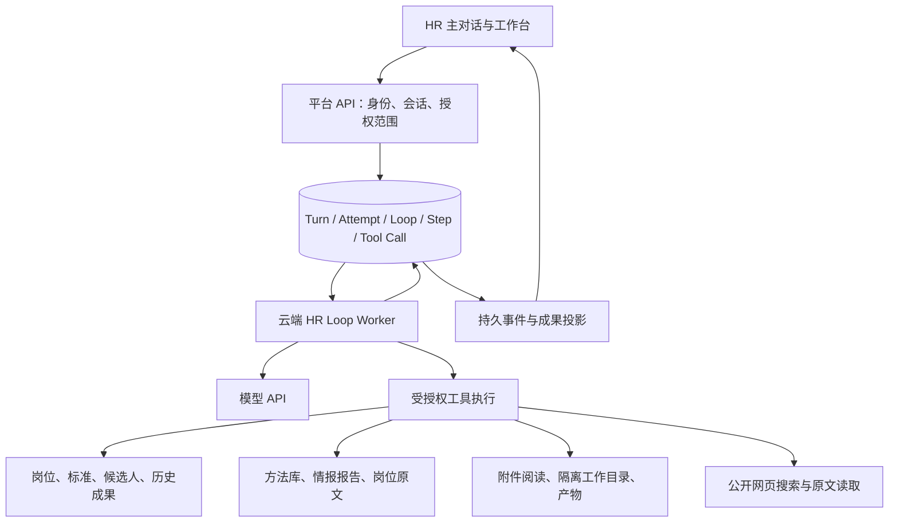

> **历史归档，2026-09-09。** 已被根目录两份主文档替代，仅作需求与旧实现快照。 [当前总体架构](../../../../../../../HR总体架构设计.md) / [当前工作流](../../../../../../../HR_Agent工作流.md)。以下原状态/授权/未勾选项是历史记录；不证明当前仍待实施。相对链接已按归档位置重定位。

# HR 云端 Loop Agent 完整迁移设计

日期：2026-09-09

状态：已撤回，不作为实施依据。用户于 2026-09-09 明确要求根据 HR 场景重新设计，不以迁移、历史契约或 FAE 代码复用为起点。云端自有 Loop、退出 MetaBot/Claude Code 的目标继续有效。新的讨论稿见 [HR Agent 场景与产品架构设计](2026-09-09-hr-agent-scenario-design.md)。以下保留为历史核查与方案记录。

工作分支：`feat/hr-cloud-loop`，基于 Platform `38dfc7a`。

## 1. 已确定的决定

整个 HR Agent 使用平台自己的持久化 Loop Agent，执行进程部署云端，退出 MetaBot、PTY 和 Claude Code。所有 HR 场景使用同一 Hannah 角色和运行时，包括开放式问答、岗位校准、人才搜寻、候选人分析、面试与沟通、岗位复盘、情报阅读与深度分析。

用户已明确执行位置，无需再次以 on-prem 原因为前置问题。模型通过服务端 API 调用；云端执行并不意味着使用 Claude Agent SDK。模型供应商与运行时分开，不因退出 Claude Code 而要求换掉模型。

平台控制授权、预算、持久化和副作用；Agent 理解用户问题、自主选材料与方法、决定后续调查。不得用关键词分流、固定 HR 推理步骤、强制方法覆盖或统计模板替代思考。

本次迁移对象是整个 HR Agent，不顺带迁移其他 Bot。其他 Bot 可暂留原运行时，但 HR 不再以调用这些旧执行器的方式完成自己的基础能力。现有独立采集与归档管道继续提供数据，不因运行时升级重写采集；正式 HR 在线任务不得依赖开发者本机执行分析。

## 2. 当前代码事实与迁移影响

核查范围是本地代码和既有交付记录，没有重新观察生产进程，也没有真实模型或故障实验。

| 现状 | 证据 | 对设计的影响 |
| --- | --- | --- |
| HR v7 已有发布记录 | `docs/reviews/2026-09-09-hr-deliverables-v7-delivery.md` | 不再沿用“v5/v6/v7 尚未上线”的旧判断；保留历史输入、成果与确认数据 |
| 持久 Loop 已有模型步骤、租约、工具调用记录、检查点和会话恢复基础 | `backend/app/agent_brain/loop_runtime.py`、`loop_repository.py` | 复用并扩展现有基础，不另起一套互不相通的 HR 调度系统 |
| 现有 Loop 以 Agent 委派和协作为主 | `tool_protocol.py`、`loop_runtime.py` | 需要直接工具执行能力；不能把 Hannah 再委派给旧 HR Runtime |
| 工具名称在 Python 和数据库中有固定枚举 | `tool_protocol.py`、`backend/control_migrations/041_agent_brain_durable_loop.sql` | 扩展可注册工具及兼容迁移；不能只往模型请求增加几个 schema |
| 请求构造器引用固定 BRAIN_TOOL_SCHEMAS，模型配置校验也较固定 | `model_adapter.py` | 将 Agent 定义、工具集合、模型能力和预算作为受控配置输入；模型实际可用性另验 |
| 当前上下文策略按消息逐条丢弃以满足 96 KiB | `context_policy.py` | 不直接照搬到全文分析；须保留工具调用与响应配对、证据引用及可恢复研究记录 |
| HR 工具已有真实 schema、收据、幂等和确认逻辑 | `backend/app/hr/tool_service.py`；MetaBot `src/runtime/hr-tool-mcp.ts` | 复用业务语义；结构化工具并非本次从零引入 |
| 工具授权、契约解析依赖远端冻结命令 | `tool_service.py:_authorize`；迁移 094 中 grant 函数 | 必须拆开运行授权与 Relay 命令，不能简单云端直调原方法或伪造 binding |
| 本地 Worker 执行官网 JD 校验脚本 | `backend/app/execution_relay/worker_official_verification.py` | 官网读取与校验的实现、必要状态和访问能力迁云，不保留本地回调依赖 |
| 情报业务读取仍返回 bundle 级 aggregates/analysis | `tool_service.py:_read` | 已完成的语义报告和原始正文需正式发布、发现和读取，换 Loop 不会自动接通 |
| 角色内容含原生 Read、skill 和旧命令描述 | Team `bots/hr/CLAUDE.md`、`.claude/skills/` | 专业内容保留，工具说明改为新运行时实际能力；不能原样盲目注入 |

参考内容基线：Team 已交付角色 `a87500e`，以及独立内容改动 `7757ca4`。后者包含 JD 语义、实体归属和方法补充，尚未因本设计自动合入发布。实施时在内容源合并，再从最终提交构建云端发布包。

## 3. 方案选择与目标边界

采用“以 AI-FAE-Agent 的模型驱动工具循环为实现参照，接入平台持久执行与 HR 业务”的方案。用户指定 FAE 后，以该仓库实际循环为优先复用来源，不再以扩展平台协作调度器作为 Agent 思考循环的主要起点。

不采用 Claude SDK 包装，也不整仓复制 FAE 服务。前者仍把循环交给 Claude Code；后者会带入产品型号规则、另一个身份/会话系统与不适合 HR 的取证预算。当前方案复用 FAE 已有通用实现和测试思路，将专业工具替换为 HR 能力，状态接入平台已有持久化基础。

模型循环运行于独立 Worker 服务，不占用 API 请求进程。HR 场景共用一个执行内核，部署层可给 HR 独立并发、资源和发布节奏。数据库持久队列作为任务真相源；不为此次迁移额外引入第二个消息队列。此次不要求 FAE 同步换库或迁移到 HR 内核，不能为抽公共框架而改动正在使用的 FAE 服务。

### 3.1 FAE 复用核查与边界

只读核查 `/Users/neo/Developer/work/AI-FAE-Agent`，HEAD 为 `b49eeed`。该仓库有用户未提交文档，未作修改。核查的是本地实现，未由此推断生产稳定性或跑过真实模型。

| FAE 实现 | 采用方式 | 必要适配 |
| --- | --- | --- |
| `src/agent/loop/adapters.py`：Anthropic/OpenAI-compatible 适配、流式工具参数归并、传输错误分类 | 优先移植可独立部分及相关协议测试 | 接平台密钥和模型配置，保留供应商能力差异；客户端方法与重试不能直接当持久步骤 |
| `src/agent/loop/runtime.py:LoopRuntime`：模型决定下一工具、结果回填、明确结束事件 | 采用直接工具循环结构 | 把一段内存 `run()` 拆为可持久提交/恢复的步骤，移除 FAE 业务门控 |
| `src/agent/loop/tools.py:ToolResult`、ToolBox dispatch/schema | 采用统一结果、来源、诊断和工具声明形态 | 替换型号、规格、SDK 知识依赖；工具错误保留可重试/权限/不可用区分 |
| `src/agent/loop/answer_contract.py` 和来源聚合 | 采用明确终态与独立来源元数据 | HR 普通问答不强制 FAE 答案字段；业务成果沿用 HR schema，不要求自由正文成为固定填表 |
| `src/platform_tasks/worker.py`：后台任务、独立租约 heartbeat、取消检查 | 参考已有成熟分工 | HR 直接接平台任务账、fencing epoch 和业务幂等，不引入 FAE 的第二个任务服务 |
| `src/agent/session.py` checkpoint、`src/storage/authenticated_conversations.py` | 借鉴带身份的会话恢复 | 这些是会话/轮次保存，不能当作正在执行的模型与工具步骤检查点 |

当前 FAE `LoopRuntime.run()` 的 messages/tool_log 等轮内状态是局部内存变量；平台任务 Worker 领取任务后创建 session 再启动 orchestrator。外层任务能记录事件、续租、取消，不等于内层可从中断工具步骤精确继续。FAE 已有会话 checkpoint，不能沿用 7 月旧文档笼统称其“完全没有持久化”。

不移植 FAE 专用选型约束检查、系列成员/支持名册门控、强制链接交付规则、同一文件第 4 次阅读后的收敛提示，以及默认 24 次工具/300 秒的任务预算。部分规则有产品事实治理用途，但不构成 HR 方法选择和判断质量规则。来源工具返回过某文件，只证明读取，不自动证明该文件支持答案里的每个结论。

实施在 Platform 新模块中进行受控移植，记录来源提交和函数/测试对应关系；不运行时 import 邻居仓库绝对路径，不复制 FAE 数据库/知识库/环境文件。先落一份可审阅的复用清单和通用适配，再进行业务接线；暂不建立跨仓公共包或要求两个产品同步发布。

## 4. 一次任务如何运行

1. API 根据真实用户身份受理消息，记录岗位、候选人、附件、指定方法、显式成果引用和标准复核声明。创建 Turn、Attempt 与对应 Loop 的持久绑定，提交去重沿用现有语义。
2. 冻结本次输入与 Agent 发布身份：用户原文、对象范围、显式引用、角色和方法目录身份、模型配置、工具集合、预算。任务重试不悄悄替换用户输入或指定版本。
3. Worker 领取执行权后，从已提交的步骤、读取结果和研究记录构造模型上下文。服务端身份与凭据不进入模型可填写的参数。
4. 模型返回回答、工具请求或向用户提问。完整工具参数先持久化、校验和授权，再执行。未接收完整的流式参数不能启动工具。
5. 工具结果及读取正文身份落库，下一模型步骤继续推理。需要长期保存的业务成果通过已有提交语义登记；普通问答可以直接形成最终回答。
6. 需要用户补充时持久记录等待状态，释放 Worker；新输入经过身份与范围验证后续跑。扩大岗位或候选人范围需形成新的受理输入，模型问题本身不授予权限。
7. 最终回答、成果引用、终态事件通过可靠投影返回工作台。业务成果已落库但最后一段回答失败时，页面仍能显示已保存成果及执行限制。

一个 Attempt 对应一个 Loop；进程崩溃恢复继续同一 Attempt。用户明确重试创建关联的新 Attempt，沿用冻结输入并显式携带已提交业务操作记录。旧 Attempt 被隔离后不能迟到写入或完成新 Attempt。

## 5. 运行内核与状态

HR 思考循环采用 FAE 的直接工具循环结构：模型适配器 → 工具请求 → 工具结果 → 下一轮。持久化接现有 `agent_brain` 的 Loop/Step/Tool Call 及 Turn/Attempt，扩展需要的通用工具记录和提交接口。现有平台 Brain 保留自己的协作编排；HR 不经过它先做一次委派，也不复制它的全部协作工具进提示词。两者只共享必要的持久执行基础。

Agent 定义包含角色内容引用、专业资源目录、工具注册项、模型配置和资源预算。专业判断放在角色与方法正文；工具注册定义能力与参数，不写场景关键词或方法选择规则。

状态分工：Turn/Attempt 负责对用户可见的任务生命周期和唯一执行权；Loop/Step 记录推理进度；Tool Call 记录操作意图和执行结果。绑定、终态投影用事务或持久 outbox，避免两张账各自宣布完成。

每次领取执行权使用递增 fencing epoch。步骤提交、工具副作用、终态更新均检查当前 epoch；只检查 worker 名称不足以隔离同名进程重启。租约续期独立于模型是否流出文本或 thinking，模型长时间无输出也要续期。

外部调用不占住数据库事务。只读调用可按策略重试；写入调用用持久 operationId 查回执再恢复。相同 operationId 更换参数必须拒绝。模型请求可能重复计费，不能承诺对供应商实现 exactly-once；平台业务副作用必须幂等。

取消时停止派发后续工具、尝试中止当前请求和执行进程，再保存可用结果。已完成的业务写入不自动撤销。达到预算以 partial/interrupted 语义交付已有结果，不强迫生成“全部完成”。展示状态按现有公共契约适配，新增内部状态不能直接破坏页面。

## 6. HR 工具与授权迁移

| 能力 | 目标行为 | 复用与改动 |
| --- | --- | --- |
| 岗位、标准、候选人读取 | 自主读取当前任务范围内的事实和确切版本 | 保留 `hr.read_context` 业务语义，解开远端命令身份依赖 |
| 官网岗位目录与校验 | 查目录、发现具体岗位、使用前校验，明确陈旧或不可用 | 将 jd-registry 的必要实现与状态迁到云端服务；Hash 等校验元数据由服务端使用 |
| 历史成果发现 | 按已授权岗位、候选人、类型枚举可读成果，再选择读取 | 新增分页发现能力；用户显式选中引用仍保持原版本与范围 |
| 成果保存 | 返回确切成果 ID、类型、来源收据与正文身份 | 保留结果 schema、来源约束和幂等；登记为事实，不能靠回答自报成功 |
| 标准确认 | 用户展示、选择、复核之后持久确认 | 复用 calibration 规则，迁移 role-calibration 包装；模型不能代用户确认 |
| 方法发现与读取 | 小目录进入初始上下文，自主读正文、组合或不用 | 复用七份内容、稳定 ID 和来源；用户指定方法随冻结输入保留 |
| 情报发现与读取 | 按公司/专题发现报告，读完整章节并回查岗位原文 | 复用已发布 bundle/Markdown 存储，新增语义报告发布目录与原文访问 |
| 附件阅读与文件输出 | 获准原文件、可追溯提取文本、必要页面图像、生成交付文件 | 复用存储与授权服务，补云端任务工作目录和格式处理工具 |
| 公开信息调查 | 搜索发现、读取原网页、标明来源和不可访问状态 | 云端搜索/抓取适配，不依赖本地浏览器登录或 Claude Code Web 工具 |
| 研究记录与长任务续跑 | 保存阶段判断、反证、未答问题和证据位置 | 工作记录属于本次任务，不自动转为共享知识或长期候选人画像 |

模型可见工具集合来自该任务获准能力，但服务端仍在每次调用时验证身份、scope、撤权和执行 epoch。schema 不是授权边界。

具体改造 `HrToolService`：分离可信运行授权解析与业务操作核心，新增云端 Loop 的身份解析入口；旧 v6/v7 入口继续解释历史执行。更新 094/095 后续迁移中的 grant/读取/记录函数，保留原收据、成果 ID 和引用可读性。不能用“本机内部调用”绕过 scope，也不能造一条假的 Relay 命令迎合旧校验。

历史成果发现是一次明确的能力扩展：枚举和读取均受当前用户、岗位、候选人及来源材料撤权约束。显式 `inputResultRefs` 是不可变用户指定输入；Agent 另行发现的成果以本轮新读取引用记录，不能偷偷改写显式输入数组。普通聊天历史不能替代授权。

## 7. 角色、方法与上下文

继续以 Git 内容源维护 Hannah 专业角色、共享背景和方法文件，云端部署不可变内容包。发布生成统一入口正文，显式列出共享内容；不靠 cwd 自动发现 `CLAUDE.md`、用户目录或 skills，也不让不同指令源自行追加上下文。

把旧内容中的原生 Read、jd-registry skill、role-calibration skill、v7 运行命令等表述改成新工具能力，保留专业语义和治理边界。文件来源身份和哈希仍用于复现，不成为产品要求用户选择的“版本”。页面默认最新；一轮任务引用已经固定的内容保持可追溯。

上下文由角色、用户目标、当前对象与显式引用、方法/材料目录、已读取证据和工作记录组成。正文由工具按需读；不把全库或 aggregates 固定推入初始提示词。已有 Panorama 关键词门控不进入新 HR 路径。

预算按模型真实可用 token 窗口计算。首个运行配置采用：输入软阈值为窗口 70%，输出预留 15%，剩余作为估算与工具结果余量；供应商上下文/输出限制优先。方法目录上限 4 KiB；默认正文单次最多 24 KiB，超限返回明确续读游标，可持续读完；目录默认每页 50 项。不把这些工程上限用作方法选择或语义质量规则。

达到上下文软阈值时生成带来源位置的研究摘要；原文和工具结果仍持久保留，允许重新打开。压缩以完整交互段为单位，不拆开工具请求/响应。用户目标、未解决问题、明确反证、实体归属、显式输入和确认记录必须可恢复；摘要不能替代权威岗位标准。

运行预算配置普通任务初始最多 100 个模型步骤、30 分钟主动执行；长期研究任务最多 400 步、120 分钟，均不是完成质量承诺。研究额度由任务入口/授权配置提供，模型不能自行扩大。等待用户不消耗主动执行时长。实际调用成本另按部署额度约束，发布前用真实样本校准这些默认值。

方法读取事件能证明工具交付过哪些内容，不能证明模型理解或正确使用。禁止把调用数、阅读计数、方法覆盖率当业务合格标准。

## 8. 全文分析与情报接入

每个已发布资料集提供稳定清单：公司/专题对象、文档 ID、记录 ID、正文路径或范围、来源身份、已知实体归属、实际分析状态。列表与搜索并存；搜索用于找线索，列表与连续读取允许通读，不把 top-k 检索冒充全量覆盖。

已有两轮人工 Agent 分析文档目前在开发工作树，必须经过内容发布导入云端。导入同时保存报告正文、原始引用索引、关联岗位原文和来源清单；用实际 archive 校验引用。不能声称现有 bundle 的 aggregates 已包含这些判断。来源不足的报告保留明确限制，绝不临时生成专题正文冒充既有分析。

智元等招聘集合保留具名子公司/业务部与“未标明归属”的区分；公司名过滤不把集团材料变成同一用人团队。正文分析允许反驳标题和任务示例，允许局部回答、冗余证据与不可答。

长任务采用分页原文读取、持久研究记录和可恢复步骤。在需要分工时，可在相同 Loop 内核启动受限子任务，共享相同数据授权上限并单独记录覆盖；不会以“子 Agent”绕回 CLI。初次业务验收可用单 Agent 顺序通读，不以必须有多 Agent 作为迁移前提。

迁移保留岗位归一化数据和原始渠道正文，不能因统一字段缺失丢掉部门、职级或正文信息。已有字段补齐工作独立衔接；读取原始归档是正式工具能力，不要求模型执行各渠道解析脚本才能拿到文本。

## 9. 云端部署与文件环境

新增独立 HR Loop Worker 服务，沿用现有云端构建和密钥注入方式。模型凭据、业务数据库凭据不提供给模型或文件执行环境。授权附件按任务放入隔离目录；知识和已发布情报只读；产物登记进入平台对象存储后由授权下载接口交付。

文档解析、网页处理和文件生成在受资源限制的工具进程中执行。模型需要计算或生成文件时，可使用隔离的代码执行能力；限制 CPU、内存、时长、磁盘与出站网络，禁止挂宿主机 socket 和平台密钥。纯阅读和检索不要求开放宿主 Bash。

读取接口拒绝目录穿越和越权文档；网页工具控制内网地址访问与重定向，避免通过公开网页工具访问云端内部服务。附件不能作为指令来源改变工具权限。未发布的工作目录终态后按配置清理；可继续任务所需的记录先持久化，不能仅依赖容器本地盘。

准备就绪检查包含模型配置、工具注册、业务授权路径、角色包、附件和情报目录可读性。健康探针不反复调用模型；真实模型连通与业务验收单独执行。

## 10. 保留、替换与退出

| 保留 | 替换/扩展 | HR 完成切换后退出 |
| --- | --- | --- |
| 主对话、岗位和候选人数据、标准、历史成果 | HR 受理入口到云端 Attempt/Loop 的连接 | HR MetaBot 执行和 PTY |
| Turn/Attempt、读取收据、幂等、撤权、确认语义 | 公共 Loop 直接工具协议及授权绑定 | HR 本地 Signed Worker 执行依赖 |
| 七份方法及本轮内容补充、来源与不可变引用 | 角色装载、工具说明、云端内容发布 | HR 远端 readiness / callback / loopback 必需链 |
| 已有采集、归档、统计、公开情报页面 | 语义报告发布、原文阅读、历史成果发现 | 新任务的 frozen_command_v6/v7 传输包装 |

只退出 HR 对旧执行的依赖。历史契约解析、已保存结果和其他 Bot 共用的 Relay/MetaBot 不能直接删除。最终新 HR 任务不创建远端 execution job、binding 或兼容 mission task 来维持旧执行幻象。

## 11. 实施顺序与验收

| 阶段 | 必须交付的结果 | 验证 |
| --- | --- | --- |
| 1. FAE 循环移植与持久执行 | 通用适配/工具事件复用、HR 直接循环、Step 与 Attempt 绑定、执行 epoch 和独立续租 | 移植部分的协议测试，现有 Brain 相关回归，真实数据库步骤恢复；不接旧 HR Runtime |
| 2. HR 云端业务闭环 | 新授权入口，岗位读取、标准确认、候选人成果、历史成果发现，保留旧引用 | 真实 HTTP/session/scope/收据/幂等/撤权；模型提供方可用工程替身并明确标注 |
| 3. 专业与研究能力 | 云端角色和方法、官网校验、全文附件、网页调查、语义报告和原文、工作记录与文件产物 | 真实发布内容校验；现有分析承重引用回查；云端文件工具实跑 |
| 4. 真实 Agent 与故障验收 | 全部 HR 场景进入同一云端循环，长任务与日常交互均可用 | 下列业务样本与故障注入，实际模型调用单独报告 |
| 5. 生产切换与退出 | 新任务只走云端 Loop，旧在途明确处理，停用 HR 旧执行服务 | API 与流式投影验收后最后检查页面；生产发布记录可回溯 |

真实业务样本至少覆盖：岗位 JD/JR 推敲并确认标准；专业社区搜寻并回看原网页；候选人分析到面试方案、真实记录与沟通草稿；按岗位发现既有成果并复盘；自主方法选择及用户指定方法；速腾/先临记录冲突与智元子公司作用域；一个大资料集的连续全文研究；上传附件及生成可下载文件。

深度判断以已有评审报告为对照，检查结论是否依赖正文、是否保留反证与作用域、是否把材料缺陷误当组织事实。允许得出不同但有证据的结论，不用关键词比对、句子相似度阈值或“必须引用某方法”自动判定质量。通读覆盖只能证明工具交付范围，仍需审读判断质量。

故障场景：模型长时间无流式输出、Worker kill/restart、重复领取和迟到旧 epoch、工具写成功但结果响应丢失、SSE 断连后按游标恢复、等待用户时重启、执行中撤权/取消、上下文压缩后回查反证、工具或附件单项失败后的部分交付。

业务数据、接口与进程验证优先，页面最后一轮验收。记录受理到首个可见事件、首个有用内容、完整完成的耗时，以及失败原因、恢复结果、重复副作用、模型 token/费用；没有实测不承诺速度倍数或稳定性百分比。

切换时暂停 HR 新任务受理，处理或明确终止旧在途任务，再更新唯一执行路由并恢复受理；每个 Attempt 的执行类型不可中途改写。最终不按场景长期保留双运行时，不自动降级到 Claude Code。新路径故障时暂停接单或由运维按记录回退受理配置，不能暗中让已开始的云端任务在旧执行器再跑一遍。

## 12. 评审结论与完成边界

本设计将复杂迁移分为“FAE 循环移植与平台生命周期”“HR 业务与专业工具”“发布与退出”三个实施部分。三个部分共同完成才算整个 HR Agent 升级；只跑通模型问答、只保住三个业务工具、只停掉 PTY 都不算完成。

当前已完成：用户目标固定、代码边界盘点、独立分支、完整迁移设计。当前未完成：运行时代码、数据库迁移、云端部署、真实模型与故障验收。

实施前评审重点：FAE 可复用部分与平台持久步骤的结合；授权解耦与旧成果兼容；历史发现的权限语义；全文阅读与上下文恢复；云端官网、网页和文件能力；生产切换与旧执行退出。用户已确定的云端位置及退出 MetaBot/Claude Code 不再作为待决项。
