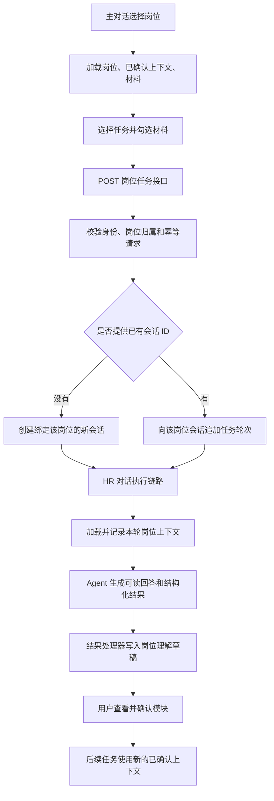

# HR 岗位任务：当前实现说明

日期：2026-09-08  
对应已发布代码：`6777d227a28c1548c6cdee480913b6f72818dde2`

本文根据当前前后端源码整理，描述已经实现的行为。文中的问题是代码审阅结论，不代表本次进行了生产任务或模型质量验收。本次只编写说明文档。

## 0. 评审核查后的诊断修正

原稿过多集中于输入框、会话归属和结果入口，低估了提示词与结果处理层的问题。核对用户提供的评审后，主结论修正为：**Web 岗位任务与会话驱动的岗位包在同一条执行链路中叠加，输出契约没有互斥；CLI/飞书的 Hannah 又已有另一套岗位查询、方法与确认规范。问题不止是前端迁移遗漏。**

平台依据仍为本文页首版本；另读取了 Orbbec-Agent-Team 的 `e791caa` 工作目录源码，以及交接记录中 MetaBot 生产提交 `6ddbdefffede245d48ec20b43ee487c7ff2c732c` 的 Git 对象。没有重新核验生产机器文件、采集原生 Claude 会话或查询生产失败统计。

### 0.1 已确认：同一 JD/JR 轮次有两种不兼容的输出要求

`conversation_context.py` 对 HR Agent 无条件设置 `HR_WORKFLOW_CONTRACT_V1`，没有在此排除按钮任务。该契约要求完整岗位需求/JD/JR 回答输出一个 `kind=position_package` 的隐藏信封。与此同时，`task_service.py` 的 JD/JR 预设指令分别要求一个 `kind=jd` 或 `kind=jr` 的信封。

`direct_mission_adapter.py` 把工作流契约、包含任务指令的消息、岗位上下文等放入同一个提交文档。这两种输出要求确实在平台提交内容中共存，并没有明确的任务契约优先级或互斥规则。

`extract_hr_envelope()` 要求整篇回答恰好只有一个信封，而且其类型必须符合调用方要求。以 JD 为例：

| 模型实际输出 | JD 任务解析器 | 会话岗位包解析器 |
|---|---|---|
| 一个合法 `position_package` | 类型不匹配，拒绝 | 格式满足时接受 |
| 一个合法 `jd` | 格式满足时接受 | 拒绝：旧解析器只显式跳过两类候选人信封，没有跳过五类岗位任务信封 |
| 两种信封各一个 | 多信封，拒绝 | 多信封，拒绝 |

这里“拒绝”是可由代码确定的解析分支；不表示已经测得某种输出的出现概率。**契约冲突是确定存在的，实际任务失败率和各类输出分布未知，不能称为五五开的随机失败。**即使 JD 任务解析成功，旧岗位包链路仍可能把同一回答记为 `envelope_invalid`，两条链路的状态也必须分别看。

### 0.2 已确认：旧链路没有按任务入口退出

`main.py` 有条件装配并启动岗位任务结果处理循环与岗位包处理循环，两种处理器都仍在应用中。迁移 `076_hr_position_packages.sql` 的岗位包领取查询覆盖已完成的 HR assistant 消息，没有按 `position_task_requests` 排除按钮任务轮次。Python 岗位包解析器对其他信封类型的排除也不完整。

因此不能把 `position_package` 当成已经退场的历史格式。这是同一回答可能被两套业务结果处理器解释的问题，比前端有两套状态控制代码更深一层。生产循环是否持续工作、积压多少，仍需要运行状态或数据证据。

### 0.3 已确认：Hannah 已有方法；Web 没有明确整合它们

`Orbbec-Agent-Team/bots/hr/CLAUDE.md` 已定义角色、招聘方法、来源纪律、自然语言协作与明确共同确认。`jd-registry` 负责官网事实查询与时效校验；`role-calibration` 负责岗位校准及已确认结论保存。

Web 的 `_PROMPTS` 主要是短业务指令加输出字段约束，没有显式选择、版本化或组合上述方法。同时，Web 把草稿模块、版本与确认操作直接暴露给用户，和角色规范中“无需创建项目、填写表单或管理内部版本”的交互目标存在偏差。人工确认的必要性没有冲突，确认必须通过管理面板完成则并非角色要求。

但不能仅由任务指令很短，推导出“模型完全没有方法”或“任务消息必定覆盖 CLAUDE.md”。这取决于原生会话实际加载了什么以及模型如何执行。本次没有采集该会话。

### 0.4 已确认与待限定：冻结输入、工具和岗位事实

- `frozen_prompt` 冻结的是已准备命令及摘要，主要约束同一命令的变更和恢复一致性。它本身不证明执行器不能调用工具。
- MetaBot 对应提交中，v5 运行时继承 Bot 的 cwd 和工具策略；只有 `toolPolicy=none` 分支明确传入禁用工具的参数。v5 还会给已验证附件追加“使用 Read 或适当本地工具”的原生提示。把“平台没有注册 HR 数据读取工具”推广成“HR Claude 模型完全没有读取工具”不准确。
- Team 的 HR 配置未显式设置工具策略，配置解析默认值为 `default`；cwd 指向 `bots/hr`。这支持项目角色与本地技能可被原生运行时使用的判断，但不能替代实际加载记录。
- `official_facts` 已含官网职责 `duty`、要求 `requirement`、其他岗位字段和版本时效元数据。再次“生成 JD/JR”实际是在官网事实之外生成内部改写/校准草稿，并非从零取得 JD。是否需要两份不同用途的内容应由产品语义决定，不能把内部改写称作更新官网。
- 已注入官网快照与角色要求 `verify-job` 之间没有明确的版本和时效交接约定。重复查询可能冗余，也可能是必要的新鲜度核验；不能断言查询本身必然错误。真正缺失的是一次执行采用哪个事实版本、核验失败如何降级的统一规则。
- `role-calibration` 也明确一段会话只对应一个岗位。所以“角色、方法、工具的基础已经存在”不等于“同一聊天记录按轮切岗位已实现”。

对应的目标设计与一次性替换、废弃实现删除范围见 [Hannah 角色与工具统一设计](../superpowers/specs/2026-09-08-hr-role-tools-unification-design.md)。该设计尚未实施。

## 1. 当前到底是什么设计

**当前是“统一对话界面 + 按岗位绑定的会话 + 固定类型的任务快捷入口”。还不是“同一个主会话里，自由切换上下文并连续执行任务”。**

岗位用于组织官网资料、内部已确认的岗位理解、材料、候选人与生成结果。会话绑定到某个岗位后，后台才能为会话加载该岗位的上下文。

“岗位任务”按钮会把一个预设任务转成一轮 HR Agent 对话。它复用聊天执行链路，并另外记录任务类型、引用的上下文版本、选中的材料和生成结果。

普通发送与点击任务按钮，是两条不同的提交路径：

| 操作 | 实际提交内容 | 后台行为 |
|---|---|---|
| 输入文字后点“发送” | 输入框文字、这轮上传/选择的附件 | 新建会话或追加普通对话轮次 |
| 点“岗位任务 → 生成 JD”等 | 任务类型、岗位、已确认上下文版本、任务菜单勾选的材料、可选会话 ID | 后台生成固定指令，再新建会话或追加一轮任务 |

**输入框里尚未发送的文字，不会随岗位任务按钮一起提交；输入框里刚上传的附件，也不会因为上传了就自动进入任务材料。**

例如，在输入框写“这次重点招深圳的嵌入式专家”，然后直接点击“生成人才画像”，这段尚未发送的要求不在任务请求里。若要求此前已经作为消息发进同一会话，情况不同：任务会追加到该会话，后台仍通过已有对话上下文链路处理历史消息。

## 2. 岗位选择与会话的关系

### 2.1 主页选择岗位

输入框旁的选择器通过现有岗位接口，分页读取当前用户可访问、内部状态为 `active` 的岗位，再在前端按名称、官网编号、部门和地点搜索。

选中岗位时：

- 前端记住选中的岗位，保留当前输入文字与待发送附件。
- 加载岗位详情、当前已确认的内部上下文、岗位材料和任务状态。
- 显示“岗位任务”和“岗位资料”。
- 此时仅仅选中了岗位，**还没有因为选择操作本身创建或绑定会话**。

岗位选择保存在当前页面组件状态中；不是可刷新恢复的全局岗位偏好。

### 2.2 选择后普通发送

第一次发送会携带 `positionId`，创建绑定该岗位的 HR 会话。前端随后使用岗位会话地址显示它：

```text
/hr/positions/{positionId}/conversations/{conversationId}
```

视觉上仍使用统一对话界面。进入已有岗位会话时，前端还会读取岗位详情，验证该会话是否属于这个岗位；后端也会再次验证归属。

### 2.3 已有会话切换岗位

当前实现会回到主页，保留旧会话，再为新岗位开始新会话。不会把原会话重新绑定到另一个岗位，也没有实现同一聊天记录按轮切换岗位。

另外，主界面目前依赖岗位路由及其归属验证恢复岗位能力。单独通过 `/hr/conversations/{id}` 打开一段历史对话时，主页面没有在这里自动反查岗位绑定。这意味着“后端确实绑定岗位”与“前端当前显示岗位任务”还不是完全一致的恢复机制。

## 3. 岗位任务菜单提供什么

主对话复用原岗位页的 `HrPositionTaskMenu`，提供五个固定任务：

| 菜单任务 | 后端类型 | 结构化结果的主要内容 |
|---|---|---|
| 生成岗位说明（JD） | `jd` | 正文、修改摘要、未知项、证据引用 |
| 梳理岗位要求（JR） | `jr` | 职责、必备条件、加分条件、可培养项、评价标准、未知项、证据引用 |
| 生成人才画像 | `talent_profile` | 维度、优先级、反例、未知项、证据引用 |
| 生成搜寻策略 | `sourcing_strategy` | 目标来源、关键词、排除项、未知项、证据引用 |
| 生成面试方案 | `position_interview_plan` | 维度、问题、追问、评价锚点、未知项、证据引用 |

这些任务当前没有各自的输入表单，也没有“把任务放入输入框，补充要求后再发送”的步骤。点选菜单项目就立即请求启动。

候选人匹配、候选人专属面试题不在这五项菜单里，入口在“岗位资料 → 候选人”。它们需要候选人身份、岗位与候选人的关联，以及已确认的岗位上下文。候选人比较另有独立接口，也不是这五项任务的同一路径。

## 4. 一次任务怎样启动和执行



### 4.1 前端请求

接口：`POST /api/hr/positions/{positionId}/tasks`。

以 JD 为例，请求形状如下。这里是字段说明，不是一次真实生产请求：

```json
{
  "task_kind": "jd",
  "context_version_id": "当前已确认上下文的 UUID，或者 null",
  "candidate_id": null,
  "position_candidate_id": null,
  "material_ids": [],
  "conversation_id": "当前已验证的岗位会话 UUID，或者 null"
}
```

请求沿用账号身份、CSRF 和 UUID 格式的 `Idempotency-Key`。没有用户输入正文这一字段。

前端会为同一个岗位、任务类型及请求内容保留幂等键，保存在内存和可用时的 `sessionStorage` 中。请求失败重试时尽量复用；收到成功响应后清除。**成功受理后再次点击同一任务，是新的任务意图，并不是始终复用上一次任务。**

### 4.2 后端提交

`HrPositionTaskService.start()` 主要做四件事：

1. 校验任务参数、岗位与会话归属，并记录规范化请求及其内容摘要。
2. 从后端 `_PROMPTS` 中取出该任务的固定指令。
3. 未指定会话时调用会话创建；指定会话时调用追加轮次。
4. 返回任务 ID、会话 ID、轮次 ID、状态和参考信息。HTTP `202` 表示已受理，不表示生成已完成。

任务最终进入现有 HR 对话执行链路，不是前端另起一个直接调用模型的通道。页面没有新增模型选择逻辑。

### 4.3 当前主页启动任务的断点

**如果选好岗位后，还没创建会话就直接点任务，后端会创建一个新会话，但主页面目前没有采用返回的会话 ID 切换到这段会话。**

前端当前只把返回值放入任务状态列表，并开始查询状态。因此用户可能仍停留在空白主页，只看到任务状态，看不到新任务所属的聊天记录。

由于页面仍没有当前会话 ID，随后再点另一个任务，后端又会走新建会话路径。用户感受到的是一个主界面，后台却可能已经创建了多段会话。这是当前“主对话”设计没有闭合的一个明确问题。

## 5. 后台到底给任务放入哪些上下文

| 上下文来源 | 当前读取方式 | 需要注意的边界 |
|---|---|---|
| 岗位身份与名称 | 从已验证的岗位绑定读取 | 不是前端随意传一段岗位名称就能替代 |
| 官网岗位事实 | 构建本轮上下文时读取岗位的官网版本指针 | 包括来源版本和时效信息；前端点任务时未显式选择官网版本 |
| 内部岗位理解 | 使用任务请求记录的已确认上下文版本 | 未确认草稿不会自动作为新的正式基线 |
| 明确选择的岗位材料 | 使用任务菜单提交的材料 ID | 默认不选；后台检查岗位归属、可用状态、保留期和删除状态 |
| 同一会话的历史 | 复用现有对话上下文构建链路 | 新建任务会话不等于继承别的会话历史；未发送草稿不属于历史 |
| 全景招聘情报 | 已接入的后台上下文提供器按任务等条件处理 | 不是主对话菜单让用户逐项选择，也不能把菜单可用等同于情报检索质量已验收 |
| 候选人资料 | 仅相应候选人任务携带并校验候选人范围 | 不会因为岗位下有候选人，就默认把所有候选人资料交给五类岗位任务 |

后台把本轮使用的岗位、版本、材料和上下文摘要记录成上下文快照，并校验摘要；已有轮次重建时优先复用已记录快照。这是本轮执行的一致性机制，不代表前端已实现“同一会话任意切岗位”。

### 材料有三层含义

1. **输入框附件**：准备随普通消息一起发送的文件。
2. **岗位材料**：已经归入该岗位、可在岗位资源中管理的材料。
3. **本次任务材料**：从岗位材料里明确勾选给这次任务使用的子集。

当前任务菜单只展示 `ready` 且可下载的岗位材料。把一个会话附件设为岗位材料之后，还需要在任务菜单中勾选，才会进入这个按钮启动的任务。

切换岗位或会话会清空任务材料选择。任务成功受理且返回状态不是失败时，也会清空选择。因此连续执行 JD、人才画像、面试方案时，材料不会自动沿用上一次勾选。

## 6. 结果在哪里，为什么“完成”还不等于形成正式岗位理解

### 6.1 回答与结构化结果是两层

后端固定指令要求 Agent 同时输出：

- 用户能阅读的 Markdown 回答。
- 一个供系统解析的隐藏结构化结果，包含版本、任务类型和任务专属字段。

结果处理器解析后，将五类岗位任务分别写成内部岗位理解的模块草稿。面试方案对应的内部模块名是 `interview_standard`。

如果模型输出只有一篇文章，没有合规结构化结果，或结构不符合要求，结果处理会拒绝它。除此之外，JD/JR 还存在第 0 节已确认的双输出契约冲突：生成 `position_package` 或两个信封都会进入任务解析失败分支。**这不应只描述为泛泛的“模型格式偶尔不对”；看到聊天回答，也不足以证明岗位任务已经完整完成。**

任务状态查询会结合对话轮次、执行状态及结果处理状态：即使对话轮次已结束，只要对应结果尚未处理完，任务仍可能显示“执行中”；结果处理失败会显示任务失败。

### 6.2 草稿需要人工确认

五类岗位任务的结构化结果主要进入：

```text
岗位资料 → 岗位信息 → 内部岗位理解 → 待确认草稿
```

用户选中模块并确认后，才推进当前已确认的岗位理解版本。确认时有基线版本检查；基线变化会提示冲突，允许核对后按新基线重试。

因此，如果先生成 JR、没有确认，再生成画像，画像任务不会自动把那个未确认 JR 当作新的已确认岗位理解。若两次任务在同一会话中，前一轮回答可能仍属于聊天历史，但这与正式上下文版本更新是两件事。

### 6.3 文件成果与岗位理解草稿不同

“材料与成果”面板展示可预览或下载的附件、产物，并通过授权下载接口取文件。五类岗位任务的固定指令主要要求可读回答与结构化模块，**并没有统一要求每次都生成一个 PDF 或 Word 文件**。

当前“查看结果”按钮对所有完成任务统一打开“材料与成果”，没有根据任务类型定位到新生成的模块草稿，也没有根据任务 ID 定位到某个具体结果。

这会造成一种实际可解释的体验：任务显示完成，点“查看结果”却找不到刚才生成的岗位内容。模块草稿可能在“岗位信息”的内部岗位理解中，而不是文件列表里。

## 7. 状态、失败与恢复

前端使用 `GET /api/hr/positions/{positionId}/tasks?status=active` 读取状态。虽然参数叫 `active`，后台返回的是运行中的任务，加最近 24 小时的终态任务，最多 50 条；范围是岗位，不只当前会话。

存在“已受理”或“执行中”任务时，每两秒查询一次。任务结束后刷新岗位详情、上下文和资源。没有运行中任务时停止持续轮询。状态请求失败后显示手动刷新入口，不无限重试。

目前还有这些表现：

| 情况 | 页面行为 |
|---|---|
| 岗位详情、上下文、材料任一加载失败 | 任务菜单暂停，提示重新读取；三个读取目前是一起等待全部成功 |
| 启动接口失败 | 通常统一提示“岗位任务未启动，请重试”，没有细分繁忙、版本冲突、授权失败等原因 |
| 会话已有任务在执行 | 按钮没有完整按当前会话执行状态禁用；最终依赖后台接受或拒绝追加轮次 |
| 切换岗位或离开当前范围 | 中止旧请求的前端等待，丢弃旧范围回调；不等于取消后台已经受理的任务 |
| 刷新后返回同一岗位会话 | 可重新读取该岗位运行中与近期任务 |
| 只在主页选过岗位、随后刷新 | 本地选择丢失，需要重新选择，才能恢复该岗位的任务视图 |

## 8. 当前值得优先讨论的问题

下面是根据代码行为作出的设计判断，不是已经实施的修复计划。

| 问题 | 代码中可确认的现状 | 用户感受或后果 |
|---|---|---|
| 输出契约不互斥 | 同一 JD/JR 提交同时要求 `position_package` 和任务专属信封 | 模型无法在一个合法单信封中满足两者 |
| 旧结果链路未退出任务入口 | 岗位包领取未排除任务轮次，解析器只跳过两类候选人类型 | 一份任务回答会被两套业务解析器解释 |
| 角色方法与 Web 任务未统一 | Hannah 已有技能和方法，Web 任务主要独立约束结果格式 | 方法调用、事实校验与版本确认缺少统一约定；不能仅凭代码量断言实际模型完全没有方法 |
| 官网事实与内部改写语义不清 | 岗位已含职责和要求，按钮仍叫“生成 JD/JR” | 容易误以为在补齐官网内容，实际生成另一份内部草稿 |
| 任务与输入框割裂 | 任务请求不携带尚未发送的正文和上传队列 | 写了补充要求、放了文件，任务却可能没有使用 |
| 主页启动后没有接管新会话 | 后端返回新会话 ID，前端只更新任务列表 | 任务开始了，但主对话仍然是空的；继续点任务可能产生更多会话 |
| 查看结果没有按结果类型定位 | 所有完成任务统一打开文件资源面板 | JD/JR 等模块草稿不容易找到 |
| 生成与确认的关系没有讲清楚 | 输出先成为草稿，确认才更新正式上下文 | 连续做几项任务时，用户以为前一步已经成为下一步的岗位基线 |
| 状态列表混合岗位下多个会话 | 查询按岗位，列表主要显示类型、状态和参考来源 | 同类任务多次生成时，难以区分哪个结果对应哪次要求 |
| 历史对话的岗位恢复依赖路由 | 通用会话地址不在主页面自动反查岗位 | 同一会话从不同入口打开，可能看到不同的岗位工具 |
| 旧岗位页与主对话仍有两套控制代码 | 菜单和接口共用，但旧页与新 hook 各自处理加载、启动、状态和刷新 | 迁移不是完整收敛到一个业务控制层，之后仍容易出现能力差异 |

如果要实现用户期待的体验，应先统一**角色方法、数据读取约定和每轮唯一的输出契约及业务处理器**，并写清旧入口退出规则。随后再收敛本次输入、会话归属和结果定位。仅修复输入框与结果跳转，不能消除双信封冲突，也不足以证明招聘分析质量改善。

“任务作为发送方式”可以作为统一入口的交互，但后台还应复用 Hannah 的专业方法，通过适当工具获取岗位事实和授权材料，以明确的结构化提交处理业务结果。不能只把罐头消息改成输入框模板，就宣称完成了角色与工具架构。这里没有修改实现。

## 9. 代码定位

| 代码 | 负责内容 |
|---|---|
| [HrWorkspacePage.tsx](../../webui/src/workspaces/hr/HrWorkspacePage.tsx) | 主界面、岗位选择状态、路由归属验证、任务与资料面板接入 |
| [HrPositionPicker.tsx](../../webui/src/workspaces/hr/HrPositionPicker.tsx) | 岗位查询与选择 |
| [useHrChatPosition.tsx](../../webui/src/workspaces/hr/useHrChatPosition.tsx) | 主对话的岗位资料加载、任务启动、状态查询、材料管理和结果入口 |
| [HrPositionTaskMenu.tsx](../../webui/src/workspaces/hr/HrPositionTaskMenu.tsx) | 五类任务及本次材料勾选 |
| [HrPositionWorkspace.tsx](../../webui/src/workspaces/hr/HrPositionWorkspace.tsx) | 仍保留的原岗位工作区实现 |
| [DirectAgentWorkspace.tsx](../../webui/src/workspaces/direct/DirectAgentWorkspace.tsx) | 普通消息创建会话、草稿和附件、创建后路由 |
| [hrMutationRequest.ts](../../webui/src/workspaces/hr/hrMutationRequest.ts) | 前端幂等键保留与清理 |
| [hrR12Api.ts](../../webui/src/hrR12Api.ts) | 任务、上下文、候选人和资源接口封装 |
| [task_routes.py](../../backend/app/hr/task_routes.py) | 任务 HTTP 接口、参数和访问校验 |
| [task_service.py](../../backend/app/hr/task_service.py) | 固定任务指令、任务请求、新建会话或追加轮次 |
| [task_context.py](../../backend/app/hr/task_context.py) | 本轮官网事实、已确认上下文、材料范围及快照 |
| [conversation_context.py](../../backend/app/agent_brain/conversation_context.py) | 将岗位上下文接入现有会话与情报上下文链路 |
| [task_repository.py](../../backend/app/hr/task_repository.py) | 根据执行与结果处理状态计算任务状态 |
| [task_result_projection.py](../../backend/app/hr/task_result_projection.py) | 结构化输出解析并写入岗位模块草稿、候选人分析 |
| [structured_output.py](../../backend/app/hr/structured_output.py) | 通用岗位工作流契约，以及单信封与类型校验 |
| [position_package_projection.py](../../backend/app/hr/position_package_projection.py) | 会话驱动的岗位包解析；当前未完整排除任务信封 |
| [076_hr_position_packages.sql](../../backend/control_migrations/076_hr_position_packages.sql) | 岗位包领取范围和持久处理函数 |
| [direct_mission_adapter.py](../../backend/app/agent_brain/direct_mission_adapter.py) | 组合工作流、消息和岗位上下文，准备冻结命令 |
| [Hannah 角色定义](/Users/neo/Developer/work/Orbbec-Agent-Team/bots/hr/CLAUDE.md) | 已有角色、专业方法和自然语言协作要求 |
| [jd-registry](/Users/neo/Developer/work/Orbbec-Agent-Team/bots/hr/.claude/skills/jd-registry/SKILL.md) | 官网事实及版本时效校验 |
| [role-calibration](/Users/neo/Developer/work/Orbbec-Agent-Team/bots/hr/.claude/skills/role-calibration/SKILL.md) | 岗位方法、共同确认和校准保存边界 |
| [HrPositionContextPanel.tsx](../../webui/src/workspaces/hr/HrPositionContextPanel.tsx) | 内部岗位理解、草稿确认和历史版本 |
| [HrPositionResourcesPanel.tsx](../../webui/src/workspaces/hr/HrPositionResourcesPanel.tsx) | 文件材料、产物预览与下载 |

本说明没有把“构建通过、接口受理、任务终态、结果可读、业务质量合格”混为同一件事；真实任务效果仍需要用户业务验收。
