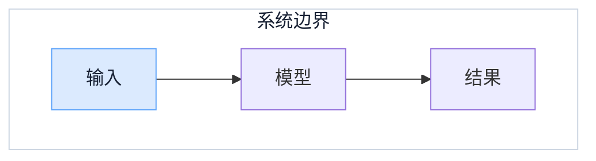

# AI 工程笔记统一发布质量门禁 Implementation Plan

> **For agentic workers:** REQUIRED SUB-SKILL: Use superpowers:subagent-driven-development (recommended) or superpowers:executing-plans to implement this plan task-by-task. Steps use checkbox (`- [ ]`) syntax for tracking.

**Goal:** 把 AI 工程笔记的作者、正文清洁度、Mermaid 可访问性与白底规范固化成自动发布门禁，并让《LLM 应用系统架构》作为第一篇通过新门禁的新增文章上线。

**Architecture:** `AiNotesRepository` 继续负责草稿和正式文章共有的目录、frontmatter 与日期结构；新的 `publication_policy.py` 只校验 `draft: false` 的正式文章。前端 Vitest 从内容目录自动发现正式文章并使用生产 Mermaid 配置真实渲染，不再维护手写文件清单。标准文档与模板负责创作入口，精读、事实核验和桌面/手机视觉质量保留人工门禁。

**Tech Stack:** Python 3.11、Pydantic 2、markdown-it-py、pytest、React 19、TypeScript、Vitest 2.1、Mermaid 11.17.2、DOMPurify 3.4、Markdown。

## Global Constraints

- `draft: true` 允许未完成内容，但目录、文件、frontmatter 和日期必须可解析；`draft: false` 必须通过全部统一发布规则。
- 作者必须为 `苍渊`，座右铭必须为 `博观而约取，厚积而薄发。`。
- 不以固定字数、固定章节数、固定图数或引用数量作为发布条件。
- 旧源仓库 `/Users/neo/Developer/personal/starship-blog-source` 保持只读，不进入运行和部署依赖。
- Mermaid 默认大分组和显式中性大分组使用 `#FFFFFF`；`#F3F4F6` 只保留为中性基础设施节点语义色。
- 每个正式 Mermaid 块必须有非空且全集唯一的 `accTitle`、`accDescr`，并包含 `classDef` 或显式 `style`。
- 正式文章不得含一级 Markdown 标题、原生 HTML、旧组织标记或危险链接协议。
- 机器门禁不替代全文精读、一手来源核验、跨文章去重、独立审查和桌面/手机视觉验收。
- 保留用户未跟踪文件，不把临时 `webui/node_modules` 符号链接加入提交。

---

## Preflight: 同步隔离工作区并保留现有草稿

工作区：`/Users/neo/Developer/work/AI-Agent-Platform/.worktrees/llm-application-architecture`

- [ ] **Step 1: 记录现有草稿状态和源文件哈希**

```bash
git status --short
shasum -a 256 \
  /Users/neo/Developer/personal/starship-blog-source/src/content/blog/AI-LLM系统架构深度指南.md \
  /Users/neo/Developer/personal/starship-blog-source/src/content/blog/AI-LLM系统架构理论指南.md
```

Expected: 只看到两份文章测试改动、一个目标 Markdown 和临时 `webui/node_modules`；源文件哈希仍为：

```text
f21f1316a7c66c5a5c920efe8c0f352dc2532af15d82265d35b58dfbab7dc784
c897f77ba9511c48358164c2c50b8f144703c983c0aa1dcedde9b20a6b145d8f
```

- [ ] **Step 2: 可恢复地同步最新 `master`**

```bash
unlink webui/node_modules
git stash push --include-untracked -- \
  backend/tests/test_ai_notes_production_content.py \
  webui/src/components/ai-notes/MermaidDiagram.integration.test.tsx \
  backend/app/ai_notes/content/01-foundations/02-llm-application-system-architecture.md
git rebase master
git stash pop
ln -s /Users/neo/Developer/work/AI-Agent-Platform/webui/node_modules webui/node_modules
```

Expected: 设计规范和本计划位于最新 `master` 之上；若 `git stash pop` 在两个测试文件产生冲突，stash 会作为恢复副本保留。使用 `apply_patch` 同时保留最新白底 Mermaid 测试与 LLM 文章合同，再执行：

```bash
git add backend/tests/test_ai_notes_production_content.py \
  webui/src/components/ai-notes/MermaidDiagram.integration.test.tsx
git restore --staged backend/tests/test_ai_notes_production_content.py \
  webui/src/components/ai-notes/MermaidDiagram.integration.test.tsx
```

确认工作树不再含 unmerged path。不得用 checkout/reset 丢弃任一侧修改；恢复副本只在所有草稿改动提交后清理。

- [ ] **Step 3: 确认既有 RED 基线**

```bash
cd backend
/Users/neo/Developer/work/AI-Agent-Platform/backend/.venv/bin/pytest -q tests/test_ai_notes_production_content.py
cd ../webui
npm test -- --run src/components/ai-notes/MermaidDiagram.integration.test.tsx
```

Expected: 后端仅因目标文章仍为 `draft: true` 而有 3 项发布合同失败；前端真实 Mermaid 测试通过。其他失败先调查，不能进入实现。

---

### Task 1: 建立正式文章统一发布策略

**Files:**

- Create: `backend/app/ai_notes/publication_policy.py`
- Create: `backend/tests/test_ai_notes_publication_policy.py`
- Modify: `backend/app/ai_notes/validation.py`
- Modify: `backend/tests/test_ai_notes_repository.py`
- Modify: `backend/tests/test_ai_notes_validation.py`
- Modify: `backend/tests/test_ai_notes_production_content.py`

**Interfaces:**

- Consumes: `tuple[Path, ArticleFrontmatter, str]`，与 `iter_validated_articles()` 的输出完全一致。
- Produces: `validate_published_article_policy(entries: Iterable[ArticleSource]) -> None` 和通用异常 `AiNotesPublicationPolicyError`。

- [ ] **Step 1: 写统一策略的失败测试**

在新测试文件中建立最小 frontmatter helper，并覆盖以下行为：

```python
from datetime import date
from pathlib import Path

import pytest

from app.ai_notes.models import ArticleFrontmatter
from app.ai_notes.publication_policy import (
    AiNotesPublicationPolicyError,
    validate_published_article_policy,
)


def article_source(
    markdown: str,
    *,
    slug: str = "sample",
    draft: bool = False,
    author: str = "苍渊",
    motto: str = "博观而约取，厚积而薄发。",
):
    frontmatter = ArticleFrontmatter.model_validate({
        "title": "示例文章",
        "slug": slug,
        "description": "用于验证发布策略。",
        "author": author,
        "motto": motto,
        "publishedAt": date(2026, 8, 28),
        "updatedAt": date(2026, 8, 28),
        "tags": ["AI 工程"],
        "draft": draft,
    })
    return Path(f"{slug}.md"), frontmatter, markdown


VALID_DIAGRAM = """## 正文


"""


@pytest.mark.parametrize(
    ("author", "motto"),
    [("其他作者", "博观而约取，厚积而薄发。"), ("苍渊", "其他座右铭")],
)
def test_rejects_wrong_published_identity(author: str, motto: str) -> None:
    with pytest.raises(AiNotesPublicationPolicyError):
        validate_published_article_policy((
            article_source(VALID_DIAGRAM, author=author, motto=motto),
        ))


@pytest.mark.parametrize("markdown", ["# 一级标题\n", "## 正文\n\n<div>HTML</div>\n"])
def test_rejects_h1_and_raw_html(markdown: str) -> None:
    with pytest.raises(AiNotesPublicationPolicyError):
        validate_published_article_policy((article_source(markdown),))


@pytest.mark.parametrize(
    "diagram",
    [
        "```mermaid\nflowchart TB\nA-->B\n```",
        "```mermaid\nflowchart TB\naccTitle: 只有标题\nA-->B\n```",
        "```mermaid\nflowchart TB\naccTitle: 无样式\naccDescr: 没有语义样式。\nA-->B\n```",
        """```mermaid
flowchart TB
accTitle: 重复标题一
accTitle: 重复标题二
accDescr: 同一张图不能声明两次标题。
A-->B
classDef input fill:#DBEAFE,stroke:#60A5FA,color:#172033;
```""",
        """```mermaid
flowchart TB
accTitle: 灰色分组
accDescr: 大分组错误使用灰色背景。
subgraph SYSTEM[系统]
A-->B
end
classDef input fill:#DBEAFE,stroke:#60A5FA,color:#172033;
style SYSTEM fill:#F8FAFC,stroke:#CBD5E1,color:#172033;
```""",
    ],
)
def test_rejects_incomplete_or_gray_mermaid(diagram: str) -> None:
    with pytest.raises(AiNotesPublicationPolicyError):
        validate_published_article_policy((article_source(f"## 正文\n\n{diagram}\n"),))


def test_rejects_duplicate_accessibility_metadata() -> None:
    with pytest.raises(AiNotesPublicationPolicyError):
        validate_published_article_policy((
            article_source(VALID_DIAGRAM, slug="first"),
            article_source(VALID_DIAGRAM, slug="second"),
        ))


def test_ignores_editorial_rules_for_drafts() -> None:
    validate_published_article_policy((
        article_source("# 未完成\n\n旧内容。", draft=True),
    ))


def test_accepts_clean_published_article() -> None:
    validate_published_article_policy((article_source(VALID_DIAGRAM),))
```

同时在 `test_ai_notes_validation.py` 增加公共入口的错误收敛测试：

```python
def test_publication_policy_errors_are_generic(tmp_path: Path) -> None:
    content = tmp_path / "content"
    content.mkdir()
    category = write_category(
        content, "01-foundations", "基础与原理", "foundations"
    )
    write_article(category, "01-first.md", slug="first", body="## 正文\n\n敏感正文。\n")
    article = category / "01-first.md"
    article.write_text(
        article.read_text(encoding="utf-8").replace("author: 苍渊", "author: 其他作者"),
        encoding="utf-8",
    )
    markers = tmp_path / "markers.yaml"
    markers.write_text("markers: []\n", encoding="utf-8")

    with pytest.raises(AiNotesContentError) as raised:
        validate_publication(content, markers, today=date(2026, 8, 28))

    assert str(raised.value) == "AI notes content unavailable"
    assert "其他作者" not in str(raised.value)
    assert "敏感正文" not in str(raised.value)
    assert str(tmp_path) not in str(raised.value)
```

- [ ] **Step 2: 运行 RED 并确认失败原因**

```bash
cd backend
/Users/neo/Developer/work/AI-Agent-Platform/backend/.venv/bin/pytest -q tests/test_ai_notes_publication_policy.py
```

Expected: collection error `No module named 'app.ai_notes.publication_policy'`；这是缺少统一策略模块导致的有效 RED。

- [ ] **Step 3: 实现最小统一策略**

新模块定义：

```python
from __future__ import annotations

from collections.abc import Iterable, Iterator
from pathlib import Path
import re

from markdown_it import MarkdownIt
from markdown_it.token import Token

from .models import ArticleFrontmatter


EXPECTED_AUTHOR = "苍渊"
EXPECTED_MOTTO = "博观而约取，厚积而薄发。"
ArticleSource = tuple[Path, ArticleFrontmatter, str]

_MARKDOWN = MarkdownIt("commonmark", {"html": True, "linkify": False})
_ACC_TITLE = re.compile(r"(?m)^\s*accTitle:\s*(?P<value>\S(?:.*\S)?)\s*$")
_ACC_DESCR = re.compile(r"(?m)^\s*accDescr:\s*(?P<value>\S(?:.*\S)?)\s*$")
_STYLING = re.compile(r"(?m)^\s*(?:classDef|style)\s+")
_SUBGRAPH = re.compile(r"(?mi)^\s*subgraph\s+(?P<id>[A-Za-z_][A-Za-z0-9_]*)\b")
_STYLE_FILL = re.compile(
    r"(?mi)^\s*style\s+(?P<targets>[A-Za-z0-9_,]+)\s+fill:\s*(?P<fill>#[0-9A-F]{6})\b"
)


class AiNotesPublicationPolicyError(ValueError):
    pass


def _all_tokens(tokens: Iterable[Token]) -> Iterator[Token]:
    for token in tokens:
        yield token
        yield from token.children or ()


def _mermaid_blocks(tokens: Iterable[Token]) -> tuple[str, ...]:
    return tuple(
        token.content.rstrip("\n")
        for token in tokens
        if token.type == "fence" and token.info.strip() == "mermaid"
    )


def _metadata(pattern: re.Pattern[str], diagram: str) -> str:
    values = [matched.group("value") for matched in pattern.finditer(diagram)]
    if len(values) != 1:
        raise AiNotesPublicationPolicyError()
    return values[0]


def _validate_diagram(diagram: str) -> tuple[str, str]:
    if _STYLING.search(diagram) is None:
        raise AiNotesPublicationPolicyError()
    subgraphs = {matched.group("id") for matched in _SUBGRAPH.finditer(diagram)}
    for matched in _STYLE_FILL.finditer(diagram):
        targets = set(matched.group("targets").split(","))
        if targets & subgraphs and matched.group("fill").casefold() == "#f8fafc":
            raise AiNotesPublicationPolicyError()
    return _metadata(_ACC_TITLE, diagram), _metadata(_ACC_DESCR, diagram)


def validate_published_article_policy(entries: Iterable[ArticleSource]) -> None:
    titles: set[str] = set()
    descriptions: set[str] = set()
    for _, frontmatter, markdown in entries:
        if frontmatter.draft:
            continue
        if frontmatter.author != EXPECTED_AUTHOR or frontmatter.motto != EXPECTED_MOTTO:
            raise AiNotesPublicationPolicyError()
        top_level = _MARKDOWN.parse(markdown)
        flattened = tuple(_all_tokens(top_level))
        if any(token.type == "heading_open" and token.tag == "h1" for token in flattened):
            raise AiNotesPublicationPolicyError()
        if any(token.type in {"html_block", "html_inline"} for token in flattened):
            raise AiNotesPublicationPolicyError()
        for diagram in _mermaid_blocks(top_level):
            title, description = _validate_diagram(diagram)
            if title in titles or description in descriptions:
                raise AiNotesPublicationPolicyError()
            titles.add(title)
            descriptions.add(description)
```

在 `validate_publication()` 中先物化 entries，再调用统一策略：

```python
entries = tuple(iter_validated_articles(root, today=today))
validate_published_article_policy(entries)
for _, frontmatter, markdown in entries:
    if frontmatter.draft:
        continue
    # 保留现有 legacy marker 与 link scheme 校验
```

- [ ] **Step 4: 调整旧测试夹具并运行 GREEN**

把 `backend/tests/test_ai_notes_repository.py` 的默认正文从 `# 正文` 改为 `## 正文`，同步更新 `markdown.startswith()` 断言；把 `test_ai_notes_validation.py` 中用于成功路径的 H1 改为 H2。失败路径若专门测试 HTML、危险链接或遗留标记，只修改标题层级，不改变原始风险样例。

```bash
cd backend
/Users/neo/Developer/work/AI-Agent-Platform/backend/.venv/bin/pytest -q \
  tests/test_ai_notes_publication_policy.py \
  tests/test_ai_notes_validation.py \
  tests/test_ai_notes_repository.py \
  tests/test_ai_notes_production_content.py
```

Expected: 新策略测试全部通过；生产内容测试仍仅因 LLM 草稿未发布而保留既有 3 项 RED。

- [ ] **Step 5: 提交统一策略**

```bash
git add backend/app/ai_notes/publication_policy.py \
  backend/app/ai_notes/validation.py \
  backend/tests/test_ai_notes_publication_policy.py \
  backend/tests/test_ai_notes_validation.py \
  backend/tests/test_ai_notes_repository.py \
  backend/tests/test_ai_notes_production_content.py
git commit -m "feat: enforce AI notes publication policy"
```

---

### Task 2: 让真实 Mermaid 测试自动发现正式文章

**Files:**

- Modify: `webui/src/components/ai-notes/MermaidDiagram.integration.test.tsx`

**Interfaces:**

- Produces: 测试内 `publishedArticleFiles(contentRoot?: string): string[]`，返回排序稳定的 `draft: false` Markdown 路径。
- Consumes: `AI_NOTES_MERMAID_CONFIG`、`mermaidImageSource()`、`mermaidMetadata()` 与仓库内容目录。

- [ ] **Step 1: 写自动发现 RED**

先增加一个临时目录测试，证明未登记的新文件会自动被发现，而草稿不会：

```tsx
import {
  mkdirSync, mkdtempSync, readFileSync, readdirSync, rmSync, writeFileSync,
} from "node:fs";
import { join, resolve } from "node:path";
import { tmpdir } from "node:os";


it("discovers published articles without a registration list", () => {
  const root = mkdtempSync(join(tmpdir(), "ai-notes-discovery-"));
  try {
    const category = join(root, "01-foundations");
    mkdirSync(category);
    writeFileSync(join(category, "_index.md"), "---\ntitle: 基础\nslug: foundations\n---\n");
    writeFileSync(join(category, "01-live.md"), "---\ndraft: false\n---\n\n## 正文\n");
    writeFileSync(join(category, "02-draft.md"), "---\ndraft: true\n---\n\n## 草稿\n");

    expect(publishedArticleFiles(root)).toEqual([join(category, "01-live.md")]);
  } finally {
    rmSync(root, { recursive: true, force: true });
  }
});
```

- [ ] **Step 2: 运行 RED**

```bash
cd webui
npm test -- --run src/components/ai-notes/MermaidDiagram.integration.test.tsx
```

Expected: TypeScript/运行失败，因为 `publishedArticleFiles` 尚不存在。

- [ ] **Step 3: 实现无依赖自动发现 helper**

使用 Node 标准库，不增加 YAML 或 frontmatter 依赖：

```tsx
function frontmatter(source: string): string {
  const matched = source.match(/^---\r?\n([\s\S]*?)\r?\n---(?:\r?\n|$)/);
  if (!matched) throw new Error("invalid AI note frontmatter");
  return matched[1] ?? "";
}


function publishedArticleFiles(contentRoot = CONTENT_ROOT): string[] {
  return readdirSync(contentRoot, { withFileTypes: true })
    .filter((entry) => entry.isDirectory())
    .sort((left, right) => left.name.localeCompare(right.name))
    .flatMap((category) => {
      const categoryPath = join(contentRoot, category.name);
      return readdirSync(categoryPath, { withFileTypes: true })
        .filter((entry) => entry.isFile() && entry.name !== "_index.md" && entry.name.endsWith(".md"))
        .sort((left, right) => left.name.localeCompare(right.name))
        .map((entry) => join(categoryPath, entry.name));
    })
    .filter((path) => /^draft:\s*false\s*$/m.test(frontmatter(readFileSync(path, "utf8"))));
}
```

- [ ] **Step 4: 用一个全集测试替换手写生产文章列表**

保留白底画布集成测试，删除五篇已发布文章各自的前端登记测试和手写 `files` 数组，改为：

```tsx
it("renders every published Mermaid diagram with unique metadata", async () => {
  const files = publishedArticleFiles();
  const sources = files.flatMap((path) => mermaidBlocks(readFileSync(path, "utf8")));
  expect(files.length).toBeGreaterThan(0);
  expect(sources.length).toBeGreaterThan(0);
  await expectProductionDiagramsToRender(sources);

  const metadata = sources.map(mermaidMetadata);
  expect(metadata.every(({ description }) => Boolean(description))).toBe(true);
  expect(new Set(metadata.map(({ title }) => title)).size).toBe(sources.length);
  expect(new Set(metadata.map(({ description }) => description)).size).toBe(sources.length);
});
```

LLM 文章仍为草稿时，暂时保留现有 `renders every LLM application architecture diagram` 测试，用于迁移期真实渲染；Task 4 设置 `draft: false` 后，由自动发现全集覆盖，再删除这项临时登记测试。

- [ ] **Step 5: 运行 GREEN 并提交**

```bash
cd webui
npm test -- --run src/components/ai-notes/MermaidDiagram.integration.test.tsx
cd ..
git add webui/src/components/ai-notes/MermaidDiagram.integration.test.tsx
git commit -m "test: auto-discover published Mermaid diagrams"
```

Expected: 当前五篇正式文章的 16 张图全部真实渲染；LLM 草稿不进入正式全集。

---

### Task 3: 提供可复制的写作标准与文章模板

**Files:**

- Create: `docs/standards/ai-engineering-notes.md`
- Create: `docs/templates/ai-engineering-note.md`
- Create: `backend/tests/test_ai_notes_authoring_assets.py`

**Interfaces:**

- 标准文档是人工精读、事实核验、去重、图示和发布清单的唯一作者入口。
- 模板位于内容目录之外，不会被 `AiNotesRepository` 扫描。

- [ ] **Step 1: 写模板合同 RED**

```python
from pathlib import Path


ROOT = Path(__file__).resolve().parents[2]
STANDARD = ROOT / "docs" / "standards" / "ai-engineering-notes.md"
TEMPLATE = ROOT / "docs" / "templates" / "ai-engineering-note.md"


def test_authoring_standard_preserves_human_quality_gates() -> None:
    source = STANDARD.read_text(encoding="utf-8")
    for required in (
        "全文精读", "一手资料", "跨文章去重", "1440×900", "390×844",
        "Critical", "Important", "draft: true", "draft: false",
    ):
        assert required in source


def test_template_starts_as_a_white_canvas_draft_by_cangyuan() -> None:
    source = TEMPLATE.read_text(encoding="utf-8")
    for required in (
        "author: 苍渊",
        "motto: 博观而约取，厚积而薄发。",
        "draft: true",
        "accTitle:",
        "accDescr:",
        "fill:#FFFFFF",
        "classDef",
    ):
        assert required in source
    assert "style SYSTEM fill:#F8FAFC" not in source
```

- [ ] **Step 2: 运行 RED**

```bash
cd backend
/Users/neo/Developer/work/AI-Agent-Platform/backend/.venv/bin/pytest -q tests/test_ai_notes_authoring_assets.py
```

Expected: 两个文件不存在导致失败。

- [ ] **Step 3: 编写标准和模板**

标准必须覆盖：主题准入、源稿精读、文章边界、一手来源、作者身份、正文结构、Mermaid 选择与固定语义色、白色大分组、图前图后解释、发布清单、独立审查、桌面/手机视觉验收、部署后核验。明确“可以没有图，但不能为了图数凑图；需要表达三项以上关系时优先考虑图”。

模板使用可直接复制后替换的合法 frontmatter，默认 `draft: true`；正文使用 H2 起步；示例 Mermaid 使用 `flowchart TB`、唯一元数据、固定语义 `classDef` 和 `style SYSTEM fill:#FFFFFF`。模板正文明确提示删除不需要的章节，不保留解释性占位文字到正式文章。

- [ ] **Step 4: 运行 GREEN 并提交**

```bash
cd backend
/Users/neo/Developer/work/AI-Agent-Platform/backend/.venv/bin/pytest -q tests/test_ai_notes_authoring_assets.py
cd ..
git add docs/standards/ai-engineering-notes.md docs/templates/ai-engineering-note.md \
  backend/tests/test_ai_notes_authoring_assets.py
git commit -m "docs: add AI engineering note authoring standard"
```

---

### Task 4: 让《LLM 应用系统架构》通过新门禁并正式发布

**Files:**

- Modify: `backend/app/ai_notes/content/01-foundations/02-llm-application-system-architecture.md`
- Modify: `backend/tests/test_ai_notes_production_content.py`
- Modify: `webui/src/components/ai-notes/MermaidDiagram.integration.test.tsx`

**Interfaces:**

- Produces: `/ai-notes/foundations/llm-application-system-architecture` 正式文章和 Foundations 分类第二个目录项。
- Consumes: Task 1 的统一策略、Task 2 的自动真实渲染、Task 3 的人工清单。

- [ ] **Step 1: 复核草稿与新规则的差异**

```bash
rg -n '^# |<[A-Za-z][^>]*>|style .*fill:#F8FAFC|accTitle:|accDescr:' \
  backend/app/ai_notes/content/01-foundations/02-llm-application-system-architecture.md
```

Expected: 无 H1/HTML；三张图都有元数据；只命中 `ORCHESTRATION`、`FLOW`、`CHOICE` 三个 `#F8FAFC` 大分组。

- [ ] **Step 2: 把三张图的大分组改为白色**

使用 `apply_patch` 将三行精确改为：

```text
style ORCHESTRATION fill:#FFFFFF,stroke:#CBD5E1,color:#172033;
style FLOW fill:#FFFFFF,stroke:#CBD5E1,color:#172033;
style CHOICE fill:#FFFFFF,stroke:#CBD5E1,color:#172033;
```

节点的 `input/model/data/policy/tool/success/risk/infra` classDef 不变。

- [ ] **Step 3: 在发布开关之前完成草稿真实渲染与内容复核**

```bash
cd webui
npm test -- --run src/components/ai-notes/MermaidDiagram.integration.test.tsx
cd ../backend
/Users/neo/Developer/work/AI-Agent-Platform/backend/.venv/bin/python - <<'PY'
from datetime import date
from pathlib import Path
from app.ai_notes.repository import iter_validated_articles

entries = tuple(iter_validated_articles(Path("app/ai_notes/content"), today=date(2026, 8, 28)))
_, frontmatter, markdown = next(item for item in entries if item[1].slug == "llm-application-system-architecture")
assert frontmatter.draft is True
assert markdown.count("```mermaid") == 3
assert "fill:#F8FAFC" not in markdown
print("LLM application architecture draft contract valid")
PY
```

Expected: 正式全集仍为五篇；草稿结构、三张图和白底合同通过。

- [ ] **Step 4: 完成真实浏览器视觉门禁**

使用 `apply_patch` 在本地工作树暂时把文章改为 `draft: false`，启动本地预览；这一步不提交、不部署。仅使用平台内 Browser，在桌面 `1440×900` 和手机 `390×844` 检查：

1. 正文宽度、字号、表格和代码块可读；
2. 三张图内嵌时不超过阅读约束，白底与博客背景连续；
3. 节点文字、颜色、连线和箭头无截断或重叠；
4. 点击打开、滚轮缩放、拖拽、点击/Esc 关闭正常；
5. 关闭后正文滚动位置稳定。

如果 Browser 没有可用会话或任一视觉项失败，立即用 `apply_patch` 恢复 `draft: true` 并停止发布；不得用 jsdom 或 SVG 字符串冒充视觉验收。全部通过时保留本地 `draft: false`，进入下一步机器门禁。

- [ ] **Step 5: 切换为正式文章并让既有 RED 变 GREEN**

确认文章保持 `draft: false`。删除 Task 2 暂时保留的 `renders every LLM application architecture diagram` 测试；自动发现全集现在必须自行包含这篇文章。

然后运行：

```bash
cd backend
/Users/neo/Developer/work/AI-Agent-Platform/backend/.venv/bin/python -m app.ai_notes.validate
/Users/neo/Developer/work/AI-Agent-Platform/backend/.venv/bin/pytest -q \
  tests/test_ai_notes_api.py \
  tests/test_ai_notes_publication_policy.py \
  tests/test_ai_notes_production_content.py \
  tests/test_ai_notes_repository.py \
  tests/test_ai_notes_validation.py
cd ../webui
npm test -- --run src/components/ai-notes/MermaidDiagram.integration.test.tsx \
  src/components/ai-notes/ArticleMarkdown.test.tsx \
  src/pages/AiNotesPage.test.tsx
```

Expected: `AI notes content valid: 5 categories, 6 published articles`；后端和前端定向测试全部通过；自动发现测试无需新增文件登记即可从 16 张扩展到 19 张图。

- [ ] **Step 6: 提交单篇文章**

```bash
git add backend/app/ai_notes/content/01-foundations/02-llm-application-system-architecture.md \
  backend/tests/test_ai_notes_production_content.py \
  webui/src/components/ai-notes/MermaidDiagram.integration.test.tsx
git commit -m "docs: publish LLM application system architecture note"
```

---

### Task 5: 独立审查、全量验证与受控上线

**Files:** Review all files changed since the design commit.

- [ ] **Step 1: 扫描内容和工作树**

```bash
! rg -n -i 'inkbot|starship|星舰|last reviewed|最后更新|真实项目|2800|19 轮|18 轮|3 天|2026-0[1-4]-|2025-01-21' \
  backend/app/ai_notes/content --glob '*.md' --glob '!_index.md'
! rg -n '^# |<[A-Za-z][^>]*>' backend/app/ai_notes/content --glob '*.md' --glob '!_index.md'
! rg -n 'style .*fill:#F8FAFC' backend/app/ai_notes/content --glob '*.md'
git diff --check
git status --short
```

Expected: 三个扫描无输出；只保留已知源文件、测试、标准和文章改动，以及临时 `webui/node_modules`。

- [ ] **Step 2: 请求独立内容与代码审查**

审查范围：统一策略是否误把草稿当正式文章、异常是否泄露内容、Markdown token 检查是否完整、Mermaid 自动发现是否真正无登记、模板是否会进入运行目录、白底与节点语义色是否分离、LLM 文章事实边界与三图可读性。Critical 和 Important 必须清零。

- [ ] **Step 3: 运行完整验证**

```bash
cd backend
/Users/neo/Developer/work/AI-Agent-Platform/backend/.venv/bin/python -m app.ai_notes.validate
/Users/neo/Developer/work/AI-Agent-Platform/backend/.venv/bin/pytest -q
cd ../webui
npm test -- --run
npm run build
cd ..
git diff --check
```

Expected: 内容校验为 5 分类、6 篇；后端全量、前端全量和生产构建零失败。仅允许既有 Vite 大 chunk 警告，不允许新增错误。

- [ ] **Step 4: 清理临时依赖链接并合并**

```bash
unlink webui/node_modules
git status --short
git fetch origin master
git rebase origin/master
```

如果 `master` 前进，解决冲突后重跑 Step 3。从干净、已审查提交快进合并到 `master`，保留根工作树的用户未跟踪文件。

```bash
git -C /Users/neo/Developer/work/AI-Agent-Platform merge --ff-only \
  feat/llm-application-architecture
test "$(git rev-parse HEAD)" = \
  "$(git -C /Users/neo/Developer/work/AI-Agent-Platform rev-parse master)"
```

- [ ] **Step 5: 推送与受控部署**

```bash
git -C /Users/neo/Developer/work/AI-Agent-Platform push origin master
./deploy/cloud/deploy.sh "/Users/neo/Library/Application Support/OrbbecAI-Agent-Platform/cloud-replica/deploy.env"
```

Expected: `CLOUD_PLATFORM_DEPLOY_OK release=<master 的 40 位 SHA> mode=dingtalk`。

- [ ] **Step 6: 生产后核验**

确认：

- `/opt/orbbec-agent-platform/current` 指向精确 release；
- platform-postgres、api、brain、dingtalk-stream、directory、loopback 六个服务 healthy；
- `https://agent.orbbec.com.cn/api/health` 返回 HTTP 200；
- API 容器内容校验为 5 分类、6 篇；
- 线上 JS 含白色 `clusterBkg`，CSS 的 lightbox 为白底；
- 认证后新文章出现在 Foundations 第二项，三张图在桌面和手机上再次抽查。

- [ ] **Step 7: 清理工作树并选择下一篇**

移除已合并 worktree 和分支。稳定后从《Agent 身份与最小权限》与《LLM 推理服务工程》中按价值和源稿质量选择下一篇，继续逐篇精读，不并行凑数量。
