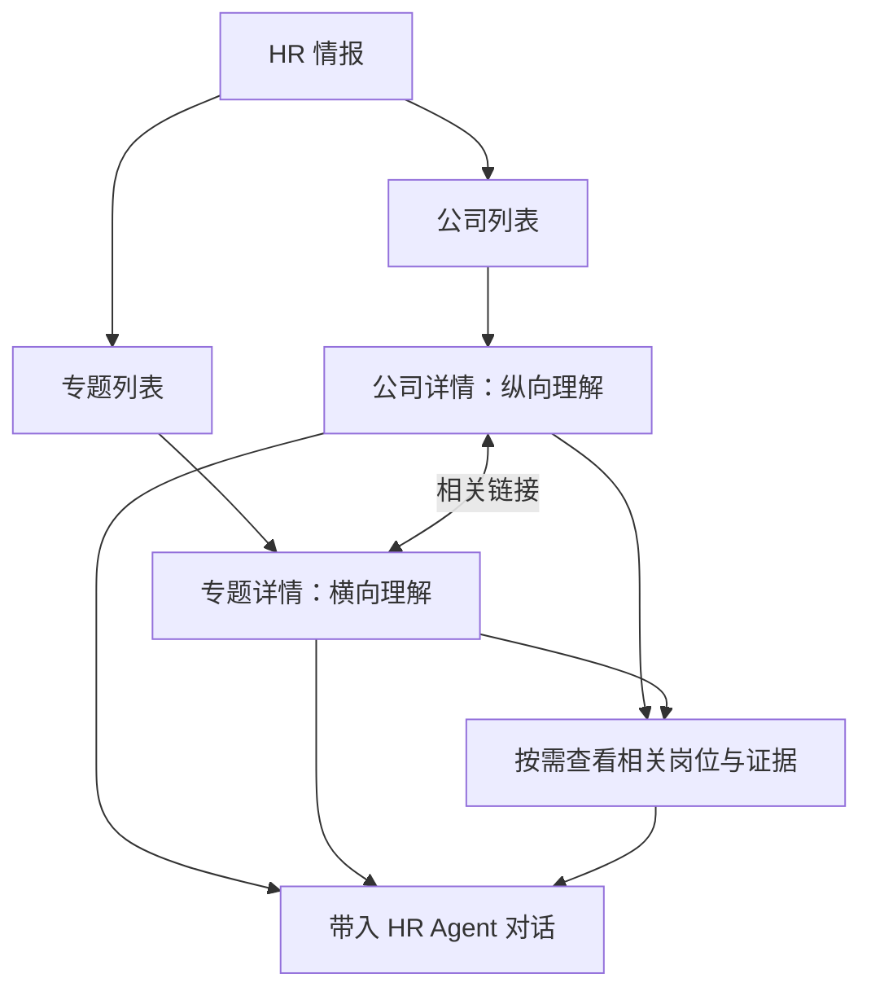

# HR 情报展示与使用设计：公司与专题

日期：2026-09-08

状态：设计评审稿，尚未实施

分支：`feat/hr-intelligence-experience`

## 设计摘要

将当前按报告版本和混合栏目组织的“全景分析”，重构为围绕**公司／专题**展开的 HR 情报空间。用户进入后直接查看最新情报，先理解已有分析，再按需深入数据与证据，并可带着当前内容与 Agent 继续工作。

公司提供纵向理解，专题提供横向理解。两类页面各自保持完整的阅读主线，通过相关链接互通。城市、社招／校招／实习、岗位族、技能和职级等成为内部查看条件；岗位明细、来源和原始材料逐层展开。

本次处理已完成情报的展示和使用。采集、分析生产与情报重新生成不属于本设计范围。

## 1. 当前问题

以下事实来自起点提交 `6777d22` 的代码核查。性能部分识别了执行成本和等待关系，尚未测量生产环境的实际耗时。

### 1.1 根维度混杂，用户难以建立阅读主线

当前一级页签为“AI 分析、社招、校招、实习、产品与业务方向、原始岗位数据、来源证据”。其中同时包含招聘类型、业务主题、分析概览和证据层级。

用户切换页签时，研究对象和阅读目的不断变化。例如，想理解一家公司，需要在总览、招聘类型、业务方向和来源页面之间自行拼接信息。侧边又以分析历史为主要入口，进一步增加了用户的选择负担。

### 1.2 内容重复、重点不明确

研发方向重复出现在总览、公司矩阵和业务方向；同一批推断出现在总览、业务方向和证据页。招聘类型同时存在于独立页签、结构统计和岗位筛选。

一些标题与内容组织不匹配：“关键能力”直接取前六条岗位要求，“重点团队与投入信号”直接取前四条推断。列表顺序并不能说明业务重要性。

原始响应的格式、字节数和内容哈希等信息也出现在阅读路径中。用户需要在大量并列材料中自行识别有用结论。

### 1.3 已有分析的组织没有完整传到页面

当前转换层将多个分析单元的事实、推断和未知项合并成列表。页面缺少围绕公司或专题连续阅读的结构。

既有内容设计包含公司分析、技术与业务专题、人才竞争、替代解释及行动建议，但旧设计中的字段约定不能证明实际内容齐全。接入本设计时，应从已完成材料的实际正文与索引恢复可用的组织关系；缺少的内容明确处理，不以临时生成冒充已有情报。

### 1.4 首次打开和交互承担了过多工作

| 当前行为 | 对体验的影响 |
| --- | --- |
| 当前报告返回后继续等待历史列表；存在比较基线时再等待上一份完整报告 | 首要内容被辅助信息阻塞 |
| 总览请求取得整份岗位、事实和证据元数据 | 用户尚未查看明细，就承担了全量读取与传输成本 |
| 页签切换、筛选等重新渲染时重复分类、统计和生成整份复制用 Markdown | 简单操作触发与当前视图无关的计算 |
| 岗位“先显示 100 条”只限制显示数量 | 没有减少首次下载的数据量 |

### 1.5 内容看完后，缺少自然的使用出口

目前主要操作是复制、下载和打开来源。用户无法直接把当前公司、专题、结论或岗位范围带入招聘对话，经常需要重新描述背景。

### 1.6 版本概念占据产品入口

用户需要最新信息，当前页面却让用户面对历史报告和“第几版”。代码中的版本号还取自 `schema_version`，不适合表达报告的先后批次。

本设计取消用户侧的版本入口，以公司和专题的最新内容作为直接访问对象。

## 2. 用户需求与场景

### 2.1 已确认的产品决定

1. 公司／专题是两个根维度，各自形成完整阅读空间，不能杂糅成一个总页面。
2. 默认显示最新情报，取消版本选择、版本历史和“第几版”展示。
3. 公司侧采用公司列表与公司详情两层：列表帮助选对象，详情帮助连续理解。
4. 公司详情先呈现核心研判，再深入业务、技术和招聘情况；岗位与证据按需展开。
5. 公司与专题通过相关链接互通，进入关联内容后有明确的对象和返回路径。
6. Agent 使用入口随内容出现，可以带着公司、专题或具体结论继续讨论。
7. 用户不需要复制整份报告，Agent 根据问题自主选择资料与方法。

本文中的具体页面命名、布局、默认落点和交互细节属于实现建议，供本次评审确认。角色优先级尚未单独确认；设计以招聘负责人／HRBP 和招聘执行 HR 的共享需求为工作假设，不据此设置新的权限或角色分屏。

### 2.2 需要完成的工作

| 场景 | 用户意图 | 应提供的体验 | 所需内容与数据 |
| --- | --- | --- | --- |
| 日常查看最新情报 | 找到值得关注的对象和认识 | 浏览公司或专题摘要，直接进入详情 | 现有摘要、对象关联、数据时间 |
| 研究一家目标公司 | 理解业务、技术能力和招聘重点 | 在公司详情形成连续认识 | 公司分析、岗位职责要求、业务与技术信号、依据 |
| 研究一个技术或人才问题 | 比较不同公司的共性和差异 | 在专题中跨公司阅读与对照 | 已有专题研判、相关公司、可比统计与证据 |
| 校准内部岗位要求 | 判断哪些条件值得讨论 | 带着外部情报和当前岗位询问 Agent | 已确认岗位目标与约束、外部相似任务及要求 |
| 扩展搜寻方向 | 找到值得研究的公司、城市或相邻领域 | 从公司／专题进入相关岗位，并继续讨论 | 任务与技能关系、公司和地点、适用条件 |
| 核验一个判断 | 知道结论从哪里来、有哪些限制 | 从结论就近展开证据 | 引用、原始来源、观察时间和不确定性 |

### 2.3 数据能支持的判断

公开岗位支持对招聘需求、要求和公开招聘重点的研究，不能直接代表实际 HC、预算、人才供给数量、人员离职意愿或真实薪酬分布。

招聘变化需要已有的可比观察与来源覆盖说明。用户虽然只看最新情报，但最新情报中的变化结论仍须有依据；没有可比数据时，正常展示当前认识，不强行填充趋势。

## 3. 信息架构

建议将现有“全景分析”入口命名为“HR 情报”，进入后提供“公司”和“专题”两个根入口。首次进入默认展示公司列表；使用过程中的根入口切换和返回保留各自浏览位置。

### 3.1 层级职责

| 层级 | 职责 | 内容 |
| --- | --- | --- |
| 根入口 | 选择研究方式 | 公司／专题 |
| 对象列表 | 找到要研究的对象 | 公司摘要／专题摘要 |
| 对象详情 | 连续理解当前对象 | 现有核心判断、分析正文、相关数据 |
| 查看条件 | 缩小当前明细或比较范围 | 城市、招聘类型、岗位族、技能、职级等 |
| 支撑材料 | 查证或深入观察 | 相关岗位、统计依据、原始来源 |
| 使用出口 | 将认识带进工作 | 带入对话及必要的复制、导出 |

当前招聘岗位是使用情报时的业务上下文。报告、版本、原始数据和证据不新增为与公司／专题并列的根入口。

### 3.2 公司与专题的关系

一家公司可以关联多个专题，一个专题可以涉及多家公司。关联关系来自已有分析及其索引，页面不通过名称中的几个关键词自行推定关系。

公司页展示相关专题的名称和简短说明，点击后进入专题页；专题页展示涉及公司的比较内容或相关入口，点击公司后进入公司详情。关联入口只呈现必要预览，不把对方整篇正文嵌入当前页面。

## 4. 公司侧设计

### 4.1 公司列表：帮助选择对象

建议使用紧凑列表，避免每家公司占据一张包含多组统计和长段正文的大卡片。每项表达：

- 公司名称；
- 已有的简短核心判断或最新重点；
- 帮助识别的业务／技术方向信息；
- 与内容对应的数据时间，以及必要的内容可用提示。

支持按公司名称和别名查找。无明确业务排序依据时采用稳定的中性顺序；已有编排可保留，但不能将数组前几项标为“最重要”或“与你最相关”。

列表不展开岗位明细、来源渠道、完整能力树或多项统计。用户选择公司后，再进入完整内容。

### 4.2 公司详情：保持一个对象、一条阅读主线

页头持续明确公司名称、内容时间与“带着这家公司讨论”入口。主体以连续阅读为主，使用章节和轻量目录，而非大量等权卡片。

建议阅读顺序如下；实际章节由已有内容决定，不要求每家公司填满相同模板。

| 阅读阶段 | 用户要理解的问题 | 展示方式 |
| --- | --- | --- |
| 核心研判 | 这家公司当前最值得理解的是什么？ | 已有核心摘要与判断，必要的不确定性就近说明 |
| 业务与技术 | 它在做什么，需要哪些能力？ | 保留已有业务、产品、技术分析的逻辑与区别 |
| 招聘重点 | 它公开在招什么，这些岗位如何形成能力组合？ | 分析与必要统计相连，相关岗位可展开 |
| 对我们工作的启示 | 与当前人才竞争、岗位或搜寻有什么关系？ | 展示已有启示及其适用条件，可带入对话进一步处理 |
| 延伸阅读 | 还有哪些相关问题值得继续研究？ | 相关专题链接，进入独立专题空间 |

缺少某部分分析时，不临时拼接若干事实伪装成该章节。可用内容正常展示，必要缺口集中说明。未知项与替代解释尽量跟随相关判断，不在每个区域重复通用警告。

### 4.3 岗位和证据按需展开

“查看相关岗位”保留公司范围，支持在该范围内按现有可靠字段筛选。岗位使用服务端分页或等效的分段读取，用户看到多少，不要求浏览器预先取得全部岗位。

结论附近提供证据入口。展开后显示具体依据、来源链接和观察时间；原始文件下载放在更深入的核查位置。MIME、字节数、哈希等不进入核心阅读区。

## 5. 专题侧设计

### 5.1 专题列表：帮助找到要理解的问题

每项包含专题名称、研究问题或简短摘要、涉及的公司范围，以及内容时间。专题内容从已有材料发现，不在前端写死固定专题名单。

“具身智能人才竞争”“光学能力需求”“校招布局”是可能的专题示例，不是本设计要求必须生成的内容。社招、校招和实习只有在已有独立分析时才作为专题出现，否则作为查看条件。

### 5.2 专题详情：围绕同一问题横向展开

页头明确专题问题、涉及范围、时间与“带着这个专题讨论”入口。

主体先呈现已有综合判断，再解释公司间的共性、差异及其业务含义。对照表只用于真正适合比较的内容；正文保留已有分析中的解释、依据和不确定性。涉及的公司可以进入独立公司详情。

专题详情不把各公司完整分析依次拼接成一篇超长报告，也不只堆岗位数量。

### 5.3 筛选不能悄悄改变结论的含义

用户在专题中按城市、招聘类型或公司缩小明细范围时，界面明确显示当前筛选范围。原专题结论仍标明其原有范围，不能因为下方表格变了，就让用户误以为分析已重新针对筛选范围生成。

如需解释新的范围，用户可带着选中范围向 Agent 提问。打开页面和普通筛选不触发重新分析。

## 6. 内容如何进入 Agent 工作

### 6.1 明确携带正在看的内容

支持带入一家公司、一个专题、一条具体结论，或已选岗位／筛选范围。页面使用清楚的业务名称表达选择，不要求用户操作资源编号或文件路径。

交互过程：

1. 用户点击当前内容的“带入对话”。
2. 回到当前可用的 HR 对话；没有明确对话时进入新对话草稿。
3. 输入区显示所选公司、专题或内容摘要，允许查看和移除。
4. 保留用户已写的文字，用户补充问题后自行发送；点击选择不自动发出任务。
5. 提交失败时保留输入与选择，成功后清理本次已提交选择。

切换公司／专题、展开证据和普通浏览不会自动改变正在编写的任务上下文。跨页返回保留阅读位置，避免使用 Agent 后需要重新找内容。

### 6.2 Agent 获得什么

当前用户问题、所选内容及其明确范围、相关引用与必要摘要，以及已有的岗位和对话上下文，应成为可信的任务输入。大段正文、全部岗位和原始证据按需读取，不整库塞进初始提示词。

用户所选内容表达本轮关注对象。Agent 根据真实问题判断需要哪些进一步资料，也可以说明材料不适用或证据不足；不把外部情报直接覆盖为内部岗位事实。

普通对话也应支持 Agent 发现和读取已有情报，不能要求用户先浏览页面或输入特定触发词。当前关键词门控并不等于自主选择能力：实现时须明确核验并提供情报发现、正文读取和证据读取通道，复用现有 Agent 工具循环。本设计没有将尚未验证的通道记为已具备能力。

方法论库可以作为另一类参考资源供 Agent 自主选用。本功能不要求先合并或发布保留的 `feat/hr-methodology-library` 分支，不能把两类内容硬连接成必经步骤。

### 6.3 最新信息与已经发出的讨论

浏览入口始终提供当前最新可用内容。后台更新不应突然替换正在阅读的正文、用户已选内容或已发出的消息。更新提示只表达新的内容或时间，用户无需选择“第几版”。

已发出的讨论保留当时所选材料和引用，方便继续理解答案依据；技术重试复用既有任务输入。新的浏览或新的问题可以使用最新内容。上述一致性由系统处理，不增加版本管理页面。

## 7. 内容与读取设计

### 7.1 保留语义对象及关联

页面需要的是可理解的内容对象，而不是一份包罗全部数据的大响应。

| 对象 | 最小必要内容 | 关联 |
| --- | --- | --- |
| 公司 | 稳定身份、名称／别名、已有摘要、可读分析、内容时间 | 相关专题、结论、岗位与来源 |
| 专题 | 稳定身份、名称、研究范围、已有摘要及正文、内容时间 | 涉及公司、结论、比较材料与来源 |
| 结论或章节 | 稳定引用、正文、适用范围、已有事实／推断属性 | 相关公司／专题、依据和必要的限制说明 |
| 岗位 | 原有岗位身份、公司、职责要求、地点、状态和时间 | 来源与相关分析 |
| 证据 | 具体依据、原始链接、观察时间 | 被哪些内容引用 |

前端按这些对象呈现，不再用公司名称、岗位标题或正文关键词临时推导新的业务分类。浏览排序、分页、字段校验等工程处理不替代 Agent 的理解与判断。

### 7.2 先核对已完成内容，再确定适配位置

实施前对实际已完成材料做一次只读盘点：公司与专题是否有独立内容，摘要和正文如何定位，关系与引用是否可恢复，哪些结构化字段实际有值。

已有章节和索引能够承接时，直接适配；内容确实不存在时显示可用范围，不伪造分析，也不在页面访问时补调模型。若该缺口使一个核心场景无法成立，在实现前明确反馈该场景的限制。

读取接口按公司／专题列表、对象详情、分段岗位和按需证据组织。它们复用既有情报来源及访问权限；完整接口字段和运行时工具注册位置在实现计划中与现有代码对齐。本稿确定职责边界，不预先绑定尚未核验的运行时能力。

### 7.3 范围准确、统计可解释

岗位记录、去重岗位和公开招聘状态按实际口径命名，不能混用。不同公司的覆盖时间或来源完整性不同，应在相关比较中就近说明。

公司与专题的统计和明细采用一致范围。缺失记录不自动显示为零，缺少人才履历数据时不呈现人才供给或人员流动指标。

## 8. 加载与交互体验

- 列表只读取识别对象所需的摘要和必要元数据；公司与专题入口独立加载。
- 进入详情先显示已有核心内容，不等待岗位全量、证据下载或历史比较。
- 长文、相关岗位和证据根据实际访问需要读取；明细采用服务端分页或等效机制。
- 相同内容的重复访问可以复用已取得结果，同时确保新进入时能识别最新可用内容；缓存必须沿用现有用户和权限边界。
- 复制和导出在用户操作时执行。静态统计避免在每次页签切换和输入时重复计算。
- 局部加载失败只影响对应区域；已经可读的正文保持可用，用户能针对失败区域重试。
- 快速切换对象时，旧请求不能覆盖新对象内容。返回列表或从关联页面返回时恢复筛选和阅读位置。
- 小屏幕延续相同阅读顺序，复杂表格在必要区域内滚动；不把整页挤成无法阅读的宽表。

性能验收覆盖首要内容可读时间、详情打开、明细筛选和返回操作。实施时用代表性情报规模与真实 HTTP 环境建立基线，再确定具体目标；当前没有线上计时数据，不写未经测量的提速承诺。

## 9. 使用状态与兼容

| 情况 | 页面行为 |
| --- | --- |
| 公司或专题存在，部分分析缺失 | 展示已有内容，清楚说明必要缺口 |
| 某来源较旧或覆盖有限 | 就近呈现时间／范围说明，不把缺失等同于没有招聘 |
| 岗位筛选无结果 | 保留筛选条件，显示该范围没有匹配记录 |
| 证据暂时无法读取 | 保留当前判断与来源信息，允许局部重试 |
| 没有可用情报 | 提供简洁空状态，不出现重新采集／重新分析入口 |
| 内容已更新 | 新进入展示最新内容；当前阅读可提示更新，不突然替换正文 |
| 权限不足 | 沿用现有 HR 情报授权，不因新入口扩大可见范围 |

现有“全景分析”入口迁移到公司／专题体验。旧页面链接根据可识别对象导向当前对应内容；无法识别时进入 HR 情报根入口。报告下载可以保留为辅助操作，不再成为根导航或首屏主要任务。

具体对象路径与旧链接映射在接口设计时统一确定，并以可回退的发布方式替换页面。发布本身不属于本文已执行的工作。

## 10. 验收标准

### 产品与内容

- 根入口清楚区分公司与专题，没有恢复成混合总览或版本列表。
- 公司列表能够帮助选对象，公司详情围绕单一公司连续展开。
- 专题围绕一个问题跨公司理解，不拼接成公司长报告合集。
- 关联可访问且可返回，进入相关内容后研究对象清楚。
- 核心认识、查看条件、岗位明细与证据层级分明。
- 页面忠实呈现已有分析的对象、范围和依据；不将数组位置作为业务重要性。
- 最新内容可直接访问，用户不需要理解或操作版本。

### 使用

- 用户可从公司、专题或具体内容带入对话，不需要复制整份报告。
- 选择可见、可移除；文字草稿、选择及返回位置在交互中保持一致。
- 选择不自动发送，提交失败不丢失内容，重试不静默替换任务材料。
- Agent 能拿到所选范围与引用；进一步读取遵循真实问题，不依赖固定关键词或预设方法链。
- 业务验证能完整走通“理解一个对象—核验判断—用于当前岗位讨论”，不以引用数量代替实际效果。

### 工程验证顺序

遵循仓库既有要求：真实身份与权限下的 HTTP/API 优先，验证读取范围、分段加载、对话携带、持久化与恢复；再验证组件状态和必要浏览器交互。接口模拟、真实模型试验和生产验收分别记录，不互相替代。

## 11. 评审范围与后续工作

公司／专题根维度、最新默认、阅读空间分离、公司列表与详情分层已经确认。本稿将其展开为可评审设计。

建议重点评审：公司和专题的阅读顺序是否贴近 HR 工作，筛选与证据层级是否清楚，以及带入对话能否自然承接当前任务。通过设计评审后，再编写实施计划、核验实际内容与运行时接入位置，并确定 API 和页面变更。

本次交付仅为设计文档。未修改产品代码、生产情报或保留的方法论库分支。

## 12. 依据

- [需求与行业产品研究](../../research/hr-intelligence-experience/2026-09-08-product-discovery.md)：包括 LinkedIn Talent Insights、Lightcast、Draup、AlphaSense 的官方资料及借鉴边界。
- [当前页面加载](../../../webui/src/workspaces/hr/HrPanoramaWorkspace.tsx)
- [当前页面内容与交互](../../../webui/src/workspaces/hr/HrPanoramaReport.tsx)
- [当前情报转换层](../../../backend/app/hr/panorama_service.py)
- [当前前端数据契约](../../../webui/src/hrPanoramaTypes.ts)
