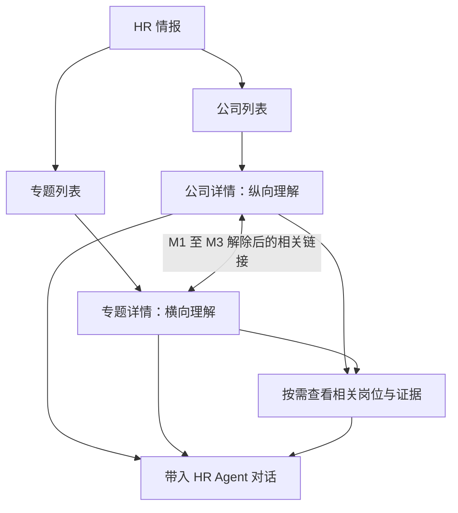

# HR 情报展示与使用设计：公司与专题

日期：2026-09-08

状态：真实内容核查后的设计修订稿；公司侧可适配，完整专题侧受阻，尚未实施

分支：`feat/hr-intelligence-experience`

## 设计摘要

将当前按报告版本和混合栏目组织的“全景分析”，重构为围绕**公司／专题**展开的 HR 情报空间。用户进入后直接查看最新情报，先理解已有分析，再按需深入数据与证据，并可带着当前内容与 Agent 继续工作。

公司提供纵向理解，专题提供横向理解。两类页面各自保持完整的阅读主线，通过相关链接互通。城市、社招／校招／实习、岗位族、技能和职级等成为内部查看条件；岗位明细、来源和原始材料逐层展开。

本次处理已完成情报的展示和使用。公司侧所需的独立内容与身份已经在真实产物中确认，可推进读模型、API 和展示适配。专题侧缺少可靠关联、业务元数据和明确的内容状态，完整专题及双向关联目前受阻，依赖 §5.4 的 M1／M2／M3 上游修正及专题内容复核。

采集、分析生产和情报重新生成不在本次消费侧实施范围内。本文列明这些上游依赖，不代表已经执行或授权执行生产改动。公司／专题仍是已确认的两个根维度；公司侧可以独立开发和验证，但不能将其算作整套设计完成，也不以占位专题冒充第二个根维度已可用。

## 1. 当前问题

以下事实来自起点提交 `6777d22` 的相关代码，以及本机真实 bundle `2b49ecc4-42fe-45ae-80ac-26891f42ac6c` 的只读验证。该样本包含 12 家公司、3437 个岗位和 86 个分析单元，已通过现有 `verify_import_bundle` 并实际调用 `_project` 比较转换前后结果；[核查数据](../../reviews/2026-09-08-hr-intelligence-real-bundle-audit.json)可复核。

这是本机文件与进程内转换核查，不是生产部署清单、真实 HTTP、浏览器或线上性能验证。

### 1.1 根维度混杂，用户难以建立阅读主线

当前一级页签为“AI 分析、社招、校招、实习、产品与业务方向、原始岗位数据、来源证据”。其中同时包含招聘类型、业务主题、分析概览和证据层级。

用户切换页签时，研究对象和阅读目的不断变化。例如，想理解一家公司，需要在总览、招聘类型、业务方向和来源页面之间自行拼接信息。侧边又以分析历史为主要入口，进一步增加了用户的选择负担。

### 1.2 内容重复、重点不明确

页面代码在总览、公司矩阵和业务方向中重复安排研发方向，在多个位置重复安排招聘类型；其中矩阵与结构统计在真实样本中因契约失配不可达，见 §1.3。同一批推断仍在总览、业务方向和证据页反复出现。

一些标题与内容组织不匹配：“关键能力”直接取前六条岗位要求，“重点团队与投入信号”直接取前四条推断。同类代码还包括事实取前四条，以及当前样本未进入的统计分支中技术栈取前十六项。列表顺序并不能说明业务重要性。

原始响应的格式、字节数和内容哈希等信息也出现在阅读路径中。用户需要在大量并列材料中自行识别有用结论。

### 1.3 已有内容被扁平化和丢弃，统计结构与页面不兼容

真实样本经过当前转换层后：

| 内容 | 原始分析 | 页面接口得到 |
| --- | --- | --- |
| 单元摘要 | 86 | 1 |
| 建议 recommendations | 86 | 0 |
| 替代解释 alternatives | 86 | 0 |
| 事实 facts | 410 | 332 |
| 推断 inferences | 104 | 88 |

`_summary()` 仅选择一个单元摘要；`_project()` 把剩余分析合并成少数扁平列表。事实必须能匹配岗位快照才能保留，导致本样本 78 条非岗位匹配事实被移除，其中包括官网公开材料依据；依赖被移除事实的推断也被丢弃。建议、替代解释、置信度和 `claim_type` 未传出，推断／建议／替代解释自身的稳定 ID 也未保留。

因此，公司侧的核心摘要、建议、证据展开和“带入具体结论”都依赖读模型与 API 修正，不能只修改前端组件。引用要支持岗位和非岗位公开文档，并保留原分析单元与事实、推断、建议、替代解释之间的关联。

统计层也已复现不兼容：真实 `aggregates` 是顶层 `schema_version: 3`，没有 `_v2` 包装；前端只接受 `_v2.schema_version === 2`，因此本样本的公司矩阵及结构面板不会进入渲染分支。即使补一个包装也不够：已存矩阵使用 `company_key`，前端却用投影后的 UUID 查询。

旧 `legacyDirections()` 读取顶层数值，真实样本只得到 `schema_version → 3`。据此可确定当前代码会将格式号当作研发方向数据；本次没有运行浏览器，不能将此表述为亲眼观察到生产页面。

### 1.4 首次打开和交互承担了过多工作

| 当前行为 | 对体验的影响 |
| --- | --- |
| 当前报告返回后继续等待历史列表 | 首要内容被辅助信息阻塞 |
| 总览请求取得整份岗位、事实和证据元数据 | 用户尚未查看明细，就承担了全量读取与传输成本 |
| 页签切换、筛选等重新渲染时重复分类、统计和生成整份复制用 Markdown | 简单操作触发与当前视图无关的计算 |
| 岗位“先显示 100 条”只限制显示数量 | 没有减少首次下载的数据量 |

上一份报告的额外请求只存在于条件分支：比较要求 `previous.versionNumber < current.versionNumber`，而二者实际取自 schema 版本。同一 schema 的报告无法满足条件，因此不能把第三次完整请求列为已经发生的生产性能成本。生产是否存在不同 schema 的历史产物未核验；即使偶然触发，也不能证明它是有效的时间比较。

### 1.5 内容看完后，缺少自然的使用出口

目前主要操作是复制、下载和打开来源。用户无法直接把当前公司、专题、结论或岗位范围带入招聘对话，经常需要重新描述背景。

### 1.6 版本概念占据产品入口

用户需要最新信息，当前页面却让用户面对历史报告和“第几版”。代码中的版本号还取自 `schema_version`，不适合表达报告的先后批次。

本设计取消用户侧的版本入口，以公司和专题的最新内容作为直接访问对象。

同时删除“招聘变化”板块及其首屏比较请求，不迁移一个长期空白的功能。真实聚合的 `trend.state` 为 `baseline_only`，生成代码也固定产生该状态；再加上 schema 比较问题，同一 schema 下无法正确找到时间基线。将来只有在数据具备可信跨期比较能力后，才另行设计变化展示。

## 2. 用户需求与场景

### 2.1 已确认的产品决定

1. 公司／专题是两个根维度，各自形成完整阅读空间，不能杂糅成一个总页面。
2. 默认显示最新情报，取消版本选择、版本历史和“第几版”展示。
3. 公司侧采用公司列表与公司详情两层：列表帮助选对象，详情帮助连续理解。
4. 公司详情先呈现核心研判，再深入业务、技术和招聘情况；岗位与证据按需展开。
5. 公司与专题通过相关链接互通，进入关联内容后有明确的对象和返回路径。
6. Agent 使用入口随内容出现，可以带着公司、专题或具体结论继续讨论。
7. 用户不需要复制整份报告，Agent 根据问题自主选择资料与方法。

本文中的具体页面命名、布局、默认落点和交互细节属于实现建议，供本次评审确认。角色优先级尚未单独确认；设计以招聘负责人／HRBP 和招聘执行 HR 的共享需求为工作假设，不据此设置新的权限或角色分屏。

### 2.2 需要完成的工作

| 场景 | 用户意图 | 应提供的体验 | 所需内容与数据 |
| --- | --- | --- | --- |
| 日常查看最新情报 | 找到值得关注的对象和认识 | 浏览公司或专题摘要，直接进入详情 | 现有摘要、对象关联、数据时间 |
| 研究一家目标公司 | 理解业务、技术能力和招聘重点 | 在公司详情形成连续认识 | 公司分析、岗位职责要求、业务与技术信号、依据 |
| 研究一个技术或人才问题 | 比较不同公司的共性和差异 | 在专题中跨公司阅读与对照 | 已有专题研判、相关公司、可比统计与证据 |
| 校准内部岗位要求 | 判断哪些条件值得讨论 | 带着外部情报和当前岗位询问 Agent | 已确认岗位目标与约束、外部相似任务及要求 |
| 扩展搜寻方向 | 找到值得研究的公司、城市或相邻领域 | 从公司／专题进入相关岗位，并继续讨论 | 任务与技能关系、公司和地点、适用条件 |
| 核验一个判断 | 知道结论从哪里来、有哪些限制 | 从结论就近展开证据 | 引用、原始来源、观察时间和不确定性 |

### 2.3 数据能支持的判断

公开岗位支持对招聘需求、要求和公开招聘重点的研究，不能直接代表实际 HC、预算、人才供给数量、人员离职意愿或真实薪酬分布。

本次不设置招聘变化、趋势计数或变化专题入口。当前只呈现最新的有效认识；跨期变化需要可信的历史观察与覆盖口径，属于另行解除的数据依赖。

## 3. 信息架构

以下是目标信息架构。专题空间及公司／专题双向关联须在 §5.4 的依赖解除后进入正式完整验收，不能先用当前缺失元数据的文件拼出假完成页面。

建议将现有“全景分析”入口命名为“HR 情报”，进入后提供“公司”和“专题”两个根入口。首次进入默认展示公司列表；使用过程中的根入口切换和返回保留各自浏览位置。

### 3.1 层级职责

| 层级 | 职责 | 内容 |
| --- | --- | --- |
| 根入口 | 选择研究方式 | 公司／专题 |
| 对象列表 | 找到要研究的对象 | 公司摘要／专题摘要 |
| 对象详情 | 连续理解当前对象 | 现有核心判断、分析正文、相关数据 |
| 查看条件 | 缩小当前明细或比较范围 | 城市、招聘类型、岗位族、技能、职级等 |
| 支撑材料 | 查证或深入观察 | 相关岗位、统计依据、原始来源 |
| 使用出口 | 将认识带进工作 | 带入对话及必要的复制、导出 |

当前招聘岗位是使用情报时的业务上下文。报告、版本、原始数据和证据不新增为与公司／专题并列的根入口。

### 3.2 公司与专题的关系

目标关系是一家公司关联多个专题、一个专题涉及多家公司；**该关系目前尚未具备可靠数据，受 M1 阻塞**。真实样本 49 个 topic 块的 `companies` 全为空。专题输入证据覆盖全部公司，并不证明逐家公司都有相关分析；四个 topic 单元的岗位事实又都只回指 agibot、bambu-lab、creality、elegoo，不能据此恢复完整的专题关系。

页面不通过名称关键词推定关系，也不把输入全集或引用样本当作“涉及公司”。解除 M1 后，关联从明确的专题范围与实质分析关系读取；公司回链使用同一关系反查。

公司页展示相关专题的名称和简短说明，点击后进入专题页；专题页展示涉及公司的比较内容或相关入口，点击公司后进入公司详情。关联入口只呈现必要预览，不把对方整篇正文嵌入当前页面。

## 4. 公司侧设计

公司侧可行性已确认：样本中有 12 个 `kind=company` 单元、12 份公司 Markdown、84 个带公司身份的分段索引；具备摘要、建议、替代解释、置信度及分面信息。聚合矩阵已存在并使用 `company_key`。本样本矩阵只有 11 项，不能假定每家公司的岗位统计都完整，缺项仍要结合覆盖状态处理。

公司身份以稳定 `company_key` 贯穿列表、详情、矩阵和引用；需要兼容既有 UUID 时做明确映射，不在页面临时猜测。公司侧适配不需要新生产步骤。

### 4.1 公司列表：帮助选择对象

建议使用紧凑列表，避免每家公司占据一张包含多组统计和长段正文的大卡片。每项表达：

- 公司名称；
- 已有的简短核心判断或最新重点；
- 帮助识别的业务／技术方向信息；
- 与内容对应的数据时间，以及必要的内容可用提示。

支持按公司名称和别名查找。无明确业务排序依据时采用稳定的中性顺序；已有编排可保留，但不能将数组前几项标为“最重要”或“与你最相关”。

列表不展开岗位明细、来源渠道、完整能力树或多项统计。用户选择公司后，再进入完整内容。

### 4.2 公司详情：保持一个对象、一条阅读主线

页头持续明确公司名称、内容时间与“带着这家公司讨论”入口。主体以连续阅读为主，使用章节和轻量目录，而非大量等权卡片。

建议阅读顺序如下；实际章节由已有内容决定，不要求每家公司填满相同模板。

| 阅读阶段 | 用户要理解的问题 | 展示方式 |
| --- | --- | --- |
| 核心研判 | 这家公司当前最值得理解的是什么？ | 已有核心摘要与判断，必要的不确定性就近说明 |
| 业务与技术 | 它在做什么，需要哪些能力？ | 保留已有业务、产品、技术分析的逻辑与区别 |
| 招聘重点 | 它公开在招什么，这些岗位如何形成能力组合？ | 分析与必要统计相连，相关岗位可展开 |
| 对我们工作的启示 | 与当前人才竞争、岗位或搜寻有什么关系？ | 展示已有启示及其适用条件，可带入对话进一步处理 |
| 延伸阅读 | 还有哪些相关问题值得继续研究？ | M1 至 M3 解除后展示相关专题链接；此前不生成伪关联 |

缺少某部分分析时，不临时拼接若干事实伪装成该章节。可用内容正常展示，必要缺口集中说明。未知项与替代解释尽量跟随相关判断，不在每个区域重复通用警告。

### 4.3 岗位和证据按需展开

“查看相关岗位”保留公司范围，支持在该范围内按现有可靠字段筛选。岗位使用服务端分页或等效的分段读取，用户看到多少，不要求浏览器预先取得全部岗位。

结论附近提供证据入口。展开后显示具体依据、来源链接和观察时间；原始文件下载放在更深入的核查位置。MIME、字节数、哈希等不进入核心阅读区。

## 5. 专题侧设计

**当前状态：完整专题体验受阻。**现有产物存在专题正文及技术 `scope_key`，但它们不足以实现业务名称、研究问题、可信公司范围、可用状态与双向关联。以下 §5.1 至 §5.3 是解除依赖后的目标，不是本次可直接适配的承诺。

### 5.1 专题列表：帮助找到要理解的问题

目标列表包含业务名称、研究问题／摘要、明确研究范围及内容时间，读取生产端提供的专题目录。

当前生成单元的 `_TOPIC_SCOPES` 固定为四项，而 Markdown 的 `_TOPIC_FILES` 固定写出七份，包含三种招聘类型；标题为文件名加“招聘专题”。样本七个 H1 均是这种技术名称，没有持久化的业务名称、研究问题和结构化研究范围。必须先完成 M2，不能把“名单不写在前端”当作已实现内容发现。

“具身智能人才竞争”“光学能力需求”“校招布局”仍只是可能的业务题目，不要求本次生成。

社招、校招、实习是否可作为专题，需要目录明确其对应分析单元和状态，不能仅看文件存在。生产代码在没有单元时仍写占位 Markdown，且缺少专门的分析可用状态，必须完成 M3。本次样本有三个 track 单元，七份专题均有分析，未观察到占位文件；缺失状态是代码契约缺口，不是此样本的实际占位现象。

### 5.2 专题详情：围绕同一问题横向展开

页头明确专题问题、涉及范围、时间与“带着这个专题讨论”入口。

主体先呈现已有综合判断，再解释公司间的共性、差异及其业务含义。对照表只用于真正适合比较的内容；正文保留已有分析中的解释、依据和不确定性。涉及的公司可以进入独立公司详情。

专题详情不把各公司完整分析依次拼接成一篇超长报告，也不只堆岗位数量。

### 5.3 筛选不能悄悄改变结论的含义

用户在专题中按城市、招聘类型或公司缩小明细范围时，界面明确显示当前筛选范围。原专题结论仍标明其原有范围，不能因为下方表格变了，就让用户误以为分析已重新针对筛选范围生成。

如需解释新的范围，用户可带着选中范围向 Agent 提问。打开页面和普通筛选不触发重新分析。

### 5.4 专题解除阻塞所需的生产端改动

| 依赖 | 必须补齐的产物能力 | 消费侧如何使用 | 解除条件 |
| --- | --- | --- | --- |
| M1：范围与公司关系 | 明确声明研究范围、实质分析／比较涉及的公司、关系依据；引用样本涉及的公司另行表达 | 专题范围、公司列表、双向回链和 Agent 发现 | 关系可追溯到明确范围与实质内容，不由输入全集、排序位置或名字匹配产生 |
| M2：专题身份与目录 | 单一专题目录持久化稳定 ID、业务名称、研究问题、内容定位及分析单元引用；统一 topic 与 track 文档的登记来源 | 从目录发现专题，而非扫描固定文件清单 | 标题和问题由内容来源提供，目录与实际单元／正文对应，新增专题无需修改前端名单 |
| M3：分析状态 | 明确区分已有分析、缺少分析、已分析但证据不足，并记录对应单元 | 控制列表可用性、缺失提示和是否可带入 | 不依赖占位句子、文件存在、篇幅或置信度猜测状态；覆盖状态与分析状态分开 |

这些改动需同步到生成、Markdown／块索引、内容校验和导入契约，不是前端适配即可完成。本次设计文档修订没有改动生产工具或已有 bundle。

M1 尤其不能简单改为“对引用事实反查公司”。事实引用能证明某条证据来自某公司，不能证明专题覆盖了哪些公司、哪些公司可以比较。真实样本中四个专题的岗位事实来自相同四家公司；需要在生产侧核查已有专题的比较内容和覆盖是否充分。若不足，应修订相应专题分析／编排，单纯补元数据不能解除业务阻塞；这不要求重做已经可用的公司分析，也不自动启动模型。

兼容旧产物时，可依据已接受单元是否存在及生产端明确的文档映射判断“有／无分析”，不需要匹配中文占位句。业务名称、研究问题、完整关系和证据不足状态不能凭空恢复；未补齐的旧专题不进入完整专题验收。

M1／M2／M3 解除前，可以独立验证公司侧，但正式交付应明确标识为部分完成；“公司／专题”整体目标保持待完成，不把不可用专题、空趋势页或虚假回链作为替代。

## 6. 内容如何进入 Agent 工作

### 6.1 明确携带正在看的内容

公司侧支持带入一家公司、一条具体结论，或已选岗位／筛选范围；它们依赖消费侧保留原有内容身份。带入完整专题须先解除 M1／M2／M3，不能把技术文件名和空公司数组当成完整用户关注范围。目标上支持两类根对象。页面使用清楚的业务名称表达选择，不要求用户操作资源编号或文件路径。

交互过程：

1. 用户点击当前内容的“带入对话”。
2. 回到当前可用的 HR 对话；没有明确对话时进入新对话草稿。
3. 输入区显示所选公司、专题或内容摘要，允许查看和移除。
4. 保留用户已写的文字，用户补充问题后自行发送；点击选择不自动发出任务。
5. 提交失败时保留输入与选择，成功后清理本次已提交选择。

切换公司／专题、展开证据和普通浏览不会自动改变正在编写的任务上下文。跨页返回保留阅读位置，避免使用 Agent 后需要重新找内容。

### 6.2 Agent 获得什么

当前用户问题、明确的选择意图，以及所选范围、相关引用与必要摘要，应与已有岗位和对话上下文一起进入任务输入。情报正文始终作为参考材料，不因被选中而获得指令权。大段正文、全部岗位和原始证据按需读取，不整库塞进初始提示词。

用户所选内容表达本轮关注对象。Agent 根据真实问题判断需要哪些进一步资料，也可以说明材料不适用或证据不足；不把外部情报直接覆盖为内部岗位事实。

普通对话也应支持 Agent 发现和读取已有情报，不能要求用户先浏览页面或输入特定触发词。当前关键词门控并不等于自主选择能力：实现时须明确核验并提供情报发现、正文读取和证据读取通道，复用现有 Agent 工具循环。当前 `_score` 依赖 companies 等标签，公司必选候选又限制为 `scope=company`；专题缺少公司标签，因此按公司研究时不能可靠发现对应专题。带招聘类型等其他条件时可能命中部分专题，不应夸大为任何查询都绝对不可达。专题发现与页面关联共享 M1 依赖。本设计没有将尚未验证的通道记为已具备能力。

方法论库可以作为另一类参考资源供 Agent 自主选用。本功能不要求先合并或发布保留的 `feat/hr-methodology-library` 分支，不能把两类内容硬连接成必经步骤。

### 6.3 最新信息与已经发出的讨论

本设计明确采用**当前 bundle 级的最新**：公司和专题目录均来自当前有效内容包，不建设跨包“逐家公司最后一次出现”聚合，也不静默拼接不同包的对象。

当前内容包移除一家公司时，该公司从最新列表移除；旧公司链接提示“当前情报未包含该公司”，提供返回公司列表入口，不自动展示旧分析，也不解释为该公司不存在或停止招聘。已经发出的对话引用保留既有材料，不受最新列表成员变化影响。

浏览入口始终提供当前最新可用内容。后台更新不应突然替换正在阅读的正文、用户已选内容或已发出的消息。更新提示只表达新的内容或时间，用户无需选择“第几版”。

已发出的讨论保留当时所选材料和引用，方便继续理解答案依据；技术重试复用既有任务输入。新的浏览或新的问题可以使用最新内容。上述一致性由系统处理，不增加版本管理页面。

## 7. 内容与读取设计

### 7.1 保留语义对象及关联

页面需要的是可理解的内容对象，而不是一份包罗全部数据的大响应。

| 对象 | 最小必要内容 | 关联 |
| --- | --- | --- |
| 公司 | 稳定身份、名称／别名、已有摘要、可读分析、内容时间 | 结论、岗位与来源；相关专题须解除 M1 至 M3 |
| 专题（受阻） | M2 的业务目录、M3 的分析状态及已有正文 | M1 的研究／比较关系与来源，当前不可直接恢复 |
| 结论或章节 | 保留原分析单元及事实／推断／建议／替代解释的原 ID、正文、类型与范围 | 原有依据与被反驳推断关系；岗位和非岗位文档均可引用 |
| 岗位 | 原有岗位身份、公司、职责要求、地点、状态和时间 | 来源与相关分析 |
| 证据 | 具体依据、原始链接、观察时间 | 被哪些内容引用 |

结论引用保留内容来源、分析单元、类型与单元内原 ID 的组合身份，避免不同单元重复使用局部 ID 时发生碰撞；这些内部定位信息不要求用户操作。

前端按这些对象呈现，不再用公司名称、岗位标题或正文关键词临时推导新的业务分类。浏览排序、分页、字段校验等工程处理不替代 Agent 的理解与判断。

### 7.2 已完成盘点及实现边界

本次已经完成一个真实产物的只读盘点和实际转换比较，不再把最关键的可行性判断留到实施时。

公司侧先修复消费读模型：按 company_key 保留独立单元、摘要和正文；保留推断、建议、替代解释的原 ID 与关联；支持官网文档等非岗位证据；按照真实 aggregates schema 适配统计和身份，不能人为补 `_v2` 来满足旧测试。摘要、正文、统计和明细均以真实数据进入接口验证。

专题侧按 §5.4 处理明确依赖。新增目录和关系应先有生产端契约及实际产物，再扩展消费接口与页面；不能在测试里手写生产端没有的名称、状态和公司数组，并据此宣称可行。

读取接口按公司／专题列表、对象详情、分段岗位和按需证据组织，复用现有来源与授权。具体字段和运行时注册位置留给实施计划；这一接口拆分不改变专题先满足上游依赖的要求。

### 7.3 范围准确、统计可解释

岗位记录、去重岗位和公开招聘状态按实际口径命名，不能混用。不同公司的覆盖时间或来源完整性不同，应在相关比较中就近说明。

公司与专题的统计和明细采用一致范围。缺失记录不自动显示为零，缺少人才履历数据时不呈现人才供给或人员流动指标。

## 8. 加载与交互体验

- 列表只读取识别对象所需的摘要和必要元数据；公司与专题入口独立加载。
- 进入详情先显示已有核心内容，不等待岗位全量、证据下载或历史比较。
- 长文、相关岗位和证据根据实际访问需要读取；明细采用服务端分页或等效机制。
- 相同内容的重复访问可以复用已取得结果，同时确保新进入时能识别最新可用内容；缓存必须沿用现有用户和权限边界。
- 复制和导出在用户操作时执行。静态统计避免在每次页签切换和输入时重复计算。
- 局部加载失败只影响对应区域；已经可读的正文保持可用，用户能针对失败区域重试。
- 快速切换对象时，旧请求不能覆盖新对象内容。返回列表或从关联页面返回时恢复筛选和阅读位置。
- 小屏幕延续相同阅读顺序，复杂表格在必要区域内滚动；不把整页挤成无法阅读的宽表。

性能验收覆盖首要内容可读时间、详情打开、明细筛选和返回操作。实施时用代表性情报规模与真实 HTTP 环境建立基线，再确定具体目标；当前没有线上计时数据，不写未经测量的提速承诺。

## 9. 使用状态与兼容

| 情况 | 页面行为 |
| --- | --- |
| 公司存在，部分分析缺失 | 展示已有内容，清楚说明必要缺口 |
| 专题目录、范围或分析状态不明确 | 保持受阻，不通过正文字符串猜测可用性；解除 M1 至 M3 后再开放完整体验 |
| 某来源较旧或覆盖有限 | 就近呈现时间／范围说明，不把缺失等同于没有招聘 |
| 岗位筛选无结果 | 保留筛选条件，显示该范围没有匹配记录 |
| 证据暂时无法读取 | 保留当前判断与来源信息，允许局部重试 |
| 没有可用情报 | 提供简洁空状态，不出现重新采集／重新分析入口 |
| 内容已更新 | 新进入展示最新内容；当前阅读可提示更新，不突然替换正文 |
| 权限不足 | 沿用现有 HR 情报授权，不因新入口扩大可见范围 |

现有“全景分析”入口迁移到公司／专题体验。旧页面链接根据可识别对象导向当前对应内容；无法识别时进入 HR 情报根入口。报告下载可以保留为辅助操作，不再成为根导航或首屏主要任务。

具体对象路径与旧链接映射在接口设计时统一确定，并以可回退的发布方式替换页面。发布本身不属于本文已执行的工作。

## 10. 验收标准

公司侧与完整专题侧分开记录结果。只有公司、专题、双向关联及使用通道均满足下面要求时，才可宣称整套产品实现完成；M1／M2／M3 未解除时专题保持受阻。

### 产品与内容

- 根入口清楚区分公司与专题，没有恢复成混合总览或版本列表。
- 公司列表能够帮助选对象，公司详情围绕单一公司连续展开。
- 专题围绕一个问题跨公司理解，不拼接成公司长报告合集。
- 关联可访问且可返回，进入相关内容后研究对象清楚。
- 核心认识、查看条件、岗位明细与证据层级分明。
- 页面忠实呈现已有分析的对象、范围和依据；不将数组位置作为业务重要性。
- 最新内容可直接访问，用户不需要理解或操作版本。

### 使用

- 用户可从公司、专题或具体内容带入对话，不需要复制整份报告。
- 选择可见、可移除；文字草稿、选择及返回位置在交互中保持一致。
- 选择不自动发送，提交失败不丢失内容，重试不静默替换任务材料。
- Agent 能拿到所选范围与引用；进一步读取遵循真实问题，不依赖固定关键词或预设方法链。
- 业务验证能完整走通“理解一个对象—核验判断—用于当前岗位讨论”，不以引用数量代替实际效果。

### 工程验证顺序

必须先通过真实产物验证契约：采用本次样本或明确登记的真实已完成 bundle，经过真实导入／读模型与 API，再由前端客户端解析。CI 需要可再分发样本时，可提供由该真实产物按既定规则裁剪的结构保真夹具，记录来源及裁剪方式；不得凭空添加 `_v2`、UUID 矩阵键、递增 schema 版本、专题标题或公司关联来迎合页面。

针对本次失配必须验证：独立公司摘要与正文可读，建议和替代解释保留；官网文档事实可达，推断与引用不断裂；真实 schema 3 统计和 company_key 关联正确；没有比较能力时不出现招聘变化模块。专题侧必须使用完成 M1／M2／M3 的实际产物核验业务目录、状态、范围和双向链接，并人工复核比较内容；字段齐全不等于分析质量通过。

遵循仓库既有要求：真实身份与权限下的 HTTP/API 优先，验证读取范围、分段加载、对话携带、持久化与恢复；再验证组件状态和必要浏览器交互。接口模拟、真实模型试验和生产验收分别记录，不互相替代。

## 11. 评审范围与后续工作

公司／专题根维度、最新默认、阅读空间分离、公司列表与详情分层已经确认。本稿将其展开为可评审设计。

建议重点评审：公司和专题的阅读顺序是否贴近 HR 工作，筛选与证据层级是否清楚，以及带入对话能否自然承接当前任务。通过设计评审后可编写公司消费侧实施计划。完整专题实施与整体验收须待上游依赖解除；不得把本稿改写为“纯展示改动、两侧一起就绪”。运行时接入仍需实证，生产分发、浏览器和线上性能并未因本次文件核查而通过。

本次交付仅为设计文档。未修改产品代码、生产情报或保留的方法论库分支。

## 12. 依据

- [真实 bundle 核查记录](../../reviews/2026-09-08-hr-intelligence-real-bundle-review.md)与[数量证据](../../reviews/2026-09-08-hr-intelligence-real-bundle-audit.json)
- [需求与行业产品研究](../../research/hr-intelligence-experience/2026-09-08-product-discovery.md)：包括 LinkedIn Talent Insights、Lightcast、Draup、AlphaSense 的官方资料及借鉴边界。
- [当前页面加载](../../../webui/src/workspaces/hr/HrPanoramaWorkspace.tsx)
- [当前页面内容与交互](../../../webui/src/workspaces/hr/HrPanoramaReport.tsx)
- [当前情报转换层](../../../backend/app/hr/panorama_service.py)
- [当前前端数据契约](../../../webui/src/hrPanoramaTypes.ts)
