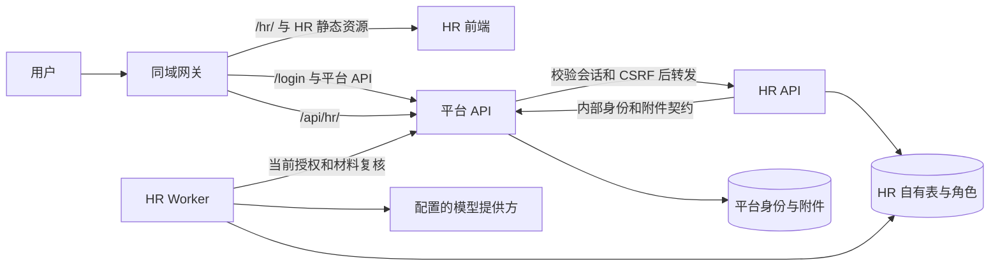

# HR 独立仓库拆分方案

状态：待用户评审的拆分设计。本文交付方案，不代表已初始化新仓库、搬迁代码或切换生产。

调查基线：2026-09-15，`master` 与远端均为 `6cfb9d78299da9c12c5087deacaaaf1fd3195604`。目标目录为 `/Users/neo/Developer/work/AI-HR-Agent`，本次核实时为空。最近发布记录为 `570ea62547a6955dbf146b53e2a8eef5a5adfbf5`；这是原会话留下的发布证据，本次整理没有重新探测生产。

依据：[当前实现全景](../../2026-09-15-hr-current-implementation.md)、[依赖评估](../../2026-09-15-hr-repository-extraction-assessment.md)、[发布记录](../../releases/2026-09-15-mainline.md)、[总体架构](../../../HR总体架构设计.md)、[工作流](../../../HR_Agent工作流.md)。本方案细化部署与仓库边界，不替代两份根文档的业务设计。

## 1. 推荐决定

将 HR 拆成独立应用仓库：独立前端、API、Worker、测试、镜像和发布记录。平台继续负责企业登录、账号与 HR 使用授权、共享附件及其他 Agent；HR 通过受认证接口调用平台能力。

第一轮保留 `agent.orbbec.com.cn/hr/` 用户入口，保留现有 PostgreSQL 实例及当前 HR 数据身份，先拆源码、进程和权限。独立域名、独立数据库实例可以以后单独做，不作为独立仓库的前置条件。

| 选择 | 收益 | 代价与判断 |
| --- | --- | --- |
| **独立 HR 应用，复用平台身份与附件（推荐）** | HR 可独立迭代、构建和发布，平台职责明确 | 先补平台服务契约，处理当前跨模块与数据库依赖 |
| 仅拆源码仓库，平台安装 HR 包并统一发布 | 搬迁步骤少 | 每次 HR 更新仍需平台发布；只适合短暂迁移中间态 |
| HR 完全独立，另建登录、附件、数据库与域名 | 最强运行隔离 | 重复维护企业身份和附件擦除体系，显著扩大本次任务 |

本轮成功标准是：一个全新 HR checkout，在没有平台源码目录的环境中可以安装、测试、构建和启动；接入明确版本的平台服务后可运行当前业务；HR 版本升级无需重建平台镜像。

## 2. 两个仓库各自负责什么

| 能力 | AI-HR-Agent | AI-Agent-Platform |
| --- | --- | --- |
| 当前 HR 对话、岗位、候选人、情报页面 | 全部页面、路由、客户端、专用样式和测试 | 产品入口链接、企业登录页 |
| Hannah 执行 | 五工具循环、工作/输入/预算/租约/恢复、模型配置与计量 | 不再装配 HR 运行时；其他 Agent 保持自身执行链 |
| 岗位和招聘业务 | 岗位身份与官网版本、资源关系、标准、成果、候选人、面试原文关系 | 不保留第二套 HR 业务写入口 |
| 情报与知识 | 当前来源/研究两层、发布读取与校验、HR 导入命令 | 无运行时 HR 内容目录依赖 |
| 身份权限 | 使用平台确认的用户身份；校验 HR 对象归属、准确引用与来源 | 钉钉登录、企业会话、CSRF、目录状态、`hr-bot` 当前使用授权 |
| 材料 | HR 文本解析、覆盖说明、准确正文版本、候选人处理授权与派生关系 | 原件上传/检查/存储、附件元数据、授权字节读取、下载票据、撤权与擦除 |
| 运维 | HR 镜像、API/Worker 探针、业务迁移、发布与恢复手册 | 网关、平台服务、共享附件 Worker、宿主部署编排 |

“平台保留通用执行能力”不表示 Hannah 的循环仍留平台。HR 的模型调用、工具、预算与恢复必须一起迁出，才能独立发布。

### 2.1 按当前代码选择迁移资产

| 当前来源 | 迁移处理 |
| --- | --- |
| `backend/app/hr_agent/` | 当前业务整体迁入；重写平台身份、附件、加密及数据库门禁的适配处 |
| `backend/app/hr/` 中岗位 repository/service/models、官网版本与导入、resource、source_library/research_library 和当前 panorama 部分 | 按当前调用闭包迁入；混合文件拆出当前方法，不整目录照搬 |
| `webui/src/workspaces/hr/`、`hrLoopApi`、`hrLoopCandidatesApi`、`hrApi`、`hrR12Api` 及当前情报客户端 | 迁当前页面及实际引用的类型/辅助函数；建立 HR 自己的 App、路由和构建入口 |
| 平台 auth/router/attachmentApi、共享组件与样式中的必要部分 | 将平台服务访问收敛为小型客户端；必要通用展示代码定点复制并记来源，不搬整个平台前端 |
| HR 当前测试与最小夹具 | 跟随能力迁移；移除对平台 `main.create_app` 与私有对象注入的依赖，建立跨服务 HTTP 测试 |
| HR 两份根设计文档、当前实施说明、知识发布工具及清单 | 新仓库维护现行版本；平台保留集成说明、迁出指针与历史发布证据 |

以下旧能力不进入新仓库：旧聊天/轮次、旧标准读取、旧成果与候选人接口、旧情报归档、HR 专用 MetaBot/DirectWorker/Relay 执行及专用测试。当前 `backend/app/hr/` 中仍服务岗位和资料读取的代码不属于这份删除名单。

当前岗位资源列表引用的材料/文件关系仍要保留；它们不是旧聊天历史入口。当前云端成果/标准的不可变版本同样属于现行能力。

### 2.2 新仓库建议布局

```text
AI-HR-Agent/
  AGENTS.md
  README.md
  HR总体架构设计.md
  HR_Agent工作流.md
  backend/
    pyproject.toml
    app/
      main.py                  # HR 独立 API 装配
      hr_agent/                # 当前循环与招聘业务
      hr/                      # 当前岗位、资源、情报
      integrations/platform/   # 身份、授权、附件 HTTP 适配
      crypto/                  # HR 密文格式适配与兼容用例
    migrations/                # HR 自有增量与基线清单
    tests/
  webui/                       # 独立依赖清单、锁文件与 /hr/ 构建
  contracts/platform-v1/       # 受版本约束的接口描述及契约样例
  knowledge/                   # 已授权的发布元数据/公共内容；私有正文外置
  deploy/                      # HR 镜像、Compose、预检和恢复说明
  docs/                        # 实施与验收证据
```

布局为建议目标，当前目录尚未创建这些文件。实现时保持业务模块结构，避免把拆仓扩大成全盘重写。新仓库不使用 `../AI-Agent-Platform`、可编辑跨仓安装、源码软链接或启动时克隆平台仓库。

## 3. 部署与访问方式



首轮平台提供薄的 HR 代理入口，在已有会话/CSRF 中间件之后转发当前 `/api/hr/*`；HR 内部 API 不直接对公网开放。该代理只负责通用认证和传输，不导入 HR 类、不执行 HR SQL、不理解成果或候选人内容。平台服务部署一次契约后，常规 HR 发布只更新 HR 镜像。

平台网关将 `/hr/`、当前子路由的刷新回退和 HR 专属静态资源前缀交给 HR 前端。HR 前端构建的资源前缀使用 `/hr/assets/`，避免与平台 `/assets/` 冲突。保持 `position`、`work` 和登录 `return_path` 语义，登录页继续由平台维护。

保留的业务 API 为当前 `/api/hr/agent/*`、岗位列表/详情/官网版本/资源票据、情报 `sources`/`research`。HR 路由采用当前能力白名单；未实现路径返回 404，不回退到平台旧 HR 路由。

## 4. 必须补齐的平台接口契约

本节端点名称和字段为**拟新增 v1 契约**，不是现有接口。现有公共登录和 `/api/v1/attachments/*` 路径继续使用。接口实现、OpenAPI 与契约测试一起交付后才能认定平台依赖已解除。

### 4.1 请求身份与服务认证

平台与 HR 双向内部调用使用 mTLS 服务身份，网络策略仅放行所需服务。证书由部署侧配置并轮换，不提交 Git。用户浏览器不能直接调用内部接口，也不能自行提交可信用户头。

平台验证会话和 CSRF 后，生成短效、签名的用户断言转发给 HR：包含 `sub`（现有用户 UUID）、`aud=hr-api`、签发/到期时间、请求 ID、目录只读状态、实际请求 method/path/query/body 的摘要。采用成熟签名库；HR 校验签名、受众、时效和请求绑定，网关移除外部同名头。不能用“在内网”或一个裸 `X-User-ID` 替代认证。

公共写请求仍带原幂等键和预期修订。代理遇到网络不确定结果不能生成新幂等键自动重做；重试保持请求身份，重新签发短效断言。HR 保存业务回执，代理日志不记录 Cookie、断言或业务正文。

### 4.2 当前用户授权

拟新增 `POST /internal/v1/hr/authorize`，接收用户 UUID、`action=read|write|model_send`、请求追踪 ID。服务证书限定调用方为 HR；平台返回用户存在/启用情况、`hr-bot` 当前授权、目录只读状态和判定时间。HTTP 身份从受验证断言取得；Worker 身份从 HR 数据库中工作 owner 取得，不从模型参数取得。

API 业务请求、Worker 恢复和发送模型前均重新校验当前授权；不缓存“允许”跨操作沿用。未登录为 401，无使用权限为 403，对象不属于用户为 404，准确来源失效为 410；平台不可用返回 503，不能放行。目录硬过期保持现有只读规则，写入和模型发送拒绝。

HR 本地继续负责岗位/候选人/成果 owner 与准确引用检查。平台“可使用 HR”不等于“可读取所有 HR 数据”。需替换 `HrAccess` 和 `build_runtime_services.authorize_owner` 两条路径，不能只修改 HTTP 而留下 Worker 的 `platform_control.resolve_agent_use_decision_v41` 直查。

### 4.3 材料元数据、字节和下载

| 拟新增接口 | 请求与输出要点 |
| --- | --- |
| `POST /internal/v1/hr/attachments/resolve` | 用户、附件 ID 列表；逐项返回可用状态、名称/MIME/长度、稳定内容身份和 SHA256；不返回桶名、对象 key、凭据 |
| `POST /internal/v1/hr/attachments/read` | 用户、附件 ID、预期内容身份；有界传输准确原件字节及摘要，返回前再次核验当前可用性 |
| `POST /internal/v1/hr/attachments/authorize` | 用户、附件 ID 与已核验内容身份批次；重新核验 owner、状态、保留期限、擦除与内容是否变更 |
| `POST /internal/v1/hr/attachments/tickets` | 用户、附件 ID、用途、幂等键；返回现有短效受约束下载路径与到期时间，实际下载仍由平台执行 |

当前身份摘要包含原件 SHA、immutable locator、write attempt、MIME 和长度。拟由平台生成稳定的、不含存储明文位置的身份值，并以同一版本算法供 resolve/read/authorize 比较。迁移当前证明时通过受控适配保留原等价身份；算法改变必须版本化，不能静默接受旧证明。HR 自己保存正文 `kind/id/revision/sha256` 与原件身份的绑定。

PDF/DOCX 文本解析、覆盖说明与加密解析结果留 HR，附件原件解密及对象存储凭据留平台。读取必须校验实际长度、SHA 和版本，限制大小与耗时；不能仅凭元数据伪造“已阅读”。HR 读取派生成果、恢复和发送前递归验证来源，并调用当前附件授权接口。过期、删除或擦除中的材料及依赖它的内容不得靠缓存继续使用；来源已失效返回 410，依赖故障返回 503。

网络请求不能放在长数据库锁内。沿用“取快照—外部复核—事务内核对当前输入/租约”的结构；验证时点不承诺已发出的模型请求可撤回。撤权竞态要通过接口故障与 Worker 测试验证。

本轮以即时授权复核实现失效传播，不额外引入消息总线。附件对象物理擦除由平台负责；HR 已持久化的解析文本、候选人/成果及依赖的访问阻断必须独立验证，物理清理情况按实际证据记录，不能将“读取被拒绝”写成“所有派生数据已物理删除”。

## 5. 数据、迁移、加密与知识

### 5.1 第一轮不搬物理数据

现有用户 UUID、岗位 ID、工作 ID、附件 ID、成果/标准修订、摘要、输入版本、幂等回执、预算及租约语义保持。当前数据继续存在原库；HR 使用自有最小权限角色访问归属自己的表。不能给新服务沿用整个 `platform_control_app` 权限。

| 数据范围 | 首轮归属与处理 |
| --- | --- |
| `platform_hr_agent` 当前业务表 | HR 负责；API/Worker 根据所需操作分别授权 |
| `platform_hr.positions`、当前官网版本和材料/文件关系等 | HR 负责；按当前 SQL 逐表列清，不把整个 schema 当作现行资产 |
| `platform_control` 身份、会话、目录、其他 Agent | 平台负责；HR 通过 HTTP，不直接 SELECT 用户/授权表 |
| `platform_attachments`、对象存储 | 平台负责；HR 不直接 SELECT 附件表或取得存储密钥 |
| 当前跨 schema 外键 | 首轮允许保留数据库完整性约束；不因此授予 HR 跨域读取权限，也不声称数据库已完全独立 |
| HR 切换状态/函数、迁移校验账本 | 迁移期间作为明确的平台控制面契约；限定 HR 专用函数 EXECUTE 与只读版本检查，不能授予任意控制库访问 |
| 被放弃的旧业务表 | 本轮不导入新库、不建兼容入口；原库不执行 DROP 或清空 |

现有迁移中存在固定角色名、跨 schema 外键和 readiness 校验。第一批必须列出 HR 每项 SELECT/写入/函数执行需求，以拒绝多余权限的真实数据库测试核对。`hr_agent` 运行目录仍含 `platform_attachments` 业务直查或平台身份 SQL，即不通过独立服务验收；明确列出的切换/版本检查例外单独审查。

### 5.2 迁移管理与本地数据库

096/097/098/099/101 创建当前 HR 能力，102–105 管切换，100/106/107 属于共享附件；不能按编号连续区间搬走。已发布迁移保留原字节、编号和校验和，平台历史文件不删除或重编号。

新仓库记录所承接基线和旧迁移 SHA；HR 后续变更用自身迁移序列与账本，平台接口/角色/门禁变更仍由平台发布。两个 migrator 各有对象所有权和锁，不能竞争修改同一张表。新角色授权与启动检查以新增迁移完成，不改历史迁移。

干净环境由固定版本平台服务/数据库基线制品初始化共享依赖，再运行 HR 迁移；制品必须由 CI 从准确平台提交产生并记录摘要，可通过镜像获取，不要求平台源码 checkout。单仓单元测试可用平台 HTTP 边界替身；跨服务验收使用真实平台进程和数据库，不把手工伪造身份表作为生产等价基线。

### 5.3 加密与内容版本

HR 密文继续沿用当前 `ContentCodec`/`SealedContent` 的格式、subject/AAD、key version 和 HR 内容密钥；不在拆仓时重加密业务数据。迁入最小加密格式实现到 HR 自有模块并记录来源提交与兼容测试，避免为这一次拆分新建第三个通用仓库。平台继续维护自身使用的实现，格式变化按版本契约协调。

验收要读回切换前的加密工作、成果和解析记录，再验证新旧版本对首轮写入的兼容性。HR 不持有平台身份加密密钥或附件对象索引密钥；它只得到有权限的附件字节与元数据。

专业角色、方法和情报发布内容按 manifest、release/revision、SHA 迁移或作为准确版本制品装配。已有工作引用的准确版本必须可读，不能用最新内容替换旧输入。`../HR-Agent-Knowledge` 等同级目录不自动纳入；私有资料、密钥、临时回放数据与本机配置不提交新仓库。

## 6. 实施批次与每批交付条件

这是一份供评审的拆分设计；下列为分批交付边界，详细代码任务随方案确定后分别展开。

| 批次 | 具体产物 | 完成门槛 |
| --- | --- | --- |
| A：确定迁移清单与契约 | 当前文件/接口/表/角色清单，平台 v1 接口描述，HR 建仓来源清单，现行基线回归 | 现行能力有去向，废弃能力不入清单；明确角色/门禁例外与知识输入，无整目录搬迁假设 |
| B：平台边界先可用 | 受认证代理、授权与附件接口、最小数据库授权/基线制品、契约测试 | 真实 HTTP 下身份、CSRF、撤权、字节校验和故障返回通过；原 HR 服务继续工作；平台改动审查后归并主线 |
| C：独立 HR 本地交付 | 新仓库、独立前端/API/Worker/镜像、当前业务与知识、平台适配、迁移工具 | 干净 checkout 可构建；同一测试数据库中跨用户、成果/标准、材料、幂等/恢复与进程测试通过；不读取平台源码 |
| D：切换候选与生产切换 | 两仓准确提交/镜像/配置清单、完整部署覆盖顺序、暂停与恢复演练、发布候选 | 本地切换与回退已验证，全部接口门禁满足；实际生产操作按届时发布授权执行，记录独立于代码合并 |
| E：平台移除 HR 实现 | 删除已迁当前模块、废弃 HR 后端及专用测试/依赖/装配，更新平台文档 | HR 独立服务承接后完成接口核验；平台只保留入口/集成契约/共享能力/历史证据；相关其他产品回归通过，及时归并主线 |

各批都以可验证产物收尾；B/C 可以在切换前完成开发，但同一 HR 功能不能在两仓长期分别维护。期间必要修复必须显式同步并记录来源提交，平台生产仍以当前主线维护。

新仓库建议从已核对主线的文件清单建立干净初始提交，记录 `SOURCE.md` 的平台提交与路径映射；完整历史留在平台仓库可追溯，不重写平台历史。远端创建/推送时再使用用户指定组织和地址，当前未知远端不阻碍方案或本地准备。

## 7. 切换和恢复的准确顺序

1. 固定平台与 HR 的发布提交、镜像摘要、知识版本、迁移校验和、实际配置与完整 Compose 覆盖。执行前重新核对生产，不使用当前主线 tip 代替运行版本。
2. 先发布向后兼容的平台契约和新增数据库角色。新 HR 实例可以启动预检，但生产 Worker 不领取工作；仅健康检查不证明切换完成。
3. 通过现有云端排空门禁停止新 HR 受理，保持必要的观察/控制。等待活跃模型调用、解析任务和写事务到安全点；`waiting_user`/`waiting_budget` 可保留，不能等所有工作达到业务终态或伪造完成。
4. 正常停止平台版本的 HR Worker，检查真实进程与租约。停止不确定时保持暂停，确认进程隔离且租约可回收后再继续，不能仅凭 HTTP 回执启动第二组执行者。
5. 切换当前 HR 路由与前端资源到新服务，启动新 HR Worker。首轮同库同工作 ID，恢复已有工作与预算；只允许一组生产 Worker 领取。同一个请求只能落到一个业务实现。
6. 验证 API 与 Worker 实时就绪、真实授权的接口回归、暂停工作继续、准确历史修订读取及幂等重试，再恢复 `cloud` 受理；真实模型/生产业务写测试按当次授权范围执行。
7. 保存实际发布回执，完成 E 批的平台删除。浏览器和业务页面由用户验收，报告单独列出其结果。

切换失败时先保持 `draining_cloud`，停止新 Worker 和写入口。只有已验证旧版当前云端 HR 可读取新写入、迁移兼容、进程互斥成立时，才把路由/Worker 恢复到保存的准确云端版本；否则保持暂停修复新服务。不得恢复已放弃的 legacy/MetaBot 链，不回滚数据库快照覆盖切换后的有效数据。

首轮迁移采用兼容增加，禁止同批删除/改义字段，才能提供上述恢复窗口。退回旧镜像属于短期故障恢复，不保留旧 UI 或两套业务入口。后续不兼容 HR 迁移发布前必须重新评估恢复条件。

## 8. 验证与完成证据

开发侧按真实 HTTP/API → 数据库回归 → 必要进程故障验证开展；浏览器连接与页面验收交给用户。此次文档交付不声称运行过下表测试。

| 验证层 | 必须覆盖的行为 |
| --- | --- |
| 独立构建 | 无平台源码的 checkout 安装、前端构建、HR API/Worker 镜像及迁移预检；平台移除 HR 后仍可构建 |
| 服务边界 | 真实会话与 CSRF、伪造/过期/错受众断言、服务证书拒绝、HR 撤权/目录过期、平台 503；Worker 也不可绕过 |
| 当前业务 | 工作创建/追加/取消/续预算，标准部分确认与冲突、当前及准确旧修订读取、成果岗位隔离、候选逐文件确认、现行情报与资源下载 |
| 附件与来源 | 上传后真实读取和摘要校验、读取中撤权、解析后擦除、派生成果再次阅读/发送被拒、跨用户/跨岗位拒绝，不泄露存储信息 |
| 持久化与故障 | 原幂等键重试只产生一次副作用；Worker 领取后 SIGKILL/重启、旧租约失效；预算/输入/检查点/成果不重置，双 Worker 切换互斥 |
| 发布演练 | 旧当前云端服务 → 新 HR → 允许条件下恢复旧当前云端；准确工作继续，其他平台产品与共享附件服务保持可用 |
| 用户页面验收 | 登录回跳、`/hr/` 刷新及资源、岗位列表、上传、正文展开/下载、页面状态恢复，由用户实际操作 |

已有 `test_hr_agent_routes`、`test_hr_agent_b_journey`、`test_hr_agent_standards`、`test_hr_agent_material_authority`、`test_hr_agent_candidate_erasure`、`test_hr_agent_worker_process` 和岗位/情报 API 用例是回归起点，需要改成独立装配与真实跨服务路径。平台登录与附件共享测试留平台；旧链专用测试随废代码退出，不为测试保留旧业务入口。

本地工程可替换模型提供方，但必须说明替换边界；不能称为真实模型质量或生产业务验收。真实个人材料处理权限维持现行配置，不因拆仓自动开启。发布证据逐项区分接口、进程、前端组件、用户页面和生产业务结果。

## 9. 平台最终删除清单与范围限制

独立服务切换并完成接口核验后，平台删除：HR 页面和专用客户端、当前 HR 已迁业务模块、废弃 HR 后端、HR API/Worker 装配与专用运行依赖、旧 HR 执行工具/角色/专用测试。共享目录中的 HR 分支按调用和测试证据删除，不能整目录删除 `agent_brain`、`execution_relay`、`attachments` 或加密能力。

平台留下：`/hr/` 产品入口及网关路由、认证代理和内部平台契约、共享身份/附件及其 Worker、必要的版本/切换控制契约、历史数据库迁移和发布记录、指向新仓库的文档。业务 schema 的物理删除与历史清库不属于源码删除授权。

不夹带工作台重设计、新建岗位功能、旧功能兼容迁移、新 ATS 流程、组织共享权限、任意联网搜索或模型策略调整。当前能力缺口继续按现状文档记录，拆仓不等于业务补齐。

建议按本方案完成 A–C 的工程拆分，再以实际候选版本安排 D–E。方案评审重点是三个决定：HR 独立发布、平台提供身份与附件、首轮同域同库。实施与生产切换状态应在后续记录中分别更新。
