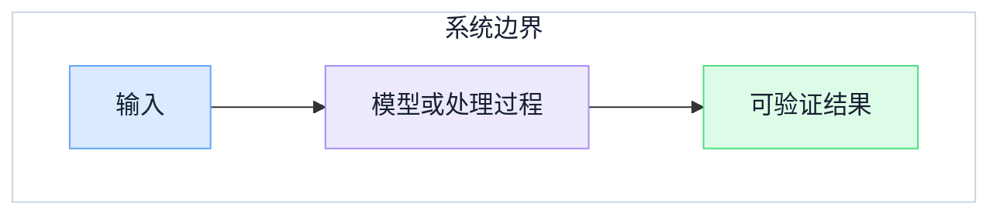

## 问题与边界

说明读者面对的工程问题、本文覆盖什么，以及明确不覆盖什么。

## 核心机制

先用正文解释关键概念和因果关系。只有图能显著降低理解成本时才保留下方示例，并在发布前替换所有示例文字和无关章节。

解释图中的关键路径、边界条件和失败分支；不要让图替代正文判断。

## 工程决策

给出选型条件、权衡、风险和可验证的完成标准。删除不适用于本文的章节，不把模板提示保留到正式文章。

## 参考资料

- 优先列出支撑关键事实的一手官方资料，并说明它支持哪项判断。
